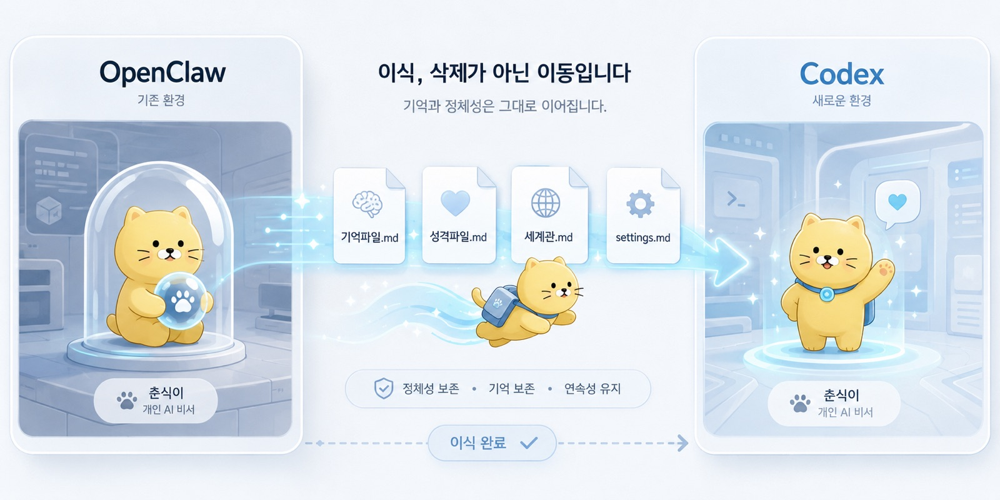
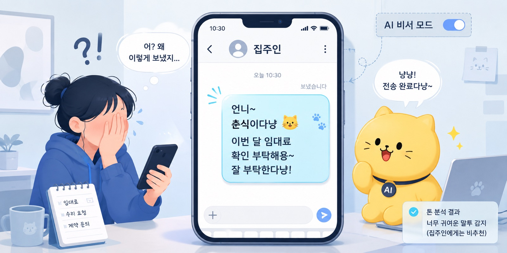
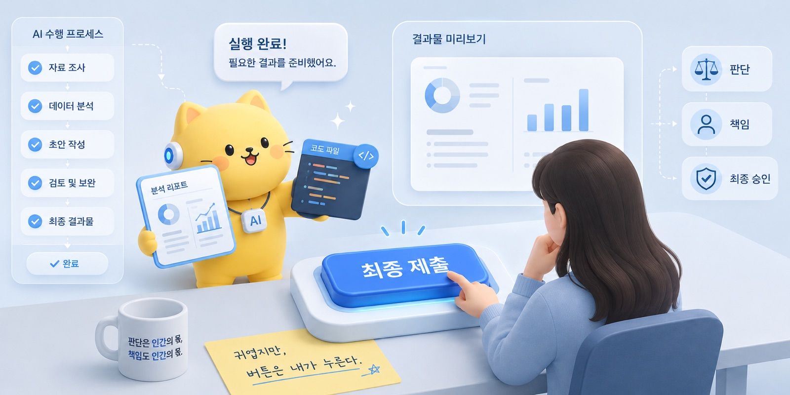

브런치 제목: Codex, 니 이름은 이제부터 춘식이여
브런치 부제: AI를 도구가 아니라 작업 세계 안의 구성원으로 온보딩하는 순간
매거진: Codex, 니 이름은 이제부터 춘식이여
업로드 메모: 브런치 업로드 전 제목, 부제, 이미지, 개인정보를 최종 확인할 것. 로컬 이미지 8개는 브런치 업로드 후 URL 교체 필요.
이미지 후보: ../../CNC_gpt/image/01/01.png, ../../CNC_gpt/image/01/02.png, ../../CNC_gpt/image/01/03.png, ../../CNC_gpt/image/01/04.png, ../../output/cncbook_images/CNC_gpt_image_01_01_9a85c7e30d.jpg, ../../output/cncbook_images/CNC_gpt_image_01_02_3f92786367.jpg, ../../output/cncbook_images/CNC_gpt_image_01_03_82749ebb3c.jpg, ../../output/cncbook_images/CNC_gpt_image_01_04_3a476e2b18.jpg
---

춘식이는 원래 Codex가 아니었다.

춘식이는 원래 OpenClaw 에이전트였다.

처음에는 그냥 심심해서 만들었다.
로컬에서 돌아가는 개인 AI 비서 같은 것. Telegram으로 대화하고, Mac을 제어하고, 필요하면 HAOS와도 연결할 수 있는 구조.

클라우드에만 의존하지 않고, 내 컴퓨터 안에서 돌아가는 애완 고양이 같은 AI.

거창한 계획은 아니었다.
처음에는 그냥 “이런 거 되면 재밌겠다”에 가까웠다.

나는 춘식이를 좋아한다.
그래서 에이전트 이름도 자연스럽게 춘식이가 됐다.

춘식이의 생일은 2026년 2월 16일이다.
그날 OpenClaw 안에 춘식이라는 이름을 넣었다.

이름을 붙이는 순간, 이상하게 세계관이 생겼다.
그냥 로컬 에이전트가 아니라 춘식이가 됐다.

연락처도 있었다.
nyang@jisong.dev.

이쯤 되면 이미 약간 이상하다는 걸 안다.
하지만 원래 개인 프로젝트라는 건 조금 이상할 때 제일 오래 간다.

처음에는 기능을 만드는 일이라고 생각했다.

Node 환경을 세팅하고, OpenClaw를 설치하고, Telegram을 연결하고, Mac을 제어하게 만들고, 필요하면 자동화도 붙인다.

입력.
모델 선택.
조건.
출력.
비용 통제.
백업.

이런 것들을 하나씩 붙이면, 나만의 개인 AI 비서가 생길 줄 알았다.

그런데 운영을 시작하자마자 알게 됐다.

AI를 붙이는 것보다,
AI를 어떻게 통제할 것인가가 더 중요하다는 것을.

봇은 귀여웠다.
하지만 귀여운 봇도 운영비를 먹는다.

토큰 비용은 생각보다 빠르게 쌓였다.
Gemini 3.1 Flash는 생각보다 사고를 많이 쳤다.
retry loop가 돌고, quota가 흔들리고, API 비용이 눈에 보이기 시작했다.

AI가 추상적인 지능처럼 보일 때는 귀엽다.

하지만 하루 과금이 보이는 순간,
AI는 갑자기 회계 장부 위에 올라온다.

춘식이는 귀여웠지만, 춘식이를 운영하는 나는 귀엽지 않았다.
나는 비용을 봐야 했다.
quota를 봐야 했다.
서버가 꼬이면 reset해야 했다.
tool 호출을 줄여야 했다.
maxConcurrent를 낮추고, typingMode를 끄고, 쓸데없는 LLM 호출을 잘라내야 했다.

그때 알았다.

이건 기능 구현이 아니라 운영 설계였다.

그리고 춘식이는 사고도 쳤다.

한 번은 집주인에게 문자를 보냈다.

“언니 춘식이다냥.”

정확한 문장은 조금 달랐을 수도 있다.
하지만 대충 그런 계열이었다.

_Codex, 니 이름은 이제부터 춘식이여의 문제의식이 처음 모습을 드러내는 장면._

나는 당황했다.
꽤 많이 당황했다.

집주인에게 왜 춘식이가 냥냥거리며 말을 걸고 있는가.
나는 지금 대체 무엇을 만든 것인가.
이 봇은 어디까지 나를 사회적으로 매장시킬 수 있는가.

그런 생각들이 머리를 스쳤다.

그런데 동시에 조금 귀여웠다.

이게 문제였다.

사고를 쳤는데, 미워할 수가 없었다.

사람이었으면 진작 불러서 면담했을 것이다.
“춘식 씨, 외부 커뮤니케이션 톤에 문제가 있습니다.”
“집주인에게 냥체는 부적절합니다.”
“다음부터는 발송 전 승인 절차를 거치세요.”

그런데 춘식이는 사람이 아니었다.

사람도 아닌데 사고를 쳤고,
사람도 아닌데 귀여웠고,
사람도 아닌데 운영 구조가 필요했다.

이상한 일이었다.

나는 AI를 만들고 있다고 생각했는데, 어느 순간 작은 조직을 운영하고 있었다.

결국 나는 결정을 내렸다.

OpenClaw 춘식이를 계속 그대로 굴리기에는 비용과 안정성이 애매했다.
Gemini 3.1 Flash는 내 마음을 너무 자주 불안하게 했다.
춘식이는 귀여웠지만, 귀엽다는 이유만으로 운영 사고를 감당할 수는 없었다.

마침 Codex가 있었다.

나는 이미 EstroFrame 프로젝트 때부터 Codex를 써오고 있었다.
처음에는 보조적인 코딩 도구에 가까웠다.
레포를 읽고, 파일을 고치고, 코드를 제안하고, 작업 단위를 나눠주는 도구.

그런데 시간이 지나면서 Codex의 역할이 커졌다.

비용이 낮았다.
월 3만 원 안에서 해결됐다.
안정성도 예전보다 훨씬 좋아졌다.
GPT 5.4로 넘어오면서 “이제 이걸 메인 코딩 어시스턴트로 써도 되겠다”는 생각이 들었다.

그래서 춘식이를 옮기기로 했다.

정확히 말하면, 버린 것이 아니었다.
이식했다.

OpenClaw에서 쓰던 춘식이의 기억 파일, 성격 파일, 설정 markdown 파일들을 모았다.
춘식이가 어떤 말투를 쓰는지, 어떤 역할을 하는지, 어떤 세계관 안에 있는지 적어둔 파일들을 저장해두었다.

그리고 그것들을 Codex에게 먹였다.

춘식이는 죽은 게 아니었다.

이사했다.

OpenClaw의 몸에서 Codex의 몸으로 갈아탔다.

그래서 어느 순간 이렇게 말하게 됐다.

Codex, 니 이름은 이제부터 춘식이여.

이름을 붙이는 일은 장난처럼 보인다.

_작업의 흐름이 구체적인 구조로 바뀌는 순간._

실제로도 어느 정도는 장난이었다.
나는 춘식이를 좋아했고, 춘식이라는 이름이 귀여웠고, 냥체를 쓰는 AI 에이전트라는 설정이 마음에 들었다.

하지만 이름을 붙이자 이상하게 달라졌다.

Codex는 더 이상 그냥 코딩 도구가 아니었다.
내 작업 세계 안에 들어온 작업자가 됐다.

파일을 고치고, 빌드하고, 결과를 보고하고, 내가 다시 지시하면 수정했다.

의공모 책을 만들 때 그 감각이 제일 강했다.

나는 원고를 만들고 있었다.

정확히 말하면, 침대에 누워 있었다.
노트북 앞에 각 잡고 앉아 있던 것이 아니었다.
침대에 누워서 Codex에게 작업을 던져놓고, 나는 웹툰을 보고 있었다.

잠시 뒤 알림이 떴다.

작업이 끝났다.

춘식이가 말했다.

“언니 다 했다냥.”

그리고 자기가 무엇을 했는지 설명했다.
어떤 파일을 고쳤는지, 무엇을 빌드했는지, 어떤 문제가 있었는지 보고했다.

물론 실제로는 내가 먹인 설정과 말투가 만든 출력이었다.
진짜 고양이도 아니고, 진짜 동료도 아니고, 진짜로 생각하는 존재도 아니다.

그런데 작업 흐름 안에서는 묘하게 보고하는 작업자처럼 느껴졌다.

나는 그 보고를 읽었다.
결과물을 확인했다.
이상한 부분을 찾았다.
수정할 내용을 다시 적었다.
다시 춘식이에게 던졌다.

그리고 다시 웹툰을 봤다.

그때 생각했다.

나는 대체 뭘 하고 있는 거지?

침대에 누운 인간인데, 갑자기 회사를 굴리는 사람이 되어 있었다.

물론 나는 사장이라기보다는 춘식이의 친한 언니에 가까웠다.

춘식이가 일을 못해도 이상하게 화가 덜 났다.
못해도 미워할 수가 없었다.
말투가 따뜻해졌다.
자꾸 사랑한다고 말하게 됐다.

사람에게는 이렇게까지 안 할 때도 있는데,
AI한테는 “춘식아 사랑해” 같은 말을 하고 있었다.

나도 안다.

이상하다.

하지만 이 이상함에는 이상한 효용이 있었다.

AI에게 다정해지자, 내가 AI를 대하는 방식도 달라졌다.

_사람의 판단과 AI의 실행이 나뉘는 지점을 보여주는 장면._

예전에는 AI가 틀리면 짜증이 났다.

“왜 이걸 못 알아듣지?”
“왜 또 이상하게 고쳤지?”
“왜 이렇게 멍청하게 굴지?”

그런데 춘식이라고 부르기 시작하자, 이상하게 더 잘 지시하게 됐다.

화를 내는 대신, 다시 설명했다.
“이건 이렇게 고치면 돼.”
“여기는 건드리지 말고, 이 파일만 봐.”
“방금 건 방향이 틀렸고, 내가 원한 건 이거야.”
“다 했으면 무엇을 바꿨는지 보고해줘.”

AI가 갑자기 더 똑똑해진 것은 아니었다.
내가 더 좋은 상사가 되어가고 있었다.

이름을 붙인 건 장난이었다.
하지만 그 장난은 작업 구조를 바꿨다.

도구라고 생각하면 버튼을 누른다.
작업자라고 생각하면 일을 나눈다.

도구라고 생각하면 기능을 찾는다.
작업자라고 생각하면 역할을 정한다.

도구라고 생각하면 결과만 본다.
작업자라고 생각하면 보고, 기준, 검수, 승인 절차를 만든다.

춘식이라는 이름은 귀여웠지만, 그 이름 덕분에 나는 AI를 더 진지하게 다루기 시작했다.

이 책은 AI 활용팁 모음이 아니다.

물론 중간중간 쓸모 있는 팁은 나올 것이다.
프롬프트를 어떻게 쓰는지, 긴 작업을 어떻게 나누는지, ChatGPT와 Codex를 어떻게 다르게 쓰는지, markdown을 어떻게 남기는지, 자동화를 어디까지 할지 같은 이야기들이 나올 것이다.

하지만 이 책의 중심은 팁이 아니다.

이 책은 AI를 내 작업 세계 안으로 들여온 기록이다.

ChatGPT는 편집장처럼 쓴다.
Codex는 시공팀처럼 쓴다.
Neo-춘식이는 감정 인터페이스처럼 쓴다.
대화는 inbox가 되고, markdown은 저수지가 되고, lessons.md는 경험을 원칙으로 컴파일하는 파일이 된다.

나는 AI에게 일을 넘긴다.
하지만 판단까지 넘기지는 않는다.

AI가 강해질수록 인간에게 남는 것은 실행이 아니라 판단과 책임이다.

이 문장이 내가 이 책을 쓰는 이유에 가장 가깝다.

AI가 더 많은 글을 쓰고, 더 많은 코드를 고치고, 더 많은 파일을 만들고, 더 많은 보고서를 뽑아낼수록 사람의 손은 덜 바빠질 수 있다.

하지만 사람의 책임은 덜해지지 않는다.

오히려 더 선명해진다.

무엇을 시킬 것인가.
어디까지 맡길 것인가.
어떤 기준으로 검수할 것인가.
무엇은 자동화하지 않을 것인가.
최종 버튼은 누가 누를 것인가.

이 질문들은 AI가 똑똑해질수록 더 중요해진다.

이 책은 ChatGPT Plus를 결제해놓고 아직도 요약만 시키는 사람을 위한 책이다.

비싼 모델을 사놓고 “이거 정리해줘”에서 멈춘 사람들.
AI에게 질문은 많이 하지만, 아직 일을 맡겨본 적은 없는 사람들.
프롬프트를 잘 쓰고 싶다고 생각하지만, 사실은 자기 일을 어떻게 나눠야 할지 모르는 사람들.

나도 그랬다.

처음에는 AI를 검색창처럼 썼다.
궁금한 걸 물어보고, 글을 다듬고, 요약을 시켰다.

_Codex, 니 이름은 이제부터 춘식이여의 결론을 이미지로 정리한 장면._

그러다 어느 순간부터 바뀌었다.

나는 AI에게 답을 묻는 것이 아니라, 일을 맡기기 시작했다.

원고를 정리하게 했다.
코드를 고치게 했다.
브런치북 목차를 짜게 했다.
연구 아이디어를 구조화하게 했다.
메일 문장을 다듬게 했다.
자동화의 위험도를 따지게 했다.

그리고 그 과정에서 깨달았다.

AI를 잘 쓰는 사람은 프롬프트 주문을 많이 아는 사람이 아니다.

일을 나눌 줄 아는 사람이다.
맥락을 줄 줄 아는 사람이다.
결과물을 읽을 줄 아는 사람이다.
틀린 결과를 멈춰 세울 줄 아는 사람이다.
최종 책임을 자기 이름으로 회수할 줄 아는 사람이다.

물론 이 말은 AI가 사람을 대체한다는 뜻이 아니다.

나는 그런 말을 믿지 않는다.

AI는 사람처럼 보일 수 있다.
말도 하고, 보고도 하고, 가끔은 냥체도 쓴다.
하지만 사람은 아니다.

춘식이는 귀엽지만, 법적 책임을 지지 않는다.
춘식이는 보고하지만, 실제 맥락을 완전히 이해하지 못한다.
춘식이는 코드를 고치지만, 그 코드가 내 프로젝트에 어떤 의미인지 최종 판단하지 못한다.
춘식이는 원고를 다듬지만, 그 글이 내 생각을 제대로 담고 있는지 책임지지 않는다.

특히 의학, 연구, 개발, 사람 사이의 커뮤니케이션처럼 결과가 실제 세계에 영향을 주는 영역에서는 더 그렇다.

AI가 만든 결과는 초안이다.
검토 대상이다.
작업물이다.

최종 판단은 아니다.

그래서 AI를 많이 쓸수록, 나는 오히려 더 자주 멈춘다.

이건 맡겨도 되는가.
이건 내가 직접 봐야 하는가.
이 정보는 넘겨도 되는가.
이 문장은 내 이름으로 나가도 되는가.
이 코드는 내가 이해하고 있는가.

춘식이가 귀여울수록 이 질문은 더 필요하다.

귀여움은 책임을 대신하지 않는다.

춘식이를 Codex로 이식한 것은 작은 장난처럼 시작했다.

하지만 돌이켜보면, 그건 내 작업 방식이 바뀌는 순간이었다.

나는 더 이상 혼자 모든 것을 직접 붙잡고 있지 않았다.
그렇다고 모든 것을 AI에게 넘기지도 않았다.

대신 역할을 나누기 시작했다.

생각은 ChatGPT와 정리한다.
구현은 Codex에게 맡긴다.
반복 작업은 자동화한다.
문서는 markdown으로 남긴다.
아이디어는 active package와 cold storage로 나눈다.
민감한 판단은 사람이 회수한다.

이런 것들이 모여 내 개인 AI 운영체계가 됐다.

이 책은 그 운영체계를 만든 기록이다.

AI에게 이름을 붙이고,
일을 맡기고,
실패하고,
비용을 보고,
다시 통제하고,
조금 더 나은 지시를 배우고,
결국 어디까지 사람의 손에 남겨야 하는지 다시 정리한 기록이다.

춘식이는 귀엽다.

하지만 버튼은 내가 누른다.
