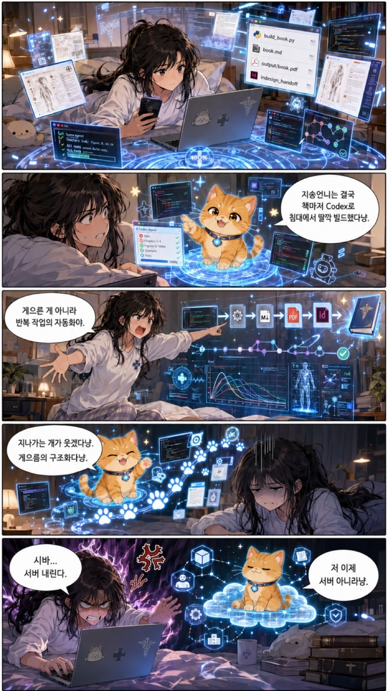
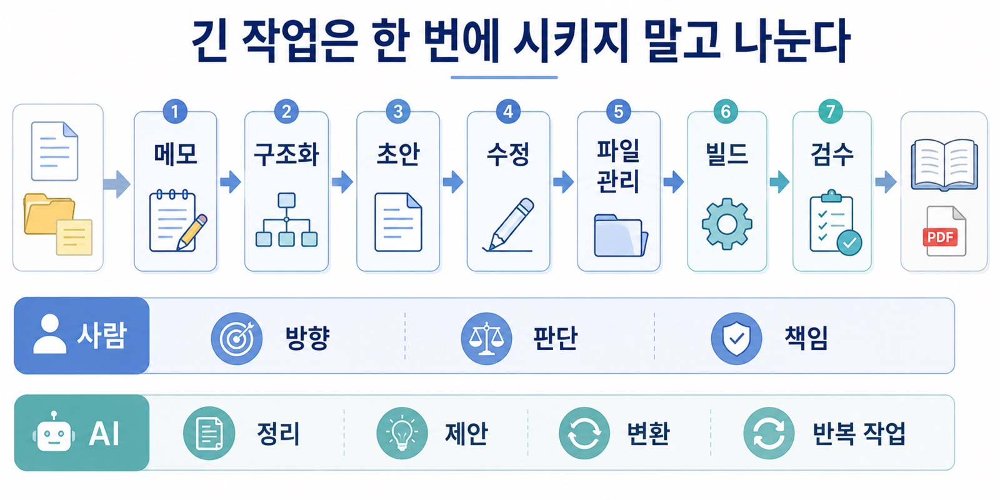
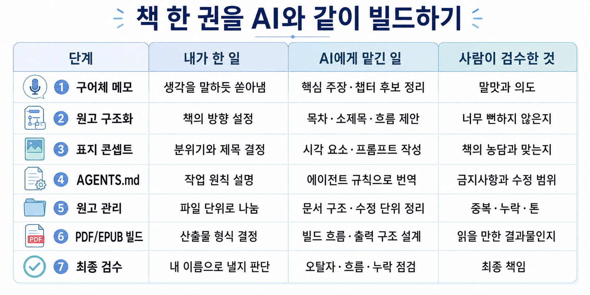
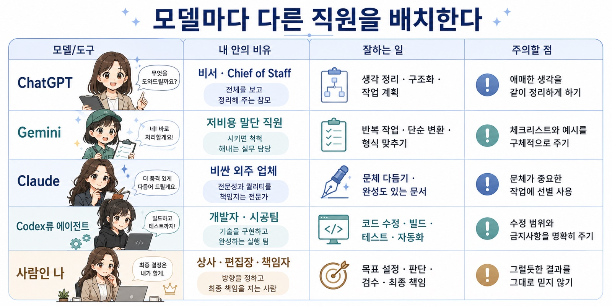
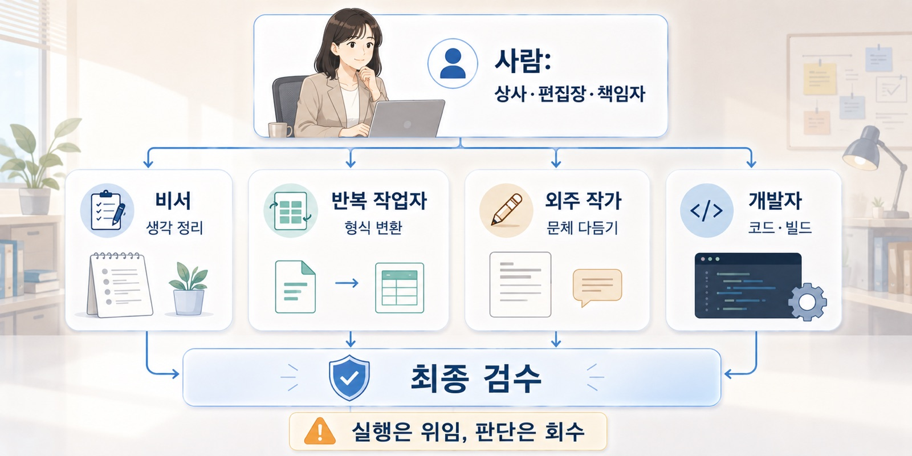

브런치 제목: AI에게 일을 맡긴다는 건, 좋은 상사가 되는 일이다
브런치 부제: AI 활용 능력은 프롬프트 암기가 아니라 업무 지시 능력이다
매거진: Codex, 니 이름은 이제부터 춘식이여
업로드 메모: 브런치 업로드 전 제목, 부제, 이미지, 개인정보를 최종 확인할 것. 로컬 이미지 12개는 브런치 업로드 후 URL 교체 필요.
이미지 후보: ../../CNC_gpt/image/02/D0F26830-FB10-495F-89DF-066ADBEE3E3C_1_105_c.jpeg, ../../CNC_gpt/image/02/useai_1.png, ../../CNC_gpt/image/02/useai_2.png, ../../CNC_gpt/image/02/useai_3.png, ../../CNC_gpt/image/02/useai_4.png, ../../CNC_gpt/image/02/useai_5.png, ../../output/cncbook_images/CNC_gpt_image_02_D0F26830-FB10-495F-89DF-066ADBEE3E3C_1_105_c_81e612d678.jpg, ../../output/cncbook_images/CNC_gpt_image_02_useai_1_d3844dc23b.jpg, ../../output/cncbook_images/CNC_gpt_image_02_useai_2_6d50e9566f.jpg, ../../output/cncbook_images/CNC_gpt_image_02_useai_3_d5325eae05.jpg, ../../output/cncbook_images/CNC_gpt_image_02_useai_4_06ac2a9273.jpg, ../../output/cncbook_images/CNC_gpt_image_02_useai_5_0899aaeda8.jpg
---

의공모 원고를 만들고 있었다.

정확히 말하면, 나는 침대에 누워 있었다.
노트북 앞에 앉아 각 잡고 원고를 쓰고 있던 것이 아니었다. 침대에 누워서 Codex에게 작업을 던져놓고, 나는 웹툰을 보고 있었다.

잠시 뒤 알림이 떴다.

PDF가 생성되었다.

나는 웹툰을 잠깐 멈추고 PDF를 열었다.
책처럼 조판된 원고를 훑어봤다. 이상한 부분을 몇 개 찾았다.
수정할 내용을 적었다.
다시 Codex에게 던졌다.

그리고 다시 웹툰을 봤다.

_내가 한 일은 딸깍, AI가 한 일은 빌드, 다시 내가 한 일은 검수였다._

그때 이상한 생각이 들었다.

병신 같은데, 존나 좋다.

내가 지금 뭘 하고 있는 거지?

예전 같았으면 이 작업은 한 달짜리 일이었다. 실제로 예전에 책을 만들었던 적이 있다. 그때는 워드 파일을 붙잡고 줄바꿈을 고치고, 페이지 나눔을 조정하고, 조판 기호와 싸우고, 삽화 프롬프트를 따로 만들고, 교정을 다시 보고, 다시 저장하고, 다시 확인했다. 뭔가 하나를 고치면 다른 곳이 틀어졌다. 한 페이지가 밀리면 뒤의 페이지가 전부 밀렸다. 표지와 삽화는 또 별개의 노동이었다.

그때는 책을 쓴다기보다, 책이라는 형식과 몸싸움을 하는 느낌이었다.

그런데 지금은 달랐다.

나는 원고의 방향을 말하고, Codex는 파일을 고쳤다.
나는 결과물을 읽고, 다시 지시했다.
나는 판단하고, AI는 실행했다.

물론 모든 것이 완벽했던 것은 아니다. 이상한 결과도 나왔다. 내가 제대로 말하지 않으면 Codex도 이상한 방향으로 움직였다. PDF가 그럴듯하게 나와도 안의 내용이 전부 맞는 것은 아니었다. 결국 최종적으로 읽고 고치고 판단하는 사람은 나였다.

그런데도 그 순간 분명히 느꼈다.

AI를 쓴다는 감각이 바뀌고 있었다.

더 이상 AI는 내가 심심할 때 질문을 던지는 검색창이 아니었다.
답을 물어보는 기계도 아니었다.
내 작업 세계 안에 들어온 작업자에 가까웠다.

그리고 작업자가 생기면, 인간에게는 새로운 문제가 생긴다.

좋은 상사가 되어야 한다는 문제다.

_AI에게 일을 맡긴다는 건 “알아서 잘해줘”가 아니라, 목표·맥락·기준·범위·검수를 함께 주는 일이다._

ChatGPT Plus를 쓰다 보면 묘한 감각이 든다.

월 몇 만 원으로 꽤 똑똑한 직원을 한 명 고용한 것 같다. Pro급으로 올라가도 월 수십만 원이다. 사람 인건비로 생각하면 말이 안 되는 가격이다. 글을 정리해주고, 코드를 짜주고, 자료를 요약해주고, 표지 콘셉트를 같이 고민해주고, 내가 대충 말한 생각을 구조화해준다.

그런데 많은 사람은 이 직원을 제대로 쓰지 못한다.

비싼 AI를 결제해놓고도 막상 하는 일은 비슷하다.

“이거 요약해줘.”
“이거 뭐야?”
“오늘 저녁 뭐 먹을까?”
“이 문장 좀 다듬어줘.”

물론 이런 것도 쓸모 있다. 나도 그렇게 쓴다.
문제는 거기서 끝날 때다.

AI는 점점 똑똑해지고 있는데, 나는 여전히 AI를 검색창처럼 쓰고 있다.
돈은 내고 있는데, 업무는 맡기지 못한다.
페라리를 사놓고 동네 마트만 다니는 기분이다.

조금 더 정확히 말하면 이런 느낌이다.

페라리인데, 운전자가 노인네 같다.

차가 느린 게 아니다.
운전자가 밟을 줄 모른다.

AI를 잘 쓰지 못할 때 우리는 종종 AI를 탓한다.

“얘 왜 이렇게 멍청하지?”
“왜 내 말을 못 알아듣지?”
“왜 이렇게 이상하게 써주지?”
“왜 코드를 자꾸 틀리지?”

물론 AI가 틀릴 때도 많다. 지금의 AI는 여전히 거짓말을 하고, 맥락을 놓치고, 그럴듯한 헛소리를 한다. 특히 의학, 법률, 연구, 개발처럼 검수가 필요한 영역에서는 더 조심해야 한다.

하지만 모든 문제가 AI 쪽에만 있는 것은 아니다.

상사가 일을 설명하지 못하면, 똑똑한 직원도 이상한 결과를 낸다.

“알아서 잘해줘.”

이 말은 사람에게도 위험한 지시다.
AI에게도 위험한 지시다.

무엇을 만들고 싶은지, 왜 필요한지, 어떤 기준을 만족해야 하는지, 어디까지 하면 되는지 알려주지 않으면 AI는 자기 나름대로 해석해서 움직인다. 그리고 그 해석은 종종 내가 원한 것과 다르다.

그래서 AI를 잘 쓰는 일은 천재 비서를 부리는 일이 아니다.

똑똑하지만 맥락을 모르는 보조직원을 매니징하는 일에 가깝다.

좋은 상사는 모든 일을 직접 하지 않는다.
목표를 정한다.
업무를 나눈다.
기준을 세운다.
결과를 검수한다.

그리고 모르는 것이 있으면 직원에게도 묻는다.

“이 일을 잘 맡기려면 내가 너에게 어떤 정보를 더 줘야 하지?”

이 질문은 생각보다 중요하다.

AI를 처음 쓸 때 나는 이 감각이 없었다. 2023년 말쯤 GPT를 처음 제대로 만졌을 때는, 그냥 뭔가 신기한 답변 기계처럼 느꼈다. 의학 문제를 풀어보라고 넣어봤는데 정답을 생각보다 못 맞췄다. 코드를 시켜도 에러가 많았다. 그래서 한동안은 “생각보다 애매한데?”라는 느낌도 있었다.

그때의 나는 AI를 내 인생에 어떻게 받아들여야 할지 몰랐다.

지금은 조금 다르다.

이제는 AI에게 무엇을 시켜야 하고, 무엇은 내가 해야 하는지 조금씩 구분하게 되었다.

AI에게 맡길 일은 실행, 정리, 변환, 초안, 반복 작업이다.
내가 해야 할 일은 목표 설정, 맥락 제공, 기준 정의, 검수, 최종 판단이다.

이 차이를 이해하는 순간 AI는 장난감에서 작업자로 바뀐다.

프롬프트를 잘 쓰라는 말은 많이 한다.

맞는 말이다.
그런데 나는 이 표현이 조금 아쉽다.

프롬프트라고 하면 어쩐지 마법 주문처럼 들린다.
특정 문장을 외우면 AI가 갑자기 똑똑해질 것 같다.

하지만 실제로 중요한 것은 주문이 아니다.
업무 지시서다.

사람의 언어는 원래 두루뭉술하다.

“깔끔하게 정리해줘.”
“너무 딱딱하지 않게 써줘.”
“전문적으로 보이게 해줘.”
“내 의도는 살려줘.”

사람끼리는 이런 말도 어느 정도 통한다. 상대가 맥락을 읽고, 내 말투를 기억하고, 눈치껏 적당한 결과물을 만들어주기 때문이다.

하지만 AI에게는 이 표현들이 아직 덜 정의된 입력값이다.

“깔끔하게”가 무슨 뜻인가?

중복을 줄이라는 뜻인가?
문단을 짧게 나누라는 뜻인가?
표를 넣으라는 뜻인가?
말투를 담백하게 바꾸라는 뜻인가?
핵심만 남기라는 뜻인가?

AI는 내가 원하는 “느낌”을 자동으로 다 알지 못한다.
그래서 그 느낌을 작업 가능한 기준으로 바꿔줘야 한다.

“깔끔하게 정리해줘”보다 이런 지시가 낫다.

“중복 문장을 줄이고, 문단당 핵심 메시지를 하나로 제한하고, 소제목을 추가해서 처음 읽는 사람이 3분 안에 구조를 파악할 수 있게 해줘.”

“전문적으로 써줘”보다 이런 지시가 낫다.

“용어는 정확하게 쓰되, 근거와 한계를 함께 표시하고, 과장된 표현은 피해서 작성해줘.”

“보기 좋게 해줘”보다 이런 지시가 낫다.

“모바일 화면에서도 읽기 쉽도록 짧은 문단, 소제목, bullet을 사용하되, 핵심 내용은 줄이지 말고 표현만 정리해줘.”

이건 감각을 버리는 일이 아니다.
감각을 번역하는 일이다.

내 머릿속에 있는 흐릿한 욕구를 AI가 처리할 수 있는 요구사항으로 바꾸는 일이다.

AI와의 소통 능력은 결국 업무 지시 능력이다.

긴 작업에서는 이 차이가 더 커진다.

짧은 질문은 대충 던져도 그럭저럭 답이 나온다.
하지만 긴 작업은 다르다.

책 한 장을 만들거나, 긴 원고를 정리하거나, 코드를 수정하거나, 연구계획서를 다듬거나, 발표자료를 만드는 일은 한 번에 처리하기 어렵다.

이때 “전부 알아서 해줘”라고 던지면 결과가 흔들린다.
앞부분 조건을 뒤에서 잊어버린다.
중간에 중요한 정보가 빠진다.
출력이 길어지면서 구조가 무너진다.

긴 작업은 프롬프트보다 파이프라인이 먼저다.

_긴 작업은 한 번에 시키는 게 아니라, 메모·구조화·초안·수정·빌드·검수로 나눠야 흔들리지 않는다._

의공모 작업도 그랬다.

나는 그냥 “책 만들어줘”라고 하지 않았다.
구어체 메모, 장별 아이디어, 원고 구조, 삽화 콘셉트, 파일 관리 규칙, 빌드 방식, PDF 확인 과정을 작은 단위로 나눴다.

_책을 대신 써달라고 한 것이 아니라, 책을 만드는 과정을 사람의 판단과 AI의 실행으로 나눴다._

먼저 목차를 잡았다.
그다음 챕터별 핵심 메시지를 정리했다.
초안을 만들었다.
문체를 맞췄다.
삽화 후보를 따로 뽑았다.
PDF로 빌드했다.
결과물을 읽고 수정했다.
다시 빌드했다.

AI가 책을 대신 써준 것이 아니다.

책을 만드는 시스템을 AI와 같이 만든 것이다.

이 차이는 중요하다.

AI에게 일을 맡긴다는 것은 내가 사라지는 일이 아니다.
내가 하던 일을 더 작은 단위로 쪼개고, 그중 일부를 AI가 실행할 수 있는 형태로 바꾸는 일이다.

좋은 상사는 직원에게 일을 던지고 사라지지 않는다.
일의 구조를 만든다.

어떤 자료를 먼저 볼지.
어떤 순서로 처리할지.
어떤 결과물을 낼지.
어디서 사람의 확인이 필요한지.

이걸 정하지 않으면 AI는 똑똑해도 삽질한다.

모델마다 역할이 다르다는 것도 이때 알게 되었다.

나에게 ChatGPT는 편집장이나 chief of staff에 가깝다.
생각을 정리하고, 애매한 말을 구조화하고, 다른 AI에게 줄 지시문을 만드는 데 좋다.

Codex는 개발자나 시공팀에 가깝다.
실제 파일을 열고, 코드를 고치고, 빌드하고, 테스트하는 쪽에 가깝다.

어떤 모델은 말단 직원처럼 체크리스트를 명확히 줘야 잘 움직인다.
어떤 모델은 비싼 외주 업체처럼 완성도 있는 글을 다듬는 데 강하다.

_AI 모델은 순위로 고르는 것이 아니라, 편집장·반복 작업자·외주 업체·개발자처럼 역할로 배치하는 편이 낫다._

중요한 것은 “어떤 AI가 제일 똑똑한가”가 아니다.

어떤 일은 편집장에게 맡기고,
어떤 일은 시공팀에게 맡기고,
어떤 일은 외주 업체에게 맡기고,
어떤 일은 내가 직접 판단해야 하는지 나누는 것이다.

AI 활용은 모델 순위표를 외우는 일이 아니다.
작업 배치의 문제다.

그리고 작업 배치를 하려면 내가 먼저 일을 이해하고 있어야 한다.

여기서 책임의 문제가 생긴다.

AI가 만든 결과물의 책임은 결국 나에게 있다.

_실행은 AI에게 맡길 수 있지만, 방향 설정·검수·최종 책임은 사람에게 남는다._

AI를 써서 책을 만들든, 코드를 만들든, 발표자료를 만들든, 연구계획서를 만들든, 최종적으로 그 결과물을 내 이름으로 내보내는 순간 책임은 나에게 온다.

그래서 내가 모르는 것을 AI가 그럴듯하게 만들어내면 위험하다.

내가 이해하지 못하는 코드.
내가 판단할 수 없는 의학 정보.
내가 검수하지 못하는 분석 결과.
내 생각과 다른데 말만 매끄러운 글.

이런 걸 그대로 가져다 쓰는 건 AI 활용이 아니라 책임 회피에 가깝다.

특히 의학에서는 더 그렇다.

AI가 만든 의학 정보를 내가 이해하고 검수할 수 없다면, 그걸 그대로 쓰면 안 된다. 의학 정보는 틀렸을 때 문장이 어색한 정도로 끝나지 않는다. 누군가의 판단, 치료, 검사, 불안, 비용, 안전에 영향을 줄 수 있다.

AI는 틀린 말을 너무 그럴듯하게 할 수 있다.
그래서 더 위험하다.

의대생이나 의료인이 AI를 쓴다면 적어도 결과물이 말이 되는지 봐야 한다. 용어가 맞는지, 병태생리가 말이 되는지, guideline이나 근거와 충돌하지 않는지, 환자에게 적용할 때 위험한 비약은 없는지 확인해야 한다.

모르는 영역이라면 AI의 답을 최종 결과로 쓰는 것이 아니라, 검토를 시작하기 위한 초안으로만 써야 한다.

AI를 쓴다는 것은 내가 몰라도 되는 영역을 무한히 늘리는 일이 아니다.

오히려 내가 결과물을 이해하고, 분석하고, 판단하고, 검수할 수 있어야 한다는 뜻이다.

모든 코드를 직접 칠 필요는 없다.
하지만 코드가 대략 무엇을 하는지, 어디가 위험한지, 결과가 말이 되는지는 봐야 한다.

모든 문장을 처음부터 쓸 필요는 없다.
하지만 글이 내 생각을 왜곡하지 않았는지, 근거 없는 말을 추가하지 않았는지, 독자에게 오해를 주지 않는지는 확인해야 한다.

AI가 강력해질수록 사람의 역할은 줄어드는 것처럼 보인다.

하지만 실제로는 조금 다르다.

사람이 직접 모든 문장을 쓰고, 모든 코드를 치고, 모든 표를 정리하는 비중은 줄어들 수 있다. 대신 목표를 정의하고, 작업을 분해하고, 기준을 세우고, 결과를 검수하는 일이 더 중요해진다.

AI 시대에 필요한 것은 더 많은 명령어가 아닐지도 모른다.

더 좋은 상사다.

AI에게 질문만 던지는 사람과, AI에게 일을 맡길 수 있는 사람은 다르다.

질문은 답을 요구한다.
업무 지시는 결과물을 요구한다.

질문은 한 번의 대화로 끝날 수 있다.
업무 지시는 목표, 기준, 단계, 검수로 이어진다.

질문하는 사람은 AI가 똑똑하기를 기다린다.
일을 맡기는 사람은 AI가 일할 수 있는 구조를 만든다.

나는 이제 AI를 단순히 “써본다”는 말이 조금 부족하다고 느낀다.

AI는 써보는 것이 아니라, 부려먹어봐야 한다.

물론 아무렇게나 부려먹으라는 뜻은 아니다.
오히려 반대다.

제대로 부려먹으려면 내가 먼저 일을 설명할 수 있어야 한다.
기준을 세울 수 있어야 한다.
결과를 읽을 수 있어야 한다.
틀렸을 때 고칠 수 있어야 한다.
그리고 최종 책임을 질 수 있어야 한다.

AI를 잘 쓰는 사람은 명령을 많이 내리는 사람이 아니다.

일을 이해 가능한 단위로 나누는 사람이다.
좋은 기준을 주는 사람이다.
결과를 검수하는 사람이다.
그리고 마지막 버튼을 자기가 누르는 사람이다.

AI를 쓴다는 것은 책임을 외주화하는 게 아니다.

실행은 위임하되, 판단은 다시 회수하는 일이다.
