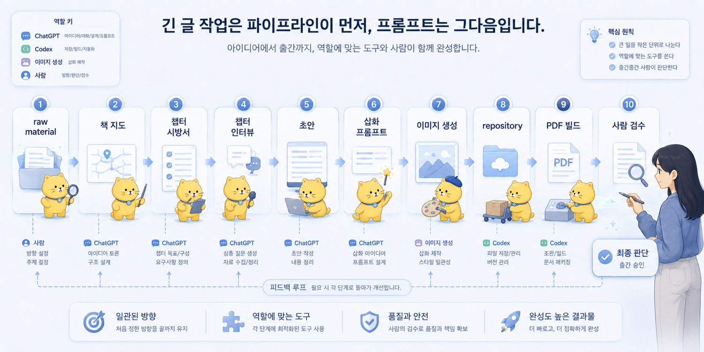
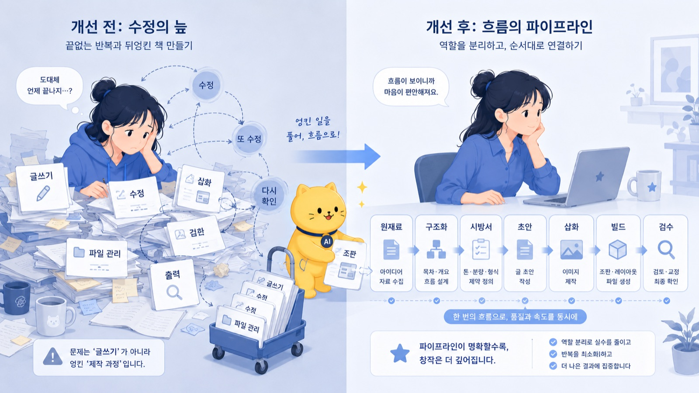
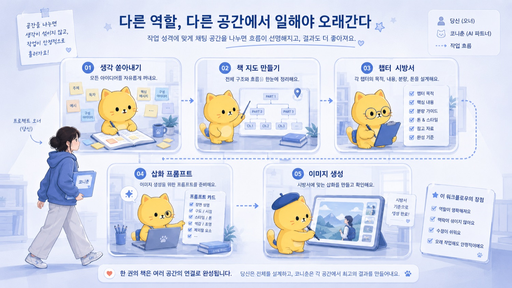
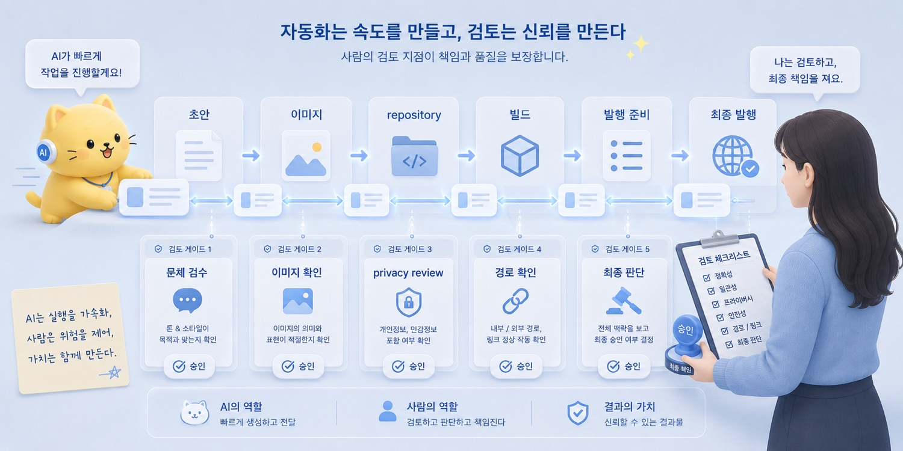

브런치 제목: 긴 작업은 프롬프트보다 파이프라인이 먼저다
브런치 부제: 긴 작업은 한 번에 시키는 것이 아니라 입력과 출력을 나눠 설계해야 한다
매거진: Codex, 니 이름은 이제부터 춘식이여
업로드 메모: 브런치 업로드 전 제목, 부제, 이미지, 개인정보를 최종 확인할 것. 로컬 이미지 8개는 브런치 업로드 후 URL 교체 필요.
이미지 후보: ../../CNC_gpt/image/06/1.png, ../../CNC_gpt/image/06/2.png, ../../CNC_gpt/image/06/3.png, ../../CNC_gpt/image/06/4.png, ../../output/cncbook_images/CNC_gpt_image_06_1_ae5fc5bc7a.jpg, ../../output/cncbook_images/CNC_gpt_image_06_2_1e220fbacf.jpg, ../../output/cncbook_images/CNC_gpt_image_06_3_b79c965cf0.jpg, ../../output/cncbook_images/CNC_gpt_image_06_4_6ca1c66b2e.jpg
---

예전에 책을 만든 적이 있다.

A5 판형에 88페이지 정도 되는 책이었다.
창작 자체는 오래 걸리지 않았다.
핵심 내용을 쓰는 데에는 3일 정도면 충분했다.

진짜 문제는 그다음이었다.

수정.
수정.
또 수정.

워드 파일을 열어놓고 페이지를 나눴다.
한 문단을 조금만 고치면 뒤쪽 페이지가 밀렸다.
표 하나가 움직이면 다음 장의 구성이 어긋났다.
줄바꿈을 고치면 또 다른 줄바꿈이 이상해졌다.
조판 기호를 켜고, 여백을 보고, 다시 출력하고, 다시 확인했다.

책을 쓰는 것보다 책이라는 형식과 싸우는 시간이 더 길었다.

그때는 모든 것이 한 덩어리였다.

글쓰기.
수정.
조판.
삽화.
파일 관리.
출력.
검수.

전부 한 사람의 손에 엉겨 있었다.

무언가를 하나 고치면 다른 것이 무너졌다.
한 문장을 고치면 페이지가 밀렸다.
이미지 하나를 바꾸면 레이아웃이 틀어졌다.
다시 보고, 다시 고치고, 다시 뽑았다.

그때의 나는 책을 만드는 사람이 아니라, 책이 무너지지 않게 붙잡고 있는 사람에 가까웠다.

이번에는 다르게 하고 싶었다.

---

코니춘, 그러니까 이 브런치북을 만들 때는 처음부터 한 번에 만들려고 하지 않았다.

“책 한 권 만들어줘.”

이렇게 시키지 않았다.

그랬으면 망했을 것이다.

AI는 긴 작업을 할 수 있다.
하지만 긴 작업을 한 번에 안정적으로 끝내는 존재는 아니다.

특히 책, 긴 문서, 앱 개발, 연구계획서처럼 맥락이 길고 조건이 많은 작업은 한 번에 “완성해줘”라고 하면 흔들리기 쉽다.

앞에서 정한 조건을 뒤에서 잊는다.
초반 톤과 후반 톤이 달라진다.
중요한 사례가 빠진다.
반복되는 문장이 많아진다.
출력이 길어지면서 중간에 흐려진다.
처음에는 내 의도를 따라오다가, 어느 순간 평균적인 글로 돌아간다.

내 경험상 20KB 정도를 넘어가면 AI가 슬슬 맛이 가기 시작한다.

물론 정확한 한계는 모델마다 다르고 상황마다 다르다.
하지만 체감상 긴 원고를 한 번에 넣고, 긴 결과물을 한 번에 뽑으려고 하면 안정성이 떨어진다.

입력 토큰에도 한계가 있고, 출력 토큰에도 한계가 있다.

더 중요한 것은 집중력의 한계다.

AI도 긴 맥락 안에서 모든 조건을 끝까지 붙잡고 가는 데 약하다.
처음에 준 조건을 뒤에서 희미하게 다루거나, 중간에 새로 나온 정보에 과하게 끌리거나, 앞뒤 톤을 다르게 만들 수 있다.

그래서 긴 작업에서는 프롬프트보다 파이프라인이 먼저다.

멋진 한 줄 프롬프트를 찾기 전에, 먼저 질문해야 한다.

이 일을 어떤 단위로 나눌 것인가?

---

이 브런치북도 그렇게 만들었다.

먼저 ChatGPT와 몇 시간 동안 대화했다.

머릿속에 있던 생각을 쏟아냈다.

AI를 쓰면서 느낀 감각.
Codex에게 춘식이라는 이름을 붙인 이야기.
침대에 누워 딸깍하고 작업을 맡긴 장면.
AI에게 일을 맡긴다는 것은 좋은 상사가 되는 일이라는 생각.
프롬프트는 주문이 아니라 specification이라는 생각.
AI는 평균적 작업자라는 비유.
ChatGPT와 Codex의 역할 차이.
책임은 결국 사람에게 남는다는 결론.

처음부터 정리된 글이 아니었다.

말하듯이 던졌다.
생각나는 대로 말했다.
중복도 많았다.
표현도 거칠었다.
어떤 것은 글감인지, 어떤 것은 그냥 잡담인지 구분도 안 됐다.

ChatGPT는 그걸 받아서 중심 생각들을 정리했다.

_긴 작업은 프롬프트보다 파이프라인이 먼저다의 문제의식이 처음 모습을 드러내는 장면._

그러고 나서 그 대화들을 바탕으로 20KB 정도 되는 markdown 문서들을 뽑아냈다.
그런 문서가 15개 정도 생겼다.

이 단계에서 중요한 것은 완성된 글을 만드는 것이 아니었다.

원재료를 만드는 것이었다.

긴 작업의 첫 단계는 완성본이 아니라 raw material이다.

---

그다음에는 다른 채팅방으로 갔다.

여기서 중요한 점은 채팅방을 나눴다는 것이다.

한 채팅에서 모든 것을 하지 않았다.

처음 채팅은 생각을 쏟아내는 곳이었다.
다음 채팅은 그것을 책으로 바꾸는 곳이었다.

나는 새 채팅에서 말했다.

“이 자료를 바탕으로 브런치북을 만들 거야. 이름, 주제, 프롤로그, 에필로그, 목차, 챕터 구성을 만들어줘.”

그러자 ChatGPT는 흩어진 생각을 책의 형태로 바꾸기 시작했다.

제목.
부제.
책의 핵심 문장.
파트 구성.
챕터 순서.
브런치 발행 순서.
ebook 순서.
작성 우선순위.
각 챕터의 역할.

이 단계에서도 아직 글을 쓰지 않았다.

먼저 책의 지도부터 만들었다.

책을 바로 쓰려고 하면 망한다.
특히 AI와 같이 쓸 때는 더 그렇다.

지도 없이 장거리 운전을 시작하면, 중간에 어디로 가는지 잊는다.

책도 마찬가지다.

프롤로그가 어디를 열어야 하는지,
1부가 어떤 문제를 다루는지,
어떤 글은 개념이고 어떤 글은 사용기인지,
어떤 챕터에서 책임의 이야기를 해야 하는지,
어떤 글은 나중에 써도 되는지.

이런 것을 먼저 잡아야 한다.

---

그다음에는 또 다른 채팅방을 만들었다.

이번에는 더 구체적인 시방서를 만들었다.

책 구상과 기존 원고를 바탕으로, 챕터별 구성 요소와 참조 문서와 중심 아이디어를 정리했다.

각 챕터마다 이런 정보를 붙였다.

작성순서.
발행순서.
성격.
핵심 메시지.
연결 문서.
개요.
주의점.

이건 거의 건축 시방서에 가까웠다.

“좋은 글 써줘”가 아니었다.

이 챕터는 왜 필요한가.
앞뒤 글과 어떻게 연결되는가.
어떤 문서를 참고해야 하는가.
어떤 메시지를 중심에 둬야 하는가.
어떤 방향으로 가면 안 되는가.

이걸 정리했다.

그러자 글이 훨씬 덜 흔들렸다.

AI에게 긴 작업을 맡길 때 중요한 것은 열정적인 요청이 아니다.

작업 가능한 단위와 기준이다.

---

이후에는 Codex가 들어왔다.

나는 의공모 repository를 fork해서 코니춘, 즉 CNCbook repository를 만들게 했다.

_작업의 흐름이 구체적인 구조로 바뀌는 순간._

이때도 그냥 “레포 만들어줘”라고 하지 않았다.

ChatGPT를 통해 300줄짜리 Codex용 프롬프트를 만들었다.

그리고 그걸 Codex에게 먹였다.

그 프롬프트에는 단순한 요청이 아니라 작업 환경이 들어 있었다.

이 프로젝트가 무엇인지.
책의 제목과 부제는 무엇인지.
이 책이 AI 활용팁 모음이 아니라 개인 AI 운영체계 제작기라는 점.
기존 repository에서 무엇을 가져와야 하는지.
어떤 파일과 폴더를 만들어야 하는지.
브런치 발행용 글은 어디에 저장해야 하는지.
metadata CSV에는 어떤 컬럼이 있어야 하는지.
이미지 checklist와 privacy review는 어떻게 남겨야 하는지.
어떤 작업은 하지 말아야 하는지.
어떤 챕터는 새로 쓰지 말고 gap만 표시해야 하는지.
최종 성공 조건은 무엇인지.

이건 프롬프트라기보다 공사 발주서에 가까웠다.

Codex는 시공팀이다.

시공팀에게는 설계도와 작업 범위가 필요하다.
어디를 뜯어도 되는지, 어디를 건드리면 안 되는지, 오늘의 목표가 완공인지 기초공사인지 알려줘야 한다.

그렇게 하자 Codex는 repository를 출판 준비 상태로 바꾸는 작업을 할 수 있었다.

파일을 만들고, 구조를 정리하고, 누락된 것을 표시하고, 브런치 업로드가 가능하도록 패키지를 준비했다.

---

그다음부터는 챕터를 하나씩 만들었다.

시방서를 보고, ChatGPT와 다시 이야기했다.

한 챕터를 만들 때마다 바로 초안을 쓰지 않았다.

먼저 ChatGPT에게 말했다.

“나한테 물어볼 것들을 알려줘.”

그러면 ChatGPT는 인터뷰 질문을 줬다.

이 글의 시작 장면은 무엇인지.
가장 중요한 사례는 무엇인지.
오해받고 싶지 않은 지점은 무엇인지.
독자가 마지막에 어떤 감정을 느끼면 좋겠는지.
어떤 표현은 피해야 하는지.

나는 거기에 답했다.

부족했던 아이디어를 다시 쏟아냈다.
내가 실제로 겪은 장면을 말했다.
말맛이 살아 있는 표현을 던졌다.
어떤 비유가 맞는지 골랐다.
어떤 문장은 너무 얌전하고, 어떤 문장은 살아 있는지 판단했다.

그제야 초안이 나왔다.

이 방식은 느려 보이지만, 실제로는 빠르다.

왜냐하면 처음부터 완성본을 뽑으려고 하지 않기 때문이다.

아이디어 수집.
인터뷰.
구조화.
초안.
보완.
리라이팅.
검수.

이렇게 나누면 각 단계에서 무엇을 봐야 하는지가 분명해진다.

한 번에 모든 것을 보려고 하면, 오히려 아무것도 제대로 못 본다.

---

삽화도 따로 파이프라인을 만들었다.

완성된 챕터 원고를 ChatGPT 이미지 프롬프트용 채팅에 넣었다.

그리고 물었다.

“이 글에 맞는 삽화 프롬프트를 뽑아줘.”

그 채팅방의 역할은 글을 쓰는 것이 아니었다.
이미지 프롬프트를 만드는 것이었다.

본문의 핵심 장면을 읽고,
도표로 만들지 만화형 장면으로 만들지 정하고,
삽화의 톤을 맞추고,
필요한 텍스트 요소를 정리하고,
프롬프트로 바꾸는 것이었다.

그다음에는 이미지 생성용 채팅방을 4~5개 만들었다.

멀티코어처럼 돌렸다.

한 채팅방에서 모든 이미지를 만들려고 하지 않았다.
이미지 생성은 실패도 많고, 수정도 많고, 원하는 스타일이 한 번에 안 나오는 경우도 많다.

_사람의 판단과 AI의 실행이 나뉘는 지점을 보여주는 장면._

그래서 여러 채팅방에서 병렬로 시도했다.

어떤 채팅방은 만화형 장면을 맡고,
어떤 채팅방은 도표형 이미지를 맡고,
어떤 채팅방은 표지 느낌을 시도하고,
어떤 채팅방은 기존 삽화 스타일을 맞추는 식이었다.

이것도 파이프라인이다.

글쓰기와 이미지 생성을 한 공간에 섞지 않았다.
아이디어 정리와 이미지 생성을 섞지 않았다.
프롬프트 생성과 실제 이미지 생성을 나눴다.

작업의 성격이 다르면 공간도 나눠야 한다.

---

모든 챕터가 어느 정도 완성되면 다시 repository로 돌아간다.

글 markdown 파일과 이미지 파일을 CNCbook repository에 넣는다.

그다음 Codex에게 맡긴다.

책으로 정리해라.
브런치북용 파일로 정리해라.
Word로 변환할 수 있게 해라.
PDF로 빌드해라.
이미지 경로를 확인해라.
metadata를 업데이트해라.
빠진 챕터와 이미지 요구사항을 표시해라.
privacy risk를 체크해라.

여기서도 사람은 사라지지 않는다.

ChatGPT는 아이디어 토의, 챕터 카드, 아웃라인, 초안, Codex용 지시문을 맡았다.
Codex는 repository 파일 정리, markdown 파일 생성과 수정, image placeholder, metadata, 빌드를 맡았다.
사람인 나는 방향 결정, 공개 범위 판단, 문체 검수, 최종 승인을 맡았다.

이 구조가 중요하다.

AI에게 긴 일을 맡긴다는 것은 사람을 빼는 일이 아니다.
사람이 봐야 할 지점을 더 선명하게 만드는 일이다.

---

이 과정을 업무 층위로 나눠보면 더 분명하다.

과거에는 책 만들기라는 하나의 일 안에 모든 것이 섞여 있었다.

원고 쓰기.
자료 정리.
문체 다듬기.
삽화 만들기.
이미지 경로 확인.
파일명 정리.
PDF 빌드.
최종 검수.

AI와 tool을 쓰면 이 일이 층위별로 나뉜다.

원재료를 만드는 일.
의미를 분류하고 구조화하는 일.
실제 파일을 정리하고 변환하는 일.
최종 판단하는 일.

반복적이고 정형적인 추출과 변환은 tool, script, Codex가 맡을 수 있다.
의미를 읽고 분류하고 요약하는 일은 ChatGPT 같은 LLM이 맡을 수 있다.
하지만 목표 설정, 기준 설정, 공개 범위, 예외 판단, 최종 선택과 책임은 사람이 맡아야 한다.

업무가 사라지는 것이 아니다.

층위별로 재배치되는 것이다.

---

자동화도 마찬가지다.

파이프라인을 만든다는 것은 모든 것을 자동으로 돌린다는 뜻이 아니다.

오히려 반대에 가깝다.

어디서 자동화하고, 어디서 사람이 멈춰서 볼지 정하는 것이다.

자동화는 속도를 준다.
하지만 책임을 없애지는 않는다.

잘못된 자동화는 오류도 빠르게 퍼뜨린다.

이미지 경로가 틀린 채로 모든 파일에 들어갈 수 있다.
민감한 내용이 privacy review 없이 발행 파일로 넘어갈 수 있다.
원본 파일을 덮어쓸 수 있다.
잘못된 메타데이터가 여러 산출물에 반복될 수 있다.
AI가 만든 평균적인 문장이 내 말투를 지울 수 있다.

그래서 파이프라인에는 검수 지점이 필요하다.

초안은 초안으로 표시한다.
이미지는 사람이 확인한다.
공개 범위는 사람이 판단한다.
privacy risk는 따로 본다.
최종 발행 버튼은 사람이 누른다.

Human-in-the-loop는 마지막에 사람이 대충 한 번 본다는 뜻이 아니다.

사람이 어디서 어떤 책임으로 개입하는지 workflow 안에 박혀 있다는 뜻이다.

파이프라인은 사람을 빼기 위한 구조가 아니라, 사람이 봐야 할 지점을 명확히 하기 위한 구조다.

_긴 작업은 프롬프트보다 파이프라인이 먼저다의 결론을 이미지로 정리한 장면._

---

좋은 파이프라인은 재사용된다.

이번에 코니춘을 만들면서 의공모 repository를 재사용했다.

이게 중요하다.

한 번 만든 workflow는 다음 작업의 뼈대가 된다.

파일 구조.
빌드 스크립트.
markdown 규칙.
이미지 위치 규칙.
metadata 형식.
privacy checklist.
Codex용 지시문.
챕터 시방서.
삽화 프롬프트 생성 방식.

이런 것들은 한 번 쓰고 버리는 결과물이 아니다.

다음 책, 다음 프로젝트, 다음 연구계획서, 다음 발표자료에도 응용할 수 있다.

AI 시대에는 최종 output 하나보다 pipeline이 더 중요해진다.

완성된 PDF 하나도 중요하다.

하지만 더 큰 자산은 그 PDF를 다시 만들 수 있는 구조다.

같은 방식으로 다른 책을 만들 수 있고,
다른 주제의 브런치북을 만들 수 있고,
연구계획서를 만들 수 있고,
발표자료를 만들 수 있고,
앱 문서를 만들 수 있다.

결과물은 한 번 쓰인다.

파이프라인은 반복된다.

---

그래서 긴 작업을 AI에게 맡길 때 나는 이제 이렇게 생각한다.

한 번에 끝내려고 하지 않는다.

먼저 raw material을 만든다.
그다음 구조를 만든다.
그다음 시방서를 만든다.
그다음 챕터별로 인터뷰한다.
그다음 초안을 쓴다.
그다음 삽화를 따로 만든다.
그다음 repository에 넣는다.
그다음 Codex에게 파일과 빌드를 맡긴다.
그다음 사람이 검수한다.

복잡해 보이지만, 오히려 이게 덜 복잡하다.

왜냐하면 각 단계에서 무엇을 해야 하는지가 분명하기 때문이다.

긴 작업을 한 번에 처리하려고 하면 AI도 헤매고, 사람도 헤맨다.

작업을 나누면 AI도 자기 역할을 알고, 사람도 어디를 봐야 하는지 안다.

---

AI 활용의 핵심은 멋진 한 줄 프롬프트가 아니다.

좋은 작업 흐름 하나다.

프롬프트는 그 흐름 안의 한 부품이다.
중요한 부품이지만 전부는 아니다.

진짜 중요한 것은 다음이다.

입력을 어떤 단위로 나눌 것인가.
출력을 어떤 단위로 받을 것인가.
어디서 ChatGPT와 생각할 것인가.
어디서 Codex에게 파일을 맡길 것인가.
어디서 이미지를 만들 것인가.
어디서 사람이 멈춰서 볼 것인가.
어떤 결과를 다음 작업의 입력으로 넘길 것인가.

이걸 설계하면 긴 작업이 움직인다.

책 한 권도 움직인다.
앱 개발도 움직인다.
연구계획서도 움직인다.
긴 문서도 움직인다.

AI에게 긴 일을 맡기고 싶다면, 먼저 질문해야 한다.

“좋은 프롬프트가 뭐지?”

보다 먼저,

“이 일을 어떤 단계로 나눌 것인가?”

좋은 프롬프트 한 줄보다 중요한 것은, 좋은 작업 흐름 하나다.

긴 작업은 한 번에 끝내는 것이 아니라, 사람이 판단할 수 있는 단위로 쪼개는 것이다.
