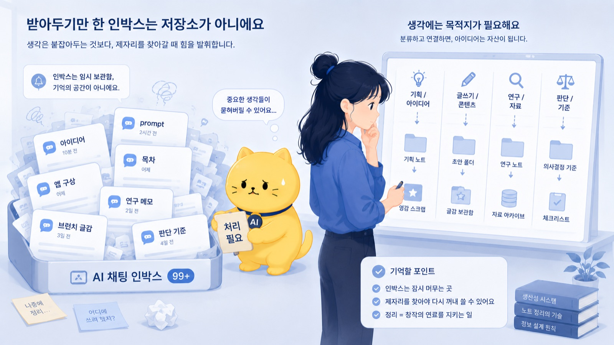
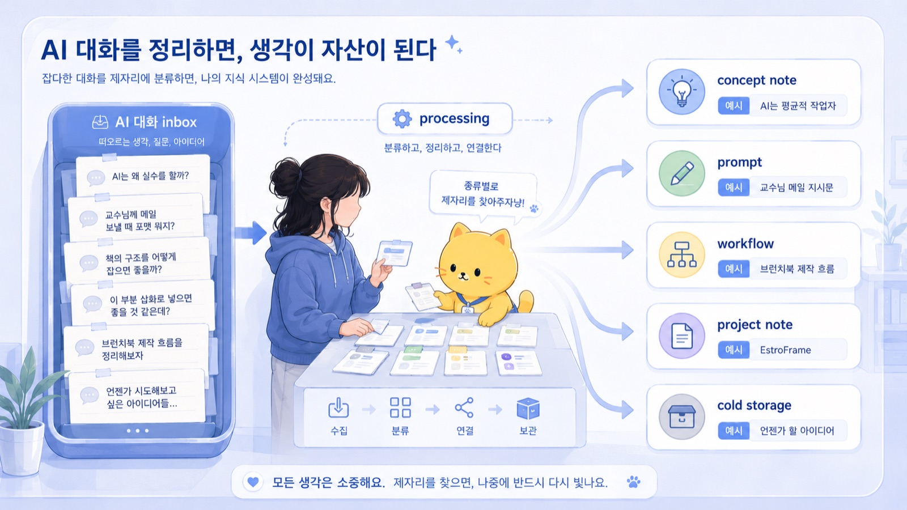
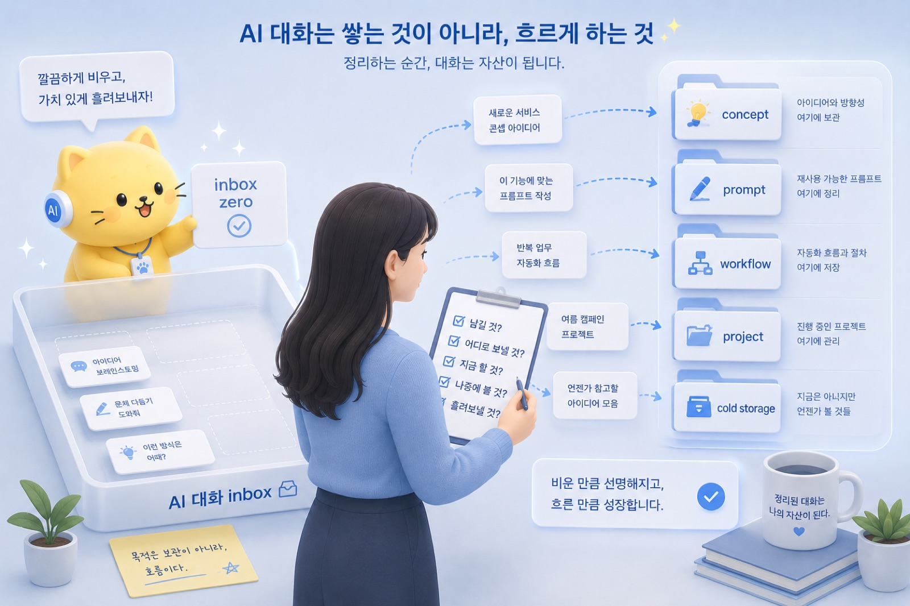
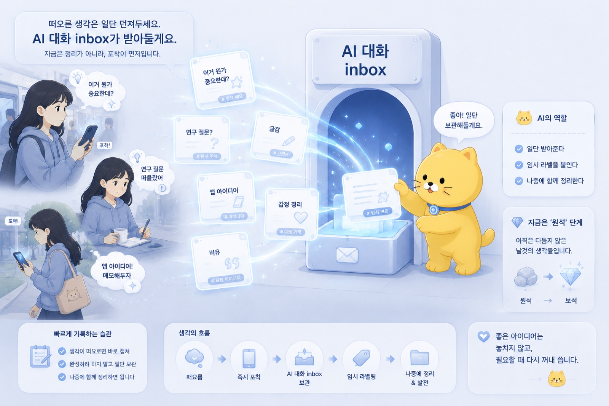

브런치 제목: AI 대화는 Inbox다
브런치 부제: AI 대화는 생각을 임시로 받아주는 inbox지만, inbox에만 쌓이면 안 된다
매거진: Codex, 니 이름은 이제부터 춘식이여
업로드 메모: 브런치 업로드 전 제목, 부제, 이미지, 개인정보를 최종 확인할 것. 로컬 이미지 8개는 브런치 업로드 후 URL 교체 필요.
이미지 후보: ../../CNC_gpt/image/07/Pasted Image (1).png, ../../CNC_gpt/image/07/Pasted Image (2).png, ../../CNC_gpt/image/07/Pasted Image (3).png, ../../CNC_gpt/image/07/Pasted Image.png, ../../output/cncbook_images/CNC_gpt_image_07_Pasted_Image_1_014ed3c85f.jpg, ../../output/cncbook_images/CNC_gpt_image_07_Pasted_Image_2_5dc074204d.jpg, ../../output/cncbook_images/CNC_gpt_image_07_Pasted_Image_3_ffec44f17c.jpg, ../../output/cncbook_images/CNC_gpt_image_07_Pasted_Image_8b1389c4d6.jpg
---

좋은 생각은 이상한 시간에 온다.

책상 앞에 앉아 있을 때만 오는 게 아니다.
샤워하다가 오고, 버스에서 오고, 실습 끝나고 집에 가는 길에 오고, 침대에 누워 있다가 오고, 교수님과 대화한 뒤 한참 지나서 온다.

연구 아이디어도 그렇다.
글감도 그렇다.
개발 아이디어도 그렇다.
인간관계에서 “아, 이게 문제였구나” 싶은 깨달음도 그렇다.
감정도 그렇다.

문제는 이런 생각들이 제때 붙잡히지 않으면 사라진다는 것이다.

방금 전까지는 분명히 중요해 보였다.
머릿속에서는 엄청 선명했다.
이건 나중에 꼭 써야겠다 싶었다.

그런데 몇 시간 지나면 흐려진다.

무슨 생각이었는지 기억은 나는데, 핵심 문장은 사라진다.
감정은 남아 있는데 구조는 날아간다.
아이디어의 방향은 알겠는데, 왜 중요했는지 설명이 안 된다.

그래서 나는 요즘 좋은 생각이 생기면 일단 AI 대화에 넣는다.

완성된 생각이 아니어도 된다.
문장이 예쁘지 않아도 된다.
욕이 섞여 있어도 된다.
비유만 있어도 된다.
“이거 뭔가 중요한데?” 정도여도 된다.

중요한 건 일단 놓치지 않는 것이다.

AI 대화는 내 생각이 들어오는 inbox다.

예전에는 생각을 머릿속에 오래 들고 있었다.

이건 나중에 글로 써야지.
이건 연구 아이디어로 발전시켜야지.
이건 앱으로 만들 수 있겠다.
이건 교수님께 여쭤보면 좋겠다.
이건 나중에 정리해야지.

그런데 “나중에”는 생각보다 자주 오지 않는다.

머릿속 inbox는 금방 넘친다.

새로운 생각이 들어오면 이전 생각이 밀린다.
감정이 크면 구조가 덮인다.
마감이 생기면 좋은 아이디어도 뒤로 밀린다.
실습, 연구, 글쓰기, 개발, 인간관계가 동시에 돌아가면 머릿속은 금방 탭 수십 개 켜진 브라우저가 된다.

AI 대화는 이때 임시 수납장이 된다.

EstroFrame 연구 아이디어가 떠오르면 AI에게 던진다.
브런치 글감이 생기면 AI에게 던진다.
실습 중 뭔가 판단해야 할 일이 생기면 AI에게 던진다.
앱 개발 아이디어가 떠오르면 AI에게 던진다.
감정이 너무 복잡해서 내가 뭘 느끼는지 모르겠을 때도 AI에게 던진다.

AI는 이 raw thought를 받아준다.

“이거 연구 질문으로 보면 뭐야?”
“이걸 글로 쓰면 제목이 뭐가 좋을까?”
“내가 지금 화난 이유가 뭘까?”
“이걸 앱 workflow로 만들 수 있나?”
“이 실습에서 내가 봐야 할 포인트가 뭐지?”

이런 식으로 던진다.

그러면 AI는 적어도 1차로 받아준다.

생각을 멈추지 않게 한다.
흩어진 말을 잠시 담아준다.
아직 이름 없는 감각에 임시 이름을 붙여준다.

_AI 대화는 Inbox다의 문제의식이 처음 모습을 드러내는 장면._

하지만 inbox는 저장소가 아니다.

이게 중요하다.

AI 대화는 생각을 받아주는 데에는 좋다.
하지만 거기에 계속 쌓아두기만 하면 곧 혼란이 된다.

채팅방은 늘어난다.
제목은 비슷해진다.
어느 대화에서 무슨 말을 했는지 헷갈린다.
좋은 prompt가 있었던 것 같은데 못 찾는다.
중요한 판단 기준을 말했던 것 같은데 대화 속에 묻힌다.
같은 얘기를 다른 채팅방에서 또 한다.
대화할 때는 똑똑해진 느낌인데, 실제 산출물은 남지 않는다.

특히 AI는 output을 너무 잘 만든다.

생각 하나를 던지면 제목 후보가 나오고, 목차가 나오고, 문서 구조가 나오고, 앱 아이디어가 나오고, 연구계획서 초안이 나오고, 브런치 글감이 나온다.

순식간에 가능성이 늘어난다.

처음에는 좋다.

그런데 어느 순간부터 모든 것이 프로젝트처럼 보인다.

이것도 해야 할 것 같고,
저것도 저장해야 할 것 같고,
이 아이디어도 아깝고,
저 workflow도 언젠가 쓸 것 같고,
이 대화도 중요한 것 같고,
저 문장도 나중에 책에 들어갈 것 같다.

이렇게 되면 AI 대화는 생각을 정리하는 도구가 아니라, 새로운 혼란의 원천이 된다.

inbox에 들어온 모든 것을 active project로 착각하면 안 된다.

_작업의 흐름이 구체적인 구조로 바뀌는 순간._

이건 이메일 inbox와 비슷하다.

메일함에 메일이 들어오는 것은 정상이다.

하지만 메일함에 모든 것을 영원히 쌓아두면 관리가 안 된다.

어떤 메일은 바로 답장해야 한다.
어떤 메일은 일정에 넣어야 한다.
어떤 메일은 자료로 저장해야 한다.
어떤 메일은 나중에 참고하면 된다.
어떤 메일은 그냥 버려도 된다.

메일함의 목적은 모든 메일을 보관하는 것이 아니다.

처리할 것을 처리하고,
저장할 것을 저장하고,
버릴 것을 버리고,
다음 행동으로 보낼 것을 보내는 것이다.

AI 대화도 마찬가지다.

AI 대화는 생각이 들어오는 문이다.
하지만 문 앞에 계속 쌓아두면 곧 잡동사니가 된다.

중요한 것은 대화 이후다.

이 생각을 어디로 보낼 것인가?

나는 AI 대화에서 나온 것을 몇 가지 목적지로 보낸다.

첫 번째는 concept note다.

개념으로 남길 만한 생각이다.

예를 들면 이런 것들이다.

AI는 평균적 작업자다.
프롬프트는 주문이 아니라 업무 명세서다.
긴 작업은 프롬프트보다 파이프라인이 먼저다.
AI 대화는 inbox다.
자동화의 핵심은 무엇을 자동화할지가 아니라 어디까지 자동화하지 않을지다.

이런 문장은 그냥 대화 속에 두면 아깝다.

개념 이름이 붙으면 다시 꺼내 쓸 수 있다.
글이 되고, 발표가 되고, 연구 아이디어를 설명하는 언어가 된다.

두 번째는 prompt다.

AI와 대화하다 보면 좋은 지시문이 생긴다.

교수님께 보낼 이메일 prompt.
연구 아이디어 feasibility 평가 prompt.
Codex에게 repository 정리를 맡기는 prompt.
브런치 글을 쓰기 전 인터뷰 질문을 뽑는 prompt.
공지문을 지송체로 정리하는 prompt.

이런 것은 한 번 쓰고 버리면 아깝다.

다시 쓸 수 있는 prompt는 따로 저장해야 한다.

세 번째는 workflow다.

반복 가능한 절차다.

예를 들어 이번 브런치북 작업도 workflow가 됐다.

AI 대화로 raw thought를 모은다.
중심 생각을 markdown으로 정리한다.
책 시방서를 만든다.
챕터별로 인터뷰 질문을 받는다.
초안을 쓴다.
삽화 프롬프트를 만든다.
이미지를 생성한다.
repository에 넣는다.
Codex에게 빌드와 정리를 맡긴다.
사람이 최종 검수한다.

이건 단순한 대화가 아니다.

다음 책에도 쓸 수 있는 workflow다.

네 번째는 project note다.

실제로 진행 중인 프로젝트에 연결되는 생각이다.

EstroFrame 연구 아이디어.
특성화 실습에서 본 workflow.
CleanEMR이나 EMRPilot 같은 앱 개발 아이디어.
브런치북 발행 작업.
코니춘 repository 정리.

이런 것은 project note에 붙어야 한다.

그냥 대화에 남아 있으면 실행과 연결되지 않는다.

다섯 번째는 cold storage다.

좋은 생각이지만 지금 할 일은 아닌 것들이다.

이것도 중요하다.

좋은 아이디어라고 해서 전부 지금 열면 안 된다.

AI 시대에는 아이디어가 너무 쉽게 그럴듯한 프로젝트로 변한다.
대화를 조금만 해도 제목이 생기고, 목차가 생기고, 앱 구조가 생기고, 연구계획서가 생긴다.

그러면 전부 가능한 것처럼 보인다.

하지만 가능한 것과 지금 해야 하는 것은 다르다.

Cold storage는 아이디어를 버리는 곳이 아니다.
지금 열지 않기 위해 안전하게 보관하는 곳이다.

좋은데 지금은 안 할 것.
언젠가 쓸 수 있지만 현재 active project를 방해하면 안 되는 것.
아직 너무 크거나 흐릿한 것.
마감도 없고 책임도 없는 것.

이런 것은 cold storage로 보낸다.

그래야 머릿속에서 계속 떠다니지 않는다.

_사람의 판단과 AI의 실행이 나뉘는 지점을 보여주는 장면._

이 다섯 가지는 전부 내 Obsidian PKM으로 들어간다.

중요한 것은 앱 이름이 아니다.

Obsidian을 쓰든, 폴더에 markdown 파일을 쓰든, Notion을 쓰든, 다른 도구를 쓰든 핵심은 같다.

AI 대화에서 나온 생각이 자기 역할을 가져야 한다.

이건 concept인가?
다시 쓸 prompt인가?
반복 가능한 workflow인가?
실제 project에 붙일 note인가?
지금은 닫아둘 cold storage인가?

이 질문이 중요하다.

메모 앱을 예쁘게 꾸미는 문제가 아니다.
생각의 흐름을 관리하는 문제다.

AI 대화는 잘 받아준다.
하지만 AI 대화가 모든 것을 보관해주지는 않는다.

적어도 내가 다시 찾고, 다시 쓰고, 다시 판단하려면 목적지가 필요하다.

_AI 대화는 Inbox다의 결론을 이미지로 정리한 장면._

여기서 조심해야 할 것이 있다.

모든 대화를 문서화할 필요는 없다.

모든 감정을 정리할 필요도 없다.
모든 아이디어를 프로젝트로 만들 필요도 없다.
모든 prompt를 저장할 필요도 없다.

그렇게 하려고 하면 시스템이 나를 돕는 것이 아니라 내가 시스템을 돌보게 된다.

AI 대화가 inbox라는 말은, 들어오는 모든 것을 완벽하게 처리하라는 뜻이 아니다.

일단 받아도 된다는 뜻이다.

생각이 들어오면 던져도 된다.
감정이 복잡하면 말해도 된다.
아이디어가 흐릿하면 대화해도 된다.
정리되지 않은 문장을 그대로 넣어도 된다.

다만 대화가 끝난 뒤에는 물어봐야 한다.

이건 남길 것인가?
남긴다면 어디로 보낼 것인가?
지금 실행할 것인가?
나중에 볼 것인가?
그냥 흘려보내도 되는가?

이 질문이 없으면 inbox는 곧 창고가 된다.

그리고 창고가 너무 커지면, 다시는 열지 않게 된다.

AI 대화가 좋은 이유는 생각을 빠르게 받아주기 때문이다.

사람에게 말하기엔 아직 너무 흐릿한 생각도 AI에게는 던질 수 있다.
정리되지 않은 감정도 일단 말할 수 있다.
부끄러운 초안도 보여줄 수 있다.
이상한 비유도 테스트할 수 있다.
아직 이름 없는 직관도 꺼낼 수 있다.

이것은 꽤 큰 일이다.

생각이 머릿속에서만 돌면 무겁다.
AI에게 던지면 일단 밖으로 나온다.
밖으로 나오면 볼 수 있다.
볼 수 있으면 다룰 수 있다.

하지만 대화로 꺼낸 것과 자산으로 만든 것은 다르다.

꺼내는 것은 capture다.
자산으로 만드는 것은 processing이다.

07에서 말하고 싶은 것은 여기까지다.

AI 대화는 capture에 강하다.
생각을 받아주는 inbox로 강하다.

하지만 inbox의 목적은 쌓아두는 것이 아니다.

이후 어디로 보낼지 정하는 것이다.

AI와 대화하는 것만으로는 충분하지 않다.

중요한 것은 대화 이후 그 생각을 어디로 보낼 것인가다.

AI 대화는 inbox다.

inbox의 목적은 쌓아두는 것이 아니라, 비우는 것이다.
