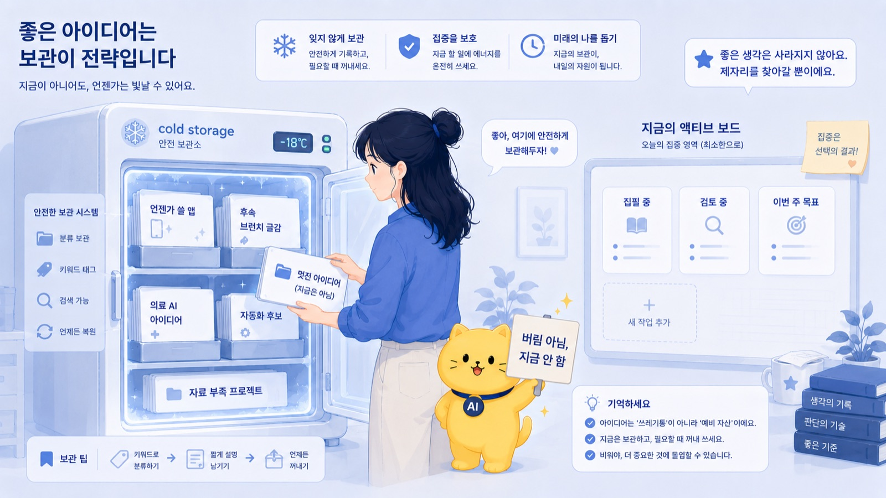
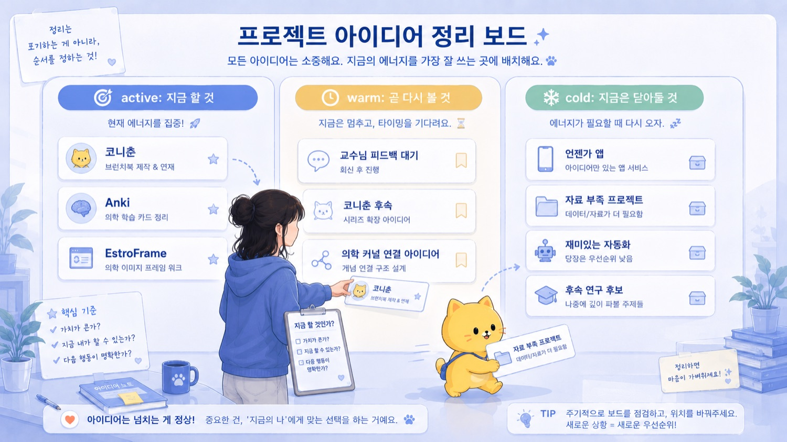
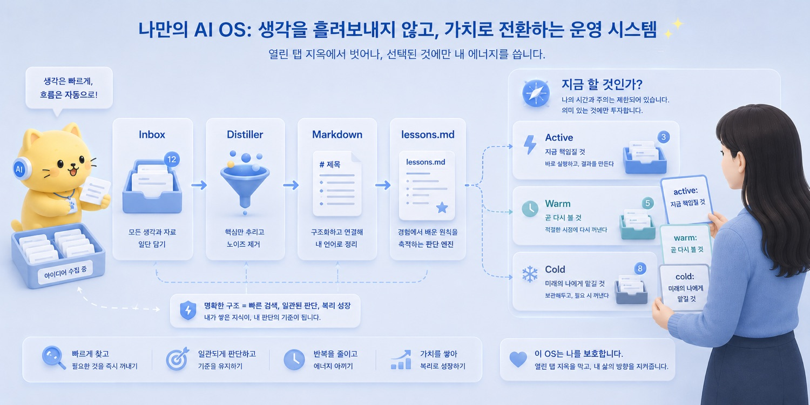
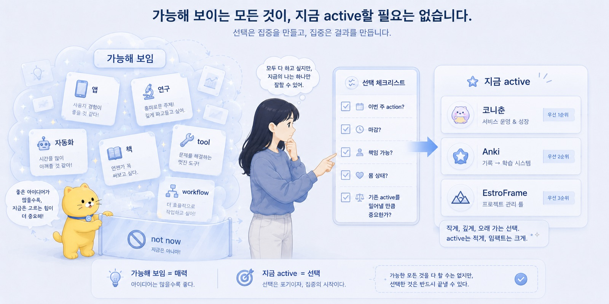

브런치 제목: Active Package와 Cold Storage
브런치 부제: 아이디어는 버리지 않아도 되지만 전부 지금 실행하면 안 된다
매거진: Codex, 니 이름은 이제부터 춘식이여
업로드 메모: 브런치 업로드 전 제목, 부제, 이미지, 개인정보를 최종 확인할 것. 로컬 이미지 8개는 브런치 업로드 후 URL 교체 필요.
이미지 후보: ../../CNC_gpt/image/11/Pasted Image (1).png, ../../CNC_gpt/image/11/Pasted Image (2).png, ../../CNC_gpt/image/11/Pasted Image (3).png, ../../CNC_gpt/image/11/Pasted Image.png, ../../output/cncbook_images/CNC_gpt_image_11_Pasted_Image_0f9286c4e9.jpg, ../../output/cncbook_images/CNC_gpt_image_11_Pasted_Image_1_cd53a52b15.jpg, ../../output/cncbook_images/CNC_gpt_image_11_Pasted_Image_2_b5fc7d2ffc.jpg, ../../output/cncbook_images/CNC_gpt_image_11_Pasted_Image_3_1ba4e60576.jpg
---

AI를 쓰면 아이디어가 줄어들 줄 알았다.

정확히는, 머릿속에 떠다니는 생각을 AI가 정리해주니까 좀 조용해질 줄 알았다.

그런데 꼭 그렇지는 않았다.

오히려 반대에 가까웠다.

AI는 생각을 정리해준다.
그런데 동시에 생각을 너무 빨리 현실적인 프로젝트처럼 만들어준다.

예전에는 아이디어가 떠올라도 바로 걸러졌다.

이건 만들려면 너무 오래 걸리겠지.
이건 내가 코드를 다 짜야 하니까 힘들겠지.
이건 문서화하려면 귀찮겠지.
이건 나중에나 가능하겠지.

실행 비용이 높았기 때문에 아이디어가 자연스럽게 식었다.

그런데 AI를 쓰기 시작하면 그 필터가 약해진다.

앱 아이디어가 떠오른다.
ChatGPT와 이야기하면 구조가 생긴다.
Codex에게 맡기면 파일이 생긴다.
대충이라도 prototype이 나온다.
README가 생기고, 폴더가 생기고, GitHub repository가 생긴다.

그러면 모든 아이디어가 갑자기 “할 수 있는 일”처럼 보인다.

좋은 일이다.

그런데 동시에 위험하다.

---

특히 의료 쪽 아이디어가 그랬다.

의학을 매일 다루다 보면 이상한 workflow가 계속 보인다.

EMR note는 왜 이렇게 비정형이지?
GAHT 처방 기록은 왜 연구 변수로 바로 쓰기 어렵지?
lab trend는 왜 한눈에 보기 어렵지?
환자 설명은 왜 매번 새로 반복하지?
chart review는 왜 이렇게 사람이 계속 눈으로 긁어야 하지?
의학 지식은 많은데 왜 실제 workflow는 이렇게 손이 많이 가지?

예전 같으면 이런 생각은 그냥 생각으로 끝났을 수 있다.

그런데 AI가 붙으면 달라진다.

이걸 앱으로 만들 수 있지 않나?
이걸 parser로 만들 수 있지 않나?
이걸 markdown workflow로 만들 수 있지 않나?
이걸 연구용 variable extraction tool로 만들 수 있지 않나?
이걸 PK model이랑 연결할 수 있지 않나?

질문이 생기고,
문서가 생기고,
repo가 생긴다.

그러다 보니 GitHub repository가 계속 늘어났다.

anki, CNCbook, choonsik-workspace, codex-workspace, EstroFrame, mesbook, estroframe_research, CleanText, Pharaframe, CleanEMR, jisong_cloud, obsidian_jsbang, DiaFrame, Photo_jisong, YT_playlist, jisong.dev, AndroFrame, NeuroFrame, VoiceGrape.

이런 식으로.

대충 세어보면 스무 개가 넘는다.

물론 전부 다 같은 무게는 아니다.

어떤 것은 실험이고,
어떤 것은 책 작업이고,
어떤 것은 연구 아이디어고,
어떤 것은 의료 workflow고,
어떤 것은 그냥 언젠가 쓸 수 있을 것 같은 껍데기다.

하지만 repo가 늘어난다는 것은 단순히 파일이 늘어난다는 뜻이 아니다.

머릿속 탭이 늘어난다는 뜻이다.

---

AI 시대의 문제는 아이디어 부족이 아니다.

오히려 아이디어 과잉이다.

AI를 쓰면 모든 아이디어가 그럴듯해진다.

브런치북 아이디어는 목차가 된다.
앱 아이디어는 README가 된다.
연구 아이디어는 IRB skeleton이 된다.
실습 중 느낀 불편함은 workflow 제안이 된다.
인간관계에서 얻은 lesson은 prompt가 된다.
자동화 아이디어는 script 후보가 된다.

예전에는 그냥 “나중에 해야지” 하고 지나갔을 생각이, 이제는 진짜 프로젝트처럼 보인다.

_Active Package와 Cold Storage의 문제의식이 처음 모습을 드러내는 장면._

이때 문제가 생긴다.

가능해 보이는 것과 지금 해야 하는 것은 다르다.

이 차이를 구분하지 못하면 active package가 폭증한다.

---

Active package는 지금 실제로 에너지를 쓰고 있는 프로젝트다.

그냥 폴더가 아니다.
그냥 GitHub repository도 아니다.
그냥 좋은 아이디어도 아니다.

지금 내 attention을 먹고 있는 작업이다.

이번 주에 실제 action이 있다.
마감이나 기회가 있다.
다른 사람과 연결되어 있을 수 있다.
산출물이 필요하다.
내가 책임지고 끌고 가야 한다.
안 하면 찝찝하다.
머릿속 background process로 계속 돈다.

이런 것이 active package다.

내 기준으로는 지금 active package를 세 개 넘기면 힘들다.

아무리 용을 써도 세 개 초과는 위험하다.

지금 기준으로 active에 가까운 것은 코니춘, Anki, EstroFrame 정도다.

코니춘은 지금 실제로 쓰고 있는 브런치북 프로젝트다.
Anki는 공부와 연결되어 있고, 실제로 써야 하는 시스템이다.
EstroFrame은 연구, 의학, GAHT, EMR, PK model이 연결된 장기축이다.

이 정도만 해도 이미 충분히 많다.

여기에 CleanText도 하고, CleanEMR도 하고, Pharaframe도 하고, NeuroFrame도 하고, VoiceGrape도 하고, DiaFrame도 하고, 다른 의료 AI 아이디어까지 전부 active로 올리면 시스템이 터진다.

아이디어가 나빠서가 아니다.

내 에너지가 유한하기 때문이다.

---

Active package가 많아지면 몸이 먼저 안다.

머릿속 background process가 계속 돈다.

쉬고 있어도 쉬는 느낌이 없다.
한 프로젝트를 하면서 다른 프로젝트가 찝찝하다.
문서는 많은데 완료가 없다.
AI output은 쌓이는데 내 실행력은 못 따라간다.
어느 repo에서 뭘 하다 말았는지 헷갈린다.
좋은 아이디어가 많다는 사실이 오히려 압박이 된다.

그리고 몸 상태가 안 좋아진다.

이게 제일 현실적이다.

생각은 계속 돌아가는데 몸이 못 따라간다.
AI는 24시간 초안을 만들 수 있지만, 나는 24시간 검수하고 판단할 수 없다.
AI는 지치지 않지만, 나는 지친다.
AI는 여러 프로젝트를 동시에 열 수 있지만, 내 attention은 동시에 그렇게 많이 못 연다.

그래서 active package 관리는 생산성 관리가 아니다.

시스템 보호다.

내 몸과 attention을 보호하는 일이다.

---

여기서 필요한 것이 cold storage다.

Cold storage는 버리는 곳이 아니다.

이게 중요하다.

좋은 아이디어를 버리자는 말이 아니다.
지금의 나를 점유하지 못하게 보관하자는 말이다.

좋은데 지금은 안 할 것.
언젠가 쓸 수 있지만 지금 active로 올리면 위험한 것.
의료 AI와 연결될 수 있지만 아직 데이터나 기회가 부족한 것.
앱으로 만들 수는 있지만 지금 만들면 다른 작업을 밀어낼 것.
브런치북 후속 글감으로 좋지만 지금 원고 흐름을 방해할 것.

이런 것은 cold storage에 둔다.

내 경우 미리알림에도 아이디어가 40개 넘게 저장되어 있다.

_작업의 흐름이 구체적인 구조로 바뀌는 순간._

그걸 하나하나 파기 시작하면 솔직히 무섭다.

전부 다 가능해 보인다.
전부 다 언젠가 쓸 수 있을 것 같다.
전부 다 조금만 밀면 뭔가 나올 것 같다.

그런데 그걸 전부 지금 열면 망한다.

Cold storage는 그걸 막기 위한 구조다.

아이디어를 죽이지 않는다.
다만 지금의 나를 점유하지 못하게 한다.

---

중간에는 warm storage도 있다.

하지만 너무 복잡하게 생각할 필요는 없다.

Warm storage는 지금 당장 active는 아니지만 가까운 시기에 다시 볼 가능성이 있는 것들이다.

예를 들어 교수님 피드백을 기다리는 연구 아이디어.
지금은 자료가 부족하지만 곧 실습이나 대화 후 다시 볼 수 있는 프로젝트.
코니춘이 끝난 뒤 바로 이어서 손볼 수 있는 후속 작업.
의학 커널과 연결되어 있지만 아직 next action이 명확하지 않은 앱 아이디어.

이런 것은 완전히 얼려두지는 않는다.

다만 active처럼 매일 에너지를 쓰지는 않는다.

결국 중요한 구분은 단순하다.

지금 할 것인가.
곧 다시 볼 것인가.
언젠가 볼 수 있지만 지금은 닫아둘 것인가.

이 세 가지를 나눠야 한다.

---

AI output이 많아질수록 이 구분은 더 중요해진다.

AI는 아이디어를 너무 빨리 그럴듯하게 만든다.

예전에는 “언젠가 만들 앱”이 그냥 상상으로 있었다.

이제는 10분이면 앱 이름, 기능 목록, README, 폴더 구조, mock data, prototype 계획까지 생긴다.

그러면 뇌가 속는다.

“이거 거의 된 거 아닌가?”

아니다.

초안이 생긴 것과 프로젝트가 active가 된 것은 다르다.

README가 있다고 프로젝트가 된 것이 아니다.
GitHub repository가 있다고 실행 중인 것이 아니다.
AI가 그럴듯한 구조를 만들었다고 내가 책임질 수 있는 일이 된 것은 아니다.

이 차이를 잊으면 모든 repo가 active처럼 느껴진다.

그리고 모든 repo가 active처럼 느껴지는 순간, 아무것도 제대로 끝나지 않는다.

---

그래서 나는 아이디어를 볼 때 질문을 한다.

지금 해야 하는가?

마감이 있는가?
사람과 약속이 있는가?
실제 산출물이 필요한가?
이번 주 next action이 명확한가?
내가 책임지고 끌고 갈 수 있는가?
현재 몸 상태와 에너지로 감당 가능한가?
기존 active package를 밀어낼 만큼 중요한가?

이 질문을 통과하지 못하면 active가 아니다.

좋은 아이디어여도 cold로 간다.

혹은 warm에 둔다.

이건 포기가 아니다.

지금의 나를 지키는 방식이다.

_사람의 판단과 AI의 실행이 나뉘는 지점을 보여주는 장면._

---

내 경우 또 하나의 기준은 의학 커널과 연결되는가다.

매일 의학을 다루다 보니, 결국 중심축이 생겼다.

의학.
EMR.
GAHT.
연구.
의료 AI.
병원 workflow.
patient communication.
chart review.
clinical decision support.

이 축과 강하게 연결되는 아이디어는 active나 warm으로 올라올 가능성이 높다.

예를 들어 EstroFrame은 단순한 앱 아이디어가 아니다.

GAHT, estradiol lab, PK model, EMR variable extraction, 연구계획, 의료 workflow가 연결되어 있다.

그래서 장기 active 축이 될 수 있다.

CleanText나 CleanEMR도 마찬가지다.

EMR note를 구조화하고, 비정형 의료 정보를 연구나 진료 전처리로 바꾸는 방향과 연결되어 있다.

하지만 어떤 아이디어는 재미있어도 중심축과 멀 수 있다.

그런 것은 cold storage에 둔다.

나중에 쓸 수 있다.
하지만 지금 내 삶의 중심을 차지할 필요는 없다.

이 기준이 없으면 모든 것이 중요해 보인다.

---

Active package를 적게 둔다는 것은 야망이 작다는 뜻이 아니다.

오히려 반대다.

크게 가려면 지금 열어둘 것을 줄여야 한다.

좋은 아이디어가 많아도 전부 동시에 밀면 아무것도 충분히 깊게 가지 못한다.

AI는 넓혀준다.
하지만 사람은 좁혀야 한다.

AI는 발산을 도와준다.
하지만 실행은 수렴해야 한다.

AI는 여러 가능성을 보여준다.
하지만 선택은 사람이 해야 한다.

여기서 중요한 것은 선택이 책임이라는 점이다.

어떤 프로젝트를 active로 올릴지 정하는 것은, 그 프로젝트에 내 시간과 몸과 판단을 배정하겠다는 뜻이다.

반대로 어떤 프로젝트를 cold storage로 보내는 것은, 그 아이디어가 가치 없다는 뜻이 아니다.

지금은 책임지지 않겠다는 뜻이다.

이 차이를 알아야 한다.

---

Cold storage에 넣으면 마음이 조금 편해진다.

버린 것이 아니기 때문이다.

문서로 남겼다.
제목을 붙였다.
필요하면 나중에 찾을 수 있다.
언젠가 다시 열 수 있다.

그러면 머릿속에서 계속 붙잡고 있을 필요가 줄어든다.

이것은 발산적 사고를 가진 사람에게 특히 중요하다.

아이디어를 억누르려고 하면 잘 안 된다.

계속 떠오른다.
다른 것과 연결된다.
갑자기 앱 이름이 생각난다.
기능 구조가 보인다.
이걸 나중에 쓰면 좋겠다는 느낌이 든다.

_Active Package와 Cold Storage의 결론을 이미지로 정리한 장면._

그럴 때 필요한 것은 “생각하지 마”가 아니다.

안전하게 넣어둘 곳이다.

Cold storage는 발산을 죽이는 것이 아니다.

발산이 현재를 집어삼키지 못하게 하는 완충지대다.

---

이 구조가 없으면 AI는 나를 더 바쁘게 만들 수 있다.

AI는 일을 줄여주기도 하지만, 일을 늘려주기도 한다.

왜냐하면 AI는 가능성의 비용을 낮추기 때문이다.

생각 하나가 문서가 되고,
문서가 프로젝트가 되고,
프로젝트가 repo가 되고,
repo가 또 다른 아이디어를 부른다.

이 흐름 자체는 좋다.

하지만 관리하지 않으면 산출물보다 열린 루프가 많아진다.

열린 루프가 많아지면 시스템 load가 올라간다.

그리고 어느 순간, AI를 많이 쓰는데도 더 피곤해진다.

이상한 일처럼 보이지만 사실 당연하다.

AI가 실행 비용을 낮췄지, 내 책임 비용까지 없앤 것은 아니기 때문이다.

---

그래서 Personal AI OS에는 active package와 cold storage가 필요하다.

Inbox는 생각을 받는다.
Distiller는 생각을 개념으로 뽑아낸다.
Markdown은 그 생각을 저장한다.
lessons.md는 경험을 원칙으로 바꾼다.

그리고 active/cold storage는 묻는다.

이걸 지금 할 것인가?

이 질문이 없으면 개인 운영체계는 무거워진다.

문서는 쌓이고,
repo는 늘고,
아이디어는 많아지고,
AI output은 쌓이는데,
정작 실행은 흐려진다.

그러면 운영체계가 아니라 열린 탭 지옥이 된다.

---

아이디어는 버리지 않아도 된다.

다만 전부 지금 실행하면 안 된다.

좋은 생각은 저장한다.
AI에게 구조화시킨다.
문서로 남긴다.
필요하면 cold storage에 둔다.

지금 해야 할 것은 active package로 올린다.
곧 다시 볼 것은 warm에 둔다.
언젠가 쓸 수 있지만 지금은 열지 않을 것은 cold에 둔다.

그리고 active는 적게 둔다.

내 몸이 감당할 수 있을 만큼만.
내 attention이 책임질 수 있을 만큼만.
내가 실제로 끝까지 볼 수 있을 만큼만.

Cold storage는 포기가 아니다.

지금의 나를 지키기 위해, 미래의 나에게 아이디어를 맡겨두는 방식이다.

발산은 자유롭게 한다.

정리는 AI에게 맡긴다.

실행은 좁힌다.
