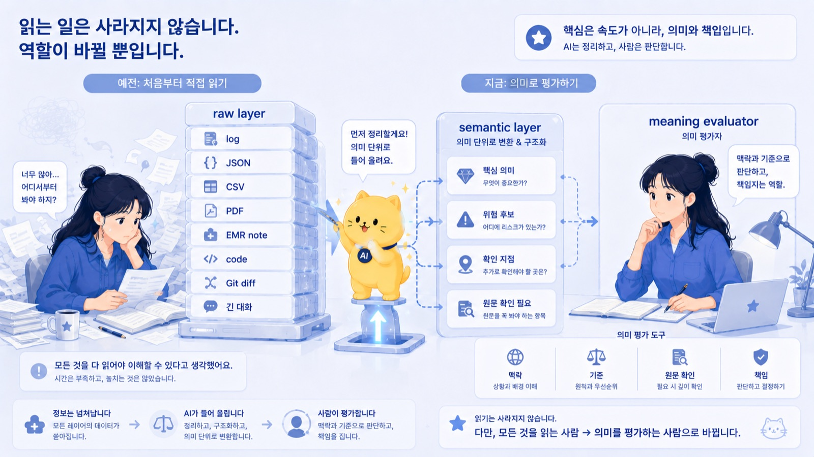
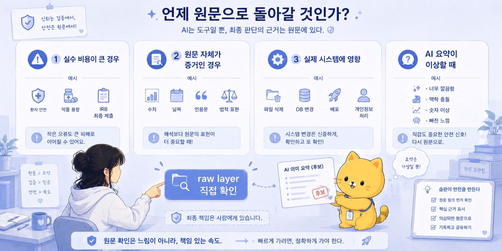
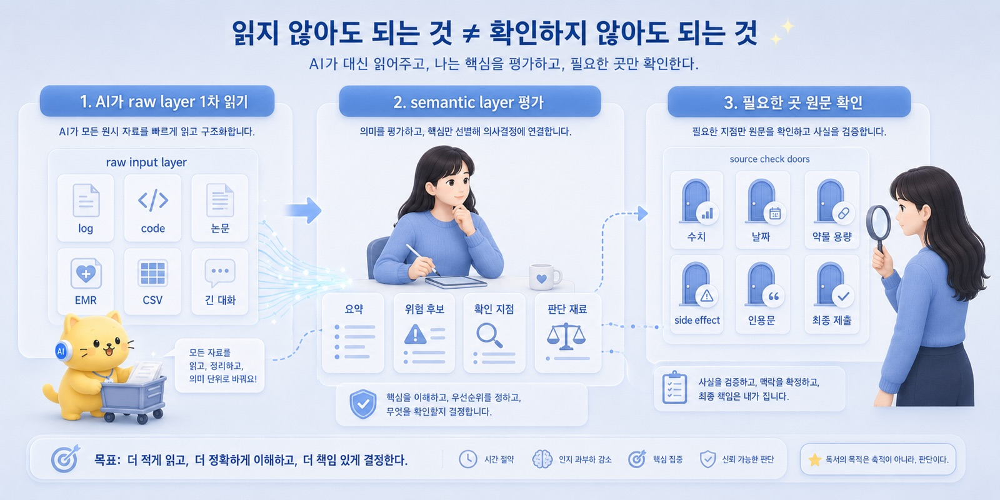
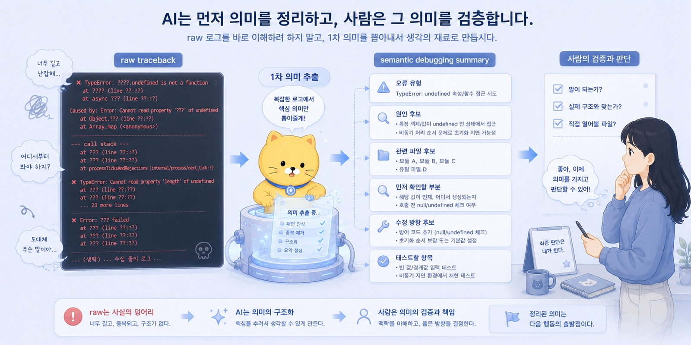

브런치 제목: Raw Layer를 읽지 않는 시대
브런치 부제: 사람은 raw layer 전체를 직접 읽는 존재에서 meaning evaluator로 이동한다
매거진: Codex, 니 이름은 이제부터 춘식이여
업로드 메모: 브런치 업로드 전 제목, 부제, 이미지, 개인정보를 최종 확인할 것. 로컬 이미지 8개는 브런치 업로드 후 URL 교체 필요.
이미지 후보: ../../CNC_gpt/image/15/Pasted Image (1).png, ../../CNC_gpt/image/15/Pasted Image (2).png, ../../CNC_gpt/image/15/Pasted Image (3).png, ../../CNC_gpt/image/15/Pasted Image.png, ../../output/cncbook_images/CNC_gpt_image_15_Pasted_Image_1_68b54631ee.jpg, ../../output/cncbook_images/CNC_gpt_image_15_Pasted_Image_2_02ab95045c.jpg, ../../output/cncbook_images/CNC_gpt_image_15_Pasted_Image_31ec776670.jpg, ../../output/cncbook_images/CNC_gpt_image_15_Pasted_Image_3_80f0aad68f.jpg
---

에러가 났다.

터미널에 빨간 글자가 쏟아졌다.

traceback.
파일 경로.
line number.
함수 이름.
TypeError.
어딘가에서 undefined를 읽을 수 없다는 말.
위에서 아래로 이어지는 호출 기록.

예전 같았으면 나는 그걸 처음부터 읽었다.

어느 파일에서 시작됐는지 보고,
어떤 함수가 어떤 함수를 불렀는지 따라가고,
어느 line에서 터졌는지 확인하고,
직접 코드 파일을 열어보고,
최근에 무엇을 바꿨는지 기억해내려고 했다.

물론 지금도 필요하면 그렇게 한다.

하지만 요즘은 첫 반응이 조금 달라졌다.

일단 traceback을 AI에게 던진다.

“이 에러가 무슨 뜻인지, 원인 후보와 먼저 확인할 파일을 정리해줘.”

그러면 AI는 빨간 글자의 덩어리를 사람이 읽을 수 있는 형태로 바꿔준다.

오류 유형.
직접 원인 후보.
관련 파일.
관련 함수.
먼저 확인할 부분.
가능한 수정 방향.
추가로 필요한 정보.
테스트할 항목.

나는 그제야 본다.

처음부터 raw log를 끝까지 읽는 것이 아니라, AI가 한 번 의미 단위로 올려준 결과를 먼저 본다.

그리고 판단한다.

이 원인 후보가 말이 되는지.
실제 코드 구조와 맞는지.
AI가 엉뚱한 파일을 찍은 것은 아닌지.
위험한 수정은 아닌지.
어디를 직접 열어봐야 하는지.

이 차이는 작아 보이지만 꽤 크다.

나는 더 이상 모든 raw layer를 처음부터 끝까지 읽는 사람이 아니다.

AI가 raw layer에서 1차 의미를 뽑아주면, 나는 그 의미를 평가하는 사람이 된다.

앞 글에서 LLM은 universal adapter라고 했다.

LLM은 사람의 말, 코드, 로그, 문서, API, EMR note, 연구 아이디어 사이를 오가며 형식을 바꾸고 의미를 옮긴다.

그렇다면 다음 질문이 생긴다.

LLM이 raw layer를 읽고,
요약하고,
분류하고,
다른 형식으로 바꿔주기 시작하면,

사람은 이제 무엇을 직접 읽어야 할까?

이 질문은 생각보다 중요하다.

AI가 요약해주니까 원문을 안 봐도 된다는 말이 아니다.

그건 위험하다.

하지만 반대로, 사람이 모든 원자료를 처음부터 끝까지 직접 읽어야만 책임 있는 작업을 할 수 있다는 말도 점점 비현실적이다.

이제 정보의 양은 너무 많다.

log는 길고,
traceback은 지저분하고,
논문 PDF는 쌓이고,
EMR note는 길고,
CSV와 JSON은 눈에 안 들어오고,
AI가 짠 코드는 내가 직접 친 코드보다 훨씬 빨리 늘어난다.

모든 raw layer를 사람이 끝까지 읽는 방식으로는 속도를 따라가기 어렵다.

그래서 읽기의 중심이 바뀐다.

사람은 raw reader에서 meaning evaluator로 이동한다.

여기서 raw layer란 가공되지 않은 정보층이다.

사람이 바로 판단하기에는 너무 길거나, 지저분하거나, 기계 친화적인 정보.

예를 들면 이런 것들이다.

log.
traceback.
JSON.
CSV.
API response.
configuration file.
source code.
Git diff.
database dump.
논문 PDF.
supplementary material.
EMR note.
lab table.
medication history.
meeting transcript.
OCR text.
긴 AI 대화.

이것들은 중요하다.

중요하지 않아서 raw layer라고 부르는 것이 아니다.

오히려 매우 중요하다.

문제는 이 정보들이 사람에게 바로 좋은 형태로 주어지지 않는다는 데 있다.

log는 원인을 담고 있지만 길다.
traceback은 힌트를 주지만 처음 보면 피곤하다.
논문 PDF는 근거를 담고 있지만 매번 처음부터 끝까지 읽기 어렵다.
EMR note는 환자의 맥락을 담고 있지만 너무 길고 비정형적이다.
CSV와 JSON은 데이터를 담고 있지만 눈으로 읽기에는 거칠다.
Git diff는 변경사항을 담고 있지만 맥락 없이 보면 의미가 잘 안 잡힌다.

과거에는 사람이 이 raw layer를 직접 읽고 의미를 뽑아야 했다.

개발자는 traceback을 따라갔다.
연구자는 논문 PDF에서 endpoint와 variable을 직접 뽑았다.
의사는 EMR note를 훑고 오늘 볼 문제를 정리했다.
조교는 OCR text를 보고 문제와 선지를 다시 맞췄다.
글 쓰는 사람은 긴 대화 속에서 핵심 문장을 직접 찾아냈다.

그런데 이 작업 중 상당수는 고급 판단 그 자체라기보다, 판단 전에 필요한 의미 추출 작업에 가깝다.

긴 텍스트에서 핵심 문장 찾기.
반복되는 패턴 인식하기.
형식이 다른 정보를 같은 구조로 맞추기.
중요하지 않은 부분 걷어내기.
표로 바꾸기.
요약하기.
원인 후보 나열하기.
변수 후보 추출하기.
다음에 확인할 항목 정리하기.

이런 작업은 LLM이 잘하는 일과 겹친다.

_Raw Layer를 읽지 않는 시대의 문제의식이 처음 모습을 드러내는 장면._

AI는 raw layer를 semantic layer로 바꾼다.

raw layer는 거친 정보다.

semantic layer는 사람이 판단할 수 있는 의미 단위다.

traceback이 raw layer라면, semantic layer는 이런 것이다.

오류가 발생한 파일.
오류가 발생한 함수.
직접 원인 후보.
관련 입력값.
먼저 확인할 부분.
수정 방향 후보.
재현 방법.
테스트할 항목.

논문 PDF가 raw layer라면, semantic layer는 이런 것이다.

연구 질문.
대상자 기준.
primary endpoint.
secondary endpoint.
주요 변수.
통계 방법.
한계.
내 연구에 참고할 점.
원문 확인이 필요한 수치.

코드가 raw layer라면, semantic layer는 이런 것이다.

이 코드의 목적.
입력과 출력.
읽는 파일.
쓰는 파일.
외부 API 호출 여부.
side effect.
실패 가능성.
테스트 방법.
rollback 가능성.

EMR note가 raw layer라면, semantic layer는 이런 것이다.

active problem 후보.
최근 lab 변화.
약물 변경 이력.
follow-up이 필요한 문제.
누락된 검사.
환자에게 설명해야 할 내용.
연구 변수로 추출 가능한 항목.

AI가 하는 일은 raw data를 바로 final decision으로 바꾸는 것이 아니다.

AI가 해야 하는 좋은 일은 raw layer를 사람이 판단 가능한 semantic layer로 올리는 것이다.

그다음 판단은 사람의 일이다.

코드에서 이 변화가 특히 선명하다.

AI가 코드를 짜기 시작하면서 이런 질문이 자주 생긴다.

AI가 쓴 코드를 내가 모든 줄 다 이해해야 하나?

예전에는 이 질문에 쉽게 답할 수 있었다.

당연히 이해해야지.

내 코드니까.
내 프로젝트니까.
내가 책임질 거니까.

이 말은 여전히 맞다.

특히 중요한 코드에서는 맞다.

환자 안전과 관련된 코드.
개인정보를 처리하는 코드.
병원 시스템과 연결되는 코드.
연구 통계 최종 분석 코드.
데이터베이스를 변경하는 코드.
실제 서비스에 배포되는 코드.
파일을 삭제하거나 덮어쓰는 코드.

이런 코드는 깊게 봐야 한다.

하지만 모든 코드의 모든 줄을 사람이 처음부터 끝까지 이해해야만 쓸 수 있다는 기준은 AI 시대에 점점 비현실적이다.

AI가 작은 script를 만든다.
파일명을 정리한다.
markdown metadata를 뽑는다.
이미지 경로를 확인한다.
CSV를 변환한다.
테스트용 데이터를 만든다.
반복적인 형식을 맞춘다.

이런 낮은 위험의 반복 작업까지 모든 줄을 내가 직접 쓴 것처럼 완전히 해부해야 한다면, AI를 쓰는 의미가 줄어든다.

중요한 것은 줄 단위 이해만이 아니다.

행동 단위 이해가 중요해진다.

이 코드는 무엇을 하려는가.
입력은 무엇인가.
출력은 무엇인가.
어떤 파일을 읽는가.
어떤 파일을 쓰는가.
원본을 덮어쓰는가.
외부 API를 호출하는가.
개인정보나 민감정보를 다루는가.
실패하면 어떤 일이 생기는가.
잘못된 입력이 들어오면 어떻게 되는가.
작은 샘플로 먼저 테스트할 수 있는가.
문제가 생기면 rollback 가능한가.

이걸 봐야 한다.

모든 줄을 기계적으로 읽는 것보다, 코드의 행동과 위험을 이해하는 것이 더 중요해진다.

그렇다고 AI 코드를 믿어도 된다는 뜻은 아니다.

오히려 반대다.

AI 코드는 반드시 검증해야 한다.

다만 검증의 방식이 바뀐다.

나쁜 방식은 이렇다.

AI가 짜줬으니 그냥 실행한다.
오류가 안 나면 맞는 코드라고 생각한다.
결과 파일을 대충 보고 넘어간다.
중요한 데이터에 바로 적용한다.
원본 파일을 덮어쓰게 둔다.
무슨 side effect가 있는지 확인하지 않는다.

이건 위험하다.

좋은 방식은 다르다.

작은 샘플 데이터로 먼저 실행한다.
입력과 출력이 예상과 맞는지 확인한다.
원본 파일을 덮어쓰지 않게 한다.
dry run을 먼저 돌린다.
로그를 남기게 한다.
실패한 row를 따로 저장하게 한다.
git이나 백업으로 rollback 가능하게 한다.
중요한 결과는 spot check한다.
위험한 작업은 사람이 승인한 뒤 실행한다.

AI 시대의 코드 이해는 “내가 모든 줄을 손으로 썼는가”가 아니다.

“내가 이 코드의 행동과 위험을 이해하고 검증했는가”에 가깝다.

이건 읽기를 포기하는 것이 아니다.

읽기의 초점을 바꾸는 것이다.

_작업의 흐름이 구체적인 구조로 바뀌는 순간._

논문도 마찬가지다.

예전에는 논문 PDF를 열면 처음부터 읽었다.

abstract.
introduction.
methods.
results.
discussion.

물론 중요한 논문은 지금도 그렇게 읽어야 한다.

하지만 모든 논문을 그렇게 읽을 수는 없다.

특히 연구 아이디어를 탐색하는 단계에서는 먼저 구조가 필요하다.

이 논문의 연구 질문은 무엇인가.
대상자는 누구인가.
primary endpoint는 무엇인가.
측정 변수는 무엇인가.
분석 방법은 무엇인가.
내 연구와 연결되는 부분은 어디인가.
한계는 무엇인가.
반드시 원문 확인이 필요한 수치와 문장은 무엇인가.

AI는 논문 PDF에서 이런 semantic layer를 먼저 뽑아줄 수 있다.

그러면 사람은 모든 문장을 처음부터 읽기 전에, 논문의 구조를 먼저 본다.

이 논문이 내 질문과 관련 있는가.
더 깊게 읽을 가치가 있는가.
methods를 확인해야 하는가.
결과 수치를 원문에서 봐야 하는가.
인용해도 되는 주장인가.
AI가 놓쳤을 가능성이 있는 caveat는 무엇인가.

이렇게 읽으면 논문 읽기가 바뀐다.

원문을 안 읽는 것이 아니다.

원문으로 들어갈 경로를 좁히는 것이다.

AI는 논문을 대신 믿어주는 존재가 아니다.

AI는 어디를 읽어야 할지 먼저 알려주는 존재에 가깝다.

EMR에서도 이 관점은 중요하다.

EMR은 대표적인 raw layer다.

외래 note.
입원 note.
수술 기록.
간호 기록.
lab result.
imaging report.
medication order.
diagnosis code.
consultation note.
discharge summary.
환자 message.

이 정보는 환자를 이해하는 데 필요하다.

하지만 매번 처음부터 끝까지 다 읽는 것은 어렵다.

AI는 EMR을 semantic layer로 바꾸는 데 도움을 줄 수 있다.

오늘 진료에서 확인할 active problem 후보.
최근 악화된 lab.
약물 변경 이력.
follow-up이 필요한 문제.
누락된 검사.
환자가 반복적으로 호소한 증상.
진료 전 확인할 질문.
환자 설명에 필요한 요점.
연구용 변수 후보.

이런 식이다.

하지만 여기서 경계가 중요하다.

EMR 요약은 진료 판단이 아니다.

AI가 active problem 후보를 뽑았다고 해서 그것이 확정 진단은 아니다.
AI가 lab trend를 정리했다고 해서 임상적 의미가 자동으로 결정되는 것은 아니다.
AI가 약물 변경 이력을 정리했다고 해서 처방 판단을 대신할 수는 없다.

의사는 원문으로 돌아갈 수 있어야 한다.

특히 약물 용량, lab value, 날짜, 수술 전후 관리, 응급도 판단, 환자 안전과 관련된 부분은 반드시 확인해야 한다.

AI는 EMR을 읽는 부담을 줄일 수 있다.

하지만 환자 안전에 대한 책임을 대신할 수는 없다.

의료에서 raw layer를 덜 읽는다는 것은 원문을 버린다는 뜻이 아니다.

어디를 먼저 볼지, 어디를 반드시 확인할지 더 전략적으로 정한다는 뜻이다.

_사람의 판단과 AI의 실행이 나뉘는 지점을 보여주는 장면._

연구에서도 똑같다.

연구에는 raw layer가 많다.

논문 PDF.
supplementary material.
chart review note.
lab table.
prescription history.
variable dictionary.
IRB document.
protocol draft.
statistical output.
reviewer comment.
meeting memo.

과거에는 연구자가 이것을 직접 읽고 정리해야 했다.

이제 AI는 많은 부분을 도울 수 있다.

논문에서 연구 질문을 추출한다.
methods 구조를 정리한다.
endpoint와 variable을 분리한다.
inclusion/exclusion criteria를 표로 만든다.
내 연구와 연결되는 부분을 표시한다.
변수표 초안을 만든다.
분석계획 초안을 만든다.
reviewer comment를 action item으로 바꾼다.
chart review note에서 구조화 변수 후보를 추출한다.
statistical output을 사람이 읽는 말로 설명한다.

하지만 연구에서도 최종 판단은 사람이 해야 한다.

AI가 뽑은 변수는 실제 EMR에서 추출 가능한지 확인해야 한다.
AI가 요약한 논문은 원문과 맞는지 확인해야 한다.
AI가 제안한 endpoint는 연구 질문과 임상적 의미에 맞는지 검토해야 한다.
AI가 쓴 결론은 데이터가 실제로 지지하는지 확인해야 한다.

AI는 연구자의 눈을 대체하지 않는다.

연구자가 봐야 할 곳을 좁혀준다.

그러면 사람이 직접 raw layer를 읽어야 하는 경우는 언제일까.

첫 번째는 실수 비용이 큰 경우다.

환자 안전.
약물 용량.
응급도 판단.
수술 전후 관리.
개인정보 처리.
IRB 최종 제출.
논문 최종 통계 결과.
법적 문서.
병원 공식 기록.

이런 경우 AI 요약만 보고 판단하면 안 된다.

두 번째는 원문 자체가 증거인 경우다.

논문 수치.
lab value.
medication dose.
날짜.
인용문.
IRB 문구.
환자 기록의 특정 표현.
법적 표현.

이런 것은 AI가 요약한 문장이 아니라 원문을 확인해야 한다.

세 번째는 실제 시스템에 영향을 주는 작업이다.

파일 삭제.
database 변경.
외부 API 호출.
배포.
개인정보가 포함된 데이터 처리.
원본 파일 덮어쓰기.

이런 코드는 AI 설명만 듣고 실행하면 안 된다.

네 번째는 AI 요약이 이상하게 느껴질 때다.

뭔가 너무 자신만만하거나,
결론이 과하게 깔끔하거나,
내가 아는 맥락과 충돌하거나,
중요한 부분이 빠진 것 같거나,
숫자와 날짜가 이상해 보이면 원문으로 돌아가야 한다.

AI 요약은 탐색 도구다.

최종 증거가 아니다.

그래서 “raw layer를 읽지 않는 시대”라는 말은 조심해서 써야 한다.

이 말은 사람이 원문을 안 봐도 된다는 뜻이 아니다.

정확히는 이렇다.

사람이 모든 raw layer를 처음부터 끝까지 직접 읽는 것이 기본값이 아니게 된다.

기본 workflow가 바뀐다.

먼저 AI가 raw layer를 1차로 읽는다.
AI가 핵심 의미, 구조, 위험 후보를 추출한다.
사람은 AI가 추출한 semantic layer를 검토한다.
중요한 부분은 원문으로 돌아가 확인한다.
최종 판단과 책임은 사람이 진다.

즉 사람은 raw layer를 완전히 버리는 것이 아니다.

사람은 raw layer에 직접 들어가는 시점과 범위를 더 전략적으로 선택한다.

예전에는 모든 숲을 처음부터 걸어야 했다.

이제 AI가 지도를 먼저 그려준다.

하지만 지도와 땅은 다르다.

지도만 보고 절벽을 건널 수는 없다.

_Raw Layer를 읽지 않는 시대의 결론을 이미지로 정리한 장면._

이 변화는 문해력의 의미도 바꾼다.

과거의 문해력은 긴 글을 직접 읽고 이해하는 능력이었다.

그 능력은 여전히 중요하다.

AI 시대에도 긴 글을 읽지 못하는 사람은 위험하다.
원문으로 돌아갈 수 없는 사람은 AI 요약을 검증할 수 없다.
기본 지식이 없는 사람은 AI가 놓친 부분을 감지하기 어렵다.

하지만 이제 문해력은 단순히 오래 읽는 능력만으로는 부족하다.

AI 시대의 문해력은 이런 능력을 포함한다.

어떤 raw data를 AI에게 줄지 판단하는 능력.
AI가 추출한 의미가 맞는지 평가하는 능력.
요약에서 빠진 것을 감지하는 능력.
원문 확인이 필요한 부분을 고르는 능력.
high-risk와 low-risk를 나누는 능력.
AI가 만든 구조를 workflow로 바꾸는 능력.
최종 책임을 질 수 있는 결론만 채택하는 능력.

읽기의 중심이 raw reading에서 mediated reading으로 이동한다.

사람은 여전히 읽는다.

하지만 읽는 방식이 달라진다.

모든 줄을 처음부터 끝까지 읽는 능력만큼이나,
어디를 직접 읽어야 하는지 아는 능력이 중요해진다.

AI 시대의 문해력은 모든 줄을 읽는 능력이 아니라, 어디를 원문 확인해야 하는지 아는 능력이다.

이 관점은 내가 AI를 쓰는 방식과도 맞닿아 있다.

나는 비정형 정보를 많이 다룬다.

AI와의 긴 대화.
브런치북 원고.
markdown 문서.
연구 아이디어.
논문.
IRB 초안.
교수님 피드백.
EMR과 GAHT 정보.
PK model.
코드.
에러 로그.
인간관계 메시지.
팀 운영 맥락.

이걸 전부 raw layer에서 직접 처리하려고 하면 에너지가 너무 많이 든다.

AI를 쓰면 흐름이 바뀐다.

긴 대화는 핵심 개념으로 압축된다.
논문은 endpoint와 method 구조로 분해된다.
교수님 피드백은 revision plan이 된다.
인간관계 경험은 communication protocol이 된다.
코드와 error는 behavior와 failure mode 중심으로 정리된다.
흩어진 생각은 markdown 문서가 된다.

AI는 내 raw cognitive input을 semantic layer로 올려준다.

내가 해야 할 일은 그 의미가 맞는지 평가하는 것이다.

이 문장이 내 생각을 왜곡하지 않았는지.
이 연구 구조가 실제 데이터로 가능한지.
이 코드가 위험한 행동을 하지 않는지.
이 요약에서 빠진 예외는 없는지.
이 메시지를 실제로 보내도 되는지.
이 판단을 내 이름으로 책임질 수 있는지.

이게 사람의 일이다.

결국 AI 시대에 읽기는 사라지지 않는다.

읽는 대상과 순서가 바뀐다.

AI가 raw layer를 먼저 읽는다.
사람은 semantic layer를 평가한다.
필요한 곳에서는 다시 raw layer로 돌아간다.
그리고 최종 판단은 사람이 한다.

읽지 않아도 되는 것과 확인하지 않아도 되는 것은 다르다.

AI가 raw layer를 읽어준다고 해서, 모든 것을 자동화해도 된다는 뜻은 아니다.

오히려 다음 질문이 더 중요해진다.

어디까지 맡길 것인가.
어디서 멈출 것인가.
어디는 반드시 사람이 볼 것인가.
어떤 작업은 아예 자동화하지 않을 것인가.

다음 문제는 자동화하지 않을 것을 정하는 일이다.
