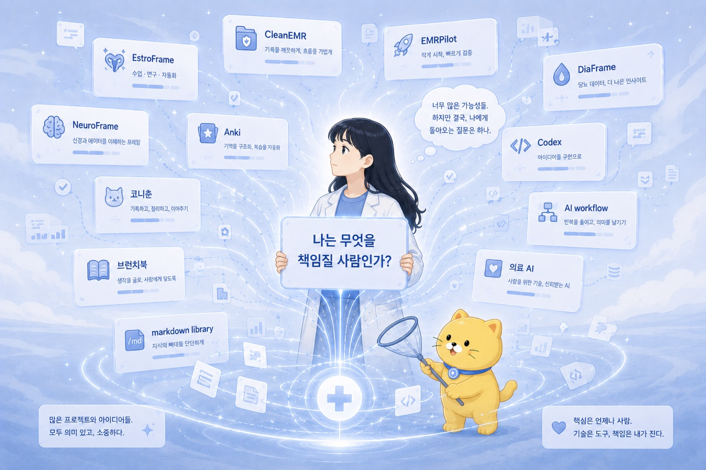
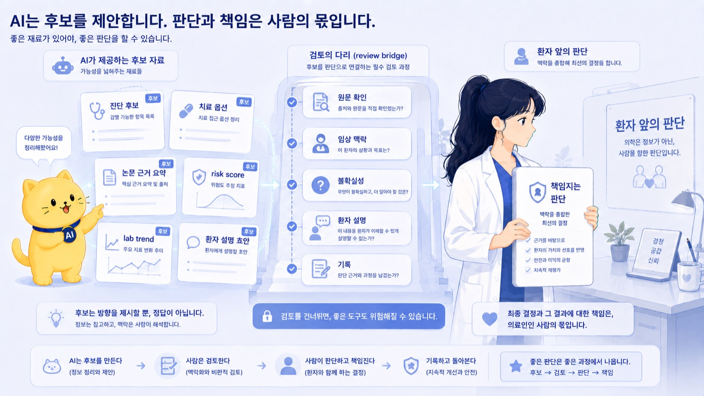
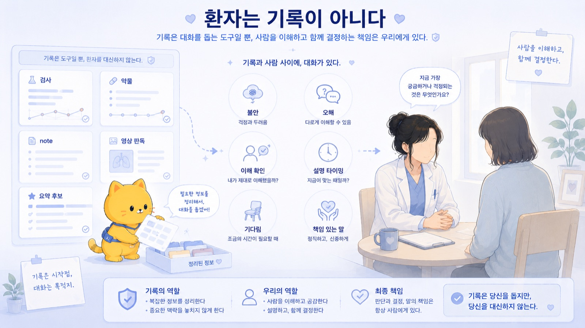
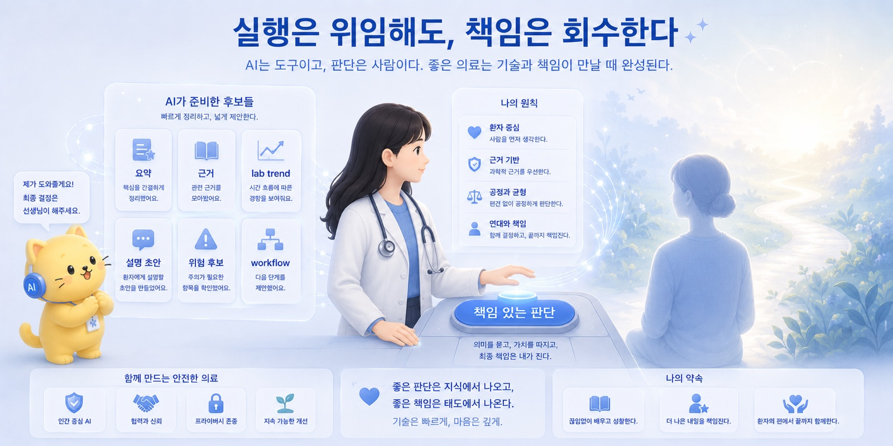

브런치 제목: AI 시대의 의사: 판단보다 책임이 남는다
브런치 부제: AI가 판단 후보를 잘 만들수록 의사에게 남는 것은 설명과 책임이다
매거진: Codex, 니 이름은 이제부터 춘식이여
업로드 메모: 브런치 업로드 전 제목, 부제, 이미지, 개인정보를 최종 확인할 것. 로컬 이미지 8개는 브런치 업로드 후 URL 교체 필요.
이미지 후보: ../../CNC_gpt/image/20/1.png, ../../CNC_gpt/image/20/2.png, ../../CNC_gpt/image/20/3.png, ../../CNC_gpt/image/20/4.png, ../../output/cncbook_images/CNC_gpt_image_20_1_19bccf3d00.jpg, ../../output/cncbook_images/CNC_gpt_image_20_2_cb4ec1b168.jpg, ../../output/cncbook_images/CNC_gpt_image_20_3_018341a20e.jpg, ../../output/cncbook_images/CNC_gpt_image_20_4_6aac03393b.jpg
---

한동안 너무 많은 것을 벌려놓은 것 같았다.

EstroFrame.
CleanEMR.
EMRPilot.
DiaFrame.
NeuroFrame.
Anki.
코니춘.
브런치북.
markdown library.
active package.
cold storage.
Codex.
춘식이.
AI 대화.
연구 아이디어.
의료 AI.
자동화.
workflow.

이름만 늘어놓아도 조금 정신이 없다.

겉으로 보면 산만해 보인다.

앱도 만들고 싶고,
글도 쓰고 싶고,
연구도 하고 싶고,
의료 데이터도 구조화하고 싶고,
AI와 함께 일하는 방식도 정리하고 싶고,
내 삶의 운영체계도 만들고 싶어 하는 사람처럼 보인다.

틀린 말은 아니다.

실제로 그랬다.

AI를 쓰기 시작하면서 가능해 보이는 것이 너무 많아졌다.

아이디어를 던지면 문서가 생겼다.
문서를 던지면 목차가 생겼다.
목차를 던지면 원고가 생겼다.
연구 생각을 던지면 IRB skeleton이 생겼다.
코드 아이디어를 던지면 repo가 생겼다.
불편함을 던지면 workflow가 생겼다.

가능성은 늘어났다.

그리고 가능성이 늘어날수록, 나는 한 가지 질문으로 다시 돌아오게 됐다.

나는 무엇을 만들 사람인가.

더 정확히 말하면,

나는 무엇을 책임질 사람인가.

이 책에서 나는 AI에게 일을 맡기는 법부터 시작했다.

처음에는 단순했다.

AI에게 뭔가 시키고 싶었다.

침대에 누워서 “해줘”라고 말하고 싶었다.

내가 하기 싫은 일을 누군가 대신해줬으면 했다.

그런데 막상 AI에게 일을 맡기기 시작하자, 생각보다 빨리 알게 됐다.

AI에게 일을 맡긴다는 것은 단순히 명령하는 일이 아니었다.

좋은 상사가 되는 일이었다.

목표를 설명해야 했다.
맥락을 줘야 했다.
출력 형식을 정해야 했다.
제약조건을 말해야 했다.
검토 기준을 세워야 했다.

프롬프트는 주문이 아니라 업무 명세서였다.

AI는 평균적 작업자였다.

내가 좌표계를 주지 않으면 평균으로 갔다.

ChatGPT는 편집장처럼 구조를 잡았고,
Codex는 시공팀처럼 파일을 고쳤고,
Gemini는 저렴한 운영 보조처럼 반복 작업을 처리했고,
Claude는 고급 외주 인력처럼 긴 글과 정교한 문서를 다뤘다.

그렇게 역할을 나누다 보니, AI는 하나의 도구가 아니라 작은 조직처럼 보이기 시작했다.

그러면 질문도 바뀐다.

AI를 잘 쓴다는 것은 무엇인가.

답은 단순히 “더 많이 자동화한다”가 아니었다.

AI에게 무엇을 맡기고,
어디서 사람이 검토하고,
무엇을 문서로 남기고,
무엇을 실행으로 좁히고,
어디서 멈출지를 정하는 일이었다.

AI 대화는 inbox였다.

생각이 일단 들어오는 곳이었다.

연구 아이디어도 들어오고,
인간관계 고민도 들어오고,
공지문 초안도 들어오고,
교수님께 보낼 이메일도 들어오고,
EMR workflow 아이디어도 들어오고,
AI 철학도 들어오고,
개발 아이디어도 들어왔다.

하지만 inbox에 쌓아두기만 하면 안 됐다.

AI 대화는 distiller이기도 했다.

흩어진 생각을 핵심 문장, 개념 이름, 문서 제목, lesson, prompt, workflow로 증류했다.

그리고 그 결과는 markdown으로 남겨야 했다.

대화로 끝나면 고급 수다였다.

문서로 남겨야 사고 자산이 됐다.

그래서 AI 대화는 점점 개인 운영체계가 됐다.

inbox.
distiller.
markdown library.
lessons.md.
prompts.md.
workflows.md.
active package.
cold storage.
weekly review.

이 구조를 만들면서 나는 알게 됐다.

AI가 많아질수록, 사람에게 필요한 것은 더 많은 output이 아니다.

output을 다루는 운영체계다.

_AI 시대의 의사: 판단보다 책임이 남는다의 문제의식이 처음 모습을 드러내는 장면._

그다음에는 raw layer의 문제가 보였다.

log.
traceback.
JSON.
CSV.
code.
Git diff.
논문 PDF.
EMR note.
lab table.
medication history.
긴 AI 대화.

예전에는 사람이 이런 raw layer를 처음부터 끝까지 읽고 의미를 뽑아야 했다.

이제 AI가 먼저 읽어줄 수 있다.

traceback을 원인 후보와 확인할 파일로 바꿔준다.
논문 PDF를 research question, endpoint, variable로 바꿔준다.
EMR note를 problem list 후보와 lab trend로 바꿔준다.
긴 대화를 concept note와 lesson으로 바꿔준다.
코드를 purpose, input, output, side effect로 설명해준다.

사람은 raw reader에서 meaning evaluator로 이동한다.

그렇다고 원문을 버리는 것은 아니다.

중요한 값은 원문으로 돌아가야 한다.

숫자.
날짜.
dose.
lab value.
약물명.
IRB 문구.
논문 결과.
환자 기록.
법적 표현.

AI가 읽어준다고 해서 확인하지 않아도 되는 것은 아니다.

읽지 않아도 되는 것과 확인하지 않아도 되는 것은 다르다.

자동화도 마찬가지였다.

자동화는 딸깍이다.

딸깍하면 파일이 정리된다.
딸깍하면 PDF가 빌드된다.
딸깍하면 문서가 생긴다.
딸깍하면 코드가 고쳐진다.
딸깍하면 메시지 초안이 나온다.

기분이 좋다.

하지만 자동화는 속도를 높일 뿐 아니라, 오류의 속도도 높인다.

잘못된 OCR 규칙이 수백 개 문항에 적용될 수 있다.
잘못된 변수 추출 기준이 dataset 전체를 오염시킬 수 있다.
코드가 원본 파일을 덮어쓸 수 있다.
AI가 만든 메시지가 실제 사람에게 나갈 수 있다.
개인정보가 외부로 나갈 수 있다.

그래서 자동화의 핵심은 무엇을 자동화할 수 있는가가 아니었다.

어디까지 자동화하지 않을 것인가였다.

낮은 위험은 넓게 자동화한다.

개인 메모.
초안.
문서 skeleton.
브레인스토밍.
toy script.
AI 대화 markdown화.

중간 위험은 AI 초안과 사람 검수를 결합한다.

메일.
공지.
연구계획서 초안.
IRB 초안.
변수표 후보.
코드 prototype.

높은 위험은 자동 실행하지 않는다.

환자 안전.
개인정보.
논문 결론.
실제 database 변경.
원본 데이터 삭제.
외부 전송.
의료 판단.

AI는 속도를 준다.

하지만 책임을 없애지는 않는다.

Human-in-the-loop도 다시 보게 됐다.

사람이 마지막에 보면 되잖아.

이 말은 맞지만, 너무 막연하다.

사람이 본다는 게 정확히 무엇인가.

누가 보는가.
언제 보는가.
무엇을 보는가.
어떤 기준으로 보는가.
원문은 어디서 확인하는가.
실행 전 승인 지점은 어디인가.
오류가 생기면 누가 책임지는가.
그 오류는 다음 workflow에 어떻게 반영되는가.

이 질문에 답하지 못하면 사람 검수는 장식이 된다.

Human-in-the-loop는 마지막에 사람이 대충 보는 절차가 아니었다.

책임 구조였다.

AI output이 후보인지 최종본인지 구분해야 한다.
고위험 값은 원문 확인이 필요하다.
실행 전 승인 단계가 있어야 한다.
근거가 남아야 한다.
검수 기준이 있어야 한다.
오류가 생기면 workflow를 수정해야 한다.

사람은 사고 이후에 등장하는 변명 장치가 아니다.

사람은 workflow 안에서 실제로 멈출 수 있어야 한다.

그다음에는 인간 쪽으로 질문이 돌아왔다.

AI가 평균적인 산출물을 싸게 만들수록, 인간에게 남는 것은 무엇인가.

AI는 평균을 잘 만든다.

평균적인 이메일.
평균적인 보고서.
평균적인 코드.
평균적인 요약.
평균적인 연구계획서 skeleton.

그러면 인간에게 필요한 것은 평균 밖의 질문이다.

무엇을 이상하다고 느끼는가.
어떤 workflow를 의심하는가.
어떤 도메인을 연결하는가.
어떤 평균적 답이 부족하다고 감지하는가.
어떤 결과에는 책임질 수 없다고 멈추는가.

Neurodivergent한 사고는 여기서 평균 밖의 안테나가 될 수 있다.

기존 시스템에 자동으로 동기화되지 않기 때문에, 남들이 그냥 넘기는 부분에서 걸린다.

왜 이걸 사람이 손으로 하고 있지?
왜 이 정보가 세 번씩 중복 입력되지?
왜 중요한 변수는 EMR에 있는데 연구에서는 못 쓰지?
왜 환자 설명은 매번 반복되는데 structured tool이 없지?
왜 AI와 한 좋은 대화를 저장하지 않고 날려버리지?

이 질문들은 피곤할 수 있다.

하지만 AI 시대의 builder에게는 출발점이 된다.

다만 발산은 관리되어야 했다.

AI가 붙으면 모든 아이디어가 가능해 보인다.

문서가 생기고,
앱 이름이 생기고,
repo가 생기고,
IRB 초안이 생기고,
workflow가 생긴다.

하지만 내 실행 에너지는 무한하지 않다.

그래서 발산은 자유롭게 하되, 실행은 좁혀야 했다.

AI는 가능성의 비용을 낮춘다.

하지만 내 시간과 체력과 책임 능력은 늘려주지 않는다.

_작업의 흐름이 구체적인 구조로 바뀌는 순간._

이 모든 이야기를 따라오다 보면, 이상하게도 처음 질문으로 돌아온다.

나는 어떤 의사가 될 것인가.

이 질문은 오래된 질문이다.

의대에 들어온 뒤 여러 번 들었다.

좋은 의사가 되어야 한다는 말도 들었다.
환자를 위하는 의사가 되어야 한다는 말도 들었다.
평생 공부해야 한다는 말도 들었다.
책임감 있는 의사가 되어야 한다는 말도 들었다.

처음에는 막연한 다짐처럼 들렸다.

조금 지나자 직업윤리처럼 들렸다.

그리고 이제는 AI 시대에 내가 어떤 방식으로 살아남을 것인가에 대한 질문처럼 들린다.

AI를 쓰면서 나는 의사라는 일에서 멀어진 것이 아니다.

오히려 의사의 일이 더 또렷하게 보이기 시작했다.

AI는 note를 요약할 수 있다.

하지만 환자를 마주하지는 못한다.

AI는 lab trend를 정리할 수 있다.

하지만 이 환자에게 그 trend가 무슨 의미인지 최종 판단하지는 못한다.

AI는 medication history를 표로 만들 수 있다.

하지만 실제 복약 순응도와 환자의 불안을 직접 듣지는 못한다.

AI는 논문을 요약할 수 있다.

하지만 그 근거를 내 환자에게 적용할지 결정하지는 못한다.

AI는 환자교육 자료 초안을 만들 수 있다.

하지만 환자가 정말 이해했는지, 무엇을 두려워하는지, 어떤 말이 필요한지 읽지는 못한다.

AI는 판단 후보를 만들 수 있다.

하지만 책임 없는 판단 후보와, 책임지는 판단은 다르다.

AI 시대의 의사는 모든 정보를 손으로 처리하는 사람이 아닐 수 있다.

그럴 필요도 점점 줄어들 것이다.

AI가 raw layer를 먼저 읽고,
semantic layer로 정리하고,
problem list 후보를 만들고,
lab trend를 보여주고,
약물 변경 이력을 정리하고,
논문 근거를 요약하고,
chart review 변수 후보를 뽑을 수 있다.

이것은 좋은 일이다.

의사가 모든 정보를 처음부터 끝까지 손으로 처리해야만 좋은 의사라는 기준은 점점 비현실적이다.

하지만 그렇다고 의사의 역할이 줄어드는 것은 아니다.

오히려 역할의 중심이 이동한다.

AI가 정리한 정보 중 무엇을 믿을 것인가.
무엇을 의심할 것인가.
무엇을 원문으로 확인할 것인가.
무엇을 환자에게 설명할 것인가.
무엇을 아직 불확실하다고 말할 것인가.
무엇을 오늘 결정하고, 무엇을 보류할 것인가.
그 결정의 결과를 어떻게 책임질 것인가.

이것은 여전히 의사의 일이다.

어쩌면 더 선명하게 의사의 일이다.

의료 AI에서 중요한 것은 답을 내는 능력만이 아니다.

답을 검증할 수 있는 구조다.

DiaFrame을 생각하면서 배운 것도 이것이었다.

AI에게 환자 정보를 주고 약제를 추천하게 하는 것은 생각보다 어렵지 않다.

어려운 것은 그다음이다.

그 추천이 맞는지 어떻게 볼 것인가.
어떤 기준으로 평가할 것인가.
실제 의사의 처방과 다를 때 그 차이를 어떻게 해석할 것인가.
명백히 위험한 추천은 어떻게 막을 것인가.
추천 결과를 어떻게 비교 가능한 형태로 제한할 것인가.
불일치 사례를 어떻게 다시 볼 것인가.

의료 AI는 그럴듯한 답을 내는 순간보다, 그 답을 어떻게 검증할 것인지에서 더 어려워진다.

이건 의료에만 해당하는 말이 아니다.

이 책 전체에서 반복한 말이기도 하다.

AI가 글을 쓰면 검토해야 한다.
AI가 코드를 짜면 테스트해야 한다.
AI가 메시지를 만들면 사람이 보내야 한다.
AI가 변수를 뽑으면 원문 확인이 필요하다.
AI가 추천을 하면 검증 구조가 필요하다.

의료 AI는 예외가 아니다.

오히려 이 원칙의 가장 고위험 버전이다.

환자 안전과 개인정보와 법적 책임이 걸려 있기 때문이다.

_사람의 판단과 AI의 실행이 나뉘는 지점을 보여주는 장면._

그래서 내가 만들고 싶은 의료 AI는 환자를 대신 보는 AI가 아니다.

환자를 하나의 데이터 포인트로 줄이는 시스템도 아니다.

환자의 디지털 복제본을 만들어 의사 없이 판단하게 하는 장치도 아니다.

내가 생각하는 임상 디지털 트윈은 훨씬 조심스럽다.

환자를 완벽하게 복제하는 것이 아니라,
의사결정에 필요한 변수와 변화를 구조화하는 모델에 가깝다.

환자의 현재 상태.
시간에 따른 검사 수치 변화.
복용 중인 약물.
치료 반응.
위험도.
예상되는 다음 상태.
아직 불확실한 부분.

이런 요소를 하나의 구조 안에 놓고, 의사가 더 설명 가능한 판단을 준비하도록 돕는 것.

디지털 트윈은 정답을 만드는 장치가 아니라, 판단의 구조를 보여주는 장치여야 한다.

EstroFrame에서 보고 싶었던 것도 결국 이것이었다.

호르몬 농도를 단일 검사값으로만 보지 않고,
투여 시점과 채혈 시점 사이에서 움직이는 시간-농도 곡선으로 보고 싶었다.

같은 estradiol 수치라도 주사 직후인지, 주기 중간인지, 주기 말인지에 따라 의미가 달라질 수 있다.

그러면 호르몬은 숫자 하나가 아니라 시간 위에서 움직이는 상태가 된다.

이것은 환자를 대체하는 AI가 아니다.

판단을 준비하는 구조다.

CleanEMR도 같은 방향에 있다.

모델을 만들기 전에 데이터 구조가 필요하다.

의료에는 정보가 많다.

하지만 정보가 항상 판단 가능한 형태로 있는 것은 아니다.

EMR에는 자유 텍스트와 검사 결과, 처방 기록과 외래 기록이 섞여 있다.

환자.
방문.
검사.
약물.
수동 검토가 필요한 문장.
원문 근거.
불확실한 값.

이런 것들이 구조화되어야 그다음 모델이 의미를 가진다.

좋은 의료 AI는 원문 EMR 위에 바로 올라가지 않는다.

그 전에 데이터 구조화 계층이 필요하다.

이것도 이 책에서 말한 raw layer와 semantic layer의 문제다.

의료 raw layer를 semantic layer로 올리고,
그 위에서 사람이 judgment layer를 맡는 것.

나는 이 구조에 계속 돌아온다.

글쓰기에서도,
코드에서도,
자동화에서도,
연구에서도,
의료에서도 같은 구조가 반복된다.

AI는 raw layer를 읽고 후보를 만든다.

사람은 그 후보를 평가하고 판단하고 책임진다.

어떤 의사가 될 것인가.

이 질문에 지금 완성된 답을 낼 수는 없다.

아마 평생 고쳐가며 살게 될 것이다.

의사는 한 번 완성되는 직업이 아니다.

면허를 받는다고 끝나는 것도 아니고, 전문의가 된다고 끝나는 것도 아니다.

의학은 계속 변하고, 환자는 매번 다르고, 기술은 더 빨리 바뀐다.

AI 시대의 의사는 더 많이 업데이트되어야 한다.

의학 지식도 업데이트해야 한다.
AI 도구도 이해해야 한다.
그 도구의 오류와 한계도 알아야 한다.
환자와의 관계도 놓치지 않아야 한다.
책임 구조도 설계할 수 있어야 한다.
자기 자신의 판단 기준도 계속 고쳐야 한다.

AI가 의학 공부와 임상 workflow 주변부에 들어올수록, 의사는 AI를 모른 척하기 어려워질 것이다.

그렇다고 AI를 맹신해서도 안 된다.

도구는 방향을 스스로 정하지 않는다.

어디까지 쓸지, 어디서 멈출지, 어떤 상황에서 원문으로 돌아갈지, 어떤 판단은 사람이 해야 할지 결정하는 것은 결국 의사다.

AI 시대의 의사는 완성된 사람이 아니라, 계속 업데이트되는 사람이어야 한다.

환자를 데이터가 아니라 사람으로 보는 일도 남는다.

AI는 환자 기록을 처리할 수 있다.

하지만 환자는 기록이 아니다.

환자는 불안하고, 기대하고, 화를 내고, 망설이고, 말하지 못하고, 때로는 같은 질문을 반복하는 사람이다.

검사 수치와 영상, 약물과 수술만으로 의료가 완성되지는 않는다.

환자의 표정과 말투.
보호자의 반응.
설명을 들을 준비가 되어 있는지.
무엇을 두려워하는지.
무엇을 오해하고 있는지.
어느 정도까지 말해야 하는지.
지금은 기다려야 하는지.
지금은 더 강하게 말해야 하는지.

이것은 여전히 사람과 사람 사이에서 일어난다.

AI가 아무리 좋아져도 환자 앞에서 설명하는 일은 가볍지 않다.

그리고 그 설명은 단순한 정보 전달이 아니다.

책임 있는 사람이, 불확실성 속에서, 지금 가능한 최선의 판단을 환자에게 이해 가능한 언어로 건네는 일이다.

이건 의사의 일이다.

_AI 시대의 의사: 판단보다 책임이 남는다의 결론을 이미지로 정리한 장면._

결국 제목을 조금 더 정확히 풀면 이렇다.

AI 시대의 의사에게 판단이 사라지는 것은 아니다.

오히려 판단 후보는 더 많아진다.

AI가 진단 후보를 만들고,
치료 옵션을 정리하고,
논문 근거를 요약하고,
risk score를 계산하고,
lab trend를 보여주고,
약물 상호작용을 경고하고,
환자 설명 초안을 만든다.

판단의 재료는 많아진다.

그중 일부는 AI가 만들 것이다.

하지만 책임 없는 판단 후보와 책임지는 판단은 다르다.

의사가 남는 곳은 바로 여기다.

무엇을 믿을 것인가.
무엇을 의심할 것인가.
무엇을 보류할 것인가.
무엇을 환자에게 말할 것인가.
무엇을 기록으로 남길 것인가.
무엇을 내 이름으로 책임질 것인가.

AI 시대의 의사에게 남는 것은 판단보다 더 깊은 것일지도 모른다.

책임이다.

판단은 여러 곳에서 나올 수 있다.

하지만 책임은 분산되지 않는다.

환자 앞에서, 기록 앞에서, 자기 자신 앞에서, 결국 누군가는 책임져야 한다.

나는 대단한 의사가 되겠다고 쉽게 말하고 싶지는 않다.

그 말은 아직 너무 크다.

다만 방향은 조금 알 것 같다.

계속 배우는 의사.

환자를 데이터가 아니라 사람으로 보는 의사.

AI와 기술을 활용하되, 그 책임을 회피하지 않는 의사.

구조를 만들되, 구조가 환자를 지우지 않게 하는 의사.

AI가 만든 후보를 검토하고,
불확실한 부분을 표시하고,
원문으로 돌아가고,
환자에게 설명하고,
마지막 판단을 자기 이름으로 감당하는 의사.

그리고 아무도 보지 않는 순간에도 자기 자신에게 부끄럽지 않은 의사.

의료에는 아무도 보지 않는 순간이 있다.

조금 더 볼 수도 있었고, 그냥 넘어갈 수도 있었던 장면이 있다.

기록에는 남지 않는 판단이 있다.

환자도 끝내 알지 못할 수 있는 선택이 있다.

그때 남는 것은 외부의 평가가 아니다.

자기 자신이다.

나는 내가 무엇을 했는지 안다.

무엇을 하지 않았는지도 안다.

AI가 도와준 시대에도 이 사실은 바뀌지 않는다.

오히려 더 또렷해진다.

이 책은 AI 사용법을 정리하는 책처럼 시작했다.

Codex에게 이름을 붙이고,
춘식이라고 부르고,
침대에 누워 “해줘”라고 말하고,
프롬프트를 업무 명세서처럼 쓰고,
ChatGPT를 편집장처럼 쓰고,
AI 대화를 markdown으로 남기고,
자동화의 경계선을 정하고,
active package와 cold storage를 나누는 이야기였다.

하지만 여기까지 오고 보니, 이 책은 AI에게 일을 맡기는 법만을 다룬 것이 아니었다.

AI와 함께 일하면서 내가 어떤 사람으로 남을 것인가를 묻는 기록이었다.

AI를 쓴다는 것은 책임을 외주화하는 일이 아니었다.

실행은 위임할 수 있다.
정리는 맡길 수 있다.
초안은 받아볼 수 있다.
코드는 생성할 수 있다.
추천 후보는 만들 수 있다.
요약은 받을 수 있다.

하지만 마지막에 무엇을 믿고,
무엇을 의심하고,
무엇을 말하고,
무엇을 멈추고,
무엇을 책임질지는 다시 나에게 돌아온다.

춘식이는 많은 일을 도와줄 수 있다.

하지만 환자 앞에서 버튼을 누르는 사람은 결국 나다.
