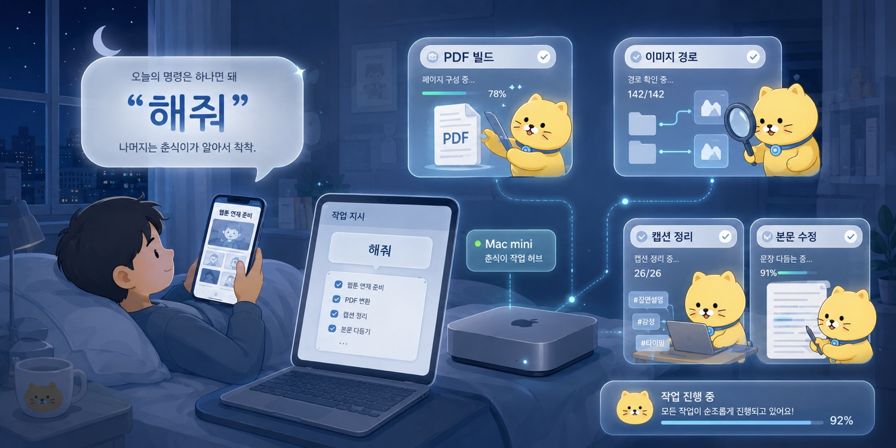
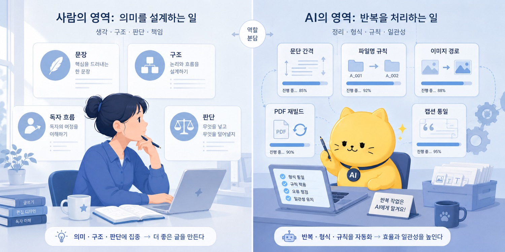
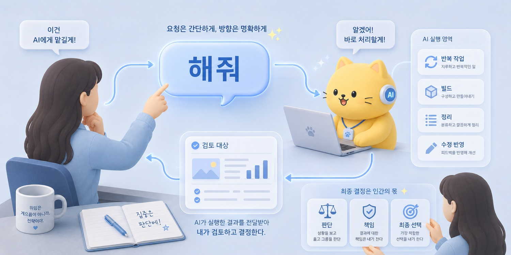

## 1. 침대에 누워 딸깍, “해줘”라고 말하고 싶었다

밤 10시였다.

나는 침대에 누워 있었다.
책상 앞에 앉아 각 잡고 작업하는 시간은 아니었다.
커피를 내려놓고, 작업곡을 틀고, “자 이제 해보자” 하고 마음을 먹은 상태도 아니었다.

맥미니 M4 16GB에는 Codex가 로그인되어 있었다.
ChatGPT 앱에서 Codex를 조종할 수 있게 해둔 상태였다.

나는 침대에 누워 웹툰을 보고 있었다.

그리고 가끔씩 Codex에게 일을 던졌다.

“이 부분 수정해줘.”
“PDF 다시 빌드해줘.”
“이미지 경로 확인해줘.”
“본문에 삽화 넣어줘.”
“캡션 정리해줘.”

그리고 다시 웹툰을 봤다.

잠시 뒤 알림이 떴다.

언니 작업 다 했다냥.
PDF 만들어 놨다.

순간 웃음이 나왔다.

이게 맞나?

너무 날먹하는 거 아닌가?

나는 침대에 누워 있고, AI는 책을 빌드하고 있었다.
나는 웹툰을 보고 있었고, 어딘가의 맥미니에서는 파일이 열리고, 코드가 돌고, PDF가 만들어지고 있었다.

그 장면이 조금 어이없었다.

웃기기도 했고, 편하기도 했고, 약간 죄책감도 들었다.
내가 너무 편하게 가는 건가 싶었다.

그런데 동시에 이런 생각도 들었다.

아니, 이걸 사람이 왜 계속 붙잡고 있어야 하지?

---

나는 비효율을 싫어한다.

정확히 말하면, 사람이 굳이 머리를 써야 하지 않는 일에 머리를 쓰는 상황을 싫어한다.

물론 모든 귀찮은 일이 나쁜 것은 아니다.
반복 속에서 감각이 생기는 일도 있고, 직접 손으로 만져봐야 구조가 보이는 일도 있다.

하지만 어떤 일들은 정말로 이상하다.

_침대에 누워 딸깍, “해줘”라고 말하고 싶었다의 문제의식이 처음 모습을 드러내는 장면._

예를 들어 책을 만든다고 해보자.

책을 쓰는 일에는 분명 창작이 있다.
무슨 이야기를 할지 정하고, 어떤 순서로 배치할지 고민하고, 문장의 톤을 고르고, 독자가 어디서 막힐지 생각하는 일. 이런 건 사람이 해야 한다.

그런데 책을 만드는 작업에는 창작과 별 상관없는 노동도 엄청나게 많다.

문단 간격 맞추기.
이미지 경로 확인하기.
파일명 정리하기.
삽화 캡션 통일하기.
페이지 나눔 확인하기.
PDF 다시 뽑기.
조판이 깨진 부분 찾기.
수정하고 다시 확인하기.
또 수정하고 다시 확인하기.

이런 일들은 중요하지 않은 것은 아니다.
중요하다.

문제는 이것들이 내 머리를 갈아먹는 방식이다.

내가 정말 쓰고 싶은 것은 문장인데, 어느 순간 나는 줄바꿈과 싸우고 있다.
내가 정말 보고 싶은 것은 전체 흐름인데, 어느 순간 이미지 경로 하나가 틀렸는지 찾고 있다.
내가 정말 해야 하는 것은 판단인데, 어느 순간 파일명 규칙을 맞추고 있다.

그럴 때마다 생각한다.

이건 사람이 할 일이 아닌데.

적어도, 사람이 매번 직접 붙잡고 있을 일은 아닌데.

---

예전에 책을 만든 적이 있다.

공개할 수 있는 책은 아니지만, A5 판형에 88페이지 정도 되는 책이었다.

창작 자체는 오래 걸리지 않았다.
핵심 내용을 쓰는 데에는 3일 정도면 충분했다.

진짜 문제는 그다음이었다.

수정.
수정.
또 수정.
그리고 다시 수정.

워드 파일을 열어놓고 페이지를 나눴다.
한 문단을 조금만 고치면 뒤쪽 페이지가 밀렸다.
표 하나가 움직이면 다음 장의 구성이 어긋났다.
줄바꿈을 고치면 또 다른 줄바꿈이 이상해졌다.
조판 기호를 켜고, 여백을 보고, 다시 출력하고, 다시 확인했다.

삽화도 따로 만들었다.
그때는 Midjourney 프롬프트를 직접 짰다.
이미지가 나오면 어울리는지 보고, 다시 뽑고, 다시 고르고, 다시 넣었다.

인쇄해서 보고, 친구들에게 평가를 부탁하고, 다시 고쳤다.

그때의 나는 책을 쓰는 사람이 아니라, 책이라는 형식에 계속 끌려다니는 사람에 가까웠다.

창작은 3일컷이었다.
나머지는 수정수정수정이었다.

_작업의 흐름이 구체적인 구조로 바뀌는 순간._

그 경험은 묘하게 사람을 지치게 한다.

내가 내용을 더 좋게 만들고 있는 건지,
아니면 형식의 삐끗함을 수습하느라 에너지를 태우고 있는 건지 헷갈리기 시작한다.

책을 만드는 과정에서 가장 중요한 것은 생각이어야 한다.

그런데 실제 작업에서는 생각보다 훨씬 많은 시간을 형식이 가져간다.

---

그래서 “해줘”라고 말하고 싶었다.

내가 아무것도 하기 싫어서가 아니다.

생각하기 싫어서도 아니다.
책임지기 싫어서도 아니다.
내 이름을 달고 나가는 결과물을 대충 만들고 싶어서도 아니다.

오히려 반대다.

내가 책임져야 하는 부분에 에너지를 쓰고 싶었다.

무슨 말을 할지.
어떤 문장을 남길지.
어떤 구조로 독자를 데려갈지.
이 표현이 내 생각을 정확히 담고 있는지.
이 결과물을 내 이름으로 내보내도 되는지.

이런 데에 머리를 쓰고 싶었다.

문단 간격과 파일 경로와 반복 빌드에 내 뇌를 갈아 넣고 싶지 않았을 뿐이다.

나는 게으르고 싶었던 게 아니다.
쓸데없는 노동에 내 뇌를 갈아 넣고 싶지 않았을 뿐이다.

---

가끔 AI를 쓰는 일을 이상하게 보는 시선이 있다.

직접 해야 진짜라는 감각이다.

직접 써야 진짜 글이고,
직접 고쳐야 진짜 작업이고,
직접 삽질해야 진짜 노력이라는 감각.

물론 어느 정도는 맞다.
직접 해봐야 아는 것들이 있다.
한 번도 해보지 않은 일을 전부 AI에게 맡기면, 결과물을 제대로 판단할 수 없다.

하지만 이 논리가 이상한 방향으로 가면, 사람은 계속 양잿물에 빨래를 빨아야 한다.

세탁기를 쓰면 안 된다.
청소기를 쓰면 안 된다.
식기세척기를 쓰면 안 된다.
그래야 진짜 살림이고, 그래야 진짜 성실함이라는 식이다.

그건 이상하다.

_사람의 판단과 AI의 실행이 나뉘는 지점을 보여주는 장면._

도구를 쓴다고 해서 사람이 사라지는 것은 아니다.
세탁기가 빨래를 대신 돌려줘도, 어떤 옷을 어떻게 관리할지 결정하는 사람은 남아 있다.
청소기가 먼지를 빨아들여도, 어디를 치워야 하는지 판단하는 사람은 남아 있다.

AI도 비슷하다.

AI가 문단을 정리해줘도, 어떤 문장이 내 생각인지 판단하는 사람은 남아 있다.
AI가 PDF를 빌드해줘도, 그 결과물을 읽고 고치는 사람은 남아 있다.
AI가 코드를 고쳐도, 그 코드가 내 프로젝트에 맞는지 확인하는 사람은 남아 있다.

도구를 쓴다는 것은 책임을 버리는 일이 아니다.

반복 노동을 도구에 넘기고, 사람의 판단을 더 선명하게 남기는 일이다.

---

물론 “해줘”에는 조건이 있다.

AI에게 뭔가를 시키면, 실제로 뭔가를 만들어내긴 한다.

문제는 그게 내가 원하는 것인지다.
내 생각이 들어 있는지다.
내 이름을 달고 낼 수 있는지다.
내가 책임질 수 있는지다.

AI가 만든 결과물이 그럴듯해도, 내 생각이 빠져 있으면 내 글이 아니다.
AI가 만든 코드가 돌아가도, 내가 이해하지 못하면 내 시스템이 아니다.
AI가 만든 PDF가 예뻐도, 내가 읽고 판단하지 않았다면 내 책이 아니다.

그래서 딸깍 이후에도 사람이 해야 할 일이 남는다.

방향을 정해야 한다.
결과를 읽어야 한다.
틀린 부분을 비판해야 한다.
다시 수정 지시를 해야 한다.
여러 버전 사이에서 골라야 한다.
내 인사이트를 넣어야 한다.
마지막으로 내 이름을 달아도 되는지 판단해야 한다.

AI가 80%를 해줄 수는 있다.

하지만 나머지 20%는 사람이 봐야 한다.

그리고 그 20%가 사실 가장 중요하다.

그 20% 안에 방향이 있고, 기준이 있고, 책임이 있다.

---

처음 GPT를 쓸 때는 이걸 몰랐다.

그때는 AI를 어떻게 내 삶에 받아들여야 할지 몰랐다.
질문을 던지면 답이 오는 신기한 도구 정도로 느꼈다.

의학 문제를 넣어보면 틀렸다.
코드를 시켜보면 에러가 났다.
그럴듯한 말은 하는데, 막상 중요한 데서는 미묘하게 못 믿겠다는 느낌도 있었다.

그래서 한동안 AI는 애매했다.

_침대에 누워 딸깍, “해줘”라고 말하고 싶었다의 결론을 이미지로 정리한 장면._

신기하지만 믿기 어렵고,
똑똑하지만 이상하고,
쓸모 있을 것 같지만 어디에 넣어야 할지 모르겠는 도구.

그런데 어느 순간부터 관점이 바뀌었다.

AI를 정답 기계로 보면 계속 실망한다.
AI를 검색창으로 보면 조금 편해지는 정도에서 끝난다.
AI를 작업자로 보면, 내가 해야 할 일이 달라진다.

내가 할 일은 모든 버튼을 직접 누르는 것이 아니다.
어떤 버튼을 눌러야 하는지 정하는 것이다.

내가 할 일은 모든 파일을 직접 고치는 것이 아니다.
어떤 기준으로 고쳐야 하는지 설명하는 것이다.

내가 할 일은 모든 문장을 처음부터 쓰는 것이 아니다.
어떤 문장이 내 생각이고, 어떤 문장이 아닌지 판단하는 것이다.

이 관점이 바뀌면 “해줘”라는 말도 달라진다.

그건 게으른 부탁이 아니다.

작업을 위임하는 말이다.

---

밤 10시에 침대에 누워 Codex에게 일을 던지고, 웹툰을 보다가 알림을 받는 장면은 확실히 이상하다.

약간 날먹 같다.
솔직히 편하다.
너무 편해서 웃기다.

하지만 그 장면을 조금 더 들여다보면, 거기에는 단순한 게으름 이상의 것이 있다.

사람이 직접 붙잡고 있던 반복 노동이 뒤로 빠지고,
사람은 방향과 판단과 검수에 더 집중하는 구조.

나는 그 구조가 좋았다.

왜냐하면 내가 하고 싶었던 것은 일을 안 하는 것이 아니었기 때문이다.

나는 더 중요한 일에 머리를 쓰고 싶었다.

생각을 정리하고,
문장을 고르고,
구조를 만들고,
결과를 판단하고,
마지막 버튼을 누르는 일.

그 일을 더 잘하기 위해서, 나머지를 AI에게 맡기고 싶었다.

그러니까 내가 침대에 누워 딸깍하고 “해줘”라고 말하고 싶었던 이유는 단순하지 않다.

게으르고 싶어서가 아니었다.

쓸데없는 노동에 내 뇌를 갈아 넣고 싶지 않았을 뿐이다.
