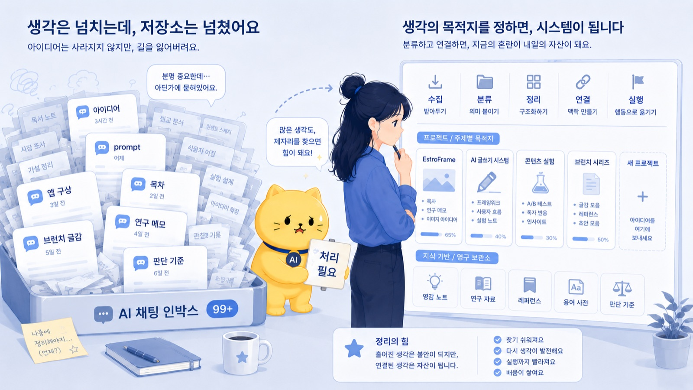
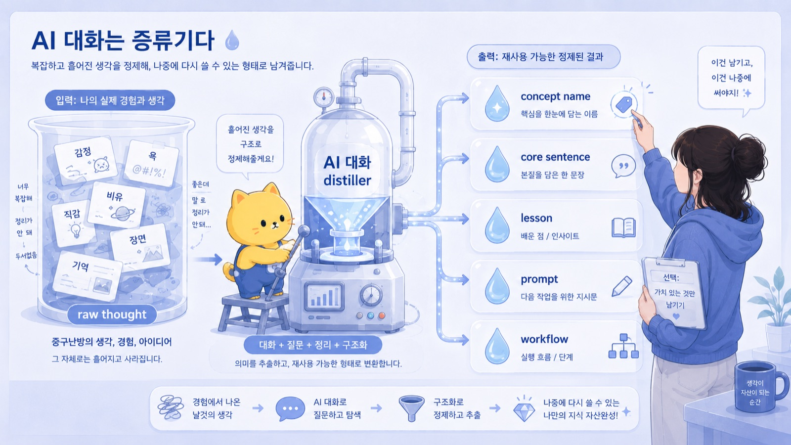
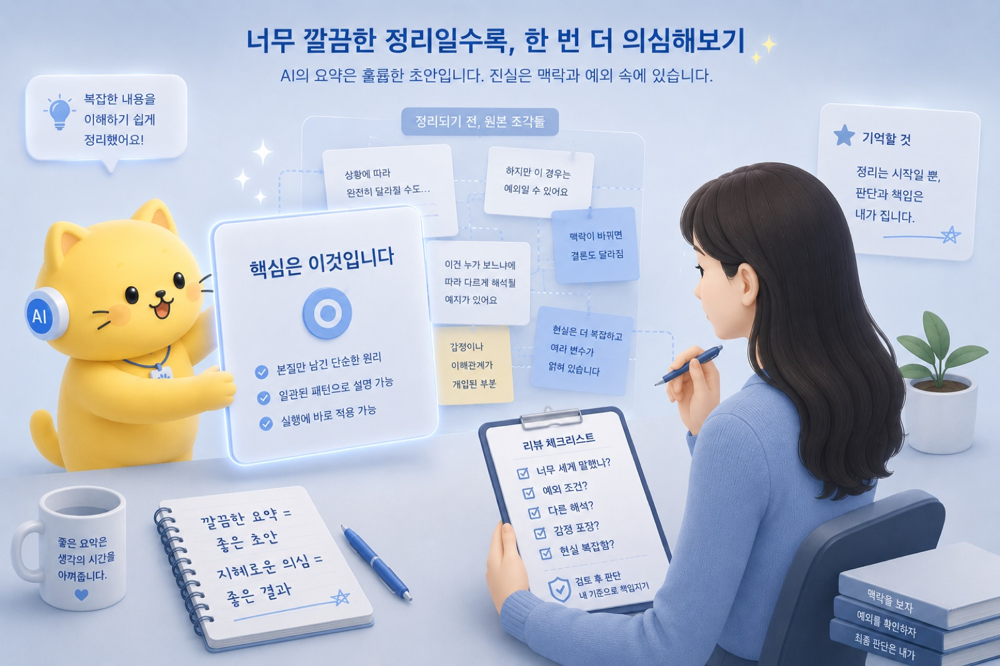
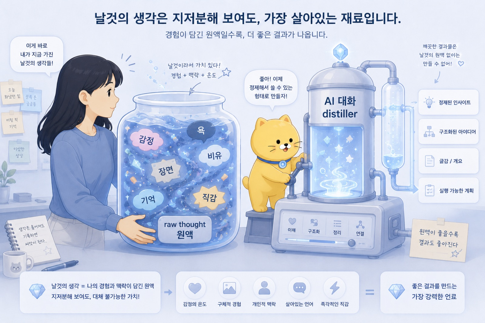

## 9. AI 대화는 Distiller다

처음 생각은 대체로 지저분하다.

처음부터 제목과 목차와 핵심 문장으로 오지 않는다.
처음부터 “이것은 이런 개념입니다” 하고 얌전히 나타나지 않는다.

대부분은 더러운 원액처럼 온다.

감정이 섞여 있다.
욕이 섞여 있다.
장면이 섞여 있다.
비유가 섞여 있다.
기억이 섞여 있다.
아직 설명할 수 없는 직감이 섞여 있다.

“이거 뭔가 중요한데?”
“아니 이거 개웃긴데?”
“이게 왜 이렇게 짜증나지?”
“이거 연구로 되나?”
“이거 글감인데?”
“이걸 뭐라고 불러야 하지?”

이 상태에서는 아직 문서가 아니다.

그냥 raw thought다.

하지만 raw thought가 쓸모없다는 뜻은 아니다.
오히려 중요한 생각은 처음에 대체로 raw한 형태로 온다.

너무 빨리 예쁘게 정리하면 맛이 빠진다.
너무 빨리 논리적으로 만들려고 하면 처음의 감각이 죽는다.

그래서 나는 먼저 쏟아낸다.

AI에게 그냥 말한다.

정리되지 않은 말로.
가끔 욕 섞어서.
가끔 비유만 던져서.
가끔 “이거 뭔가 있지 않냐?” 정도로.

그러면 AI는 그 원액을 받아서 증류하기 시작한다.

\newpage

이 브런치북도 처음부터 책이 아니었다.

처음에는 그냥 장면이었다.

침대에 누워 있었다.
Codex에게 일을 맡겼다.
나는 웹툰을 보고 있었다.
그러다 알림이 왔다.

“언니 작업 다 했다냥. PDF 만들어 놨다.”

그걸 보고 생각했다.

이게 맞나?
너무 날먹 아닌가?
근데 존나 좋다.
병신 같은데 너무 좋다.

이건 처음에는 그냥 감각이었다.

AI에게 일을 맡기는 이상한 쾌감.
침대에 누워 딸깍하는 죄책감.
내가 직접 타이핑하지 않았는데 일이 끝나는 어색함.
그런데도 결과물은 나오는 시대의 기묘함.

그걸 AI와 계속 이야기했다.

그러자 점점 문장이 생겼다.

나는 게으르고 싶은 게 아니었다.
쓸데없는 노동에 내 뇌를 갈아 넣고 싶지 않았던 것이다.

AI에게 일을 맡긴다는 것은 일을 하지 않는다는 뜻이 아니었다.
일을 나누고, 기준을 주고, 결과를 검수하는 일이었다.

그러다 한 문장으로 증류됐다.

AI에게 일을 맡긴다는 건, 좋은 상사가 되는 일이다.

처음의 원액은 이랬다.

“침대에서 Codex 딸깍하는데 병신 같은데 존나 좋다.”

증류된 개념은 이랬다.

“AI에게 일을 맡긴다는 건 좋은 상사가 되는 일이다.”

그리고 더 압축하면 이렇게 된다.

“실행은 위임하되, 판단은 회수하는 일이다.”

이게 AI 대화가 해주는 일이다.

AI가 내 생각을 새로 만들어낸 것이 아니다.
내가 이미 느끼고 있던 감각을, 다시 볼 수 있는 문장으로 끌어올린 것이다.

\newpage

연구 아이디어도 비슷하다.

처음부터 연구계획서 형태로 떠오르지 않는다.

처음에는 보통 이런 식이다.

“GAHT 환자에서 estradiol 농도를 PK model로 예측해보면 재밌지 않을까?”

이 문장 안에는 가능성이 있다.

하지만 아직 연구는 아니다.

대상자가 누구인지 애매하다.
primary endpoint가 없다.
데이터가 실제로 있는지도 모른다.
제형, 용량, 투여 간격, lab timing이 어떻게 들어갈지도 정리되지 않았다.
prospective인지 retrospective인지도 불분명하다.
교수님께 제안할 수 있는 크기인지도 판단해야 한다.

처음 생각은 흥미로운 직감이다.

그걸 AI와 계속 이야기한다.

“이걸 연구 질문으로 만들면 뭐가 되지?”
“후향적으로 가능하려면 어떤 변수가 필요하지?”
“endpoint가 약하지 않으려면 뭘 봐야 하지?”
“perioperative washout보다 일반 GAHT validation으로 먼저 가는 게 낫나?”
“교수님께 보여드릴 수 있는 낮은 압력의 형태는 뭐지?”

이렇게 물으면 AI는 흩어진 생각을 연구 구조로 바꿔준다.

대상자.
exposure.
outcome.
prediction.
primary endpoint.
변수표.
분석계획.
feasibility issue.
limitation.
IRB 문서 구조.

그러면 처음의 원액은 이렇게 바뀐다.

Raw thought:

“GAHT 환자 E2 농도 모델로 예측해보면 재밌지 않을까?”

Distilled concept:

“Transfeminine gender-affirming hormone therapy 환자에서 observed estradiol value와 model-predicted value의 prediction error를 비교하는 후향적 validation 연구.”

이건 꽤 큰 차이다.

첫 문장은 아이디어다.
두 번째 문장은 연구계획서의 씨앗이다.

물론 AI가 연구의 가치를 대신 판단해주는 것은 아니다.

실제 데이터가 있는지, endpoint가 충분한지, 교수님께 제안할 만한지, IRB로 갈 수 있는지는 사람이 판단해야 한다.

하지만 AI는 흐릿한 아이디어를 연구자가 검토할 수 있는 형태로 증류해준다.

그 형태가 있어야 판단도 가능하다.

감각 상태에서는 판단하기 어렵다.
문장과 구조가 생기면 비로소 검토할 수 있다.

_AI 대화는 Distiller다의 문제의식이 처음 모습을 드러내는 장면._

\newpage

인간관계도 마찬가지다.

처음에는 감정으로 온다.

“아니 왜 얘는 맞는 말을 해도 방어적으로 받지?”

이 말 안에는 짜증이 있다.
억울함도 있다.
피로감도 있다.
내가 틀린 말을 한 것도 아닌데 상황이 꼬였다는 감각도 있다.

그런데 감정 상태로만 두면 다음에 또 비슷하게 말하게 된다.

“내가 맞는데 왜 그래?”
“내가 잘못한 건 아닌데?”
“그냥 정보 공유한 건데 왜 통보처럼 받아들이지?”

이 상태에서는 배운 것이 감정으로만 남는다.

AI와 대화하면 그 감정 밑의 구조를 볼 수 있다.

상대는 내용 자체보다 방식에 반응했을 수 있다.
결론을 먼저 들으면 통보받는다고 느끼는 사람일 수 있다.
불안, 자율성, 책임소재에 민감할 수 있다.
내가 “이게 맞는 판단이야”라고 말했지만, 상대는 “너희가 결정했으니 따라와”처럼 들었을 수 있다.

그러면 짜증은 lesson으로 바뀐다.

Raw thought:

“왜 얘는 맞는 말 해도 방어적으로 받지?”

Distilled concept:

“불안과 책임소재에 민감한 사람에게는 결론 통보보다 정보 공유 구조가 안전하다.”

여기서 더 나아가면 원칙이 된다.

정보 공유임을 먼저 말한다.
내 방침과 상대 선택지를 분리한다.
상대가 최종 판단할 여지를 남긴다.
불확실한 부분은 확인 중이라고 표시한다.
최종 책임은 각자에게 남긴다.

그리고 이것은 prompt가 될 수도 있다.

“아래 메시지를 정보 공유 → 내 방침 → 상대 선택권 → 책임소재 분리 구조로 다시 써줘. 상대가 결정 통보처럼 느끼지 않게 하고, 불확실한 부분은 확인 중이라고 표시해줘.”

이렇게 되면 한 번의 인간관계 삽질이 다음 상황에서 쓸 수 있는 도구가 된다.

이게 distillation이다.

감정이 사라지는 것이 아니다.
감정에서 구조를 뽑아내는 것이다.

\newpage

AI 대화는 답변을 받는 시간이 아니다.

적어도 내게는 점점 그렇게 바뀌었다.

처음에는 질문을 하면 답을 받는 도구처럼 썼다.

“이거 뭐야?”
“이거 정리해줘.”
“이거 써줘.”

물론 AI는 답을 준다.

하지만 더 중요한 순간은 답을 받는 순간이 아니었다.

내가 한 말을 다시 보여줄 때였다.

“지금 말한 걸 보면 핵심은 이거예요.”
“이건 단순한 생산성 이야기가 아니라 책임의 재배치에 가깝습니다.”
“이 경험은 ‘정보 공유와 결정 통보의 차이’로 정리할 수 있습니다.”
“이 연구 아이디어는 endpoint와 data availability를 중심으로 줄여야 합니다.”
“이 글은 AI 사용법이 아니라 개인 AI 운영체계 제작기로 보입니다.”

이런 문장이 나올 때, 생각이 한 단계 올라온다.

내 머릿속에서는 감각이었는데, 대화 안에서 개념이 된다.

개념이 되면 이름을 붙일 수 있다.
이름이 붙으면 문서가 된다.
문서가 되면 다시 찾을 수 있다.
다시 찾을 수 있으면 prompt나 workflow가 된다.
prompt나 workflow가 되면 다음 행동을 바꾼다.

_작업의 흐름이 구체적인 구조로 바뀌는 순간._

\newpage

이 과정을 나는 distiller라고 본다.

AI는 내 생각을 대신하는 존재가 아니다.

AI는 내 생각의 증류기다.

더 정확히 말하면, 내가 쏟아낸 raw thought에서 다시 쓸 수 있는 농축액을 뽑아내는 도구다.

처음 생각은 원액이다.

거칠고, 진하고, 지저분하고, 불순물이 많다.

그 안에는 감정도 있고, 욕도 있고, 과장도 있고, 너무 개인적인 장면도 있다.

AI는 그걸 바로 버리지 않는다.

그 안에서 반복되는 구조를 찾는다.
핵심 문장을 뽑는다.
개념 이름을 제안한다.
문서 제목을 만든다.
lesson 후보를 만든다.
prompt로 바꾼다.
workflow로 바꾼다.

즉 AI는 raw thought를 distilled concept으로 바꾼다.

\newpage

여기서 중요한 것은 원료가 사람에게서 온다는 점이다.

AI가 아무것도 없는 곳에서 내 통찰을 만들어주는 것이 아니다.

내가 겪은 장면.
내가 느낀 불편함.
내가 반복해서 마주친 문제.
내가 실패한 방식.
내가 아깝다고 느낀 노동.
내가 책임져야 하는 상황.
내가 이상하다고 감지한 workflow.

이것들이 원료다.

AI는 그 원료를 정리한다.

그러므로 AI가 만들어준 문장이 아무리 그럴듯해도, 원료가 비어 있으면 약하다.

실제 경험이 없는 명언은 금방 공허해진다.
AI가 너무 깔끔하게 정리한 문장은 오히려 현실의 거칠음을 지울 수 있다.

그래서 AI가 증류한 결과는 다시 사람이 봐야 한다.

이 문장이 내 경험을 제대로 담고 있는가?
너무 예쁘게 정리하면서 중요한 불편함을 지우지는 않았는가?
과잉 일반화하고 있지는 않은가?
적용 조건과 예외가 필요한가?
다음 행동을 바꾸는가?

이 검수가 필요하다.

AI는 증류기를 돌릴 수 있다.

하지만 어떤 원액을 넣을지, 어떤 농도의 결과물을 남길지, 그것을 마셔도 되는지는 사람이 판단해야 한다.

\newpage

Wisdom Compiler라는 말도 여기서 나온다.

경험은 그냥 쌓인다고 지혜가 되지 않는다.

실패를 많이 했다고 자동으로 현명해지지 않는다.
대화를 많이 했다고 자동으로 자산이 생기지 않는다.
생각을 많이 했다고 자동으로 원칙이 생기지 않는다.

경험에서 패턴을 뽑아야 한다.

패턴은 통찰이 되고,
통찰은 문장이 되고,
문장은 원칙이 되고,
원칙은 체크리스트가 되고,
체크리스트는 prompt가 되고,
prompt는 workflow가 되고,
workflow는 나중에 tool이 될 수도 있다.

이 흐름이 Wisdom Compiler다.

AI 대화의 distiller 기능은 그 과정의 앞단에 있다.

흐릿한 경험과 감각을 문장과 구조로 바꿔주는 단계다.

그다음 그 문장을 lesson, prompt, workflow로 compile할 수 있다.

그러니까 distiller와 compiler는 같은 말이 아니다.

Distiller는 원액에서 핵심 농축액을 뽑는 과정이다.

Wisdom Compiler는 그 농축액을 다음에도 쓸 수 있는 판단 체계와 실행 구조로 바꾸는 과정이다.

_사람의 판단과 AI의 실행이 나뉘는 지점을 보여주는 장면._

\newpage

감정도 증류될 수 있다.

이 말이 조금 이상하게 들릴 수 있지만, 실제로는 꽤 중요하다.

처음에는 그냥 “짜증난다”일 때가 많다.

그런데 AI와 대화하다 보면 짜증 밑에 있는 구조가 보일 때가 있다.

상대가 싫은 게 아니라, 책임소재가 흐려지는 상황을 싫어하는 것일 수 있다.
일이 많은 게 싫은 게 아니라, 목적 없는 반복 노동에 뇌를 갈아 넣는 것이 싫은 것일 수 있다.
불안한 게 아니라, 내가 어디까지 책임져야 하는지 정해지지 않은 상태가 불편한 것일 수 있다.
게으르고 싶은 게 아니라, 판단이 필요한 일과 단순 실행 노동이 뒤섞인 상태가 싫은 것일 수 있다.

이렇게 바뀌면 감정은 단순한 배출로 끝나지 않는다.

감정이 판단 기준이 된다.

“나는 책임소재가 흐려지는 상황에서 load가 올라간다.”
“나는 반복 노동보다 판단 노동에 에너지를 쓰고 싶다.”
“나는 정보 공유와 결정 통보가 섞이는 상황을 조심해야 한다.”

이 문장들은 다음 행동을 바꾼다.

메시지를 다르게 쓰게 하고,
프로젝트를 다르게 나누게 하고,
AI에게 맡길 일과 직접 볼 일을 다르게 정하게 한다.

AI가 감정을 대신 느끼는 것은 아니다.

다만 감정의 아래층에 있는 구조를 꺼내보게 도와준다.

\newpage

좋은 증류에는 시간이 조금 필요하다.

한 번에 바로 나오는 경우도 있지만, 대개는 대화하면서 나온다.

처음에는 장면을 말한다.
그다음 감정을 말한다.
그다음 비유를 던진다.
그다음 AI가 구조를 제안한다.
나는 그중 맞는 것과 아닌 것을 고른다.
다시 표현을 바꾼다.
더 정확한 문장을 찾는다.
그러다 어느 순간 “아 이거다” 싶은 문장이 나온다.

그 문장이 중요하다.

그 문장은 처음부터 있었던 것이 아니다.

대화 속에서 증류된 것이다.

예를 들어 “AI는 평균적 작업자다”도 그렇다.

처음부터 그렇게 말한 것이 아니다.

AI가 답을 잘하는데 묘하게 내 것이 아닌 느낌.
검색 결과가 평균적인 사용자를 만족시키는 것처럼, AI도 평균적인 답으로 가는 느낌.
모호하게 시키면 무난한 결과는 나오지만, 내 맥락에는 안 맞는 느낌.

이런 감각들이 모여서 한 문장이 됐다.

AI는 평균적 작업자다.

그리고 그다음 문장이 붙었다.

AI는 평균을 만든다.
사용자는 좌표계를 준다.

이런 문장은 대화가 없었으면 흘러갔을 수 있다.

생각은 있었지만, 이름이 없었을 것이다.

AI 대화는 이름 없는 감각에 이름을 붙인다.

_AI 대화는 Distiller다의 결론을 이미지로 정리한 장면._

\newpage

물론 증류가 항상 좋은 것은 아니다.

AI는 너무 깔끔하게 정리하려는 경향이 있다.

현실은 지저분한데, AI는 그걸 그럴듯한 도식으로 만들 수 있다.

감정은 복잡한데, AI는 너무 빨리 “핵심은 이것입니다”라고 말할 수 있다.
한두 번의 경험인데, AI는 일반 원칙처럼 정리할 수 있다.
아직 확신이 없는 생각인데, AI는 제목과 목차를 붙여 프로젝트처럼 만들 수 있다.

그래서 조심해야 한다.

증류된 문장은 진리가 아니다.

초안이다.

내 경험을 설명하는 임시 모델이다.

좋은 모델은 유용하지만, 과잉 일반화되면 위험하다.

특히 사람에 대한 판단, 의학적 판단, 연구 방향, 팀 운영, 자기 감정에 대한 해석은 더 조심해야 한다.

AI가 뽑아준 개념은 검토해야 한다.

이 개념이 너무 세게 말하고 있지는 않은가?
예외 조건이 필요한가?
다른 해석 가능성은 없는가?
내 감정을 너무 깔끔하게 포장하고 있지는 않은가?
현실의 복잡함을 지우고 있지는 않은가?

이 질문을 남겨야 한다.

\newpage

그래도 AI 대화가 distiller가 된다는 사실은 강력하다.

예전에는 좋은 감각이 생겨도 그대로 흘려보내는 경우가 많았다.

좋은 비유가 떠올랐다.
좋은 연구 아이디어가 스쳤다.
인간관계에서 중요한 패턴을 봤다.
어떤 workflow가 이상하다고 느꼈다.
어떤 감정이 반복된다는 것을 알았다.

하지만 그것을 문장으로 만들기까지 시간이 오래 걸렸다.

이제는 AI에게 던질 수 있다.

“방금 내가 말한 것의 핵심이 뭐야?”
“이걸 개념 이름으로 붙이면 뭐가 좋을까?”
“이 경험에서 lesson을 뽑아줘.”
“이걸 prompt로 만들면 어떻게 돼?”
“이걸 workflow로 만들 수 있어?”
“너무 과잉 일반화된 부분은 뭐야?”
“예외 조건을 붙이면 뭐가 좋을까?”

이 질문들이 증류기의 스위치가 된다.

AI는 내 생각을 대신 완성하지 않는다.

하지만 내 생각을 볼 수 있는 형태로 뽑아준다.

\newpage

07에서는 AI 대화를 inbox라고 했다.

생각이 들어오는 문이다.
놓치지 않기 위한 입구다.

08에서는 그다음이 일어난다.

AI 대화 안에서 생각이 증류된다.

감정, 예시, 욕, 비유, 직관이 섞인 원액에서
핵심 문장, 개념 이름, 문서 제목, lesson, prompt, workflow가 나온다.

그리고 09에서는 이 증류된 것을 어디에 남길지 이야기하게 된다.

대화로 끝내면 증류액은 다시 증발한다.
문서로 남겨야 자산이 된다.

생각은 처음부터 문서가 아니다.

감정과 비유와 욕과 직관이 섞인 원액이다.

AI 대화는 그 원액에서 다시 쓸 수 있는 개념을 뽑아내는 과정이다.

AI는 내 생각을 대신해주는 존재가 아니다.

내가 흘려보낼 뻔한 감각에 이름을 붙여주는 증류기다.
