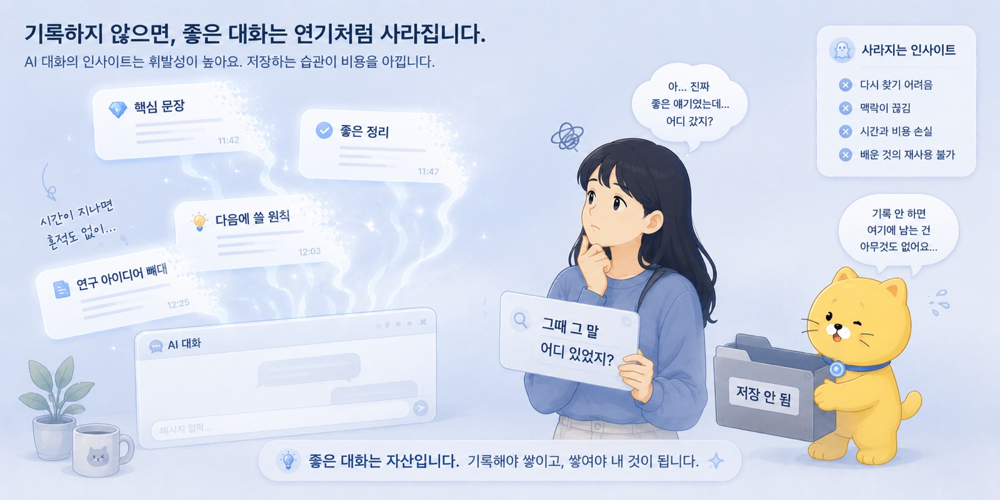
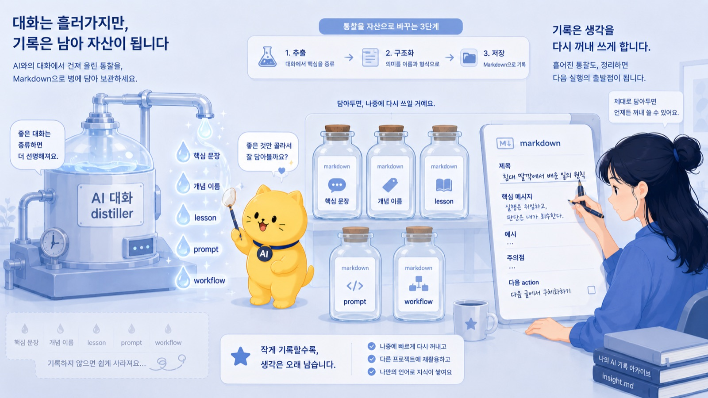
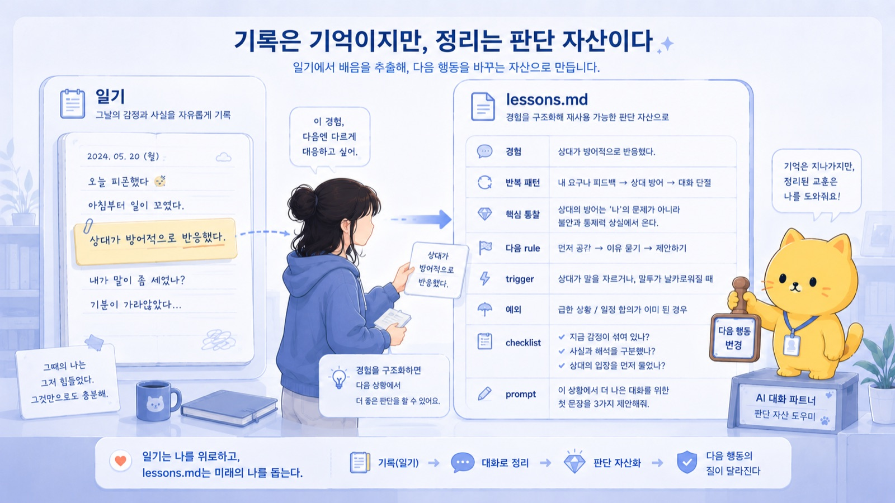
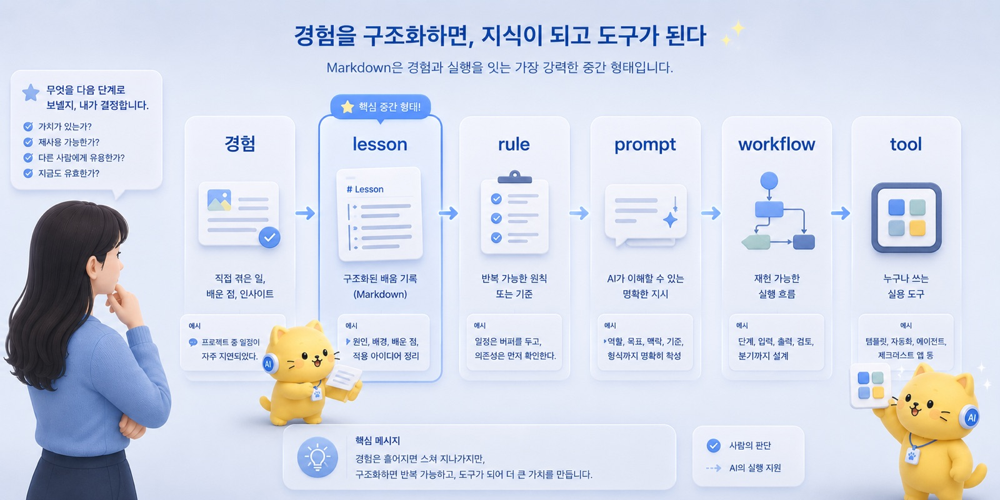

## 10. Markdown으로 남기지 않으면 고급 수다로 끝난다

AI와 대화하다 보면 좋은 말이 많이 나온다.

진짜 많이 나온다.

처음에는 그냥 잡담처럼 시작했는데, 어느 순간 꽤 중요한 문장이 나온다.
대충 던진 고민이었는데, 갑자기 문제의 구조가 보인다.
감정 정리였는데, 반복되는 패턴이 보인다.
연구 아이디어였는데, primary endpoint와 변수표의 뼈대가 나온다.
글감이었는데, 제목과 핵심 문장이 생긴다.

그 순간에는 뭔가 얻은 것 같다.

“아, 이거다.”

이런 느낌이 온다.

그런데 문제는 그다음이다.

대화창을 닫는다.
다른 일을 한다.
하루가 지난다.
새 채팅방을 연다.
다른 주제를 이야기한다.
또 좋은 말이 나온다.
또 닫는다.

그러다 며칠 뒤에 생각한다.

“그때 그 말 어디 있었지?”

찾으려고 하면 안 나온다.

분명히 좋은 문장이 있었다.
분명히 좋은 정리가 있었다.
분명히 다음에 써먹을 수 있는 원칙이 있었다.

그런데 어느 채팅방이었는지 모르겠다.
제목도 애매하다.
대화는 길다.
스크롤은 끝이 없다.
검색어도 기억이 안 난다.

결국 다시 묻는다.

같은 생각을 또 설명한다.
AI는 또 그럴듯하게 정리해준다.
그러면 또 “아, 이거다” 싶다.

하지만 또 남기지 않으면 다시 사라진다.

이쯤 되면 AI와의 대화는 꽤 비싼 수다가 된다.

말은 좋았다.
정리도 좋았다.
그 순간에는 똑똑해진 것 같았다.

하지만 자산은 남지 않았다.

\newpage

AI와 대화만 하고 끝내면 고급 수다다.

이 말은 AI 대화가 쓸모없다는 뜻이 아니다.

오히려 반대다.

AI와의 대화는 정말 쓸모 있다.
생각을 받아주고, 정리해주고, 이름 붙여주고, 구조화해준다.

문제는 대화가 흐른다는 데 있다.

대화는 기본적으로 흘러간다.

맥락은 풍부하다.
당시의 감정도 있다.
말의 앞뒤도 살아 있다.
왜 그 이야기를 하게 됐는지도 들어 있다.

하지만 다시 쓰기는 어렵다.

대화는 읽을 수는 있지만, 재사용하기 어렵다.
길고, 뒤섞여 있고, 핵심 문장이 묻혀 있고, 다른 주제와 섞여 있다.

반면 문서는 다르다.

문서는 남는다.

제목이 생긴다.
검색할 수 있다.
링크를 걸 수 있다.
다른 문서와 연결할 수 있다.
prompt로 바꿀 수 있다.
workflow로 바꿀 수 있다.
나중에 다시 읽을 수 있다.

대화는 생각을 발전시키는 공간이다.

문서는 생각을 저장하고 다시 쓰는 공간이다.

이 둘은 역할이 다르다.

\newpage

앞 글에서 AI 대화는 distiller라고 했다.

처음 생각은 지저분하다.

감정, 예시, 욕, 비유, 직관이 섞인 원액이다.
AI 대화는 그 원액에서 다시 쓸 수 있는 개념을 뽑아낸다.

하지만 증류된 결과를 병에 담지 않으면 다시 날아간다.

그 병이 markdown이다.

Markdown이 특별히 신성한 형식이라는 뜻은 아니다.
Obsidian을 써야만 한다는 뜻도 아니다.

중요한 것은 “문서로 남긴다”는 행위다.

나는 markdown을 쓴다.

가볍고, 오래가고, 검색되고, 링크를 걸기 좋고, Git으로 관리하기 쉽고, AI와 주고받기도 편하기 때문이다.

하지만 핵심은 앱이 아니다.

핵심은 대화 상태의 생각을 문서 상태의 생각으로 바꾸는 것이다.

대화 속 문장은 흘러간다.

문서 속 문장은 다시 호출된다.

_Markdown으로 남기지 않으면 고급 수다로 끝난다의 문제의식이 처음 모습을 드러내는 장면._

\newpage

예를 들어 “AI는 평균적 작업자다”라는 생각도 처음부터 문서가 아니었다.

처음에는 그냥 감각이었다.

AI가 답을 잘하긴 하는데 묘하게 내 것이 아닌 느낌.
무난하고 평균적인 답은 나오는데, 내가 원하는 맥락은 빠지는 느낌.
구글 검색에서 대충 키워드를 치면 누구에게나 맞는 개괄 설명만 나오는 것과 비슷한 느낌.

이걸 AI와 이야기하면서 문장으로 만들었다.

AI는 평균적 작업자다.
AI는 평균을 만든다.
사용자는 좌표계를 준다.

여기까지는 대화다.

하지만 이것을 대화창에만 두면 나중에 또 같은 이야기를 해야 한다.

그래서 markdown 문서로 남긴다.

제목을 붙인다.

`AI는 평균적 작업자다`

문서 안에는 핵심 메시지를 적는다.

“AI는 평균적인 산출물을 빠르게 만들지만, 사용자가 좌표계를 주지 않으면 평균에 머문다.”

예시를 넣는다.

브런치 글.
메일.
코드 prototype.
구글 검색 비유.

주의점도 적는다.

“AI 비하처럼 보이지 않게 한다. 평균은 유용하지만 충분하지 않다는 톤.”

이렇게 되면 생각은 더 이상 흘러가는 대화가 아니다.

다음 글의 참조 문서가 된다.

다른 챕터와 연결된다.
비슷한 글을 쓸 때 다시 꺼낼 수 있다.
Codex에게 줄 시방서의 일부가 된다.
삽화 프롬프트의 원료가 된다.

문서가 되면 생각은 작업 단위가 된다.

\newpage

연구 아이디어도 마찬가지다.

처음에는 이런 정도였다.

“GAHT 환자에서 estradiol 농도를 PK model로 예측해보면 재밌지 않을까?”

이건 좋은 아이디어일 수 있다.

하지만 대화 상태로만 두면 위험하다.

그때그때 말은 많이 할 수 있다.
모델 이야기도 할 수 있고, 제형 이야기도 할 수 있고, perioperative washout 이야기도 할 수 있다.

하지만 문서가 없으면 매번 다시 시작하게 된다.

대상자가 누구였지?
primary endpoint가 뭐였지?
교수님 피드백이 뭐였지?
prospective는 왜 부담스럽다고 했지?
후향적 validation으로 피벗한 이유가 뭐였지?
필요한 변수는 뭐였지?

이런 것을 매번 기억으로 복원해야 한다.

그래서 문서가 필요하다.

문서로 남기면 연구 아이디어는 다음 형태를 가진다.

제목.
배경.
연구 질문.
대상자.
primary endpoint.
수집 변수.
분석계획.
feasibility issue.
교수님께 보여줄 범위.
확인 필요한 부분.

이렇게 되면 AI와의 대화는 연구계획서의 raw material이 된다.

문서가 없으면 좋은 대화로 끝난다.

문서가 있으면 다음 action으로 이어진다.

\newpage

인간관계 lesson도 그렇다.

어떤 상황에서 상대가 방어적으로 반응했다.

처음에는 감정이다.

짜증난다.
억울하다.
내가 틀린 말 한 것도 아닌데 왜 저렇게 받지.
이걸 어떻게 말해야 하지.

AI와 대화하면 그 안에서 구조가 나온다.

상대는 결론을 통보받는다고 느꼈을 수 있다.
불안과 책임소재에 민감한 사람에게는 정보 공유 구조가 더 안전할 수 있다.
내 방침과 상대 선택지를 분리해야 한다.
확정 전 정보는 “현재 기준 공유”라고 먼저 말하는 편이 낫다.

여기까지도 좋다.

하지만 대화 상태로만 두면 다음에 비슷한 상황에서 또 감으로 처리한다.

문서가 되면 다르다.

`확정 전 정보는 통보처럼 말하지 않는다`

이런 lesson이 된다.

그 안에 trigger를 쓴다.

일정 변경.
역할 분담.
확정 전 정보.
책임소재가 애매한 상황.
상대가 방어적으로 반응할 가능성이 있는 상황.

rule을 쓴다.

정보 공유임을 먼저 명시한다.
현재 기준이라는 점을 말한다.
내 방침과 상대 선택지를 분리한다.
최종 판단은 각자에게 남긴다.
변동 가능성과 확인 필요 사항을 표시한다.

prompt도 만든다.

“아래 카톡 문장을 지송체로 다듬어줘. 확정 전 정보 공유라는 점을 먼저 밝히고, 내 방침과 상대 선택지를 분리해줘.”

이렇게 하면 한 번의 삽질이 다음 메시지를 바꾼다.

이게 문서화의 힘이다.

_작업의 흐름이 구체적인 구조로 바뀌는 순간._

\newpage

나는 `lessons.md`를 이런 용도로 본다.

일기가 아니다.

일기는 경험을 기록한다.
`lessons.md`는 경험에서 나온 판단 기준을 기록한다.

일기에는 이렇게 쓸 수 있다.

“오늘 조별 운영 이야기를 하다가 상대가 방어적으로 반응해서 피곤했다.”

이것도 중요하다.

하지만 `lessons.md`는 조금 다르다.

“불안과 책임소재에 민감한 사람에게 확정 전 정보를 공유할 때는, 결론보다 정보 공유 구조가 안전하다.”

이렇게 쓴다.

일기는 그날의 기억을 보존한다.

lesson은 다음 행동을 바꾼다.

그래서 좋은 lesson에는 단순 감상이 아니라 구조가 있어야 한다.

무슨 경험이 있었는가.
반복되는 패턴은 무엇인가.
핵심 통찰은 무엇인가.
다음에 적용할 rule은 무엇인가.
어떤 trigger에서 떠올려야 하는가.
적용 범위는 어디까지인가.
예외는 무엇인가.
행동 전 checklist는 무엇인가.
AI에게 적용시킬 prompt는 무엇인가.
workflow나 tool로 만들 수 있는가.

이렇게 쓰면 경험이 판단 자산이 된다.

\newpage

물론 모든 대화를 markdown으로 남길 필요는 없다.

이건 중요하다.

모든 감정을 문서화하려고 하면 피곤하다.
모든 잡담을 lesson으로 만들려고 하면 시스템이 무거워진다.
모든 문장을 저장하려고 하면 저장소가 쓰레기장이 된다.

남길 것은 골라야 한다.

기준은 간단하다.

다시 쓸 것인가?

다시 쓸 가능성이 있다면 남긴다.

다음에 비슷한 상황에서 행동을 바꿀 원칙인가?
다시 쓸 prompt가 될 수 있는가?
다른 글이나 연구에 연결될 개념인가?
반복 가능한 workflow로 만들 수 있는가?
프로젝트의 방향을 바꾸는 판단인가?
실수 비용이 큰 lesson인가?
나의 사고방식을 잘 설명하는 문장인가?

그렇다면 남긴다.

반대로 단순 감정 배출, 한 번 쓰고 끝날 정보, 맥락 없는 명언, 너무 사소한 팁, 아직 충분히 검증되지 않은 과잉 일반화는 굳이 남기지 않아도 된다.

`lessons.md`는 쓰레기통이 아니다.

재사용 가능한 판단 자산을 모으는 곳이다.

\newpage

Markdown으로 남긴다는 것은 생각을 얼려버린다는 뜻이 아니다.

오히려 반대다.

문서는 업데이트할 수 있어야 한다.

처음 lesson은 v0.1이어도 된다.

처음부터 완벽한 원칙을 만들 필요는 없다.

처음에는 이렇게 쓴다.

“확정 전 정보는 통보처럼 말하지 않는다.”

나중에 경험이 쌓이면 예외가 붙는다.

긴급 상황에서는 명확한 지시가 우선이다.
내가 공식 책임자인 경우에는 선택지를 과하게 열어두면 혼란이 생긴다.
이미 합의된 일을 다시 선택지처럼 말하면 결정력이 약해 보일 수 있다.
환자 안전이 걸린 상황에서는 모호함보다 명확성이 중요하다.

이렇게 업데이트한다.

좋은 lesson은 고정된 진리가 아니다.

판단 모델의 versioned repository다.

내가 경험을 더 쌓으면 수정된다.
실패하면 고친다.
더 좋은 prompt가 생기면 바꾼다.
workflow가 생기면 연결한다.
더 이상 맞지 않으면 outdated로 표시한다.

문서화는 생각을 박제하는 일이 아니다.

생각을 업데이트 가능한 형태로 만드는 일이다.

_사람의 판단과 AI의 실행이 나뉘는 지점을 보여주는 장면._

\newpage

문서가 되면 생각은 서로 연결된다.

이게 대화와 문서의 큰 차이다.

대화 속에서는 개념이 그 대화 안에 묶인다.

하지만 markdown 문서가 되면 다른 문서와 연결할 수 있다.

`AI는 평균적 작업자다`는 `Prompt as Specification`과 연결된다.
`Prompt as Specification`은 `긴 작업은 프롬프트보다 파이프라인이 먼저다`와 연결된다.
`AI 대화는 Inbox다`는 `AI 대화는 Distiller다`와 연결된다.
`AI 대화는 Distiller다`는 `lessons.md의 철학`과 연결된다.
`lessons.md의 철학`은 `Personal AI Operating System`으로 이어진다.

이렇게 연결되면 생각은 단독 메모가 아니다.

지식망이 된다.

하나의 문서가 다른 문서를 부른다.
하나의 lesson이 prompt가 된다.
prompt가 workflow가 된다.
workflow가 나중에 tool이 될 수 있다.

대화는 순간의 정리다.

문서는 시스템의 부품이다.

\newpage

이 차이는 AI 시대에 더 중요해진다.

AI는 output을 너무 많이 만들어준다.

예전에는 글 하나를 쓰려면 시간이 오래 걸렸다.
연구 아이디어를 구조화하려면 꽤 많은 에너지가 필요했다.
메일 하나를 다듬는 것도 귀찮았다.
workflow를 문서화하는 일도 부담이었다.

이제는 AI가 순식간에 해준다.

그래서 생각보다 더 많은 문서 후보가 생긴다.

개념도 생기고, prompt도 생기고, workflow도 생기고, 연구 아이디어도 생기고, 글감도 생기고, 앱 아이디어도 생긴다.

이때 아무 기준 없이 다 쌓으면 혼란이 된다.

하지만 중요한 것을 markdown으로 남기고, 역할을 정하면 자산이 된다.

이 문서는 concept인가?
lesson인가?
prompt인가?
workflow인가?
project note인가?
cold storage인가?

역할이 생기면 다시 쓸 수 있다.

\newpage

나는 이 흐름을 개인 지식 운영체계의 핵심으로 본다.

경험이 있다.

그 경험을 AI와 대화한다.

AI가 그 안에서 패턴과 문장을 뽑아준다.

그중 중요한 것을 markdown으로 남긴다.

그 문서는 lesson이 된다.
lesson은 rule로 압축된다.
rule은 prompt가 된다.
prompt는 workflow가 된다.
workflow는 반복되면 tool이 된다.

흐름은 이렇게 간다.

경험
→ lesson
→ rule
→ prompt
→ workflow
→ tool

이건 단순한 메모법이 아니다.

사고의 재사용 구조다.

내가 한 번 겪은 경험이 다음 행동을 바꾸고,
다음 메시지를 바꾸고,
다음 연구 아이디어 검토를 바꾸고,
다음 AI 프롬프트를 바꾸고,
나중에는 자동화 가능한 workflow가 된다.

Markdown은 그 흐름을 담는 중간 형태다.

너무 무겁지 않고,
너무 휘발되지 않고,
사람도 읽고,
AI도 읽고,
다른 도구도 처리할 수 있는 형태.

그래서 좋다.

_Markdown으로 남기지 않으면 고급 수다로 끝난다의 결론을 이미지로 정리한 장면._

\newpage

결국 중요한 것은 Obsidian이 아니다.

Obsidian은 좋은 도구다.

검색도 되고, 링크도 되고, 그래프도 있고, markdown을 다루기 좋다.
나도 Obsidian PKM에 넣는다.

하지만 이 글은 Obsidian 소개글이 아니다.

도구는 바뀔 수 있다.

Obsidian을 쓰든, VS Code로 markdown을 쓰든, GitHub에 저장하든, 로컬 폴더에 두든, Notion을 쓰든, 핵심은 같다.

AI 대화에서 나온 통찰을 대화 상태로 방치하지 않는 것.

그것을 문서로 만들고, 제목을 붙이고, 역할을 정하고, 다시 쓸 수 있게 만드는 것.

도구가 아니라 흐름이 중요하다.

\newpage

AI와 대화하면 똑똑해진 느낌이 든다.

그건 어느 정도 사실이다.

AI는 내가 한 말을 정리해주고,
내가 못 본 구조를 보여주고,
흩어진 감각에 이름을 붙여준다.

하지만 그걸 남기지 않으면 대부분 흘러간다.

대화는 좋았지만, 다음 행동은 바뀌지 않는다.
좋은 말은 있었지만, 다음에 다시 찾지 못한다.
통찰은 있었지만, prompt가 되지 않는다.
감정 정리는 됐지만, lesson으로 남지 않는다.
아이디어는 있었지만, project note로 연결되지 않는다.

그러면 고급 수다로 끝난다.

나쁘다는 뜻은 아니다.

수다도 필요하다.
감정 배출도 필요하다.
그냥 흘려보내는 대화도 필요하다.

하지만 모든 좋은 대화를 그렇게 흘려보낼 필요는 없다.

중요한 통찰은 병에 담아야 한다.

내 경우 그 병이 markdown이다.

\newpage

AI와 대화만 하고 끝내면 고급 수다다.

중요한 통찰을 markdown으로 남기면 사고 자산이 된다.

대화는 흐른다.

문서는 남는다.

대화는 생각을 증류한다.

문서는 그 증류물을 다시 쓸 수 있게 만든다.

Markdown으로 남긴다는 것은 예쁘게 정리한다는 뜻이 아니다.

다음의 나에게 넘긴다는 뜻이다.

다음에 비슷한 상황을 만났을 때,
다음에 같은 메시지를 써야 할 때,
다음에 같은 연구 아이디어를 검토할 때,
다음에 같은 workflow를 돌릴 때,
다음에 다시 흔들릴 때,

그때 꺼내 쓸 수 있게 만드는 것이다.

AI 대화는 순간의 지능을 빌려준다.

Markdown은 그 순간을 다음의 나에게 넘겨준다.
