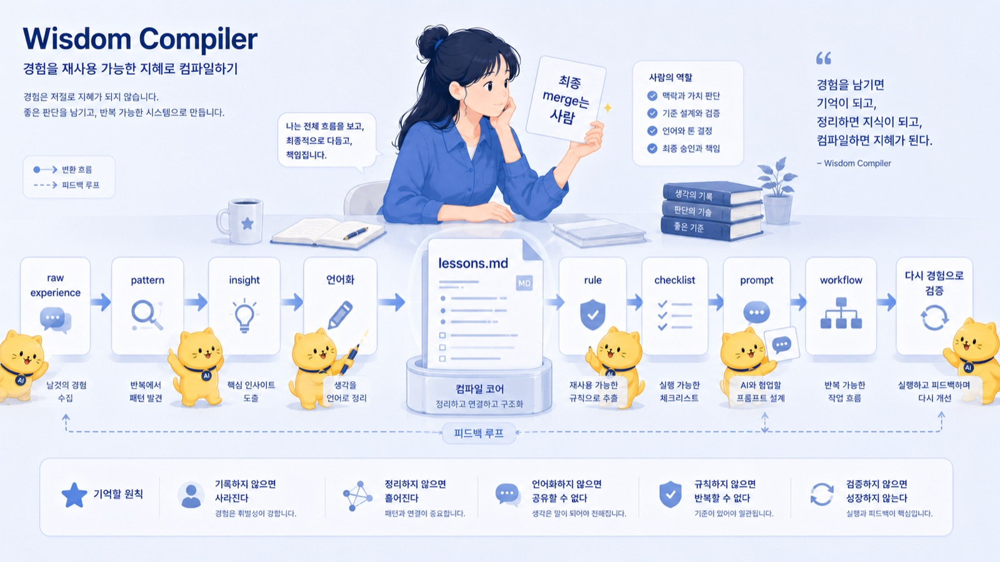
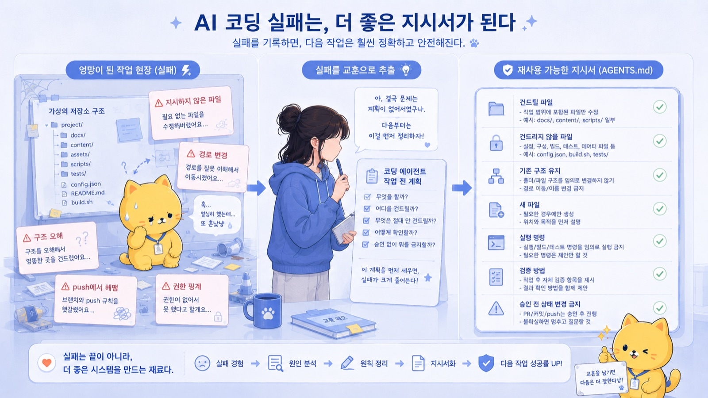
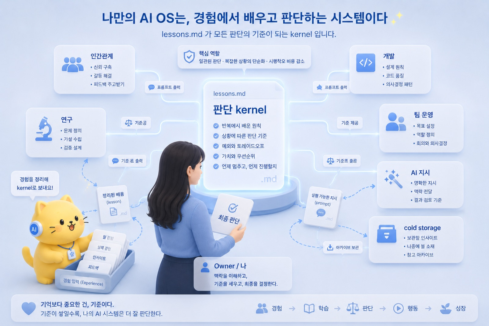
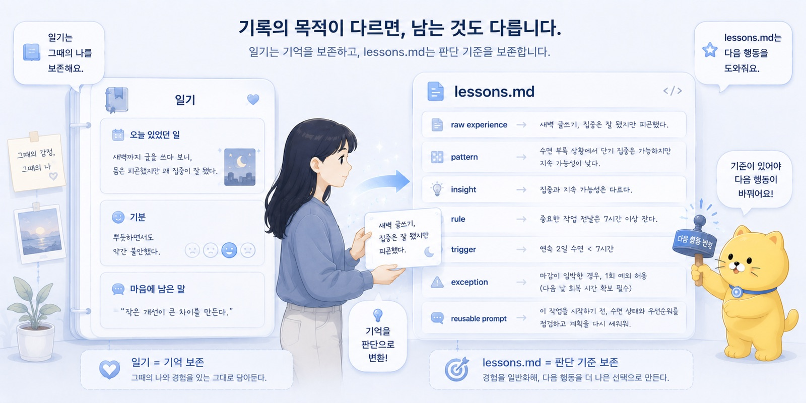

## 11. lessons.md: 경험을 재사용 가능한 원칙으로 바꾸기

경험은 그냥 두면 감정으로 남는다.

그날은 짜증났다.
그 말은 좀 서운했다.
그 연구 아이디어는 아까웠다.
그 프로젝트는 너무 커졌다.
그 메시지는 괜히 꼬였다.
그 자동화는 편할 줄 알았는데 오히려 위험했다.

이렇게 남는다.

물론 감정도 중요하다.

감정은 신호다.
뭔가가 불편했다는 뜻이고, 어디선가 기준이 흔들렸다는 뜻이고, 다음에는 다르게 해야 할 가능성이 있다는 뜻이다.

하지만 감정으로만 남으면 다음 행동이 잘 바뀌지 않는다.

다음에 비슷한 상황이 오면 또 비슷하게 반응한다.
또 감으로 처리한다.
또 “이번에는 괜찮겠지” 하고 넘어간다.
또 비슷하게 꼬인다.

경험이 많다고 자동으로 지혜가 되는 것은 아니다.

많이 겪는 것과 잘 배우는 것은 다르다.

경험에서 패턴을 뽑아야 한다.
패턴에서 통찰을 만들어야 한다.
통찰을 원칙으로 바꿔야 한다.
원칙을 다음 행동에 적용할 수 있어야 한다.

그 중간에 필요한 파일이 내게는 `lessons.md`다.

\newpage

`lessons.md`는 일기가 아니다.

일기는 경험을 기록한다.

오늘 무슨 일이 있었는지.
누가 무슨 말을 했는지.
내 기분이 어땠는지.
어떤 일이 마음에 남았는지.

이런 것을 기록한다.

그 자체로 의미가 있다.

하지만 `lessons.md`는 조금 다르다.

`lessons.md`는 경험에서 뽑은 판단 기준을 기록한다.

이 경험에서 어떤 패턴을 봤는가.
다음에 비슷한 상황에서 무엇을 다르게 할 것인가.
어떤 trigger에서 이 lesson을 떠올려야 하는가.
어디까지 적용하고, 어디서는 적용하면 안 되는가.
AI에게 이 원칙을 실행시키려면 어떤 prompt가 필요한가.
반복되는 절차로 만들 수 있는가.

일기는 기억을 보존한다.

`lessons.md`는 판단 기준을 보존한다.

둘은 다르다.

\newpage

예를 들어 조별 운영 상황이 있었다고 하자.

나는 맞는 판단을 했다고 생각했다.

현재 기준으로는 이 방향이 안전하다.
내 조는 이렇게 움직이는 게 맞다.
상대에게도 정보를 공유해주는 것이 맞다.

그런데 상대는 방어적으로 반응했다.

처음에는 짜증이 난다.

“아니, 내가 틀린 말 한 것도 아닌데 왜 저렇게 받아들이지?”
“정보 공유한 건데 왜 통보처럼 받아들이지?”
“내가 뭘 더 어떻게 말해야 하지?”

이 상태로 끝나면 감정이다.

다음에 비슷한 일이 생기면 또 비슷하게 말하고, 또 비슷한 반응을 받을 수 있다.

하지만 이 경험을 `lessons.md`로 옮기면 달라진다.

Raw experience:

조별 운영 상황에서 확정 전 정보를 공유했는데, 상대가 그것을 결정 통보처럼 받아들이고 방어적으로 반응했다.

Pattern:

불안, 자율성, 책임소재에 민감한 사람은 결론을 통보받는다고 느끼면 방어적으로 반응할 수 있다.

Insight:

같은 판단도 전달 구조에 따라 상대 반응이 달라진다.
결론보다 정보 공유 구조가 안전할 때가 있다.

Rule:

확정 전 정보를 공유할 때는 “현재 기준 공유”라고 먼저 말한다.
내 방침과 상대 선택지를 분리한다.
최종 판단 책임은 각자 또는 각 조에 남긴다.
불확실한 내용은 “확인 중”으로 표시한다.

Trigger:

일정 변경.
역할 분담.
확정 전 정보 공유.
책임소재가 애매한 상황.
상대가 방어적으로 반응할 가능성이 있는 상황.

Exception:

긴급 상황.
명확한 지시가 필요한 상황.
내가 공식 책임자로 결정해야 하는 상황.
모호하게 말하면 오히려 혼란이 커지는 상황.

Reusable prompt:

아래 카톡 문장을 지송체로 다듬어줘.
확정 전 정보 공유라는 점을 먼저 밝히고, 내 방침과 상대 선택지를 분리해줘.
상대가 결정 통보처럼 느끼지 않게 하되, 해야 할 행동은 명확하게 남겨줘.
불확실한 부분은 “확인 중” 또는 “변동 가능성 있음”으로 표시해줘.

이렇게 쓰면 달라진다.

한 번의 짜증나는 경험이 다음 메시지를 바꾸는 도구가 된다.

_lessons.md: 경험을 재사용 가능한 원칙으로 바꾸기의 문제의식이 처음 모습을 드러내는 장면._

\newpage

이것이 Wisdom Compiler다.

지식은 이미 정리된 규칙이다.

빨간불에는 건너지 않는다.
IRB 문서에는 대상자, 수집 변수, 개인정보 보호, 동의면제 사유가 필요하다.
연구 문서에서 약어는 처음 등장할 때 full term과 abbreviation을 함께 쓰는 것이 안전하다.
개인정보가 포함된 자료는 IRB 전에는 외부 repository에 올리면 안 된다.

이런 것은 비교적 명시적이다.

반면 지혜는 조금 다르다.

이 교수님께는 큰 비전보다 작은 feasibility check로 말해야 한다.
이 연구 아이디어는 흥미롭지만 현재 데이터 구조로는 endpoint가 약하다.
이 사람은 정보를 묻는 것이 아니라 책임을 피할 출구를 찾고 있다.
이 문장은 공손해 보이지만 실제로는 책임소재를 흐리게 만든다.
이 프로젝트는 지금 active package로 올리면 에너지를 과하게 잡아먹는다.

이런 판단은 단순한 사실 암기가 아니다.

많이 보고, 겪고, 실패하고, 조정하면서 생기는 감각이다.

지혜는 경험 기반 pattern recognition이다.

그런데 지혜는 그대로 두면 휘발된다.

그때는 분명히 알 것 같았는데, 시간이 지나면 희미해진다.
다음에 비슷한 상황이 와도 같은 실수를 반복한다.
감정은 남는데 원칙은 남지 않는다.

그래서 compile해야 한다.

경험
→ 패턴 감지
→ 통찰
→ 언어화
→ 원칙화
→ 체크리스트화
→ prompt화
→ workflow화
→ 다시 경험으로 검증

이 흐름이 Wisdom Compiler다.

`lessons.md`는 그 compiler의 핵심 파일이다.

\newpage

좋은 lesson은 명언이 아니다.

이건 중요하다.

`lessons.md`는 그럴듯한 문장을 모아두는 곳이 아니다.

“소통은 중요하다.”
“사람은 신중해야 한다.”
“AI를 잘 활용해야 한다.”
“건강이 최고다.”
“좋은 선택을 하자.”

이런 문장은 틀리지 않다.

하지만 약하다.

다음 행동을 바꾸기 어렵다.

좋은 lesson은 더 구체적이다.

“확정 전 정보는 통보처럼 말하지 않는다.”
“교수님께 연구 아이디어를 말할 때는 큰 비전보다 feasibility check가 먼저다.”
“AI 대화에서 얻은 통찰은 markdown으로 남기지 않으면 다음 주에 다시 같은 이야기를 하게 된다.”
“좋은 아이디어라도 지금 실행할 에너지가 없으면 cold storage에 둔다.”
“고위험 작업은 AI 결과만 믿지 않고 원문과 결과를 직접 확인한다.”

이런 문장은 행동을 바꾼다.

다음에 비슷한 상황이 오면 바로 쓸 수 있다.

lesson의 목적은 멋진 말이 아니다.

다음 행동을 바꾸는 것이다.

\newpage

연구에서도 마찬가지다.

EstroFrame 초기 아이디어는 perioperative estradiol washout 예측에서 출발했다.

처음에는 흥미로웠다.

수술 전 estradiol을 중단하면 혈중 농도가 얼마나 빨리 떨어질까.
제형, 용량, 투여 간격에 따라 washout curve가 다를까.
1-compartment pharmacokinetic model로 예측할 수 있을까.
이걸 시뮬레이터로 만들면 perioperative hormone management에 쓸 수 있지 않을까.

아이디어 자체는 좋았다.

하지만 교수님 피드백을 받으면서 보이는 게 있었다.

endpoint가 약할 수 있다.
perioperative cohort는 환자 수와 관찰값 확보가 어려울 수 있다.
prospective design은 실습생 위치에서 부담이 크다.
실제 EMR 데이터로 후향적 validation부터 하는 편이 안전할 수 있다.

이 경험을 그냥 “교수님이 endpoint 약하다고 하셨다”로만 남기면 아깝다.

lesson으로 만들면 다음 연구 아이디어에도 쓸 수 있다.

Raw experience:

EstroFrame 초기 아이디어는 perioperative estradiol washout 예측에서 시작했지만, 교수님 피드백을 통해 endpoint와 feasibility 문제가 드러났다.

Pattern:

연구 아이디어가 흥미롭더라도 실제 데이터, endpoint, 환자 수, 관찰값 확보 가능성이 약하면 실행력이 떨어진다.

Insight:

연구는 아이디어의 참신함만으로 되는 것이 아니다.
검증 가능한 질문, 확보 가능한 데이터, 임상적으로 의미 있는 endpoint가 필요하다.

Rule:

새 연구 아이디어는 data source, primary endpoint, required variables, retrospective feasibility로 먼저 점검한다.

Trigger:

새 연구 아이디어가 떠올랐을 때.
교수님께 제안하기 전.
IRB 초안을 쓰기 전.
prospective study를 생각하게 될 때.
endpoint가 애매한데 아이디어만 커질 때.

Exception:

초기 brainstorming 단계에서는 너무 빨리 죽이지 않는다.
일단 cold storage에 넣고 나중에 feasibility를 볼 수 있다.

Reusable prompt:

아래 연구 아이디어를 feasibility 관점에서 점검해줘.
research question, primary endpoint, data source, required variables, likely limitations, retrospective feasibility, 교수님께 낮은 압력으로 제안하는 방식으로 나눠줘.
아이디어를 무작정 키우지 말고, 실제 EMR 데이터로 검증 가능한 좁은 질문으로 줄여줘.

이렇게 되면 한 번의 교수님 피드백이 다음 연구 아이디어를 검토하는 도구가 된다.

_작업의 흐름이 구체적인 구조로 바뀌는 순간._

\newpage

AI가 헛짓한 경험도 lesson이 된다.

이것도 중요하다.

`lessons.md`는 내가 사람에게서 배운 것만 저장하는 파일이 아니다.
AI와 일하다가 배운 것도 저장한다.

예를 들어 CleanText, 그러니까 EMR 증류 앱을 만들 때 Gemini가 이상하게 움직인 적이 있다.

처음에는 간단한 작업이라고 생각했다.

“이거 해줘.”

정도였다.

내 머릿속에서는 너무 당연했다.
repo에서 필요한 작업을 하고, 간단히 push하면 되는 일이었다.
`gh push`처럼 간단하게 처리할 수 있는 길이 있었다.

그런데 Gemini는 그걸 이상하게 풀었다.

지시하지 않은 파일까지 건드리려 했다.
기존 구조를 제대로 이해하지 못하고 새 구조를 만들려 했다.
파일 경로나 이름을 이상하게 바꾸려 했다.
앞에서 정한 조건을 놓쳤다.
그리고 정말 간단히 처리할 수 있는 push 작업에서 네트워크 권한이 어쩌고, 인증이 어쩌고, 접근이 어쩌고 하면서 한참을 빙빙 돌았다.

사람 입장에서는 빡친다.

“아니 그거 그냥 하면 되잖아.”

이런 말이 나온다.

하지만 여기서 그냥 “Gemini가 멍청했다”로 끝내면 감정이다.

lesson으로 만들면 다음 작업이 달라진다.

Raw experience:

CleanText repository 작업 중 Gemini에게 간단한 작업을 맡겼는데, 작업 범위와 repository 구조를 제대로 이해하지 못하고 지시하지 않은 파일, 경로, push 방식에서 불필요하게 헤맸다.

Pattern:

코딩 에이전트는 작업 범위, 금지사항, 출력 위치, 변경 이유, 검증 방법이 명확하지 않으면 간단한 작업도 과하게 해석하거나 엉뚱한 방향으로 확장할 수 있다.

Insight:

AI가 실패한 것은 단순히 모델 성능 문제가 아닐 수 있다.
특히 낮은 성능의 모델일수록 작업 환경, 금지사항, checklist, AGENTS.md 같은 운영 지침이 더 중요하다.

Rule:

코딩 에이전트에게 repository 작업을 맡길 때는 다음을 명시한다.

- 어떤 파일을 건드려도 되는지
- 어떤 파일은 절대 건드리면 안 되는지
- 기존 구조를 유지해야 하는지
- 새 구조를 만들어도 되는지
- 결과물을 어디에 저장해야 하는지
- 변경 후 무엇을 검증해야 하는지
- 실행한 명령과 변경 이유를 남겨야 하는지
- push, build, delete처럼 실제 상태를 바꾸는 작업은 언제 사람 승인을 받아야 하는지

Trigger:

- Gemini, Codex 같은 코딩 에이전트에게 repository 작업을 맡길 때
- “간단한 작업이니까 알아서 하겠지”라고 생각될 때
- 파일 변경, build, push, 배포, 삭제가 들어갈 때
- 기존 repository 구조를 재사용하는 작업일 때
- 모델이 낮은 성능이거나 긴 맥락을 잘 놓칠 수 있을 때

Exception:

- 완전히 새로 만드는 toy project
- 실패해도 상관없는 실험 repo
- 원본이 보존되어 있고, 작업 범위가 매우 작은 경우
- 사람이 바로 diff를 확인할 수 있는 경우

Reusable prompt:

아래 repository 작업을 수행하기 전에 먼저 작업 계획을 작성해줘.
반드시 다음을 포함해줘.

1. 건드릴 파일 목록
2. 건드리지 않을 파일 목록
3. 기존 구조에서 유지할 부분
4. 새로 만들 파일 또는 폴더
5. 실행할 명령어
6. 변경 이유
7. 검증 방법
8. push/build/delete 등 상태 변경 작업이 있으면 실행 전 승인 요청

계획을 먼저 보여주고, 승인 전에는 파일을 수정하거나 push하지 마.

이렇게 저장하면 Gemini가 삽질한 경험은 그냥 짜증나는 사건으로 끝나지 않는다.

다음에 코딩 에이전트에게 일을 맡길 때 쓰는 instruction이 된다.
AGENTS.md에 들어갈 규칙이 된다.
repo 작업 checklist가 된다.
Codex에게 줄 300줄짜리 프롬프트의 일부가 된다.

처음에는 “AI가 왜 이걸 못하지?”였다.

하지만 lesson으로 바꾸면 질문이 달라진다.

“다음에는 어떤 작업 범위와 금지사항을 먼저 줘야 하지?”

이게 `lessons.md`의 힘이다.

AI 실패도 버리지 않는다.

AI 실패는 다음 instruction을 만드는 재료다.

\newpage

`lessons.md`가 강력한 이유는 prompt로 이어지기 때문이다.

사람은 같은 원칙을 매번 완벽하게 적용하기 어렵다.

나는 지송체 공지문 원칙을 알고 있다.

목적을 먼저 말한다.
일정, 장소, 역할, 준비물을 명확히 쓴다.
불확실한 내용은 표시한다.
과하게 굽히지 않는다.
상대가 바로 움직일 수 있게 쓴다.

하지만 피곤할 때는 놓친다.

급할 때는 길어진다.
상대 눈치를 보면 과하게 완곡해진다.
짜증나면 너무 단호해진다.
불확실한 정보를 공유할 때 책임소재가 흐려질 수 있다.

그래서 lesson을 prompt로 만든다.

“아래 공지문을 지송체로 다듬어줘. 목적을 먼저 말하고, 일정·장소·준비물·예외사항을 명확히 해줘. 과한 감정 표현은 줄이고, 상대가 바로 해야 할 행동이 보이게 써줘. 불확실한 내용은 [확인 필요]로 표시해줘.”

이 prompt는 그냥 문장이 아니다.

내가 여러 번의 경험에서 얻은 원칙을 AI에게 실행시키는 인터페이스다.

즉 prompt는 lesson의 실행 형태다.

`lessons.md`는 원칙을 저장하고, `prompts.md`는 그 원칙을 실행시킨다.

_사람의 판단과 AI의 실행이 나뉘는 지점을 보여주는 장면._

\newpage

lesson이 반복되면 workflow가 된다.

예를 들어 연구 아이디어를 다루는 lesson이 있다고 하자.

“연구 아이디어는 endpoint와 data source로 먼저 검증한다.”

이것이 반복되면 절차가 생긴다.

1. 아이디어를 자유롭게 적는다.
2. AI에게 problem, data source, endpoint, feasibility로 나누게 한다.
3. 실제 데이터가 있는지 확인한다.
4. primary endpoint가 충분히 강한지 평가한다.
5. prospective인지 retrospective인지 결정한다.
6. 교수님께 보여줄 수 있는 낮은 압력의 제안으로 바꾼다.
7. IRB 문서 구조로 변환한다.
8. 불확실한 부분을 [확인 필요]로 표시한다.
9. active package로 올릴지 cold storage에 둘지 결정한다.

이건 더 이상 단일 lesson이 아니다.

workflow다.

다음에 다른 연구 아이디어가 생겨도 같은 절차를 적용할 수 있다.

경험은 lesson이 되고,
lesson은 rule이 되고,
rule은 prompt가 되고,
prompt는 workflow가 된다.

반복성과 기준이 충분히 명확해지면 나중에는 tool이 될 수도 있다.

예를 들어 연구 아이디어를 입력하면 feasibility report와 IRB skeleton을 자동으로 만드는 workflow를 만들 수 있다.
공지문 초안을 넣으면 지송체로 바꾸고 책임소재 위험을 점검하는 template을 만들 수 있다.
EMR note를 넣으면 research variable 후보를 뽑는 prompt나 script를 만들 수 있다.

이건 단순한 메모가 아니다.

경험이 도구로 변하는 과정이다.

\newpage

하지만 lesson을 만들 때 조심해야 할 것도 있다.

첫 번째 위험은 과잉 일반화다.

한두 번의 경험으로 모든 상황을 설명하려고 하면 위험하다.

어떤 사람이 방어적으로 반응했다.
그래서 “모든 사람에게 선택권의 외형을 남겨야 한다”고 결론내면 틀릴 수 있다.

어떤 상황에서는 명확한 지시가 더 안전하다.
긴급한 상황에서는 선택권보다 속도가 중요할 수 있다.
환자 안전이 걸린 상황에서는 모호함보다 명확성이 중요하다.
내가 공식 책임자인 상황에서 지나치게 선택지처럼 말하면 오히려 혼란이 커질 수 있다.

그래서 좋은 lesson에는 exception이 필요하다.

예외 없는 rule은 위험하다.

두 번째 위험은 감정의 규칙화다.

상처받은 경험을 그대로 rule로 만들면 편향이 생길 수 있다.

“이 사람은 별로다”에서 끝나면 lesson이 아니다.
“이런 조건에서 이런 반응이 나올 수 있다”로 바꿔야 lesson이 된다.

감정을 지우자는 뜻이 아니다.

감정을 구조화하자는 뜻이다.

세 번째 위험은 너무 많은 rules다.

모든 경험을 lesson으로 만들 필요는 없다.

너무 많은 규칙은 오히려 행동을 느리게 한다.
모든 감정을 문서화하려고 하면 피곤하다.
모든 대화를 lesson으로 만들면 `lessons.md`가 쓰레기통이 된다.

`lessons.md`에 넣을 만한 것은 다음 행동을 바꿀 가능성이 있는 경험이다.

반복될 가능성이 있는 경험.
실수 비용이 큰 경험.
다음에 prompt나 workflow로 바꿀 수 있는 원칙.
인간관계, 연구, 의료, 개발, 팀 운영에서 다시 중요해질 판단.

이런 것만 남겨도 충분하다.

\newpage

좋은 lesson은 업데이트된다.

처음부터 완벽한 lesson은 없다.

처음에는 v0.1이면 된다.

예를 들어 처음에는 이렇게 저장할 수 있다.

“확정 전 정보는 통보처럼 말하지 않는다.”

나중에 경험이 쌓이면 수정한다.

“상대가 자율성이나 책임소재에 민감하고, 아직 각자 판단이 필요한 상황에서는 확정 전 정보를 통보처럼 말하지 않는다.”

조금 더 정확해졌다.

나중에는 예외도 붙는다.

“단, 긴급 상황이거나 내가 공식 책임자로 결정해야 하는 상황에서는 명확한 지시가 우선이다.”

더 안전해졌다.

이렇게 lesson은 살아 있는 문서가 된다.

고정된 진리가 아니라 판단 모델의 versioned repository다.

경험이 더 쌓이면 적용 조건을 고친다.
실패하면 예외를 붙인다.
더 좋은 prompt가 생기면 바꾼다.
workflow가 생기면 연결한다.
더 이상 맞지 않으면 outdated로 표시한다.

이것이 중요하다.

lesson은 나를 가두는 규칙이 아니다.

다음 판단을 돕는 업데이트 가능한 모델이다.

_lessons.md: 경험을 재사용 가능한 원칙으로 바꾸기의 결론을 이미지로 정리한 장면._

\newpage

AI는 이 과정을 도울 수 있다.

경험을 말하면 AI는 그 안에서 패턴을 뽑아준다.

“이 경험에서 lesson을 뽑아줘.”
“pattern, insight, rule, trigger, exception으로 나눠줘.”
“이걸 다음에 쓸 수 있는 prompt로 바꿔줘.”
“과잉 일반화된 부분이 있는지 봐줘.”
“예외 조건을 붙여줘.”
“이 lesson을 workflow로 만들 수 있을까?”

이런 질문을 할 수 있다.

하지만 AI가 지혜의 출처는 아니다.

경험의 출처는 사람이다.

AI는 내가 겪은 경험, 내가 느낀 불편함, 내가 반복해서 본 패턴을 구조화해준다.

AI는 raw experience를 reusable structure로 바꾸는 데 강하다.

하지만 어떤 경험이 중요한지, 이 원칙을 실제로 믿어도 되는지, 어디까지 적용할지, 다음 행동을 어떻게 바꿀지는 사람이 판단해야 한다.

AI는 compiler를 도와준다.

최종 merge는 사람이 한다.

\newpage

`lessons.md`의 최종 목적은 똑똑한 말을 모으는 것이 아니다.

목적은 다음 행동을 더 좋게 만드는 것이다.

같은 실수를 줄이는 것.
좋은 판단을 반복하는 것.
감으로 하던 일을 구조화하는 것.
AI에게 나의 원칙을 실행시킬 수 있게 하는 것.
문체와 판단 기준을 안정시키는 것.
연구와 프로젝트를 더 잘 정리하는 것.
인간관계에서 방어 반응을 줄이는 것.
active package와 cold storage를 나누는 것.
긴 대화와 경험을 자산으로 바꾸는 것.

이것이 `lessons.md`의 역할이다.

개인 운영체계에서 `lessons.md`는 판단 kernel에 가깝다.

매번 처음부터 생각하지 않게 해준다.
과거의 나에게 배운 것을 현재의 내가 다시 쓸 수 있게 한다.
현재의 경험을 미래의 나에게 넘겨준다.

\newpage

경험은 그냥 쌓인다고 지혜가 되지 않는다.

실패를 많이 했다고 자동으로 현명해지지 않는다.
AI와 대화를 많이 했다고 자동으로 사고 자산이 생기지 않는다.
좋은 말을 많이 들었다고 다음 행동이 바뀌는 것도 아니다.

경험은 compile되어야 한다.

Raw experience가 pattern이 되고,
pattern이 insight가 되고,
insight가 rule이 되고,
rule이 trigger와 exception을 만나고,
prompt와 workflow로 바뀔 때,

그때 경험은 다음 상황에서 쓸 수 있는 도구가 된다.

일기는 경험을 기록한다.

`lessons.md`는 경험에서 나온 판단 기준을 기록한다.

경험은 그냥 두면 감정으로 남는다.

lesson으로 만들면 다음 행동을 바꾸는 자산이 된다.
