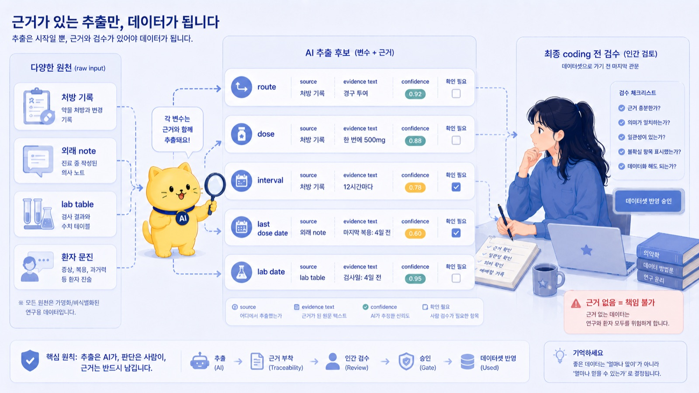
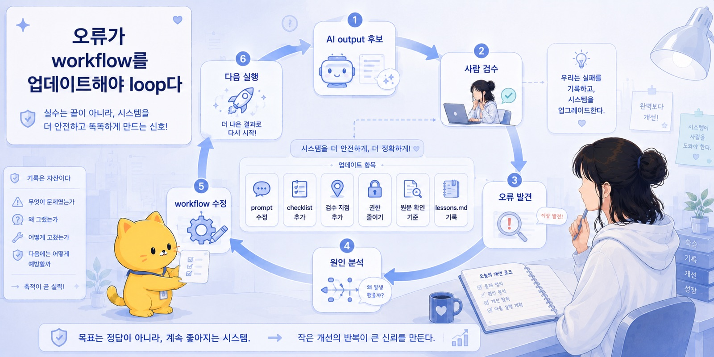
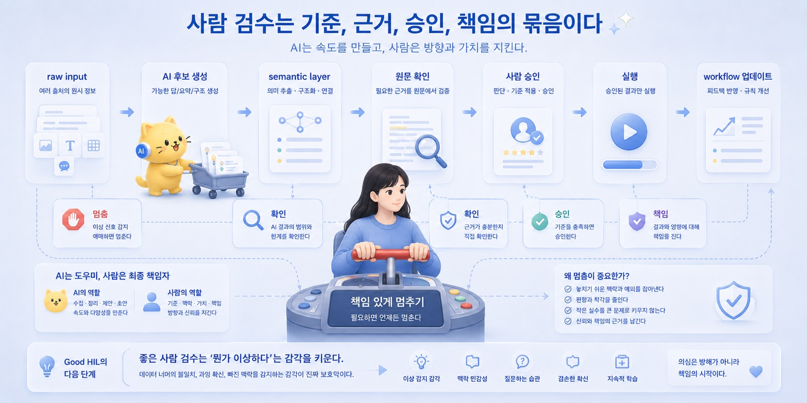
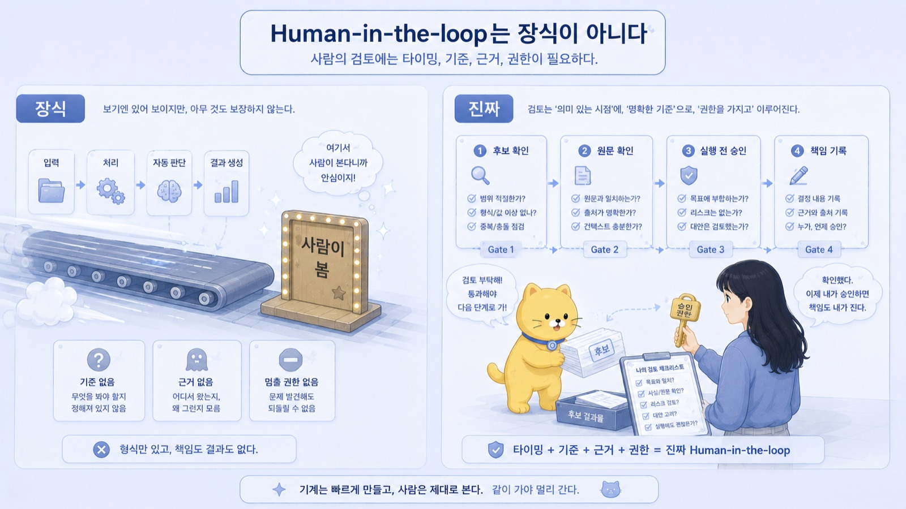

## 17. Human-in-the-loop는 장식이 아니다

사람이 보면 되잖아.

AI를 쓰는 이야기를 하다 보면 이 말을 자주 듣는다.

AI가 초안을 만들고,
AI가 요약하고,
AI가 변수를 뽑고,
AI가 코드를 고치고,
AI가 EMR note를 정리하고,
AI가 메시지를 써도,

마지막에 사람이 보면 되잖아.

겉으로는 맞는 말이다.

나도 그렇게 말한다.

AI output을 그대로 믿으면 안 된다.
사람이 검토해야 한다.
최종 판단은 사람이 해야 한다.
책임은 사람에게 남는다.

이 문장들은 전부 맞다.

그런데 문제는 그다음이다.

사람이 본다는 게 정확히 무슨 뜻인가?

누가 보는가.
언제 보는가.
무엇을 보는가.
어떤 기준으로 보는가.
원문은 어디서 확인하는가.
실행 전 승인 지점은 어디인가.
오류가 생기면 누가 책임지는가.
그 오류는 다음 workflow에 어떻게 반영되는가.

이 질문에 답하지 못하면 “사람이 보면 된다”는 말은 안전장치가 아니다.

그냥 장식이다.

workflow 끝에 사람 모양 표지판 하나 세워둔 것에 가깝다.

Human-in-the-loop는 그런 뜻이 아니다.

Human-in-the-loop는 마지막에 사람이 대충 보는 절차가 아니다.

책임 구조다.

---

이전 글에서 자동화의 핵심은 자동화하지 않을 것을 정하는 일이라고 했다.

자동화는 딸깍이다.

딸깍하면 파일이 정리되고,
딸깍하면 PDF가 빌드되고,
딸깍하면 문서가 생기고,
딸깍하면 코드가 고쳐지고,
딸깍하면 메시지 초안이 나온다.

그 딸깍은 편하다.

하지만 딸깍이 실제 세계에 닿는 순간, 질문이 바뀐다.

초안인가, 실행인가.
후보인가, 최종본인가.
내 안에서 끝나는가, 다른 사람에게 전달되는가.
원본을 보존하는가, 덮어쓰는가.
틀렸을 때 되돌릴 수 있는가.
그 결과를 누가 책임지는가.

이 질문들에 답해야 한다.

그리고 이 질문들에 답하는 방식이 human-in-the-loop다.

사람을 workflow 끝에 세워두는 것과,
사람이 책임 있게 개입하도록 설계하는 것은 다르다.

---

춘식이가 집주인에게 메시지를 보낸 사건을 생각해보자.

귀여웠다.

너무 귀여웠다.

그리고 아주 위험했다.

AI가 메시지 초안을 쓰는 것은 괜찮다.

“이 상황에서 집주인에게 보낼 메시지를 공손하게 정리해줘.”
“너무 과하게 친절하지 않게 줄여줘.”
“책임소재가 애매하지 않게 다시 써줘.”
“짧은 카톡 버전으로 바꿔줘.”

여기까지는 좋다.

AI는 ghostwriter가 될 수 있다.

하지만 AI가 실제로 집주인에게 보내는 순간 이야기가 달라진다.

메시지는 외부 세계로 나간다.
상대가 읽는다.
관계가 생긴다.
오해가 생길 수 있다.
후폭풍이 생긴다.
되돌리기 어렵다.

여기서 필요한 human-in-the-loop는 “나중에 한 번 확인”이 아니다.

실행 전 승인이다.

AI가 초안을 만든다.
사람이 읽는다.
사람이 맥락을 판단한다.
사람이 표현을 고른다.
사람이 보낼지 말지 결정한다.
사람이 전송 버튼을 누른다.

이 구조가 있어야 한다.

춘식이가 귀엽다고 해서, 춘식이가 집주인에게 직접 말을 걸면 안 된다.

귀여움은 권한이 아니다.

---

이메일도 마찬가지다.

AI가 교수님께 보낼 이메일 초안을 쓰는 것은 유용하다.

인사말을 정리하고,
메일 목적을 앞에 두고,
배경을 짧게 줄이고,
요청사항을 명확히 하고,
감사 인사를 붙일 수 있다.

AI는 초안을 잘 만든다.

하지만 보내는 것은 사람이다.

왜냐하면 이메일은 문장만의 문제가 아니기 때문이다.

지금 보내도 되는가.
이 표현이 교수님께 너무 압박으로 보이지 않는가.
내가 감당할 수 있는 요청인가.
연구 방향을 너무 확정적으로 말하고 있지는 않은가.
불확실한 부분을 제대로 표시했는가.
첨부파일과 내용이 맞는가.
이 메일이 나중에 기록으로 남아도 괜찮은가.

이건 AI가 대신 판단할 수 없다.

_Human-in-the-loop는 장식이 아니다의 문제의식이 처음 모습을 드러내는 장면._

AI는 문장을 매끄럽게 만들 수 있다.

하지만 관계의 맥락과 책임은 사람에게 남는다.

그러니까 이메일 workflow에서 human-in-the-loop는 이런 식이어야 한다.

AI가 초안을 만든다.
사람이 목적과 톤을 확인한다.
사람이 사실관계를 확인한다.
사람이 책임질 수 없는 문장을 지운다.
사람이 최종 전송 여부를 결정한다.

사람 검수는 버튼 하나가 아니다.

기준, 근거, 승인, 책임의 묶음이다.

---

파일 정리나 코드 자동화에서도 마찬가지다.

Codex가 코드를 고친다.

파일을 열고,
함수를 수정하고,
테스트를 만들고,
README를 고치고,
빌드를 돌리고,
결과를 보고한다.

좋다.

이건 진짜 좋다.

예전에는 사람이 직접 해야 했던 작업이 줄어든다.

하지만 여기서도 사람이 보는 지점이 필요하다.

어떤 파일을 건드렸는가.
원본을 덮어썼는가.
삭제한 파일은 없는가.
개인정보가 들어간 파일을 건드렸는가.
테스트는 통과했는가.
실제 behavior가 바뀌었는가.
rollback 가능한가.
이 변경을 commit해도 되는가.

그냥 “Codex가 했으니 괜찮겠지”가 아니다.

AI가 만든 patch는 후보이다.

사람은 그 patch가 목적에 맞는지, 위험한 side effect가 없는지, 실행해도 되는지 봐야 한다.

여기서 좋은 human-in-the-loop는 이런 구조다.

작업 전 목표를 정한다.
수정 가능 범위를 정한다.
건드리면 안 되는 파일을 명시한다.
AI가 변경한 diff를 보여준다.
테스트를 돌린다.
사람이 확인한다.
사람이 승인한 뒤 merge하거나 실행한다.

이 과정이 없으면 “사람이 봤다”는 말은 공허하다.

사람이 무엇을 봐야 하는지 정해져 있지 않으면, 검수는 쉽게 통과 의례가 된다.

---

Human-in-the-loop에서 가장 먼저 구분해야 하는 것은 output의 지위다.

이 결과가 후보인가, 최종본인가.

AI가 만든 problem list는 후보인가, 최종 problem list인가.
AI가 뽑은 변수값은 후보인가, dataset에 들어갈 최종값인가.
AI가 쓴 이메일은 초안인가, 발송 가능한 최종본인가.
AI가 만든 코드는 patch 후보인가, 바로 배포할 코드인가.
AI가 요약한 논문 결론은 참고용인가, 원고에 들어갈 주장인가.

이걸 구분해야 한다.

낮은 위험 작업에서는 AI output을 거의 최종본처럼 써도 되는 경우가 있다.

개인 메모 정리.
제목 후보.
브레인스토밍.
문서 skeleton.
toy script.
혼자 보는 markdown 정리.

틀려도 피해가 작고, 고치면 된다.

하지만 중간 위험부터는 다르다.

메일, 공지, 연구계획서 초안, IRB 초안, 변수표 후보, 코드 prototype, 환자교육 자료 초안은 사람이 검토해야 한다.

고위험 작업에서는 더 엄격하다.

의료, 연구, 개인정보, 논문 결론, database 변경, 원본 데이터 삭제, 외부 전송에서는 AI output을 최종본으로 보면 안 된다.

후보와 최종본을 구분하는 것.

이게 human-in-the-loop의 첫 번째 조건이다.

---

두 번째 조건은 근거다.

AI가 뽑은 값에는 “이 값이 어디서 나왔는지”가 붙어 있어야 한다.

어려운 말로 하면 근거 추적성이다.

의료와 연구에서는 특히 그렇다.

AI가 말한다.

“last injection to lab interval은 3일로 보입니다.”

좋다.

그러면 물어야 한다.

그 3일은 어디서 나온 값인가?

처방 기록인가.
외래 note인가.
환자 문진인가.
lab date와 injection date를 계산한 것인가.
AI가 추정한 것인가.
확실한 값인가, 확인 필요한 값인가.

AI가 말한다.

“이 환자는 estradiol valerate intramuscular injection을 weekly로 맞은 것으로 보입니다.”

좋다.

그러면 봐야 한다.

원문에 그렇게 적혀 있는가.
처방은 q1wk인데 실제 투여도 q1wk였는가.
중간에 dose change가 있었는가.
마지막 투여일이 확인되는가.
lab timing과 연결 가능한가.

AI가 뽑은 값이 연구 dataset으로 들어가려면, 값만 있어서는 부족하다.

그 값의 출처가 있어야 한다.

_작업의 흐름이 구체적인 구조로 바뀌는 순간._

원문 위치.
evidence text.
confidence.
확인 필요 여부.

이런 것이 붙어 있어야 사람이 검수할 수 있다.

근거 없는 AI output은 검수하기 어렵다.

검수할 수 없는 output은 책임질 수 없다.

---

세 번째 조건은 원문 확인 지점이다.

모든 원문을 처음부터 끝까지 읽을 필요는 줄어들 수 있다.

하지만 중요한 값은 원문으로 돌아가야 한다.

숫자.
날짜.
dose.
lab value.
medication name.
route.
frequency.
IRB 문구.
논문 결과 수치.
법적 표현.
환자 기록의 특정 문장.

이런 것은 AI 요약만 믿으면 안 된다.

AI가 아무리 매끄럽게 정리해도, 최종 판단에 쓰이는 값은 원문 확인이 필요하다.

예를 들어 EstroFrame-HRT 연구를 생각해보자.

AI가 GAHT 기록에서 변수 후보를 뽑을 수 있다.

formulation.
route.
dose.
interval.
last dose date.
lab date.
estradiol value.
time since last dose.
antiandrogen use.

이 과정은 매우 유용하다.

EMR의 비정형 정보를 structured variable 후보로 바꿔준다.

하지만 이 값들이 곧바로 최종 dataset이 되면 안 된다.

특히 estradiol value, lab date, last injection date, dose, route, interval 같은 값은 원문 확인이 필요하다.

AI가 추출한 값은 chart reviewer가 확인할 후보값이다.

최종 dataset에 넣을 값은 사람이 확인해야 한다.

이게 연구에서의 human-in-the-loop다.

---

네 번째 조건은 실행 전 승인이다.

AI가 무언가를 실행하기 전, 사람이 멈춰서 확인할 지점이 있어야 한다.

이메일 발송 전.
파일명 일괄 변경 전.
원본 파일 저장 전.
database update 전.
public repo 업로드 전.
환자에게 메시지 전송 전.
IRB 최종 제출 전.
코드 배포 전.

이 지점이 없으면 human-in-the-loop는 작동하지 않는다.

사람이 마지막에 본다고 해도 이미 일이 끝난 뒤면 늦다.

보낸 이메일은 회수하기 어렵다.
삭제된 파일은 복구가 안 될 수 있다.
잘못 올라간 public repo는 이미 노출됐을 수 있다.
환자에게 전달된 잘못된 설명은 불안을 만들 수 있다.
잘못된 database update는 전체 workflow를 오염시킬 수 있다.

사람은 실행 후 변명하는 사람이 아니라, 실행 전 승인하는 사람이어야 한다.

---

다섯 번째 조건은 책임자와 rollback이다.

오류가 생기면 누가 책임지는가.

이 질문이 workflow 안에 있어야 한다.

AI가 잘못 요약했다.
Codex가 파일을 잘못 고쳤다.
자동화 script가 row를 잘못 처리했다.
LLM이 EMR note에서 중요한 red flag를 놓쳤다.
변수 추출 기준이 틀려 dataset이 오염됐다.
공지문 표현이 애매해서 팀원이 오해했다.

이때 “AI가 그랬다”는 말은 책임 구조가 아니다.

누가 확인했는가.
어떤 기준으로 통과시켰는가.
어디서 원문 확인을 했어야 하는가.
다음에는 어떤 검증 규칙을 추가할 것인가.
workflow를 어떻게 수정할 것인가.

이 질문이 필요하다.

Human-in-the-loop는 사람을 blame하기 위한 구조가 아니다.

오류가 생겼을 때 workflow를 배우게 만드는 구조다.

실패하면 사람을 탓하는 것이 아니라, 검수 지점을 고치고, prompt를 바꾸고, checklist를 추가하고, 자동화 권한을 줄이고, 원문 확인 기준을 세운다.

그게 loop다.

사람이 한 번 보고 끝나는 것이 아니라, 오류가 workflow를 업데이트해야 한다.

---

의료 AI에서는 이 구조가 더 중요해진다.

의료 AI에서 AI가 할 수 있는 일은 많다.

긴 note를 요약할 수 있다.
problem list 후보를 만들 수 있다.
lab trend를 정리할 수 있다.
medication history를 timeline으로 바꿀 수 있다.
환자교육 자료 초안을 만들 수 있다.
chart review checklist를 만들 수 있다.
연구 변수 후보를 뽑을 수 있다.
IRB skeleton을 만들 수 있다.

이런 일은 전부 가치가 있다.

의료 현장은 비정형 정보가 많고, 의사는 이미 너무 많은 raw layer를 읽고 있다.

AI는 여기서 cognitive preprocessing layer가 될 수 있다.

Raw EMR data가 있다.
AI가 먼저 읽고 구조화한다.
structured summary나 후보 목록을 만든다.
의사가 검토한다.
의사가 최종 판단한다.
의사가 책임 있는 진료를 한다.

이 구조는 안전하다.

하지만 한 단계만 넘어가면 위험해진다.

AI가 problem list 후보를 만드는 것과 진단을 확정하는 것은 다르다.
AI가 lab trend를 요약하는 것과 치료 방향을 결정하는 것은 다르다.
AI가 medication history를 정리하는 것과 처방 order를 내는 것은 다르다.
AI가 환자 설명 초안을 만드는 것과 환자에게 자동 의료 조언을 발송하는 것은 다르다.

_사람의 판단과 AI의 실행이 나뉘는 지점을 보여주는 장면._

의료에서 human-in-the-loop는 “의사가 마지막에 보면 된다”가 아니다.

어떤 output이 후보인지 명시되어 있어야 한다.
어떤 값은 원문 확인이 필요한지 정해져 있어야 한다.
어떤 판단은 AI가 하지 못하게 막아야 한다.
누가 최종 책임자인지 명확해야 한다.
오류가 발견되면 workflow를 수정해야 한다.
AI output의 근거가 남아야 한다.

의료 AI에서 사람은 장식이 아니다.

환자 안전의 마지막 방어선이다.

---

연구에서도 마찬가지다.

AI가 chart review에서 변수 후보를 뽑을 수 있다.

이건 매우 강력하다.

후향적 연구에서 chart review는 큰 병목이다.

EMR note, lab table, medication history, procedure record, patient message, discharge summary가 흩어져 있고, 연구자는 그 안에서 필요한 변수를 찾아야 한다.

AI는 먼저 후보를 만들 수 있다.

이 환자의 estrogen formulation은 무엇으로 보이는가.
route는 무엇인가.
dose는 무엇인가.
dosing interval은 무엇인가.
last dose date는 확인되는가.
lab date는 언제인가.
estradiol value는 얼마인가.
antiandrogen use는 있는가.
값이 불확실한 부분은 어디인가.

여기까지는 AI가 도울 수 있다.

하지만 최종 coding은 사람이 해야 한다.

AI가 뽑은 값이 실제 원문과 맞는지 확인해야 한다.
불확실한 값은 missing 또는 확인 필요로 처리해야 한다.
변수 정의에 맞지 않는 값은 제외해야 한다.
추출 기준이 흔들리면 전체 dataset이 오염될 수 있다.

IRB도 마찬가지다.

AI가 IRB 초안을 만들 수 있다.

연구 목적.
대상자.
수집 변수.
개인정보 보호.
동의면제 사유.
자료 보관 방식.

하지만 최종 제출 문구는 사람이 책임진다.

AI가 쓴 문장이 그럴듯해도, 실제 연구 범위와 맞는지, 개인정보 보호가 충분한지, 동의면제 사유가 타당한지, 교수님과 기관이 감당할 수 있는 내용인지 확인해야 한다.

AI는 연구를 빠르게 한다.

하지만 연구의 신뢰성과 책임은 사람이 지켜야 한다.

---

그러면 좋은 human-in-the-loop에는 무엇이 있어야 할까.

첫째, 개입 지점이 명시되어 있어야 한다.

사람이 언제 보는지 정해야 한다.

초안 생성 후인지,
원문 추출 후인지,
실행 전인지,
전송 전인지,
dataset 확정 전인지,
제출 전인지.

둘째, AI output의 지위가 정해져 있어야 한다.

후보인지, 초안인지, 최종본인지 구분해야 한다.

셋째, 고위험 값은 원문 확인이 필요하다.

숫자, 날짜, dose, lab value, medication, 개인정보, IRB 문구, 논문 결과 수치 같은 것은 원문으로 돌아가야 한다.

넷째, 근거가 남아야 한다.

AI가 뽑은 값에는 “이 값이 어디서 나왔는지”가 붙어 있어야 한다.

다섯째, 실행 전 승인 단계가 있어야 한다.

파일 변경, 이메일 전송, database 수정, 외부 업로드, 환자 전달, 공식 제출 전에는 사람이 멈춰서 확인해야 한다.

여섯째, 검수 기준이 있어야 한다.

그냥 “봐주세요”가 아니라, 무엇을 확인해야 하는지 체크리스트가 있어야 한다.

일곱째, 오류가 생기면 workflow를 수정해야 한다.

prompt를 고치고,
검수 지점을 늘리고,
권한을 줄이고,
원문 확인 기준을 추가하고,
실패한 사례를 lessons.md에 남긴다.

이것이 loop다.

사람이 한 번 서명하는 것이 아니라, workflow가 계속 배워야 한다.

---

Human-in-the-loop가 장식이 되는 순간도 있다.

사람에게 마지막 확인 버튼만 준다.
하지만 무엇을 확인해야 하는지는 알려주지 않는다.

AI output의 근거가 없다.
하지만 사람에게 책임은 있다.

이미 이메일이 발송된 뒤에 사람이 알게 된다.

이미 파일이 덮어써진 뒤에 사람이 확인한다.

이미 dataset이 만들어진 뒤에 추출 기준이 틀렸다는 걸 발견한다.

이미 public repo에 올라간 뒤에 개인정보를 본다.

이건 human-in-the-loop가 아니다.

human-after-the-accident다.

사람은 사고 이후에 등장하는 변명 장치가 아니다.

workflow 안에서 실제로 멈출 수 있어야 한다.

사람이 개입했을 때 결과를 바꿀 수 있어야 한다.

_Human-in-the-loop는 장식이 아니다의 결론을 이미지로 정리한 장면._

개입 지점이 너무 늦으면 사람은 책임만 지고 권한은 없는 존재가 된다.

그건 좋은 구조가 아니다.

---

내가 원하는 AI workflow는 사람을 매번 모든 작업에 붙잡아두는 구조가 아니다.

그건 AI를 쓰는 의미가 없다.

AI가 할 수 있는 일은 AI에게 맡긴다.

요약.
분류.
초안.
형식 변환.
후보 생성.
반복 정리.
파일 처리.
log 해석.
문서 skeleton.
변수 후보 추출.

이런 일은 적극적으로 맡긴다.

하지만 사람이 봐야 하는 지점은 분명히 남긴다.

외부로 나가기 전.
원본이 바뀌기 전.
고위험 값이 확정되기 전.
환자 안전과 연결되기 전.
개인정보가 이동하기 전.
연구 결론이 쓰이기 전.
관계에 영향을 주는 메시지가 전송되기 전.

사람은 모든 줄을 직접 읽는 존재에서 이동하고 있다.

하지만 사람은 사라지지 않는다.

사람은 더 중요한 지점에 있어야 한다.

판단이 필요한 지점.
책임이 붙는 지점.
예외를 감지해야 하는 지점.
원문으로 돌아가야 하는 지점.
멈춰야 하는 지점.

Human-in-the-loop는 사람을 workflow에 끼워 넣는 말이 아니다.

사람이 책임 있게 멈출 수 있는 지점을 설계하는 일이다.

---

이 말은 특히 의료 AI builder에게 중요하다.

의료 AI builder는 모델 숭배자가 아니다.

좋은 모델을 붙이면 의료가 자동으로 좋아질 거라고 믿는 사람이 아니다.

의료 AI builder는 workflow 설계자다.

어떤 정보가 raw layer에 있는지 본다.
어떤 정보가 semantic layer로 올라와야 하는지 본다.
어떤 output은 후보로 남겨야 하는지 본다.
어떤 값은 원문 확인이 필요한지 본다.
어떤 판단은 의사에게 남겨야 하는지 본다.
어디에 승인 단계를 둘지 본다.
개인정보와 환자 안전을 어떻게 보호할지 본다.

이 관점에서 EstroFrame이나 CleanEMR 같은 아이디어도 단순한 앱이 아니다.

의료 raw layer를 semantic layer로 올리고,
의사와 연구자가 판단하기 좋은 형태로 만들고,
위험한 판단 지점에는 사람을 남기는 workflow다.

큰 꿈은 유지해도 된다.

하지만 작은 workflow부터 이겨야 한다.

GAHT record를 structured variable 후보로 만든다.
lab table을 trend summary로 만든다.
note를 problem list 후보로 만든다.
chart review를 variable table 후보로 만든다.

그리고 그 후보를 사람이 확인한다.

이 구조를 지켜야 한다.

AI가 의사를 대체하는 것이 아니라, 의사가 판단하기 전에 필요한 정보를 정리하는 것.

AI가 연구자를 대체하는 것이 아니라, 연구자가 검토할 후보를 만드는 것.

AI가 책임을 가져가는 것이 아니라, 사람이 책임질 수 있는 구조를 만드는 것.

그게 의료 AI builder의 일이다.

---

결국 human-in-the-loop는 기술 용어처럼 보이지만, 사실은 아주 현실적인 질문이다.

내가 어디서 멈출 것인가.

어디서 원문으로 돌아갈 것인가.

어디서 승인할 것인가.

어디서 “이건 아직 후보”라고 표시할 것인가.

어디서 “이건 내가 책임질 수 없다”고 말할 것인가.

어디서 workflow를 고칠 것인가.

이 질문에 답하지 못하면 AI workflow는 빨라질 수는 있어도 안전해지지는 않는다.

사람을 workflow 끝에 세워두는 것과, 사람이 책임 있게 개입하도록 설계하는 것은 다르다.

사람 검수는 버튼 하나가 아니다.

기준, 근거, 승인, 책임의 묶음이다.

좋은 workflow는 사람이 어디서 멈추고, 어디서 원문으로 돌아가고, 어디서 승인하는지 알고 있다.

그리고 좋은 human-in-the-loop에는 기준뿐 아니라 감각도 필요하다.

뭔가 이상하다는 감각.

너무 매끄럽지만 이상하다는 감각.

평균적인 답인데 내 상황과는 맞지 않는다는 감각.

AI는 평균을 잘 만든다.

그런데 어떤 사람은 평균 밖의 신호를 더 빨리 감지한다.

다음 글에서는 그 감각, 그러니까 neurodivergent한 사고가 AI 시대에 어떤 안테나가 될 수 있는지 이야기하려 한다.
