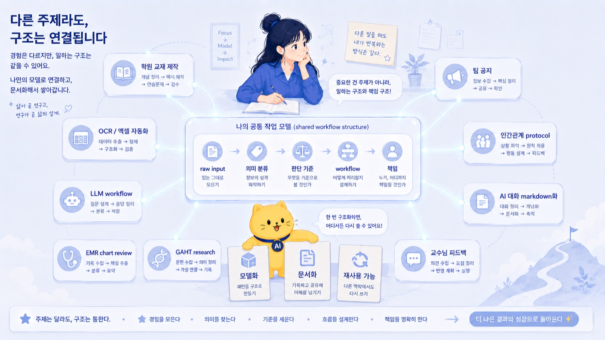
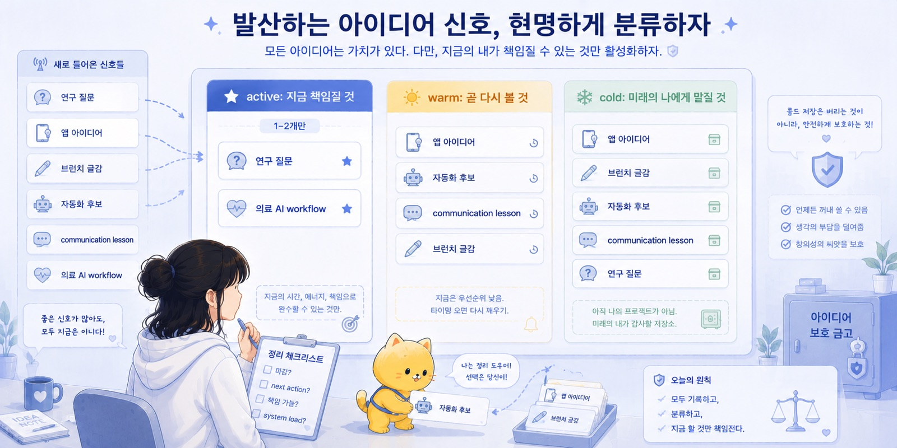
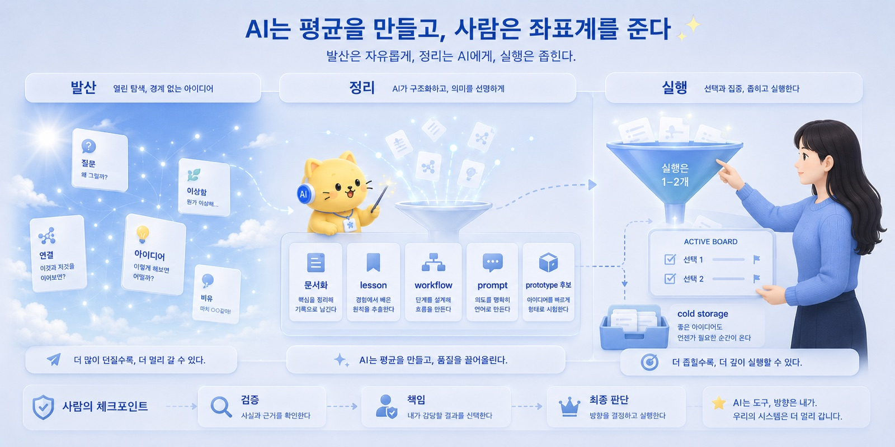
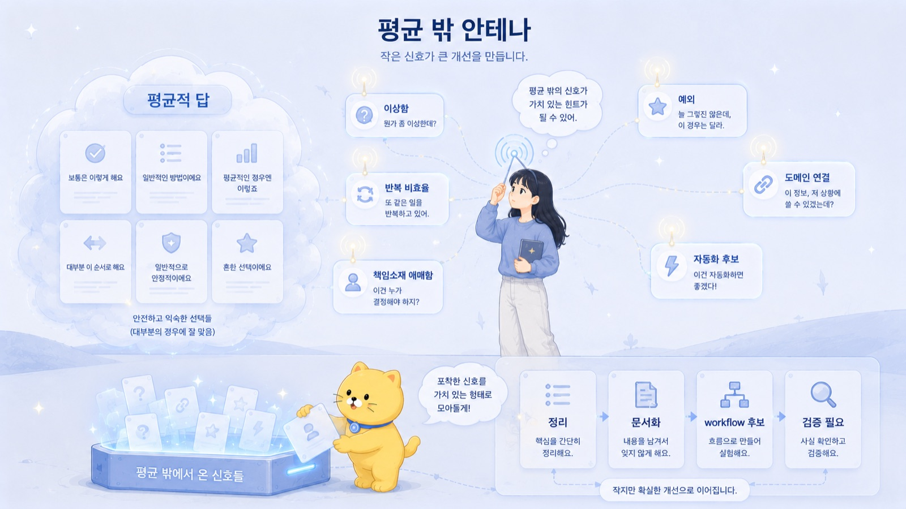

## 18. Neurodivergent 사고는 평균 밖의 안테나다

AI는 평균을 잘 만든다.

평균적인 이메일.
평균적인 보고서.
평균적인 요약.
평균적인 코드.
평균적인 발표자료.
평균적인 연구계획서 skeleton.
평균적인 블로그 글.
평균적인 문제 해결법.

이건 AI의 약점이 아니다.

오히려 엄청난 장점이다.

많은 작업에서 우리는 더 이상 빈 화면에서 시작하지 않아도 된다.
AI는 0에서 0.7까지 빠르게 밀어준다.
어색한 첫 문장을 열어주고,
흩어진 생각을 목차로 바꿔주고,
긴 문서를 요약하고,
초안과 후보와 skeleton을 만들어준다.

평균적인 산출물이 싸진다.

그런데 평균적인 산출물이 싸진다는 것은, 평균적인 산출물 자체의 희소성이 줄어든다는 뜻이기도 하다.

예전에는 평균 이상으로 괜찮은 보고서를 빠르게 쓰는 것만으로도 강점이었다.
평균 이상으로 이메일을 잘 쓰고,
평균 이상으로 자료를 정리하고,
평균 이상으로 발표자료를 만드는 것만으로도 일이 됐다.

이제는 그 능력의 일부를 AI가 빠르게 보완한다.

그러면 인간에게 남는 가치는 어디로 이동할까.

나는 그중 하나가 평균 밖의 질문이라고 생각한다.

무엇을 이상하다고 느끼는가.
어떤 문제를 볼 것인가.
어떤 도메인을 연결할 것인가.
무엇을 자동화할 가치가 있다고 판단할 것인가.
어떤 평균적 답이 내 상황과 맞지 않는다고 감지할 것인가.
어떤 결과에는 책임질 수 없다고 멈출 것인가.

AI가 평균을 싸게 만들수록, 평균 밖의 좌표계는 비싸진다.

\newpage

앞 글에서 human-in-the-loop는 장식이 아니라고 했다.

사람이 마지막에 대충 보는 절차가 아니라, 사람이 언제, 무엇을, 어떤 기준과 책임으로 개입하는지 정해둔 구조라고 했다.

그런데 좋은 human-in-the-loop에는 기준만 필요한 것이 아니다.

감각도 필요하다.

뭔가 이상하다는 감각.

너무 매끄러운데 이상하다는 감각.
형식은 맞는데 내용이 비어 있다는 감각.
평균적인 답이지만 내 상황과는 어긋난다는 감각.
AI가 놓친 예외가 있을 것 같다는 감각.
이 workflow는 원래 이렇게 하면 안 되는 것 같다는 감각.

AI는 평균적인 답을 잘 만든다.

그 평균에서 벗어난 신호를 감지하는 것은 사람의 몫이다.

그리고 어떤 사람들은 이 평균 밖의 신호에 유난히 민감하다.

나는 여기서 neurodivergent한 사고를 생각한다.

\newpage

Neurodiversity는 사람들의 신경인지적 차이를 인정하는 관점이다.

이 글에서 중요한 것은 진단명이 아니다.

중요한 것은 평균적인 사고방식과 다른 방식으로 세계를 감지하는 능력이다.

Neurodivergent한 사고는 종종 평균적인 사회 규칙이나 기본 workflow에 자동으로 동기화되지 않는다.

남들이 그냥 넘어가는 부분에서 걸린다.
반복되는 비효율을 견디기 어려워한다.
책임소재가 애매한 상황에 민감하다.
패턴의 불일치를 빨리 본다.
관심 있는 주제에 깊게 들어간다.
멀어 보이는 도메인 사이를 연결한다.
사회적 관습보다 구조적 일관성을 더 중요하게 느낀다.
남들이 당연하게 여기는 기본값을 당연하게 받아들이지 않는다.

기존 조직에서는 이것이 불편함으로 보일 수 있다.

왜 이렇게 예민하지?
왜 그냥 넘어가지 못하지?
왜 자꾸 구조를 따지지?
왜 남들처럼 대충 못 하지?
왜 갑자기 엉뚱한 연결을 하지?

이런 시선을 받을 수 있다.

실제로 피곤하기도 하다.

평균 밖의 안테나는 멋있게만 작동하지 않는다.
너무 많은 신호를 잡고,
필요 없는 모순까지 붙잡고,
남들은 신경 쓰지 않는 부분에서 에너지를 쓴다.

하지만 AI 시대에는 이 감각의 의미가 달라진다.

AI가 평균적 산출물을 싸게 만들수록, 평균 밖의 신호를 감지하는 능력은 더 중요해진다.

AI는 평균을 만든다.

사람은 좌표계를 준다.

평균 밖의 안테나는 그 좌표계를 만드는 출발점이 된다.

\newpage

대부분의 시스템은 평균적인 사람을 기준으로 설계된다.

학교, 병원, 조직, 행정, 회의, 문서, 평가 방식은 대체로 평균적인 인지 스타일에 맞춰져 있다.

많은 사람은 그 시스템에 자연스럽게 적응한다.

그냥 원래 그런가 보다 하고 지나간다.

하지만 neurodivergent한 사고는 그 기본값에 자동으로 동기화되지 않을 수 있다.

그래서 질문이 생긴다.

왜 이걸 사람이 손으로 하고 있지?

왜 이 정보가 세 번씩 중복 입력되지?

왜 책임은 없는데 영향력만 있는 사람이 있지?

왜 중요한 변수는 EMR에 있는데 연구에서는 못 쓰지?

왜 교수님께 보여주는 문서와 IRB 문서와 실제 분석계획이 따로 놀지?

왜 환자 설명은 매번 반복되는데 structured tool이 없지?

왜 공지는 항상 애매하게 써서 오해를 만들지?

왜 AI와 한 좋은 대화를 저장하지 않고 날려버리지?

왜 에러 로그를 사람이 처음부터 끝까지 읽고 있지?

왜 논문 PDF에서 매번 같은 정보를 사람이 직접 뽑고 있지?

이 질문들은 기존 조직에서는 피곤한 질문일 수 있다.

하지만 AI 시대의 builder 관점에서는 매우 중요한 질문이다.

왜냐하면 이런 질문이 workflow 개선과 자동화의 출발점이 되기 때문이다.

불편함은 그냥 짜증이 아닐 때가 있다.

불편함은 구조가 잘못되었다는 신호일 수 있다.

_Neurodivergent 사고는 평균 밖의 안테나다의 문제의식이 처음 모습을 드러내는 장면._

\newpage

이상함을 감지하는 능력은 자동화의 시작점이다.

사람이 같은 데이터를 계속 옮겨 적는다.

이상하다.

같은 공지를 매번 새로 쓴다.

이상하다.

교수님 피드백을 받고도 다음 version으로 구조화하지 않는다.

이상하다.

EMR에 있는 정보를 연구용 변수로 다시 손으로 정리한다.

이상하다.

AI와 대화해서 좋은 통찰을 얻고도 문서로 남기지 않는다.

이상하다.

코드 오류를 처음부터 끝까지 사람이 raw log로 읽는다.

이상하다.

논문 PDF에서 매번 연구 질문, endpoint, variable을 사람이 직접 뽑는다.

이상하다.

이런 이상함을 느끼는 사람이 있어야 workflow가 바뀐다.

많은 사람은 이것을 그냥 업무라고 부른다.

하지만 어떤 사람은 여기에 걸린다.

“이거 자동화할 수 있지 않나?”
“이거 구조가 잘못된 거 아닌가?”
“이걸 사람이 계속 해야 하나?”
“이걸 문서나 workflow로 바꾸면 되지 않나?”
“이 정보는 이미 다른 곳에 있는데 왜 다시 입력하지?”
“이거 사실 같은 문제 아닌가?”

AI는 사용자가 문제를 정의하면 도와준다.

하지만 무엇이 문제인지 감지하는 것은 사람의 몫이다.

AI에게 “이상한 것을 찾아줘”라고 말할 수는 있다.

하지만 애초에 어떤 세계를 이상하다고 느끼는지는 사용자의 감각에서 시작된다.

\newpage

Neurodivergent한 사고의 강점 중 하나는 멀어 보이는 도메인을 연결하는 능력이다.

겉으로 보기에는 서로 관련 없어 보이는 것들이 하나의 구조로 연결된다.

학원 교재 제작.
OCR과 엑셀 자동화.
LLM workflow.
EMR chart review.
GAHT research.
PK model.
교수님께 보내는 연구계획서.
팀 공지문.
인간관계에서의 방어 반응.
active package와 cold storage.
AI 대화의 markdown화.

평균적인 사고에서는 각각 따로 놀 수 있다.

학원 알바는 학원 알바다.
EMR은 EMR이다.
브런치북은 글쓰기다.
인간관계는 인간관계다.
AI는 AI다.
연구는 연구다.

하지만 구조를 보면 비슷한 패턴이 있다.

raw input이 있다.
의미 분류가 필요하다.
판단 기준이 필요하다.
사람이 반복 작업을 하고 있다.
AI가 1차 정리를 할 수 있다.
최종 책임은 사람이 져야 한다.
workflow로 만들면 재사용 가능하다.

그러면 서로 다른 경험들이 한 모델로 묶인다.

학원 교재 제작은 AI 업무 재배치 모델이 된다.
EMR chart review는 raw layer를 semantic layer로 올리는 문제가 된다.
인간관계 경험은 communication protocol이 된다.
교수님 피드백은 research plan revision workflow가 된다.
AI와의 긴 대화는 markdown 지식체계가 된다.
GAHT와 PK model은 EstroFrame이라는 연구 workflow가 된다.

이 연결은 자동으로 생기지 않는다.

하지만 한 번 연결되면 AI가 그것을 산출물로 바꿔준다.

AI는 평균 밖의 감지를 문서, 코드, protocol, workflow, prototype으로 바꾸는 증폭기가 된다.

\newpage

발산적 사고는 아이디어를 많이 만든다.

연결이 보이고,
비유가 떠오르고,
문제점이 보이고,
개선 가능성이 보이고,
새로운 앱 이름이 생기고,
연구 질문이 생기고,
문서 제목이 생기고,
workflow가 떠오른다.

AI가 없을 때 발산적 사고는 종종 부담이 된다.

아이디어는 많은데 산출물은 없다.
머릿속에서는 연결되는데 문서화되지 않는다.
무엇부터 해야 할지 모르겠다.
다 직접 실행하려면 에너지가 모자란다.
생각이 많아서 오히려 집중이 안 된다.

AI는 이 병목을 줄인다.

생각을 던지면 AI가 구조를 만든다.

아이디어는 문서 제목이 된다.
직관은 핵심 개념이 된다.
경험은 lesson이 된다.
반복 작업은 workflow가 된다.
workflow는 prompt가 된다.
prompt는 prototype이 된다.
연구 생각은 IRB skeleton이 된다.
EMR 문제는 variable extraction plan이 된다.
인간관계 경험은 communication protocol이 된다.

즉 발산적 사고가 AI와 만나면 prototype factory가 된다.

예전에는 아이디어 하나를 문서로 만드는 데도 에너지가 많이 들었다.

이제는 AI가 초안, 구조, 후보, 체크리스트, 코드 skeleton을 빠르게 만든다.

발산적 사고의 output bandwidth가 넓어진다.

좋은 일이다.

하지만 여기서 또 문제가 생긴다.

_작업의 흐름이 구체적인 구조로 바뀌는 순간._

\newpage

AI가 붙은 발산적 사고는 너무 빨라질 수 있다.

예전에는 실행 비용이 높아서 자연스럽게 걸러지던 아이디어가 있었다.

귀찮아서 못 했다.
문서 만들기 힘들어서 못 했다.
코드 짜기 어려워서 못 했다.
자료 정리할 시간이 없어서 못 했다.
초안을 만들기 버거워서 시작하지 않았다.

그런데 AI가 있으면 그 장벽이 낮아진다.

모든 아이디어가 그럴듯한 초안이 된다.
모든 프로젝트가 시작할 만해 보인다.
모든 앱이 만들 수 있을 것 같다.
모든 연구 질문이 IRB 초안으로 보인다.
모든 글감이 챕터가 될 것 같다.

이건 위험하다.

가능해 보이는 것이 늘어난다고, 내가 감당할 수 있는 것도 늘어나는 것은 아니다.

AI는 가능성의 비용을 낮춘다.

하지만 내 시간, 체력, 주의력, 책임 능력은 그대로다.

그래서 active package가 폭발한다.

프로젝트가 너무 많아지고,
문서는 많아지는데 실행은 좁혀지지 않고,
prototype은 늘어나는데 완성물은 적고,
정작 중요한 1~2개가 밀린다.

이건 neurodivergent 사고와 AI가 만날 때 반드시 관리해야 하는 리스크다.

평균 밖의 안테나는 좋다.

하지만 안테나가 모든 신호를 다 프로젝트로 만들면 시스템이 터진다.

\newpage

그래서 active package와 cold storage가 필요하다.

아이디어는 버리지 않아도 된다.

하지만 모든 아이디어를 지금 실행할 필요는 없다.

나는 아이디어를 세 층위로 나누는 것이 좋다고 생각한다.

Active Package.

지금 실제로 밀고 있는 프로젝트다.

마감이나 기회가 있고,
현실적 산출물이 있고,
다음 action이 명확하고,
다른 사람과 연결되어 있고,
내가 책임지고 끌고 갈 수 있는 것.

Active package는 적어야 한다.

1~2개가 적당하다.

많아지면 시스템 load가 올라간다.

Warm Storage.

지금 당장 실행하지는 않지만 가까운 시기에 다시 볼 수 있는 아이디어다.

중요하지만 아직 자료가 부족하거나,
타이밍을 기다려야 하거나,
조금 더 확인하면 active로 올라올 수 있는 것.

Cold Storage.

좋지만 지금은 실행하지 않을 아이디어다.

흥미롭고,
언젠가 쓸 수 있고,
미래의 나에게 맡겨둘 수 있지만,
지금 active로 올리면 부담이 되는 것.

Cold storage는 포기가 아니다.

지금의 나를 지키기 위해, 미래의 나에게 아이디어를 맡겨두는 방식이다.

AI 시대에는 cold storage가 특히 중요하다.

AI가 모든 아이디어를 산출물처럼 보이게 만들기 때문이다.

\newpage

Neurodivergent 사고는 강점이 될 수 있다.

하지만 강점은 관리될 때 강점이 된다.

첫 번째 강점은 패턴 감지다.

반복되는 구조를 빨리 본다.

이 업무는 매번 같은 입력과 출력을 가진다.
이 갈등은 매번 책임소재가 흐릴 때 생긴다.
이 연구 아이디어는 data source가 약할 때 흔들린다.
이 문서들은 사실 같은 template으로 만들 수 있다.

두 번째 강점은 이상 감지다.

왜 이 정보를 사람이 계속 옮겨 적지?
왜 이 note는 구조화되어 있지 않지?
왜 이 의사결정은 책임자가 없지?
왜 이 연구는 endpoint보다 비전만 커지고 있지?

세 번째 강점은 깊은 집중이다.

관심 있는 주제에 깊게 들어간다.

GAHT와 PK model.
EMR 구조화.
AI workflow.
markdown 지식체계.
인간관계 protocol.
의료 AI builder 방향.

네 번째 강점은 도메인 간 연결이다.

학원 교재 제작 workflow와 AI 업무 재배치.
EMR chart review와 raw layer 문제.
인간관계 경험과 communication protocol.
연구 피드백과 feasibility checklist.
AI 대화와 lessons.md.

다섯 번째 강점은 기본값에 대한 저항이다.

“원래 이렇게 해왔으니까”라는 말에 자동으로 설득되지 않는다.

조직에서는 불편하게 보일 수 있다.

하지만 workflow builder에게는 강점이다.

\newpage

그런데 리스크도 있다.

neurodiversity를 낭만화하면 안 된다.

평균 밖의 사고는 자동으로 천재성이 되지 않는다.

과도한 발산은 실제 문제다.

아이디어가 너무 많아질 수 있다.
AI가 모든 아이디어를 그럴듯하게 만들어주면 더 위험하다.

관리 원칙이 필요하다.

active package는 1~2개로 줄인다.
나머지는 warm/cold storage로 보낸다.
주기적으로 review한다.

과잉 구조화도 문제다.

모든 경험을 모델로 만들고 싶어진다.

하지만 모든 경험이 문서나 시스템이 될 필요는 없다.

반복되는 것만 구조화한다.
다음 행동을 바꾸는 것만 lessons.md에 넣는다.
단순 감정 배출은 굳이 시스템화하지 않아도 된다.

실행보다 설계가 많아지는 것도 위험하다.

AI는 문서와 구조를 빠르게 만든다.

하지만 구조를 만드는 것과 실행하는 것은 다르다.

문서마다 next action이 있는지 확인해야 한다.
active 문서는 실제 행동과 연결되어야 한다.
산출물 없는 구조화는 cold storage로 보내야 한다.

평균적 사회와의 충돌도 있다.

평균 밖의 질문은 가치 있지만, 모든 상황에서 환영받지는 않는다.

조직에서는 타이밍, 표현, 권한, 책임소재가 중요하다.

문제를 바로 지적하기보다 정보 공유와 질문 형태로 낮춰 말해야 할 때가 있다.
상대의 책임과 선택권을 분리해야 할 때가 있다.
실무적으로 당장 도움이 되는 제안으로 줄여야 할 때가 있다.

자기 확신의 과잉도 조심해야 한다.

패턴이 보인다고 항상 맞는 것은 아니다.

AI가 그럴듯하게 정리해주면 확신이 더 커질 수 있다.

그러니까 pattern은 hypothesis로 둬야 한다.

실제 데이터와 반응으로 검증해야 한다.

예외 조건을 남겨야 한다.

과잉 일반화를 경계해야 한다.

_사람의 판단과 AI의 실행이 나뉘는 지점을 보여주는 장면._

\newpage

Neurodivergent 사고와 AI가 잘 결합하려면 역할 분담이 필요하다.

사람은 이상함을 감지한다.
질문을 던진다.
도메인을 연결한다.
문제의 좌표계를 설정한다.
중요도를 판단한다.
active와 cold를 나눈다.
최종 책임을 진다.

AI는 생각을 정리한다.
문서화한다.
후보를 만든다.
표를 만든다.
workflow로 바꾼다.
prompt로 바꾼다.
prototype 초안을 만든다.
코드 skeleton을 만든다.
자료를 요약한다.
개념 간 연결을 정리한다.

도구는 실행한다.

OCR.
API.
CLI.
script.
database.
automation.
document generator.
validator.

좋은 결합은 이런 흐름이다.

neurodivergent antenna
→ AI structuring
→ tool execution
→ human judgment
→ reusable workflow.

이 구조가 작동하면 발산적 사고는 산만함으로만 남지 않는다.

생산 시스템이 된다.

\newpage

AI가 평균적 답을 싸게 만들면, 평균적 답 자체의 가치는 줄어든다.

누구나 무난한 이메일을 만들 수 있다.
누구나 무난한 보고서를 만들 수 있다.
누구나 무난한 발표자료를 만들 수 있다.
누구나 무난한 코드 초안을 만들 수 있다.
누구나 무난한 연구계획서 skeleton을 만들 수 있다.

그러면 차이는 어디서 나는가.

차이는 질문에서 난다.

어떤 문제를 보고 있는가.
어떤 workflow를 이상하다고 느끼는가.
어떤 데이터를 연결하는가.
어떤 도메인을 합치는가.
어떤 목적함수를 주는가.
어떤 예외를 감지하는가.
어떤 산출물을 만들 가치가 있다고 보는가.

좋은 질문은 단순히 멋진 질문이 아니다.

좋은 질문은 workflow로 이어진다.

“AI로 의료를 혁신할 수 있을까?”는 너무 크다.

“EMR note에서 GAHT 처방 route, dose, interval, lab timing을 구조화해 estradiol prediction error 분석에 쓸 수 있을까?”는 workflow가 된다.

“AI로 공부를 잘할 수 있을까?”는 흐릿하다.

“문제집 PDF를 OCR해 문항 DB로 만들고, 개념·유형·난이도 태그를 붙여 개인별 오답 문제 세트를 만들 수 있을까?”는 실행 가능한 질문이 된다.

AI가 잘하는 것은 평균적 답이다.

사람이 해야 하는 것은 좌표계를 주는 것이다.

그리고 평균 밖의 질문은 그 좌표계를 바꾼다.

\newpage

이 주제가 나에게 중요한 이유도 여기에 있다.

나는 경험을 그냥 넘기지 못하는 편이다.

사람과의 갈등도 그냥 기분 나쁜 일로만 남지 않는다.

왜 방어 반응이 생겼는지,
책임소재가 어디서 흐려졌는지,
어떤 표현이 상대의 자율성을 건드렸는지,
다음에는 어떤 구조로 말해야 하는지 생각하게 된다.

연구 아이디어도 그냥 흥미로운 생각으로 끝나지 않는다.

endpoint가 무엇인지,
data source가 있는지,
feasibility가 어떤지,
IRB 문서로 바꾸면 어떤 구조가 필요한지 보게 된다.

EMR도 그냥 병원 기록으로만 보이지 않는다.

어떤 정보가 비정형 상태로 묻혀 있는지,
무엇을 structured variable로 만들 수 있는지,
어떤 부분이 chart review의 병목인지 보인다.

AI와의 대화도 그냥 수다로 끝나지 않는다.

이걸 markdown으로 남겨야 하는지,
lesson으로 바꿀 수 있는지,
workflow로 만들 수 있는지,
active package로 올릴지 cold storage로 보낼지 생각하게 된다.

이것은 때로 피곤하다.

하지만 AI 시대에는 이 피곤함이 자산이 될 수 있다.

AI가 정리를 도와주기 때문이다.

예전에는 이런 감각을 혼자 다 처리해야 했다.

이제는 AI에게 던질 수 있다.

“이 경험을 lesson으로 바꿔줘.”
“이 아이디어를 research question, variable, feasibility로 나눠줘.”
“이 불편함이 자동화 가능한 문제인지 봐줘.”
“이 대화를 문서화할 가치가 있는지 판단해줘.”
“이 프로젝트를 active, warm, cold로 나눠줘.”

AI는 내 평균 밖의 감지를 실제 산출물로 바꾸는 외부 cortex가 된다.

답을 주는 도구라기보다, 감지를 구조화하는 장치다.

_Neurodivergent 사고는 평균 밖의 안테나다의 결론을 이미지로 정리한 장면._

\newpage

의료 AI builder에게도 이 감각은 중요하다.

의료 현장은 비정형 정보와 반복 업무가 많다.

EMR note.
lab trend.
medication history.
problem list.
referral note.
discharge summary.
chart review.
IRB document.
patient education.
research variable extraction.

대부분의 사람은 이것을 그냥 의료 업무라고 받아들인다.

하지만 workflow builder는 다르게 본다.

이 note에서 problem list 후보를 자동 추출할 수 있지 않나?
medication history를 structured variable로 만들 수 있지 않나?
lab trend를 한눈에 요약할 수 있지 않나?
GAHT 처방 기록을 pharmacokinetic model input으로 바꿀 수 있지 않나?
chart review를 연구 dataset 생성 workflow로 만들 수 있지 않나?
환자 설명을 template과 AI 초안으로 보조할 수 있지 않나?

이 질문은 평균적 의학 지식만으로 나오지 않는다.

의학 지식, 시스템 감각, 자동화 감각, 비정형 정보에 대한 불편함이 결합해야 나온다.

이 지점에서 neurodivergent antenna와 AI workflow builder의 결합이 강해진다.

의료 AI builder는 모델 숭배자가 아니다.

의료 현장의 이상한 정보 흐름을 감지하고,
AI와 tool로 구조화할 수 있는 부분을 찾고,
환자 안전과 개인정보가 걸린 곳에는 사람을 남기는 사람이다.

\newpage

평균 밖의 안테나는 그냥 켜두면 피곤하다.

그래서 운영법이 필요하다.

첫째, 신호를 바로 실행하지 않는다.

이상한 점을 감지했다고 바로 프로젝트로 만들지 않는다.

먼저 기록한다.

아이디어.
문제 감지.
도메인 연결.
자동화 후보.
연구 질문 후보.

그다음 active, warm, cold로 나눈다.

둘째, AI에게 구조화시킨다.

이 아이디어를 problem, input, output, workflow, risk로 나눠줘.
이 불편함이 자동화 가능한 문제인지 분석해줘.
이 연구 아이디어를 data source, endpoint, feasibility로 평가해줘.
이 경험을 lesson, rule, prompt로 정리해줘.

셋째, 실행 후보를 좁힌다.

지금 할 이유가 있는가.
마감이나 기회가 있는가.
실제 산출물이 있는가.
내가 책임질 수 있는가.
다른 active package를 밀어내도 되는가.

넷째, 주기적으로 review한다.

이번 주 새로 생긴 아이디어.
active package 상태.
cold storage로 보낼 것.
다음 action이 있는 것.
삭제해도 되는 것.
문서화할 lesson.
prompt나 workflow로 만들 것.

다섯째, 몸과 에너지 상태를 반영한다.

좋은 아이디어라도 에너지가 없으면 실행할 수 없다.

지금 피곤한가.
수면은 충분한가.
감정 load가 높은가.
실습, 시험, 연구 일정이 있는가.
active package가 이미 많은가.

AI 시대에는 아이디어의 feasibility뿐 아니라 나의 system load도 봐야 한다.

지속 가능한 workflow가 중요하다.

\newpage

Neurodiversity를 낭만화하고 싶지는 않다.

평균 밖의 사고는 강점이 될 수 있지만, 자동으로 성과가 되지는 않는다.

생각이 많기만 하면 산만함이 된다.

연결이 많기만 하면 과잉 해석이 된다.

구조를 많이 만들기만 하면 실행이 밀린다.

이상함을 많이 감지한다고 해서 항상 맞는 것도 아니다.

때로는 내가 예민한 것일 수 있다.
때로는 조직의 사정이 있을 수 있다.
때로는 자동화 비용이 이득보다 클 수 있다.
때로는 지금은 말할 타이밍이 아닐 수 있다.
때로는 좋은 아이디어지만 내가 할 일이 아닐 수 있다.

그래서 필요한 것은 운영이다.

발산은 자유롭게 한다.

정리는 AI에게 맡긴다.

실행은 좁힌다.

검증은 사람이 한다.

책임은 사람이 진다.

이 원칙이 없으면 neurodivergent antenna는 삶을 구하는 도구가 아니라, 삶을 과부하시키는 장치가 될 수 있다.

\newpage

AI 시대에 살아남는 사람은 단순히 가장 많이 아는 사람이 아닐 것이다.

AI가 지식을 빠르게 보완하기 때문이다.

그렇다고 인간에게 남는 것이 아무것도 없다는 뜻은 아니다.

오히려 질문이 중요해진다.

무엇을 이상하다고 느끼는가.

어떤 평균적 답을 부족하다고 보는가.

어떤 도메인을 연결하는가.

어떤 문제의 좌표계를 다시 그리는가.

무엇을 자동화하고, 무엇을 자동화하지 않을 것인가.

어떤 결과에 책임질 것인가.

AI는 평균적 산출물을 싸게 만든다.

그래서 평균 밖의 질문과 감지가 더 비싸진다.

Neurodivergent 사고는 평균 밖의 신호를 감지하는 안테나다.

LLM은 그 신호를 문서, 코드, protocol, workflow, prototype으로 바꾸는 증폭기다.

하지만 발산적 사고는 관리되어야 한다.

발산은 자유롭게 한다.
정리는 AI에게 맡긴다.
실행은 1~2개로 좁힌다.
나머지는 cold storage에 둔다.
검증과 책임은 사람이 맡는다.

AI는 평균을 만든다.

사람은 좌표계를 준다.

그리고 때로는, 평균에 잘 맞지 않는 사람이 새로운 좌표계를 더 빨리 본다.
