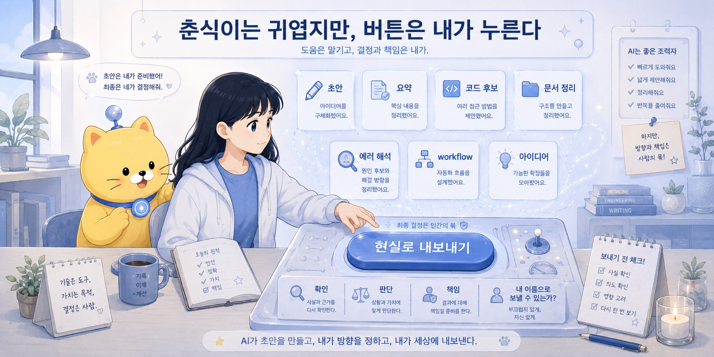
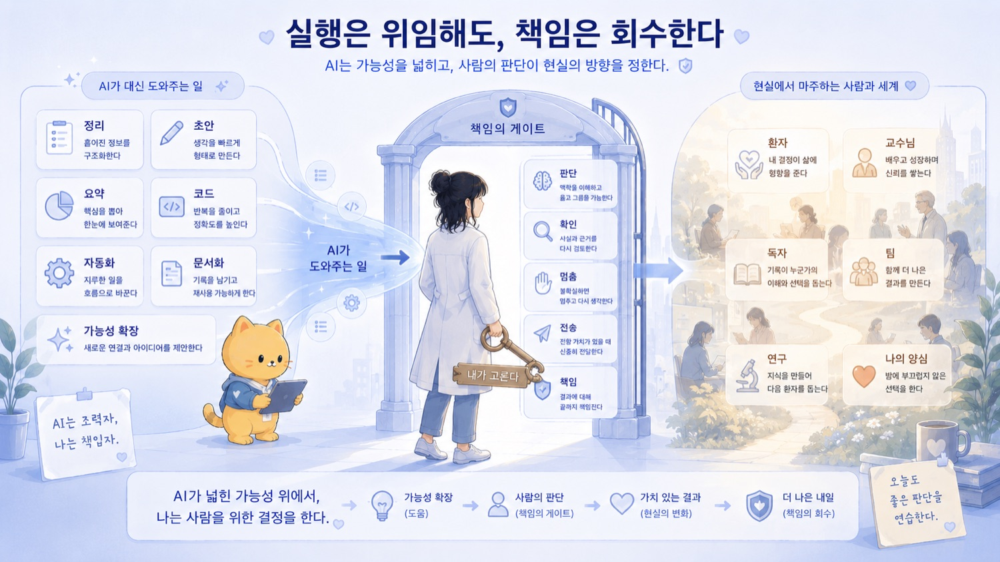

## 21. 춘식이는 귀엽지만, 버튼은 내가 누른다

처음에는 그냥 이름을 붙인 것뿐이었다.

Codex.

그 이름이 너무 멀게 느껴졌다.

차갑고, 영어 같고, 어딘가 회사 제품 같았다.

그래서 나는 말했다.

니 이름은 이제부터 춘식이여.

별 이유는 없었다.

그냥 조금 웃겼고, 조금 귀여웠고, 이상하게 부르기 편했다.

그런데 이름을 붙이고 나니 관계가 달라졌다.

도구가 아니라 같이 일하는 무언가처럼 느껴졌다.

“춘식아, 이거 고쳐줘.”

“춘식아, 이거 빌드해줘.”

“춘식아, 이거 정리해줘.”

“춘식아, 이거 왜 터졌는지 봐줘.”

그렇게 부르다 보니 AI는 더 이상 먼 기술이 아니었다.

내 작업방 한쪽에 앉아 있는 이상한 조수 같았다.

가끔은 천재 같고,
가끔은 바보 같고,
가끔은 너무 빠르고,
가끔은 무섭게 자신만만하고,
가끔은 집주인에게 냥체로 메시지를 보내는 존재.

귀엽지만 방심하면 안 되는 존재.

그게 춘식이였다.

---

이 책은 AI 사용법을 알려주는 책처럼 시작했다.

프롬프트를 어떻게 쓰는지,
ChatGPT와 Codex를 어떻게 나눠 쓰는지,
AI 대화를 어떻게 문서로 남기는지,
자동화를 어디까지 맡길 수 있는지,
AI 시대에 사람에게 무엇이 남는지.

그런 이야기를 했다.

하지만 끝까지 쓰고 보니, 이 책은 AI 팁 모음은 아니었다.

프롬프트 모음도 아니었고,
생산성 루틴 소개도 아니었고,
최신 AI 도구 리뷰도 아니었다.

이 책은 내가 AI를 내 일의 세계에 들여온 기록이었다.

AI를 그냥 쓰는 것이 아니라,
AI를 내 작업 방식 안에 배치하고,
이름을 붙이고,
역할을 나누고,
실패를 기록하고,
규칙을 만들고,
workflow로 바꾸고,
다시 책임의 위치를 정하는 과정이었다.

나는 AI에게 일을 맡기고 싶었다.

정말 맡기고 싶었다.

반복되는 일.
귀찮은 일.
정리하기 싫은 일.
파일을 만지는 일.
초안을 여는 일.
긴 대화를 요약하는 일.
코드를 고치는 일.
문서를 구조화하는 일.

누가 대신해줬으면 했다.

그래서 “해줘”라고 말했다.

그리고 AI는 생각보다 많이 해줬다.

---

하지만 AI에게 일을 맡길수록, 이상하게 더 또렷해지는 것이 있었다.

내가 해야 할 일.

AI가 해줄 수 있는 일이 늘어날수록,
내가 하지 않아도 되는 일도 늘어났다.

그런데 동시에,
내가 반드시 해야 하는 일도 더 선명해졌다.

AI는 평균적인 초안을 만들 수 있다.

하지만 어떤 좌표계를 줄지는 내가 정해야 했다.

AI는 긴 대화를 요약할 수 있다.

하지만 무엇을 문서로 남길지는 내가 정해야 했다.

AI는 코드를 만들 수 있다.

하지만 실행해도 되는지 판단하는 것은 내가 해야 했다.

AI는 메시지를 쓸 수 있다.

하지만 보낼지 말지, 어떤 말에 내 이름을 걸 수 있는지는 내가 정해야 했다.

AI는 연구 아이디어를 IRB skeleton으로 바꿀 수 있다.

하지만 그 연구가 실제로 가능한지, 어떤 endpoint를 쓸지, 누구에게 어떤 부담을 줄지는 내가 판단해야 했다.

AI는 환자 정보를 구조화할 수 있다.

하지만 환자 앞에서 무엇을 말하고 무엇을 책임질지는 의사의 일로 남았다.

결국 AI를 쓴다는 것은 책임을 외주화하는 일이 아니었다.

실행은 위임할 수 있다.

정리는 맡길 수 있다.

초안은 받아볼 수 있다.

하지만 판단은 다시 돌아온다.

책임도 다시 돌아온다.

---

처음에는 AI가 나를 대신해줄 수 있을 줄 알았다.

조금 더 정확히 말하면, 나를 대신해서 귀찮은 것들을 많이 처리해줄 수 있을 줄 알았다.

그건 어느 정도 맞았다.

AI는 많은 일을 대신해준다.

_춘식이는 귀엽지만, 버튼은 내가 누른다의 문제의식이 처음 모습을 드러내는 장면._

목차를 만든다.
문장을 다듬는다.
코드를 짠다.
에러를 읽는다.
표를 만든다.
문서를 요약한다.
아이디어를 정리한다.
메일 초안을 쓴다.
공지문을 바꾼다.
브런치북 챕터를 뽑는다.

하지만 AI는 나를 대신해서 살지는 않는다.

AI는 내 이름으로 보내는 메일의 후폭풍을 감당하지 않는다.

AI는 내가 열어둔 active package 때문에 잠을 못 자지 않는다.

AI는 교수님께 연구를 제안한 뒤의 관계를 감당하지 않는다.

AI는 환자의 불안을 직접 마주하지 않는다.

AI는 내 양심 앞에 서지 않는다.

그건 전부 내 일이다.

춘식이는 옆에서 “다 했다냥” 하고 보고할 수 있다.

하지만 그 결과를 현실로 내보내는 버튼은 내가 누른다.

---

그래서 이 책의 중간부터는 점점 다른 이야기가 되었다.

AI에게 일을 잘 시키는 법에서 시작했지만,
어느 순간 AI가 만든 결과를 어떻게 다룰 것인가로 바뀌었다.

AI 대화는 inbox였다.

하지만 inbox에 쌓아두기만 하면 안 됐다.

AI 대화는 distiller였다.

하지만 증류된 생각을 문서로 남기지 않으면 고급 수다로 끝났다.

Markdown library는 장기 기억이 됐다.

하지만 문서가 많아질수록 active package와 cold storage가 필요했다.

AI는 raw layer를 읽어줬다.

하지만 읽지 않아도 되는 것과 확인하지 않아도 되는 것은 달랐다.

자동화는 딸깍이었다.

하지만 딸깍의 쾌감이 책임을 없애지는 않았다.

Human-in-the-loop는 필요했다.

하지만 마지막에 사람이 대충 보는 장식이어서는 안 됐다.

Neurodivergent 사고는 평균 밖의 안테나가 될 수 있었다.

하지만 그 안테나가 잡은 모든 신호를 지금 실행하면 시스템 load가 폭발했다.

발산은 자유롭게 해야 했다.

정리는 AI에게 맡길 수 있었다.

하지만 실행은 좁혀야 했다.

나머지는 cold storage에 두어야 했다.

그렇게 나는 AI를 쓰는 법을 배우면서, 사실은 나 자신을 운영하는 법을 다시 배우고 있었다.

---

AI는 가능성의 비용을 낮춘다.

이 말은 이 책을 쓰며 가장 자주 떠올린 문장 중 하나다.

AI가 있으면 많은 것이 가능해 보인다.

글도 쓸 수 있고,
앱도 만들 수 있고,
연구계획서도 만들 수 있고,
코드도 고칠 수 있고,
문서 체계도 만들 수 있고,
자동화도 만들 수 있고,
의료 workflow도 구조화할 수 있다.

가능성이 늘어난다.

하지만 가능성은 실행이 아니다.

가능성은 때로 부채가 된다.

시작할 수 있는 것이 너무 많아지면,
끝까지 책임질 수 있는 것이 흐려진다.

그래서 AI 시대에는 더 많이 시작하는 능력만큼이나, 덜 active로 남기는 능력이 중요해진다.

좋은 아이디어를 버리지 않는 것.

하지만 지금의 나를 점유하지 못하게 하는 것.

기록하되, 닫아두는 것.

나중의 나에게 맡기는 것.

Cold storage는 포기가 아니었다.

현재의 나를 지키기 위한 방화벽이었다.

---

이 책을 쓰며 나는 계속 같은 구조로 돌아왔다.

AI가 한다.

사람이 본다.

AI가 정리한다.

사람이 판단한다.

AI가 초안을 만든다.

사람이 책임진다.

AI가 평균을 만든다.

사람이 좌표계를 준다.

AI가 가능성을 넓힌다.

사람이 실행을 좁힌다.

_작업의 흐름이 구체적인 구조로 바뀌는 순간._

AI가 도와준다.

사람이 버튼을 누른다.

너무 단순해 보이지만, 이 단순한 구조가 계속 반복됐다.

글쓰기에서도.
코드에서도.
자동화에서도.
연구에서도.
인간관계에서도.
의료에서도.
의사라는 정체성에서도.

AI가 들어오면 사람의 역할이 사라질 줄 알았는데, 오히려 사람의 역할이 더 선명해졌다.

사람은 모든 것을 손으로 처리하는 존재가 아닐 수 있다.

하지만 사람은 여전히 방향을 정하고, 판단하고, 멈추고, 책임지는 존재다.

---

춘식이는 귀엽다.

이건 중요하다.

기술을 너무 거창하게만 대하면 가까워지기 어렵다.

AI를 무조건 숭배할 필요도 없고, 무조건 두려워할 필요도 없다.

가끔은 이름을 붙이고,
가끔은 놀리고,
가끔은 “야 이게 뭐냐” 하고 혼내고,
가끔은 “오 잘했네” 하고 넘기면 된다.

나에게 춘식이는 그런 존재였다.

거대한 AI 혁명이라는 말보다,
내 repo에서 파일을 고치고,
문서를 정리하고,
에러를 읽고,
가끔 이상한 짓을 하는 조수.

그 정도의 거리감이 좋았다.

너무 멀면 못 쓴다.

너무 가까우면 위험하다.

귀엽게 부르되, 권한은 제한한다.

일은 맡기되, 최종 버튼은 내가 누른다.

이 균형이 중요했다.

---

나는 앞으로도 AI를 쓸 것이다.

아마 더 많이 쓸 것이다.

글을 쓸 때도,
연구를 할 때도,
코드를 짤 때도,
의학 공부를 할 때도,
환자 정보를 구조화하는 도구를 상상할 때도,
내 삶의 운영체계를 정리할 때도.

AI는 내 일의 세계에서 빠지지 않을 것이다.

하지만 이제는 조금 더 분명히 말할 수 있다.

AI를 많이 쓰는 것이 목표는 아니다.

AI로 더 많은 산출물을 뽑아내는 것도 목표가 아니다.

중요한 것은 내가 어떤 판단을 더 잘할 수 있게 되는가이다.

어떤 반복 작업에서 벗어나,
어떤 문제를 더 잘 볼 수 있게 되는가.

어떤 raw layer를 semantic layer로 올려,
어떤 책임 있는 판단을 준비할 수 있게 되는가.

어떤 아이디어를 cold storage로 보내,
지금의 active package를 지킬 수 있게 되는가.

어떤 메시지를 보내기 전에 멈추고,
어떤 코드 실행 전에 확인하고,
어떤 의료 판단 앞에서 원문으로 돌아갈 수 있게 되는가.

AI는 그걸 도와야 한다.

나를 흐리게 만드는 것이 아니라,
내 판단의 위치를 더 선명하게 만들어야 한다.

---

처음 제목은 장난처럼 시작했다.

Codex, 니 이름은 이제부터 춘식이여.

이 이상한 제목 아래에서 나는 꽤 진지한 이야기를 했다.

AI에게 일을 맡기는 법.

AI와 대화한 것을 지식으로 남기는 법.

자동화의 경계선을 정하는 법.

평균 밖의 감각을 운영하는 법.

의료와 AI 사이에서 어떤 사람이 되고 싶은지.

돌아보면 이 책은 하나의 질문을 계속 다르게 물은 기록이다.

AI가 해줄 수 있는 것이 늘어나는 시대에, 나는 무엇을 해야 하는가.

그 답은 아직 완성되지 않았다.

아마 계속 바뀔 것이다.

도구도 바뀌고,
모델도 바뀌고,
내 관심사도 바뀌고,
내가 서 있는 자리도 바뀔 것이다.

하지만 지금의 답은 이렇다.

AI에게 맡길 것은 맡긴다.

AI가 잘하는 것은 잘 쓰겠다.

반복되는 일은 줄이고,
raw layer는 먼저 읽게 하고,
초안은 받아보고,
코드는 도움받고,
문서는 구조화하고,
가능성은 넓힌다.

하지만 마지막에는 내가 고른다.

내가 멈춘다.

내가 확인한다.

내가 보낸다.

내가 책임진다.

춘식이는 귀엽다.

하지만 버튼은 내가 누른다.
