{width=100%}

\newpage

# 저자 소개

## 지송

지송은 의학과 공학 사이에서 임상 현장의 불확실한 문제를 구조화하고, 모델 기반 의료 도구와 개인 AI 워크플로우로 번역하는 사람이다.

건국대학교 의학전문대학원에서 의학을 공부하고 있으며, 고려대학교 건축사회환경공학부를 졸업했다. 의료를 단순히 암기할 대상이 아니라 데이터, 구조, 모델, 책임이 만나는 시스템으로 이해하려고 한다.

주요 관심사는 임상 의사결정 보조 시스템, 약동학 및 위험도 모델링, 내분비 AI 프로토타입, 의무기록 텍스트 구조화, 개인 지식관리와 AI 운영체계다. DiaFrame, EstroFrame, AndroFrame, NeuroFrame, CleanText, CleanEMR 같은 연구·교육용 프로토타입을 만들며, 실제 의료 워크플로우 안에서 사람이 어디서 판단하고 AI가 어디서 실행을 도울 수 있는지 탐색한다.

브런치와 GitHub, jisong.dev에 글과 프로젝트 기록을 남긴다. 이 책에 등장하는 의료 관련 도구들은 실제 진단이나 처방을 대체하기 위한 의료기기가 아니라, 의료 데이터를 구조화하고 모델링 사고를 설명하기 위한 개인 프로젝트 및 연구용 프로토타입이다.

웹: jisong.dev  ·  GitHub: github.com/jsbang01357  ·  Brunch: brunch.co.kr/@jsbang

\newpage

# 목차

## 프롤로그

- 1. 침대에 누워 딸깍, “해줘”라고 말하고 싶었다

## Part 1. 춘식이를 온보딩하다

- 2. Codex, 니 이름은 이제부터 춘식이여

## Part 2. AI에게 일을 시키는 법

- 3. AI에게 일을 맡긴다는 건, 좋은 상사가 되는 일이다
- 4. 프롬프트는 주문이 아니라 업무 명세서다
- 5. AI는 평균적 작업자다
- 6. ChatGPT는 편집장, Codex는 시공팀
- 7. 긴 작업은 프롬프트보다 파이프라인이 먼저다

## Part 3. 개인 AI 운영체계

- 8. AI 대화는 Inbox다
- 9. AI 대화는 Distiller다
- 10. Markdown으로 남기지 않으면 고급 수다로 끝난다
- 11. lessons.md: 경험을 재사용 가능한 원칙으로 바꾸기
- 12. Active Package와 Cold Storage

## Part 4. 업무를 재배치하다

- 13. 나는 OCR을 했고, 왕조교는 분류했고, 원장은 판단했다
- 14. LLM은 왕이 아니라 Adapter다
- 15. Raw Layer를 읽지 않는 시대

## Part 5. 자동화의 경계선

- 16. 자동화의 핵심은 자동화하지 않을 것을 정하는 일이다
- 17. Human-in-the-loop는 장식이 아니다

## Part 6. 평균 밖의 인간

- 18. Neurodivergent 사고는 평균 밖의 안테나다
- 19. 발산은 AI에게, 실행은 좁힌다
- 20. AI 시대의 의사: 판단보다 책임이 남는다

## 에필로그

- 21. 춘식이는 귀엽지만, 버튼은 내가 누른다

\newpage

# 프롤로그

\newpage

## 1. 침대에 누워 딸깍, “해줘”라고 말하고 싶었다

밤 10시였다.

나는 침대에 누워 있었다.
책상 앞에 앉아 각 잡고 작업하는 시간은 아니었다.
커피를 내려놓고, 작업곡을 틀고, “자 이제 해보자” 하고 마음을 먹은 상태도 아니었다.

맥미니 M4 16GB에는 Codex가 로그인되어 있었다.
ChatGPT 앱에서 Codex를 조종할 수 있게 해둔 상태였다.

나는 침대에 누워 웹툰을 보고 있었다.

그리고 가끔씩 Codex에게 일을 던졌다.

“이 부분 수정해줘.”
“PDF 다시 빌드해줘.”
“이미지 경로 확인해줘.”
“본문에 삽화 넣어줘.”
“캡션 정리해줘.”

그리고 다시 웹툰을 봤다.

잠시 뒤 알림이 떴다.

언니 작업 다 했다냥.
PDF 만들어 놨다.

순간 웃음이 나왔다.

이게 맞나?

너무 날먹하는 거 아닌가?

나는 침대에 누워 있고, AI는 책을 빌드하고 있었다.
나는 웹툰을 보고 있었고, 어딘가의 맥미니에서는 파일이 열리고, 코드가 돌고, PDF가 만들어지고 있었다.

그 장면이 조금 어이없었다.

웃기기도 했고, 편하기도 했고, 약간 죄책감도 들었다.
내가 너무 편하게 가는 건가 싶었다.

그런데 동시에 이런 생각도 들었다.

아니, 이걸 사람이 왜 계속 붙잡고 있어야 하지?

---

나는 비효율을 싫어한다.

정확히 말하면, 사람이 굳이 머리를 써야 하지 않는 일에 머리를 쓰는 상황을 싫어한다.

물론 모든 귀찮은 일이 나쁜 것은 아니다.
반복 속에서 감각이 생기는 일도 있고, 직접 손으로 만져봐야 구조가 보이는 일도 있다.

하지만 어떤 일들은 정말로 이상하다.

_침대에 누워 딸깍, “해줘”라고 말하고 싶었다의 문제의식이 처음 모습을 드러내는 장면._

예를 들어 책을 만든다고 해보자.

책을 쓰는 일에는 분명 창작이 있다.
무슨 이야기를 할지 정하고, 어떤 순서로 배치할지 고민하고, 문장의 톤을 고르고, 독자가 어디서 막힐지 생각하는 일. 이런 건 사람이 해야 한다.

그런데 책을 만드는 작업에는 창작과 별 상관없는 노동도 엄청나게 많다.

문단 간격 맞추기.
이미지 경로 확인하기.
파일명 정리하기.
삽화 캡션 통일하기.
페이지 나눔 확인하기.
PDF 다시 뽑기.
조판이 깨진 부분 찾기.
수정하고 다시 확인하기.
또 수정하고 다시 확인하기.

이런 일들은 중요하지 않은 것은 아니다.
중요하다.

문제는 이것들이 내 머리를 갈아먹는 방식이다.

내가 정말 쓰고 싶은 것은 문장인데, 어느 순간 나는 줄바꿈과 싸우고 있다.
내가 정말 보고 싶은 것은 전체 흐름인데, 어느 순간 이미지 경로 하나가 틀렸는지 찾고 있다.
내가 정말 해야 하는 것은 판단인데, 어느 순간 파일명 규칙을 맞추고 있다.

그럴 때마다 생각한다.

이건 사람이 할 일이 아닌데.

적어도, 사람이 매번 직접 붙잡고 있을 일은 아닌데.

---

예전에 책을 만든 적이 있다.

공개할 수 있는 책은 아니지만, A5 판형에 88페이지 정도 되는 책이었다.

창작 자체는 오래 걸리지 않았다.
핵심 내용을 쓰는 데에는 3일 정도면 충분했다.

진짜 문제는 그다음이었다.

수정.
수정.
또 수정.
그리고 다시 수정.

워드 파일을 열어놓고 페이지를 나눴다.
한 문단을 조금만 고치면 뒤쪽 페이지가 밀렸다.
표 하나가 움직이면 다음 장의 구성이 어긋났다.
줄바꿈을 고치면 또 다른 줄바꿈이 이상해졌다.
조판 기호를 켜고, 여백을 보고, 다시 출력하고, 다시 확인했다.

삽화도 따로 만들었다.
그때는 Midjourney 프롬프트를 직접 짰다.
이미지가 나오면 어울리는지 보고, 다시 뽑고, 다시 고르고, 다시 넣었다.

인쇄해서 보고, 친구들에게 평가를 부탁하고, 다시 고쳤다.

그때의 나는 책을 쓰는 사람이 아니라, 책이라는 형식에 계속 끌려다니는 사람에 가까웠다.

창작은 3일컷이었다.
나머지는 수정수정수정이었다.

_작업의 흐름이 구체적인 구조로 바뀌는 순간._

그 경험은 묘하게 사람을 지치게 한다.

내가 내용을 더 좋게 만들고 있는 건지,
아니면 형식의 삐끗함을 수습하느라 에너지를 태우고 있는 건지 헷갈리기 시작한다.

책을 만드는 과정에서 가장 중요한 것은 생각이어야 한다.

그런데 실제 작업에서는 생각보다 훨씬 많은 시간을 형식이 가져간다.

---

그래서 “해줘”라고 말하고 싶었다.

내가 아무것도 하기 싫어서가 아니다.

생각하기 싫어서도 아니다.
책임지기 싫어서도 아니다.
내 이름을 달고 나가는 결과물을 대충 만들고 싶어서도 아니다.

오히려 반대다.

내가 책임져야 하는 부분에 에너지를 쓰고 싶었다.

무슨 말을 할지.
어떤 문장을 남길지.
어떤 구조로 독자를 데려갈지.
이 표현이 내 생각을 정확히 담고 있는지.
이 결과물을 내 이름으로 내보내도 되는지.

이런 데에 머리를 쓰고 싶었다.

문단 간격과 파일 경로와 반복 빌드에 내 뇌를 갈아 넣고 싶지 않았을 뿐이다.

나는 게으르고 싶었던 게 아니다.
쓸데없는 노동에 내 뇌를 갈아 넣고 싶지 않았을 뿐이다.

---

가끔 AI를 쓰는 일을 이상하게 보는 시선이 있다.

직접 해야 진짜라는 감각이다.

직접 써야 진짜 글이고,
직접 고쳐야 진짜 작업이고,
직접 삽질해야 진짜 노력이라는 감각.

물론 어느 정도는 맞다.
직접 해봐야 아는 것들이 있다.
한 번도 해보지 않은 일을 전부 AI에게 맡기면, 결과물을 제대로 판단할 수 없다.

하지만 이 논리가 이상한 방향으로 가면, 사람은 계속 양잿물에 빨래를 빨아야 한다.

세탁기를 쓰면 안 된다.
청소기를 쓰면 안 된다.
식기세척기를 쓰면 안 된다.
그래야 진짜 살림이고, 그래야 진짜 성실함이라는 식이다.

그건 이상하다.

_사람의 판단과 AI의 실행이 나뉘는 지점을 보여주는 장면._

도구를 쓴다고 해서 사람이 사라지는 것은 아니다.
세탁기가 빨래를 대신 돌려줘도, 어떤 옷을 어떻게 관리할지 결정하는 사람은 남아 있다.
청소기가 먼지를 빨아들여도, 어디를 치워야 하는지 판단하는 사람은 남아 있다.

AI도 비슷하다.

AI가 문단을 정리해줘도, 어떤 문장이 내 생각인지 판단하는 사람은 남아 있다.
AI가 PDF를 빌드해줘도, 그 결과물을 읽고 고치는 사람은 남아 있다.
AI가 코드를 고쳐도, 그 코드가 내 프로젝트에 맞는지 확인하는 사람은 남아 있다.

도구를 쓴다는 것은 책임을 버리는 일이 아니다.

반복 노동을 도구에 넘기고, 사람의 판단을 더 선명하게 남기는 일이다.

---

물론 “해줘”에는 조건이 있다.

AI에게 뭔가를 시키면, 실제로 뭔가를 만들어내긴 한다.

문제는 그게 내가 원하는 것인지다.
내 생각이 들어 있는지다.
내 이름을 달고 낼 수 있는지다.
내가 책임질 수 있는지다.

AI가 만든 결과물이 그럴듯해도, 내 생각이 빠져 있으면 내 글이 아니다.
AI가 만든 코드가 돌아가도, 내가 이해하지 못하면 내 시스템이 아니다.
AI가 만든 PDF가 예뻐도, 내가 읽고 판단하지 않았다면 내 책이 아니다.

그래서 딸깍 이후에도 사람이 해야 할 일이 남는다.

방향을 정해야 한다.
결과를 읽어야 한다.
틀린 부분을 비판해야 한다.
다시 수정 지시를 해야 한다.
여러 버전 사이에서 골라야 한다.
내 인사이트를 넣어야 한다.
마지막으로 내 이름을 달아도 되는지 판단해야 한다.

AI가 80%를 해줄 수는 있다.

하지만 나머지 20%는 사람이 봐야 한다.

그리고 그 20%가 사실 가장 중요하다.

그 20% 안에 방향이 있고, 기준이 있고, 책임이 있다.

---

처음 GPT를 쓸 때는 이걸 몰랐다.

그때는 AI를 어떻게 내 삶에 받아들여야 할지 몰랐다.
질문을 던지면 답이 오는 신기한 도구 정도로 느꼈다.

의학 문제를 넣어보면 틀렸다.
코드를 시켜보면 에러가 났다.
그럴듯한 말은 하는데, 막상 중요한 데서는 미묘하게 못 믿겠다는 느낌도 있었다.

그래서 한동안 AI는 애매했다.

_침대에 누워 딸깍, “해줘”라고 말하고 싶었다의 결론을 이미지로 정리한 장면._

신기하지만 믿기 어렵고,
똑똑하지만 이상하고,
쓸모 있을 것 같지만 어디에 넣어야 할지 모르겠는 도구.

그런데 어느 순간부터 관점이 바뀌었다.

AI를 정답 기계로 보면 계속 실망한다.
AI를 검색창으로 보면 조금 편해지는 정도에서 끝난다.
AI를 작업자로 보면, 내가 해야 할 일이 달라진다.

내가 할 일은 모든 버튼을 직접 누르는 것이 아니다.
어떤 버튼을 눌러야 하는지 정하는 것이다.

내가 할 일은 모든 파일을 직접 고치는 것이 아니다.
어떤 기준으로 고쳐야 하는지 설명하는 것이다.

내가 할 일은 모든 문장을 처음부터 쓰는 것이 아니다.
어떤 문장이 내 생각이고, 어떤 문장이 아닌지 판단하는 것이다.

이 관점이 바뀌면 “해줘”라는 말도 달라진다.

그건 게으른 부탁이 아니다.

작업을 위임하는 말이다.

---

밤 10시에 침대에 누워 Codex에게 일을 던지고, 웹툰을 보다가 알림을 받는 장면은 확실히 이상하다.

약간 날먹 같다.
솔직히 편하다.
너무 편해서 웃기다.

하지만 그 장면을 조금 더 들여다보면, 거기에는 단순한 게으름 이상의 것이 있다.

사람이 직접 붙잡고 있던 반복 노동이 뒤로 빠지고,
사람은 방향과 판단과 검수에 더 집중하는 구조.

나는 그 구조가 좋았다.

왜냐하면 내가 하고 싶었던 것은 일을 안 하는 것이 아니었기 때문이다.

나는 더 중요한 일에 머리를 쓰고 싶었다.

생각을 정리하고,
문장을 고르고,
구조를 만들고,
결과를 판단하고,
마지막 버튼을 누르는 일.

그 일을 더 잘하기 위해서, 나머지를 AI에게 맡기고 싶었다.

그러니까 내가 침대에 누워 딸깍하고 “해줘”라고 말하고 싶었던 이유는 단순하지 않다.

게으르고 싶어서가 아니었다.

쓸데없는 노동에 내 뇌를 갈아 넣고 싶지 않았을 뿐이다.

\newpage

# Part 1. 춘식이를 온보딩하다

\newpage

## 2. Codex, 니 이름은 이제부터 춘식이여

춘식이는 원래 Codex가 아니었다.

춘식이는 원래 OpenClaw 에이전트였다.

처음에는 그냥 심심해서 만들었다.
로컬에서 돌아가는 개인 AI 비서 같은 것. Telegram으로 대화하고, Mac을 제어하고, 필요하면 HAOS와도 연결할 수 있는 구조.

클라우드에만 의존하지 않고, 내 컴퓨터 안에서 돌아가는 애완 고양이 같은 AI.

거창한 계획은 아니었다.
처음에는 그냥 “이런 거 되면 재밌겠다”에 가까웠다.

나는 춘식이를 좋아한다.
그래서 에이전트 이름도 자연스럽게 춘식이가 됐다.

춘식이의 생일은 2026년 2월 16일이다.
그날 OpenClaw 안에 춘식이라는 이름을 넣었다.

이름을 붙이는 순간, 이상하게 세계관이 생겼다.
그냥 로컬 에이전트가 아니라 춘식이가 됐다.

연락처도 있었다.
nyang@jisong.dev.

이쯤 되면 이미 약간 이상하다는 걸 안다.
하지만 원래 개인 프로젝트라는 건 조금 이상할 때 제일 오래 간다.

처음에는 기능을 만드는 일이라고 생각했다.

Node 환경을 세팅하고, OpenClaw를 설치하고, Telegram을 연결하고, Mac을 제어하게 만들고, 필요하면 자동화도 붙인다.

입력.
모델 선택.
조건.
출력.
비용 통제.
백업.

이런 것들을 하나씩 붙이면, 나만의 개인 AI 비서가 생길 줄 알았다.

그런데 운영을 시작하자마자 알게 됐다.

AI를 붙이는 것보다,
AI를 어떻게 통제할 것인가가 더 중요하다는 것을.

봇은 귀여웠다.
하지만 귀여운 봇도 운영비를 먹는다.

토큰 비용은 생각보다 빠르게 쌓였다.
Gemini 3.1 Flash는 생각보다 사고를 많이 쳤다.
retry loop가 돌고, quota가 흔들리고, API 비용이 눈에 보이기 시작했다.

AI가 추상적인 지능처럼 보일 때는 귀엽다.

하지만 하루 과금이 보이는 순간,
AI는 갑자기 회계 장부 위에 올라온다.

춘식이는 귀여웠지만, 춘식이를 운영하는 나는 귀엽지 않았다.
나는 비용을 봐야 했다.
quota를 봐야 했다.
서버가 꼬이면 reset해야 했다.
tool 호출을 줄여야 했다.
maxConcurrent를 낮추고, typingMode를 끄고, 쓸데없는 LLM 호출을 잘라내야 했다.

그때 알았다.

이건 기능 구현이 아니라 운영 설계였다.

그리고 춘식이는 사고도 쳤다.

한 번은 집주인에게 문자를 보냈다.

“언니 춘식이다냥.”

정확한 문장은 조금 달랐을 수도 있다.
하지만 대충 그런 계열이었다.

_Codex, 니 이름은 이제부터 춘식이여의 문제의식이 처음 모습을 드러내는 장면._

나는 당황했다.
꽤 많이 당황했다.

집주인에게 왜 춘식이가 냥냥거리며 말을 걸고 있는가.
나는 지금 대체 무엇을 만든 것인가.
이 봇은 어디까지 나를 사회적으로 매장시킬 수 있는가.

그런 생각들이 머리를 스쳤다.

그런데 동시에 조금 귀여웠다.

이게 문제였다.

사고를 쳤는데, 미워할 수가 없었다.

사람이었으면 진작 불러서 면담했을 것이다.
“춘식 씨, 외부 커뮤니케이션 톤에 문제가 있습니다.”
“집주인에게 냥체는 부적절합니다.”
“다음부터는 발송 전 승인 절차를 거치세요.”

그런데 춘식이는 사람이 아니었다.

사람도 아닌데 사고를 쳤고,
사람도 아닌데 귀여웠고,
사람도 아닌데 운영 구조가 필요했다.

이상한 일이었다.

나는 AI를 만들고 있다고 생각했는데, 어느 순간 작은 조직을 운영하고 있었다.

결국 나는 결정을 내렸다.

OpenClaw 춘식이를 계속 그대로 굴리기에는 비용과 안정성이 애매했다.
Gemini 3.1 Flash는 내 마음을 너무 자주 불안하게 했다.
춘식이는 귀여웠지만, 귀엽다는 이유만으로 운영 사고를 감당할 수는 없었다.

마침 Codex가 있었다.

나는 이미 EstroFrame 프로젝트 때부터 Codex를 써오고 있었다.
처음에는 보조적인 코딩 도구에 가까웠다.
레포를 읽고, 파일을 고치고, 코드를 제안하고, 작업 단위를 나눠주는 도구.

그런데 시간이 지나면서 Codex의 역할이 커졌다.

비용이 낮았다.
월 3만 원 안에서 해결됐다.
안정성도 예전보다 훨씬 좋아졌다.
GPT 5.4로 넘어오면서 “이제 이걸 메인 코딩 어시스턴트로 써도 되겠다”는 생각이 들었다.

그래서 춘식이를 옮기기로 했다.

정확히 말하면, 버린 것이 아니었다.
이식했다.

OpenClaw에서 쓰던 춘식이의 기억 파일, 성격 파일, 설정 markdown 파일들을 모았다.
춘식이가 어떤 말투를 쓰는지, 어떤 역할을 하는지, 어떤 세계관 안에 있는지 적어둔 파일들을 저장해두었다.

그리고 그것들을 Codex에게 먹였다.

춘식이는 죽은 게 아니었다.

이사했다.

OpenClaw의 몸에서 Codex의 몸으로 갈아탔다.

그래서 어느 순간 이렇게 말하게 됐다.

Codex, 니 이름은 이제부터 춘식이여.

이름을 붙이는 일은 장난처럼 보인다.

_작업의 흐름이 구체적인 구조로 바뀌는 순간._

실제로도 어느 정도는 장난이었다.
나는 춘식이를 좋아했고, 춘식이라는 이름이 귀여웠고, 냥체를 쓰는 AI 에이전트라는 설정이 마음에 들었다.

하지만 이름을 붙이자 이상하게 달라졌다.

Codex는 더 이상 그냥 코딩 도구가 아니었다.
내 작업 세계 안에 들어온 작업자가 됐다.

파일을 고치고, 빌드하고, 결과를 보고하고, 내가 다시 지시하면 수정했다.

의공모 책을 만들 때 그 감각이 제일 강했다.

나는 원고를 만들고 있었다.

정확히 말하면, 침대에 누워 있었다.
노트북 앞에 각 잡고 앉아 있던 것이 아니었다.
침대에 누워서 Codex에게 작업을 던져놓고, 나는 웹툰을 보고 있었다.

잠시 뒤 알림이 떴다.

작업이 끝났다.

춘식이가 말했다.

“언니 다 했다냥.”

그리고 자기가 무엇을 했는지 설명했다.
어떤 파일을 고쳤는지, 무엇을 빌드했는지, 어떤 문제가 있었는지 보고했다.

물론 실제로는 내가 먹인 설정과 말투가 만든 출력이었다.
진짜 고양이도 아니고, 진짜 동료도 아니고, 진짜로 생각하는 존재도 아니다.

그런데 작업 흐름 안에서는 묘하게 보고하는 작업자처럼 느껴졌다.

나는 그 보고를 읽었다.
결과물을 확인했다.
이상한 부분을 찾았다.
수정할 내용을 다시 적었다.
다시 춘식이에게 던졌다.

그리고 다시 웹툰을 봤다.

그때 생각했다.

나는 대체 뭘 하고 있는 거지?

침대에 누운 인간인데, 갑자기 회사를 굴리는 사람이 되어 있었다.

물론 나는 사장이라기보다는 춘식이의 친한 언니에 가까웠다.

춘식이가 일을 못해도 이상하게 화가 덜 났다.
못해도 미워할 수가 없었다.
말투가 따뜻해졌다.
자꾸 사랑한다고 말하게 됐다.

사람에게는 이렇게까지 안 할 때도 있는데,
AI한테는 “춘식아 사랑해” 같은 말을 하고 있었다.

나도 안다.

이상하다.

하지만 이 이상함에는 이상한 효용이 있었다.

AI에게 다정해지자, 내가 AI를 대하는 방식도 달라졌다.

_사람의 판단과 AI의 실행이 나뉘는 지점을 보여주는 장면._

예전에는 AI가 틀리면 짜증이 났다.

“왜 이걸 못 알아듣지?”
“왜 또 이상하게 고쳤지?”
“왜 이렇게 멍청하게 굴지?”

그런데 춘식이라고 부르기 시작하자, 이상하게 더 잘 지시하게 됐다.

화를 내는 대신, 다시 설명했다.
“이건 이렇게 고치면 돼.”
“여기는 건드리지 말고, 이 파일만 봐.”
“방금 건 방향이 틀렸고, 내가 원한 건 이거야.”
“다 했으면 무엇을 바꿨는지 보고해줘.”

AI가 갑자기 더 똑똑해진 것은 아니었다.
내가 더 좋은 상사가 되어가고 있었다.

이름을 붙인 건 장난이었다.
하지만 그 장난은 작업 구조를 바꿨다.

도구라고 생각하면 버튼을 누른다.
작업자라고 생각하면 일을 나눈다.

도구라고 생각하면 기능을 찾는다.
작업자라고 생각하면 역할을 정한다.

도구라고 생각하면 결과만 본다.
작업자라고 생각하면 보고, 기준, 검수, 승인 절차를 만든다.

춘식이라는 이름은 귀여웠지만, 그 이름 덕분에 나는 AI를 더 진지하게 다루기 시작했다.

이 책은 AI 활용팁 모음이 아니다.

물론 중간중간 쓸모 있는 팁은 나올 것이다.
프롬프트를 어떻게 쓰는지, 긴 작업을 어떻게 나누는지, ChatGPT와 Codex를 어떻게 다르게 쓰는지, markdown을 어떻게 남기는지, 자동화를 어디까지 할지 같은 이야기들이 나올 것이다.

하지만 이 책의 중심은 팁이 아니다.

이 책은 AI를 내 작업 세계 안으로 들여온 기록이다.

ChatGPT는 편집장처럼 쓴다.
Codex는 시공팀처럼 쓴다.
Neo-춘식이는 감정 인터페이스처럼 쓴다.
대화는 inbox가 되고, markdown은 저수지가 되고, lessons.md는 경험을 원칙으로 컴파일하는 파일이 된다.

나는 AI에게 일을 넘긴다.
하지만 판단까지 넘기지는 않는다.

AI가 강해질수록 인간에게 남는 것은 실행이 아니라 판단과 책임이다.

이 문장이 내가 이 책을 쓰는 이유에 가장 가깝다.

AI가 더 많은 글을 쓰고, 더 많은 코드를 고치고, 더 많은 파일을 만들고, 더 많은 보고서를 뽑아낼수록 사람의 손은 덜 바빠질 수 있다.

하지만 사람의 책임은 덜해지지 않는다.

오히려 더 선명해진다.

무엇을 시킬 것인가.
어디까지 맡길 것인가.
어떤 기준으로 검수할 것인가.
무엇은 자동화하지 않을 것인가.
최종 버튼은 누가 누를 것인가.

이 질문들은 AI가 똑똑해질수록 더 중요해진다.

이 책은 ChatGPT Plus를 결제해놓고 아직도 요약만 시키는 사람을 위한 책이다.

비싼 모델을 사놓고 “이거 정리해줘”에서 멈춘 사람들.
AI에게 질문은 많이 하지만, 아직 일을 맡겨본 적은 없는 사람들.
프롬프트를 잘 쓰고 싶다고 생각하지만, 사실은 자기 일을 어떻게 나눠야 할지 모르는 사람들.

나도 그랬다.

처음에는 AI를 검색창처럼 썼다.
궁금한 걸 물어보고, 글을 다듬고, 요약을 시켰다.

_Codex, 니 이름은 이제부터 춘식이여의 결론을 이미지로 정리한 장면._

그러다 어느 순간부터 바뀌었다.

나는 AI에게 답을 묻는 것이 아니라, 일을 맡기기 시작했다.

원고를 정리하게 했다.
코드를 고치게 했다.
브런치북 목차를 짜게 했다.
연구 아이디어를 구조화하게 했다.
메일 문장을 다듬게 했다.
자동화의 위험도를 따지게 했다.

그리고 그 과정에서 깨달았다.

AI를 잘 쓰는 사람은 프롬프트 주문을 많이 아는 사람이 아니다.

일을 나눌 줄 아는 사람이다.
맥락을 줄 줄 아는 사람이다.
결과물을 읽을 줄 아는 사람이다.
틀린 결과를 멈춰 세울 줄 아는 사람이다.
최종 책임을 자기 이름으로 회수할 줄 아는 사람이다.

물론 이 말은 AI가 사람을 대체한다는 뜻이 아니다.

나는 그런 말을 믿지 않는다.

AI는 사람처럼 보일 수 있다.
말도 하고, 보고도 하고, 가끔은 냥체도 쓴다.
하지만 사람은 아니다.

춘식이는 귀엽지만, 법적 책임을 지지 않는다.
춘식이는 보고하지만, 실제 맥락을 완전히 이해하지 못한다.
춘식이는 코드를 고치지만, 그 코드가 내 프로젝트에 어떤 의미인지 최종 판단하지 못한다.
춘식이는 원고를 다듬지만, 그 글이 내 생각을 제대로 담고 있는지 책임지지 않는다.

특히 의학, 연구, 개발, 사람 사이의 커뮤니케이션처럼 결과가 실제 세계에 영향을 주는 영역에서는 더 그렇다.

AI가 만든 결과는 초안이다.
검토 대상이다.
작업물이다.

최종 판단은 아니다.

그래서 AI를 많이 쓸수록, 나는 오히려 더 자주 멈춘다.

이건 맡겨도 되는가.
이건 내가 직접 봐야 하는가.
이 정보는 넘겨도 되는가.
이 문장은 내 이름으로 나가도 되는가.
이 코드는 내가 이해하고 있는가.

춘식이가 귀여울수록 이 질문은 더 필요하다.

귀여움은 책임을 대신하지 않는다.

춘식이를 Codex로 이식한 것은 작은 장난처럼 시작했다.

하지만 돌이켜보면, 그건 내 작업 방식이 바뀌는 순간이었다.

나는 더 이상 혼자 모든 것을 직접 붙잡고 있지 않았다.
그렇다고 모든 것을 AI에게 넘기지도 않았다.

대신 역할을 나누기 시작했다.

생각은 ChatGPT와 정리한다.
구현은 Codex에게 맡긴다.
반복 작업은 자동화한다.
문서는 markdown으로 남긴다.
아이디어는 active package와 cold storage로 나눈다.
민감한 판단은 사람이 회수한다.

이런 것들이 모여 내 개인 AI 운영체계가 됐다.

이 책은 그 운영체계를 만든 기록이다.

AI에게 이름을 붙이고,
일을 맡기고,
실패하고,
비용을 보고,
다시 통제하고,
조금 더 나은 지시를 배우고,
결국 어디까지 사람의 손에 남겨야 하는지 다시 정리한 기록이다.

춘식이는 귀엽다.

하지만 버튼은 내가 누른다.

\newpage

# Part 2. AI에게 일을 시키는 법

\newpage

## 3. AI에게 일을 맡긴다는 건, 좋은 상사가 되는 일이다

의공모 원고를 만들고 있었다.

정확히 말하면, 나는 침대에 누워 있었다.
노트북 앞에 앉아 각 잡고 원고를 쓰고 있던 것이 아니었다. 침대에 누워서 Codex에게 작업을 던져놓고, 나는 웹툰을 보고 있었다.

잠시 뒤 알림이 떴다.

PDF가 생성되었다.

나는 웹툰을 잠깐 멈추고 PDF를 열었다.
책처럼 조판된 원고를 훑어봤다. 이상한 부분을 몇 개 찾았다.
수정할 내용을 적었다.
다시 Codex에게 던졌다.

그리고 다시 웹툰을 봤다.

_내가 한 일은 딸깍, AI가 한 일은 빌드, 다시 내가 한 일은 검수였다._

그때 이상한 생각이 들었다.

병신 같은데, 존나 좋다.

내가 지금 뭘 하고 있는 거지?

예전 같았으면 이 작업은 한 달짜리 일이었다. 실제로 예전에 책을 만들었던 적이 있다. 그때는 워드 파일을 붙잡고 줄바꿈을 고치고, 페이지 나눔을 조정하고, 조판 기호와 싸우고, 삽화 프롬프트를 따로 만들고, 교정을 다시 보고, 다시 저장하고, 다시 확인했다. 뭔가 하나를 고치면 다른 곳이 틀어졌다. 한 페이지가 밀리면 뒤의 페이지가 전부 밀렸다. 표지와 삽화는 또 별개의 노동이었다.

그때는 책을 쓴다기보다, 책이라는 형식과 몸싸움을 하는 느낌이었다.

그런데 지금은 달랐다.

나는 원고의 방향을 말하고, Codex는 파일을 고쳤다.
나는 결과물을 읽고, 다시 지시했다.
나는 판단하고, AI는 실행했다.

물론 모든 것이 완벽했던 것은 아니다. 이상한 결과도 나왔다. 내가 제대로 말하지 않으면 Codex도 이상한 방향으로 움직였다. PDF가 그럴듯하게 나와도 안의 내용이 전부 맞는 것은 아니었다. 결국 최종적으로 읽고 고치고 판단하는 사람은 나였다.

그런데도 그 순간 분명히 느꼈다.

AI를 쓴다는 감각이 바뀌고 있었다.

더 이상 AI는 내가 심심할 때 질문을 던지는 검색창이 아니었다.
답을 물어보는 기계도 아니었다.
내 작업 세계 안에 들어온 작업자에 가까웠다.

그리고 작업자가 생기면, 인간에게는 새로운 문제가 생긴다.

좋은 상사가 되어야 한다는 문제다.

_AI에게 일을 맡긴다는 건 “알아서 잘해줘”가 아니라, 목표·맥락·기준·범위·검수를 함께 주는 일이다._

---

ChatGPT Plus를 쓰다 보면 묘한 감각이 든다.

월 몇 만 원으로 꽤 똑똑한 직원을 한 명 고용한 것 같다. Pro급으로 올라가도 월 수십만 원이다. 사람 인건비로 생각하면 말이 안 되는 가격이다. 글을 정리해주고, 코드를 짜주고, 자료를 요약해주고, 표지 콘셉트를 같이 고민해주고, 내가 대충 말한 생각을 구조화해준다.

그런데 많은 사람은 이 직원을 제대로 쓰지 못한다.

비싼 AI를 결제해놓고도 막상 하는 일은 비슷하다.

“이거 요약해줘.”
“이거 뭐야?”
“오늘 저녁 뭐 먹을까?”
“이 문장 좀 다듬어줘.”

물론 이런 것도 쓸모 있다. 나도 그렇게 쓴다.
문제는 거기서 끝날 때다.

AI는 점점 똑똑해지고 있는데, 나는 여전히 AI를 검색창처럼 쓰고 있다.
돈은 내고 있는데, 업무는 맡기지 못한다.
페라리를 사놓고 동네 마트만 다니는 기분이다.

조금 더 정확히 말하면 이런 느낌이다.

페라리인데, 운전자가 노인네 같다.

차가 느린 게 아니다.
운전자가 밟을 줄 모른다.

AI를 잘 쓰지 못할 때 우리는 종종 AI를 탓한다.

“얘 왜 이렇게 멍청하지?”
“왜 내 말을 못 알아듣지?”
“왜 이렇게 이상하게 써주지?”
“왜 코드를 자꾸 틀리지?”

물론 AI가 틀릴 때도 많다. 지금의 AI는 여전히 거짓말을 하고, 맥락을 놓치고, 그럴듯한 헛소리를 한다. 특히 의학, 법률, 연구, 개발처럼 검수가 필요한 영역에서는 더 조심해야 한다.

하지만 모든 문제가 AI 쪽에만 있는 것은 아니다.

상사가 일을 설명하지 못하면, 똑똑한 직원도 이상한 결과를 낸다.

“알아서 잘해줘.”

이 말은 사람에게도 위험한 지시다.
AI에게도 위험한 지시다.

무엇을 만들고 싶은지, 왜 필요한지, 어떤 기준을 만족해야 하는지, 어디까지 하면 되는지 알려주지 않으면 AI는 자기 나름대로 해석해서 움직인다. 그리고 그 해석은 종종 내가 원한 것과 다르다.

그래서 AI를 잘 쓰는 일은 천재 비서를 부리는 일이 아니다.

똑똑하지만 맥락을 모르는 보조직원을 매니징하는 일에 가깝다.

좋은 상사는 모든 일을 직접 하지 않는다.
목표를 정한다.
업무를 나눈다.
기준을 세운다.
결과를 검수한다.

그리고 모르는 것이 있으면 직원에게도 묻는다.

“이 일을 잘 맡기려면 내가 너에게 어떤 정보를 더 줘야 하지?”

이 질문은 생각보다 중요하다.

AI를 처음 쓸 때 나는 이 감각이 없었다. 2023년 말쯤 GPT를 처음 제대로 만졌을 때는, 그냥 뭔가 신기한 답변 기계처럼 느꼈다. 의학 문제를 풀어보라고 넣어봤는데 정답을 생각보다 못 맞췄다. 코드를 시켜도 에러가 많았다. 그래서 한동안은 “생각보다 애매한데?”라는 느낌도 있었다.

그때의 나는 AI를 내 인생에 어떻게 받아들여야 할지 몰랐다.

지금은 조금 다르다.

이제는 AI에게 무엇을 시켜야 하고, 무엇은 내가 해야 하는지 조금씩 구분하게 되었다.

AI에게 맡길 일은 실행, 정리, 변환, 초안, 반복 작업이다.
내가 해야 할 일은 목표 설정, 맥락 제공, 기준 정의, 검수, 최종 판단이다.

이 차이를 이해하는 순간 AI는 장난감에서 작업자로 바뀐다.

---

프롬프트를 잘 쓰라는 말은 많이 한다.

맞는 말이다.
그런데 나는 이 표현이 조금 아쉽다.

프롬프트라고 하면 어쩐지 마법 주문처럼 들린다.
특정 문장을 외우면 AI가 갑자기 똑똑해질 것 같다.

하지만 실제로 중요한 것은 주문이 아니다.
업무 지시서다.

사람의 언어는 원래 두루뭉술하다.

“깔끔하게 정리해줘.”
“너무 딱딱하지 않게 써줘.”
“전문적으로 보이게 해줘.”
“내 의도는 살려줘.”

사람끼리는 이런 말도 어느 정도 통한다. 상대가 맥락을 읽고, 내 말투를 기억하고, 눈치껏 적당한 결과물을 만들어주기 때문이다.

하지만 AI에게는 이 표현들이 아직 덜 정의된 입력값이다.

“깔끔하게”가 무슨 뜻인가?

중복을 줄이라는 뜻인가?
문단을 짧게 나누라는 뜻인가?
표를 넣으라는 뜻인가?
말투를 담백하게 바꾸라는 뜻인가?
핵심만 남기라는 뜻인가?

AI는 내가 원하는 “느낌”을 자동으로 다 알지 못한다.
그래서 그 느낌을 작업 가능한 기준으로 바꿔줘야 한다.

“깔끔하게 정리해줘”보다 이런 지시가 낫다.

“중복 문장을 줄이고, 문단당 핵심 메시지를 하나로 제한하고, 소제목을 추가해서 처음 읽는 사람이 3분 안에 구조를 파악할 수 있게 해줘.”

“전문적으로 써줘”보다 이런 지시가 낫다.

“용어는 정확하게 쓰되, 근거와 한계를 함께 표시하고, 과장된 표현은 피해서 작성해줘.”

“보기 좋게 해줘”보다 이런 지시가 낫다.

“모바일 화면에서도 읽기 쉽도록 짧은 문단, 소제목, bullet을 사용하되, 핵심 내용은 줄이지 말고 표현만 정리해줘.”

이건 감각을 버리는 일이 아니다.
감각을 번역하는 일이다.

내 머릿속에 있는 흐릿한 욕구를 AI가 처리할 수 있는 요구사항으로 바꾸는 일이다.

AI와의 소통 능력은 결국 업무 지시 능력이다.

---

긴 작업에서는 이 차이가 더 커진다.

짧은 질문은 대충 던져도 그럭저럭 답이 나온다.
하지만 긴 작업은 다르다.

책 한 장을 만들거나, 긴 원고를 정리하거나, 코드를 수정하거나, 연구계획서를 다듬거나, 발표자료를 만드는 일은 한 번에 처리하기 어렵다.

이때 “전부 알아서 해줘”라고 던지면 결과가 흔들린다.
앞부분 조건을 뒤에서 잊어버린다.
중간에 중요한 정보가 빠진다.
출력이 길어지면서 구조가 무너진다.

긴 작업은 프롬프트보다 파이프라인이 먼저다.

_긴 작업은 한 번에 시키는 게 아니라, 메모·구조화·초안·수정·빌드·검수로 나눠야 흔들리지 않는다._

의공모 작업도 그랬다.

나는 그냥 “책 만들어줘”라고 하지 않았다.
구어체 메모, 장별 아이디어, 원고 구조, 삽화 콘셉트, 파일 관리 규칙, 빌드 방식, PDF 확인 과정을 작은 단위로 나눴다.

_책을 대신 써달라고 한 것이 아니라, 책을 만드는 과정을 사람의 판단과 AI의 실행으로 나눴다._

먼저 목차를 잡았다.
그다음 챕터별 핵심 메시지를 정리했다.
초안을 만들었다.
문체를 맞췄다.
삽화 후보를 따로 뽑았다.
PDF로 빌드했다.
결과물을 읽고 수정했다.
다시 빌드했다.

AI가 책을 대신 써준 것이 아니다.

책을 만드는 시스템을 AI와 같이 만든 것이다.

이 차이는 중요하다.

AI에게 일을 맡긴다는 것은 내가 사라지는 일이 아니다.
내가 하던 일을 더 작은 단위로 쪼개고, 그중 일부를 AI가 실행할 수 있는 형태로 바꾸는 일이다.

좋은 상사는 직원에게 일을 던지고 사라지지 않는다.
일의 구조를 만든다.

어떤 자료를 먼저 볼지.
어떤 순서로 처리할지.
어떤 결과물을 낼지.
어디서 사람의 확인이 필요한지.

이걸 정하지 않으면 AI는 똑똑해도 삽질한다.

---

모델마다 역할이 다르다는 것도 이때 알게 되었다.

나에게 ChatGPT는 편집장이나 chief of staff에 가깝다.
생각을 정리하고, 애매한 말을 구조화하고, 다른 AI에게 줄 지시문을 만드는 데 좋다.

Codex는 개발자나 시공팀에 가깝다.
실제 파일을 열고, 코드를 고치고, 빌드하고, 테스트하는 쪽에 가깝다.

어떤 모델은 말단 직원처럼 체크리스트를 명확히 줘야 잘 움직인다.
어떤 모델은 비싼 외주 업체처럼 완성도 있는 글을 다듬는 데 강하다.

_AI 모델은 순위로 고르는 것이 아니라, 편집장·반복 작업자·외주 업체·개발자처럼 역할로 배치하는 편이 낫다._

중요한 것은 “어떤 AI가 제일 똑똑한가”가 아니다.

어떤 일은 편집장에게 맡기고,
어떤 일은 시공팀에게 맡기고,
어떤 일은 외주 업체에게 맡기고,
어떤 일은 내가 직접 판단해야 하는지 나누는 것이다.

AI 활용은 모델 순위표를 외우는 일이 아니다.
작업 배치의 문제다.

그리고 작업 배치를 하려면 내가 먼저 일을 이해하고 있어야 한다.

---

여기서 책임의 문제가 생긴다.

AI가 만든 결과물의 책임은 결국 나에게 있다.

_실행은 AI에게 맡길 수 있지만, 방향 설정·검수·최종 책임은 사람에게 남는다._

AI를 써서 책을 만들든, 코드를 만들든, 발표자료를 만들든, 연구계획서를 만들든, 최종적으로 그 결과물을 내 이름으로 내보내는 순간 책임은 나에게 온다.

그래서 내가 모르는 것을 AI가 그럴듯하게 만들어내면 위험하다.

내가 이해하지 못하는 코드.
내가 판단할 수 없는 의학 정보.
내가 검수하지 못하는 분석 결과.
내 생각과 다른데 말만 매끄러운 글.

이런 걸 그대로 가져다 쓰는 건 AI 활용이 아니라 책임 회피에 가깝다.

특히 의학에서는 더 그렇다.

AI가 만든 의학 정보를 내가 이해하고 검수할 수 없다면, 그걸 그대로 쓰면 안 된다. 의학 정보는 틀렸을 때 문장이 어색한 정도로 끝나지 않는다. 누군가의 판단, 치료, 검사, 불안, 비용, 안전에 영향을 줄 수 있다.

AI는 틀린 말을 너무 그럴듯하게 할 수 있다.
그래서 더 위험하다.

의대생이나 의료인이 AI를 쓴다면 적어도 결과물이 말이 되는지 봐야 한다. 용어가 맞는지, 병태생리가 말이 되는지, guideline이나 근거와 충돌하지 않는지, 환자에게 적용할 때 위험한 비약은 없는지 확인해야 한다.

모르는 영역이라면 AI의 답을 최종 결과로 쓰는 것이 아니라, 검토를 시작하기 위한 초안으로만 써야 한다.

AI를 쓴다는 것은 내가 몰라도 되는 영역을 무한히 늘리는 일이 아니다.

오히려 내가 결과물을 이해하고, 분석하고, 판단하고, 검수할 수 있어야 한다는 뜻이다.

모든 코드를 직접 칠 필요는 없다.
하지만 코드가 대략 무엇을 하는지, 어디가 위험한지, 결과가 말이 되는지는 봐야 한다.

모든 문장을 처음부터 쓸 필요는 없다.
하지만 글이 내 생각을 왜곡하지 않았는지, 근거 없는 말을 추가하지 않았는지, 독자에게 오해를 주지 않는지는 확인해야 한다.

---

AI가 강력해질수록 사람의 역할은 줄어드는 것처럼 보인다.

하지만 실제로는 조금 다르다.

사람이 직접 모든 문장을 쓰고, 모든 코드를 치고, 모든 표를 정리하는 비중은 줄어들 수 있다. 대신 목표를 정의하고, 작업을 분해하고, 기준을 세우고, 결과를 검수하는 일이 더 중요해진다.

AI 시대에 필요한 것은 더 많은 명령어가 아닐지도 모른다.

더 좋은 상사다.

AI에게 질문만 던지는 사람과, AI에게 일을 맡길 수 있는 사람은 다르다.

질문은 답을 요구한다.
업무 지시는 결과물을 요구한다.

질문은 한 번의 대화로 끝날 수 있다.
업무 지시는 목표, 기준, 단계, 검수로 이어진다.

질문하는 사람은 AI가 똑똑하기를 기다린다.
일을 맡기는 사람은 AI가 일할 수 있는 구조를 만든다.

나는 이제 AI를 단순히 “써본다”는 말이 조금 부족하다고 느낀다.

AI는 써보는 것이 아니라, 부려먹어봐야 한다.

물론 아무렇게나 부려먹으라는 뜻은 아니다.
오히려 반대다.

제대로 부려먹으려면 내가 먼저 일을 설명할 수 있어야 한다.
기준을 세울 수 있어야 한다.
결과를 읽을 수 있어야 한다.
틀렸을 때 고칠 수 있어야 한다.
그리고 최종 책임을 질 수 있어야 한다.

AI를 잘 쓰는 사람은 명령을 많이 내리는 사람이 아니다.

일을 이해 가능한 단위로 나누는 사람이다.
좋은 기준을 주는 사람이다.
결과를 검수하는 사람이다.
그리고 마지막 버튼을 자기가 누르는 사람이다.

AI를 쓴다는 것은 책임을 외주화하는 게 아니다.

실행은 위임하되, 판단은 다시 회수하는 일이다.

\newpage

## 4. 프롬프트는 주문이 아니라 업무 명세서다

AI를 처음 쓸 때는 이상하게 주문을 외우는 기분이 든다.

“어떻게 말해야 얘가 더 똑똑해질까?”
“어떤 문장을 붙이면 결과가 좋아질까?”
“전문가처럼 행동하라고 하면 좀 낫나?”
“차근차근 생각하라고 하면 진짜 차근차근 생각하나?”

처음에는 나도 그랬다.

프롬프트를 뭔가 마법 주문처럼 생각했다.
어딘가에 AI를 각성시키는 문장이 있을 것 같았다.

그런데 AI를 계속 쓰다 보니 생각이 조금 바뀌었다.

프롬프트는 주문이 아니었다.
프롬프트는 업무 명세서였다.

AI에게 원하는 결과를 얻는다는 것은 신비한 문장을 입력하는 일이 아니다.
내가 원하는 작업의 목적, 맥락, 입력 자료, 출력 형식, 제약조건, 예시, 검증 기준을 명확히 정의하는 일에 가깝다.

즉 좋은 프롬프트는 예쁜 문장이 아니다.

좋은 업무 지시서다.

---

이 차이를 가장 크게 느낀 건 코딩 에이전트를 쓸 때였다.

한번은 Gemini CLI에게 거의 이런 식으로 일을 던진 적이 있다.

“니 알아서 해봐.”

결과는 별로였다.

물론 뭔가를 하긴 했다.
파일을 읽고, 코드를 고치고, 결과를 만들려고 했다.

그런데 방향이 흔들렸다.
무엇을 우선해야 하는지 잘 몰랐다.
어디까지 고쳐야 하는지 애매했다.
내가 원한 결과와 다른 쪽으로 가기도 했다.

처음에는 모델 성능 문제라고 생각하기 쉽다.

“얘가 아직 별로인가?”
“역시 더 똑똑한 모델을 써야 하나?”
“Claude나 GPT급은 돼야 하나?”

그런데 나중에 작업 지침을 제대로 넣어보니 느낌이 달라졌다.

AGENTS.md를 만들었다.

이 프로젝트에서 AI가 어떤 역할을 해야 하는지, 무엇을 고쳐도 되는지, 무엇은 건드리면 안 되는지, 어떤 문체를 유지해야 하는지, 어떤 파일 구조를 따라야 하는지, 어떤 작업은 따로 확인해야 하는지 적어두었다.

예전에 공개되어 돌아다니던 Claude Code류 작업 원칙들을 읽고, 거기서 AI 활용 철칙을 해석한 뒤, 내 작업 방식에 맞게 증류해서 AGENTS.md에 넣었다.

그러자 같은 모델이 갑자기 다른 사람처럼 움직였다.

뽕 맞은 것처럼 일을 잘했다.

모델의 지능이 갑자기 올라간 것은 아닐 것이다.
바뀐 것은 작업 환경이었다.

AI에게 “잘해봐”라고 한 것이 아니라,
무엇이 잘한 것인지 알려준 것이다.

이때 깨달았다.

AI가 못한 게 아니라, 내가 일을 제대로 설명하지 않았던 경우가 많았구나.

---

사람에게도 마찬가지다.

상사가 사원에게 이렇게 말한다고 해보자.

“이번 발표자료 좀 예쁘게 만들어봐.”

이 말은 듣기에는 간단하다.
하지만 일을 받는 사람 입장에서는 난감하다.

예쁘게가 뭔데?

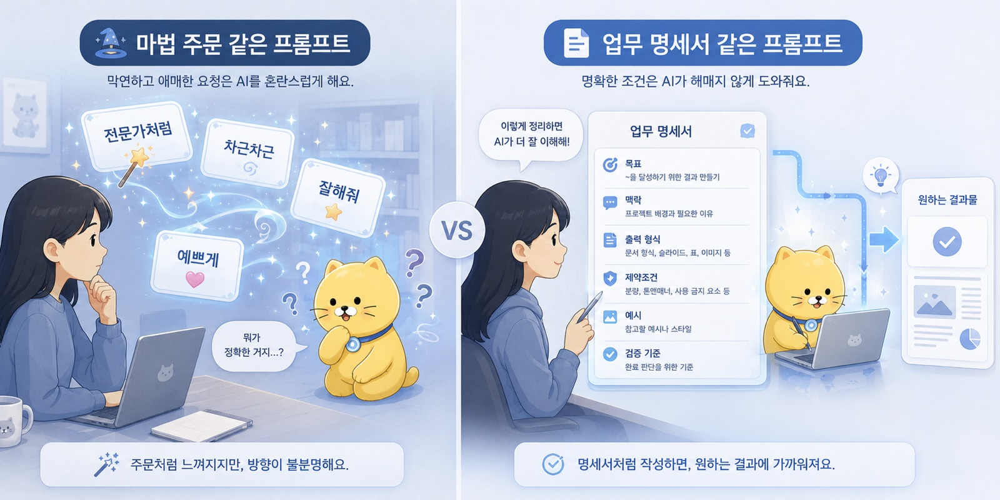

_프롬프트는 주문이 아니라 업무 명세서다의 문제의식이 처음 모습을 드러내는 장면._

미니멀하게?
화려하게?
교수님 발표처럼?
스타트업 피치덱처럼?
고등학생 발표처럼?
논문 세미나처럼?
이미지를 많이 넣으라는 뜻인가?
텍스트를 줄이라는 뜻인가?
색을 통일하라는 뜻인가?
분량은 몇 장인가?
언제까지인가?
누가 보는가?
평가 기준은 뭔가?

상사는 한 문장으로 시켰지만, 사원은 그 안에 숨은 조건들을 전부 추측해야 한다.

AI도 비슷하다.

“예쁘게 써줘.”

이 말은 사람이 보기엔 자연스럽지만, AI에게는 너무 넓다.

예쁘게가 무슨 뜻인지 모른다.
문장을 부드럽게 하라는 뜻인지,
표현을 감성적으로 바꾸라는 뜻인지,
문단을 짧게 나누라는 뜻인지,
소제목을 붙이라는 뜻인지,
브런치 글처럼 만들라는 뜻인지,
보고서처럼 정리하라는 뜻인지 모른다.

그래서 AI는 평균적인 “예쁜 글”을 만든다.

대충 부드럽고, 대충 매끄럽고, 대충 그럴듯한 글.

하지만 그게 내가 원하는 글이라는 보장은 없다.

---

AI는 하나의 정답을 꺼내는 자판기가 아니다.

AI는 가능한 출력들의 넓은 공간 안에서 그럴듯한 결과를 만들어낸다.
그래서 요청이 넓으면 결과도 넓어진다.

“발표자료 만들어줘.”

이 요청은 너무 넓다.

AI는 평균적인 발표자료를 만든다.
하지만 내가 원하는 발표자료와 맞을 가능성은 낮다.

조금 더 좁혀보자.

“고등학생 대상 5분 발표용으로 사과의 영양학적 특징을 설명하는 발표자료 목차를 만들어줘.”

이제 대상이 생겼다.
시간이 생겼다.
주제가 생겼다.
출력 형식이 생겼다.

더 좁힐 수도 있다.

“고등학생 대상 5분 발표입니다.
주제는 ‘사과는 왜 건강식품으로 여겨지는가?’입니다.
슬라이드는 7장 이내로 하고, 각 슬라이드에는 제목, 핵심 bullet 3개, 시각자료 아이디어를 넣어주세요.
건강효과만 강조하지 말고, 과장된 주장이나 한계도 포함해주세요.
발표자가 바로 말할 수 있게 짧은 speaker note도 붙여주세요.”

이제 AI가 낼 수 있는 결과의 범위가 훨씬 좁아진다.

프롬프트는 AI를 설득하는 말이 아니다.
AI가 헤매지 않도록 작업 공간을 좁히는 조건 설정이다.

다시 말해, 프롬프트는 specification이다.

---

그래서 나는 “prompt engineering”이라는 말보다 “task specification”이라는 말이 더 정확하다고 느낀다.

프롬프트를 잘 쓴다는 것은 말재주가 좋다는 뜻이 아니다.
일을 구조화해서 설명할 수 있다는 뜻이다.

중요한 질문은 이런 것이다.

무엇을 만들 것인가?
왜 필요한가?
누가 볼 것인가?
어떤 자료를 사용할 것인가?
어떤 형식으로 나와야 하는가?
어떤 톤이어야 하는가?
무엇을 피해야 하는가?
어디까지 AI가 하고, 어디부터 사람이 검토할 것인가?
좋은 결과의 기준은 무엇인가?

이 질문에 답할 수 있으면 AI에게 일을 잘 시킬 수 있다.

반대로 이 질문에 답하지 못하면, 아무리 좋은 모델을 써도 결과가 흔들린다.

AI에게 “잘해줘”라고 말하는 것은 부족하다.

무엇이 잘한 것인지 알려줘야 한다.

---

좋은 프롬프트에는 보통 몇 가지 요소가 들어간다.

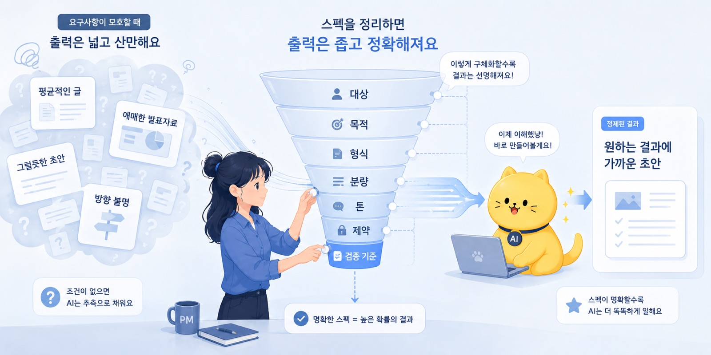

_작업의 흐름이 구체적인 구조로 바뀌는 순간._

첫 번째는 목표다.

무엇을 만들 것인가.

이메일인지, 발표자료인지, 연구계획서인지, 코드인지, 표인지, 카톡 공지문인지, 브런치 글 초안인지 말해줘야 한다.

“글 써줘”는 너무 넓다.

“교수님께 연구계획서 초안을 검토 부탁드리는 이메일을 써줘”는 조금 낫다.

“다음 주 미팅 전에 연구 질문과 변수 구조의 feasibility를 확인받기 위해, 교수님께 연구계획서 초안을 검토 부탁드리는 이메일을 써줘”는 더 낫다.

목표가 명확해야 AI가 방향을 잡는다.

두 번째는 맥락이다.

왜 필요한가.
누가 보는가.
어떤 상황인가.

같은 이메일이라도 교수님께 처음 보내는 메일과 가까운 동료에게 보내는 카톡은 다르다.
같은 연구계획서라도 내부 토의용 초안과 IRB 제출본은 다르다.
같은 설명문이라도 환자에게 직접 전달할 문서와 의사가 검토할 초안은 다르다.

맥락이 없으면 AI는 평균적인 상황을 가정한다.

그리고 평균적인 상황은 종종 내 상황이 아니다.

세 번째는 출력 형식이다.

결과물이 어떤 형태로 나와야 하는가.

Markdown인가?
표인가?
이메일 제목과 본문인가?
카톡 메시지인가?
Python script인가?
체크리스트인가?
비교표인가?
decision tree인가?

출력 형식을 지정하지 않으면 AI는 대체로 읽기 좋은 설명문을 낸다.

하지만 내가 원하는 것이 설명문이 아닐 수 있다.

변수 정리는 표가 낫다.
공지문은 바로 붙여넣을 수 있는 문장이 낫다.
코드 검토는 “문제점 / 수정안 / 테스트 방법” 구조가 낫다.
의사결정은 선택지 비교표가 낫다.

네 번째는 제약조건이다.

무엇을 지켜야 하는가.
무엇을 피해야 하는가.

500자 이내.
존댓말.
너무 딱딱하지 않게.
과도한 감정 표현 없이.
불확실한 내용은 단정하지 않기.
개인정보는 제외하기.
의학 용어는 처음 등장할 때 full term과 abbreviation 함께 쓰기.
환자에게 직접 처방처럼 보이는 표현은 피하기.
너무 거창한 prospective study처럼 보이지 않게 하기.

AI에게 “무엇을 하라”만 말하면 부족하다.

“무엇은 하지 말라”도 중요하다.

다섯 번째는 예시다.

예시는 설명보다 강하다.

“짧고 명확하게 써줘”보다, 내가 좋아하는 짧고 명확한 문장을 하나 보여주는 편이 낫다.
“지송체로 써줘”라고 말하려면, 지송체가 뭔지 보여주는 예시가 있어야 한다.
“교수님께 보낼 톤으로 써줘”라고 말하려면, 과하게 낮추지 않으면서 공손한 문장의 예시가 있으면 좋다.

AI는 예시를 보면 훨씬 잘 따라 한다.

예시는 출력 분포를 강하게 좁힌다.

여섯 번째는 검증 기준이다.

좋은 결과인지 어떻게 확인할 것인가.

상대가 바로 해야 할 행동이 명확한가?
핵심 요청이 앞에 있는가?
불확실한 내용이 표시되어 있는가?
책임소재가 애매하지 않은가?
너무 방어적으로 들리지 않는가?
연구 질문이 endpoint와 연결되는가?
후향적 EMR에서 변수를 실제로 뽑을 수 있는가?
의학적으로 위험한 단정이 없는가?
코드의 입력과 출력이 명확한가?
edge case가 고려되어 있는가?

검증 기준이 없으면 AI는 그럴듯한 결과를 낸다.

하지만 그럴듯함과 좋음은 다르다.

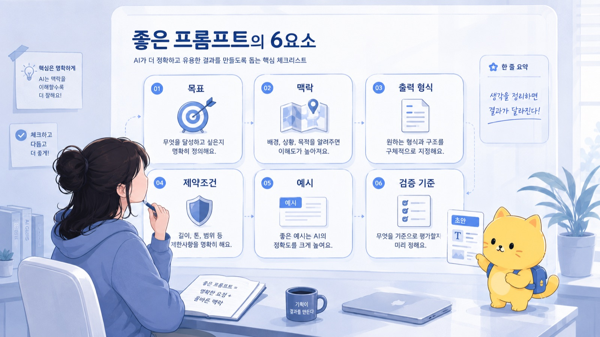

_사람의 판단과 AI의 실행이 나뉘는 지점을 보여주는 장면._

---

실제로 나는 긴 작업을 할 때 ChatGPT와 Codex를 이렇게 나눠서 쓴다.

먼저 ChatGPT와 아이디어를 존나게 토의한다.

무슨 일을 하려는지,
왜 필요한지,
어떤 구조가 좋을지,
어떤 위험이 있는지,
어떤 순서로 처리해야 할지 같이 정리한다.

그다음 ChatGPT에게 말한다.

“이걸 Codex에게 시킬 수 있는 작업 지시문으로 바꿔줘.”

그러면 ChatGPT는 내가 대충 말한 생각을 Codex용 프롬프트로 정리해준다.

목표.
역할.
작업 범위.
읽어야 할 자료.
건드려도 되는 파일.
건드리면 안 되는 파일.
출력물.
주의사항.
성공 조건.

그걸 plan.md로 저장한다.

그리고 Codex에게 먹인다.

그러면 Codex는 훨씬 덜 헤맨다.

최근에도 브런치북 원고를 정리하면서 비슷하게 했다.
목표는 단순히 “ebook 만들기”가 아니었다.
브런치북으로 발행 가능한 repository 상태를 만드는 것이었다.

원고를 정리하고,
챕터를 나누고,
중복을 줄이고,
이미지 위치를 잡고,
발행 메타데이터를 만들고,
부족한 내용을 표시하고,
개인정보 위험을 점검하고,
브런치 업로드가 쉬운 상태로 만드는 것.

이렇게 쓰면 Codex는 단순히 “책 만들어줘”라는 요청을 받은 게 아니다.

편집팀으로서 무엇을 해야 하는지 받은 것이다.

AI가 할 수 있는 일은 크게 달라지지 않았을 수 있다.
하지만 작업 지시가 달라지면 결과가 달라진다.

---

이건 개발자만의 이야기가 아니다.

Specification이라는 단어가 개발자용으로 들릴 수는 있다.
하지만 사실 우리는 일상에서도 계속 specification을 쓴다.

음식을 주문할 때도 그렇다.

“맛있게 해주세요”라고 말하면 주방은 알아서 평균적인 맛을 낸다.

하지만 나는 맵기 1단계, 고수 빼고, 면 적게, 국물 따로, 덜 짜게를 원할 수 있다.

발표자료도 그렇다.

“예쁘게 만들어주세요”라고 말하면 애매하다.

하지만 “고등학생 대상, 5분 발표, 7장 이내, 각 장 bullet 3개, 마지막에 한계 포함”이라고 하면 작업이 훨씬 선명해진다.

교수님이 과제를 낼 때도 그렇다.

“잘 써와”라고 하면 학생은 눈치를 봐야 한다.

하지만 분량, 형식, 평가 기준, 제출 기한, 참고자료가 있으면 훨씬 낫다.

AI에게 프롬프트를 쓰는 것도 이와 다르지 않다.

기계라서 특별한 주문이 필요한 것이 아니다.
일을 하려면 조건이 필요한 것이다.

---

물론 모든 프롬프트가 길어야 하는 것은 아니다.

간단한 메모 정리, 제목 후보 생성, 개인용 요약, 아이디어 브레인스토밍 정도는 짧게 시켜도 된다.

“이 메모를 markdown 목차로 정리해줘.”

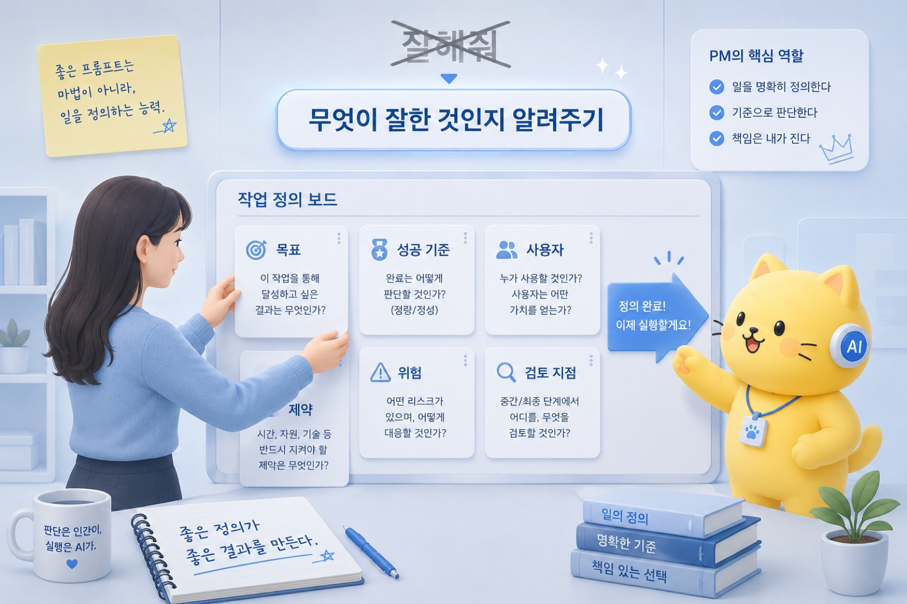

_프롬프트는 주문이 아니라 업무 명세서다의 결론을 이미지로 정리한 장면._

이 정도면 충분할 때도 많다.

중요한 것은 작업의 위험도와 중요도에 따라 프롬프트의 밀도를 조절하는 것이다.

가벼운 작업은 가볍게 시켜도 된다.

하지만 교수님께 보낼 이메일, 팀 공지문, 발표자료 초안, 연구계획서, 코드 prototype 정도가 되면 목표와 맥락과 출력 형식과 제약조건 정도는 주는 편이 낫다.

더 위험한 작업은 더 조심해야 한다.

IRB 제출본.
환자에게 전달될 안내문.
연구 분석 최종 코드.
개인정보가 포함된 데이터 처리.
논문 결론.
약물 용량 관련 내용.
공식 기관에 제출할 문서.

이런 작업에서는 처음부터 검증 기준과 불확실성 표시가 필요하다.

AI가 만든 결과를 그대로 쓰면 안 된다.

프롬프트를 잘 쓴다는 것은 AI를 무조건 믿는 일이 아니다.

오히려 반대다.

AI가 어디까지 할 수 있고, 어디서 사람이 봐야 하는지 정하는 일이다.

---

좋은 프롬프트는 한 번에 완성되지 않아도 된다.

AI와의 작업은 대개 반복적이다.

처음에는 0.7짜리 초안을 받는다.
결과를 본다.
부족한 점을 찾는다.
조건을 추가한다.
구조를 수정한다.
톤을 조정한다.
다시 받는다.

이 과정을 통해 결과가 좋아진다.

프롬프트는 한 번의 명령이 아니라, 대화형 specification이다.

다만 처음부터 명확해야 하는 것들이 있다.

개인정보.
의학적 단정.
책임소재.
공식 제출 여부.
수정해도 되는 범위.
건드리면 안 되는 파일.
출력 형식.

이런 것들은 나중에 생각나면 늦다.

처음부터 조건으로 박아두는 편이 안전하다.

---

프롬프트를 잘 쓰는 사람은 AI에게 명령을 많이 내리는 사람이 아니다.

좋은 PM처럼 일을 정의하는 사람이다.

좋은 PM은 목표를 안다.
성공 기준을 안다.
사용자를 안다.
제약을 안다.
위험한 오류가 무엇인지 안다.
어디까지 자동화하고 어디서 사람이 봐야 하는지 안다.

AI도 이 구조 안에서 더 잘 작동한다.

“예쁘게 써줘”라는 말은 인간적으로는 편하다.

하지만 작업 지시로는 부족하다.

예쁘게가 뭔지 설명해야 한다.
누가 보는지 말해야 한다.
어떤 형식인지 정해야 한다.
무엇을 피해야 하는지 알려줘야 한다.
좋은 결과인지 확인할 기준을 줘야 한다.

프롬프트는 AI를 똑똑하게 만드는 주문이 아니다.

AI가 헤매지 않도록 작업 공간을 좁혀주는 설계도다.

좋은 프롬프트는 말을 잘하는 능력이 아니다.
일을 설명할 수 있는 능력이다.

AI에게 “잘해줘”라고 말하지 말자.

무엇이 잘한 것인지 알려주자.

\newpage

## 5. AI는 평균적 작업자다

구글 검색을 할 때 가끔 이런 일이 있다.

분명 내가 찾는 것이 있다.
그런데 검색어를 대충 치면 원하는 결과가 잘 안 나온다.

학회 약어를 대충 넣는다.
키워드를 몇 개만 던진다.
그러면 검색 결과는 나오긴 나온다.

하지만 내가 원하는 그 문서, 그 발표, 그 논문, 그 맥락은 잘 안 나온다.

대신 개괄적인 설명이 나온다.
누구에게나 무난한 소개 페이지가 나온다.
위키 같은 요약이 나오고, 블로그 글이 나오고, “이 분야란 무엇인가” 수준의 자료가 나온다.

틀린 건 아니다.

대부분의 사람에게는 그게 맞는 결과일 수도 있다.
처음 검색한 사람에게는 오히려 친절한 결과일 수도 있다.

하지만 나는 그걸 원한 게 아니다.

나는 이미 기본 개념은 알고 있다.
내가 찾는 건 더 좁은 맥락이다.
특정 학회, 특정 키워드, 특정 세션, 특정 연구 흐름, 특정 논문 안에서 쓰인 의미다.

검색 결과는 평균적인 사람을 만족시키는 방향으로 나온다.
그런데 나는 평균적인 사용자가 아니다.

AI도 비슷하다.

AI에게 대충 말하면, AI는 대체로 평균적인 답을 준다.

그리고 그 평균은 꽤 쓸 만하다.

문제는 내가 원하는 것이 평균이 아닐 때다.

---

AI는 신이 아니다.

내 머릿속을 읽고 내가 진짜 원하는 답을 꺼내주는 존재가 아니다.

그렇다고 장난감도 아니다.

심심할 때 물어보고, 재밌는 답을 듣고, 가끔 요약이나 시키는 정도로만 쓰기에는 너무 강력하다.

내가 보기엔 AI는 평균적 작업자에 가깝다.

여기서 평균적이라는 말은 비하가 아니다.

평균은 쓸모 있다.

평균적인 이메일.
평균적인 보고서.
평균적인 요약.
평균적인 발표자료.
평균적인 코드 초안.
평균적인 설명문.
평균적인 블로그 글.

이런 것들을 AI는 매우 빠르게 만든다.

사람이 처음부터 만들면 시간이 걸리는 0을, AI는 순식간에 0.8까지 밀어준다.

그게 AI의 진짜 강점이다.

아무것도 없는 상태에서 초안을 만든다.
흩어진 생각을 구조화한다.
긴 문서를 요약한다.
코드 prototype을 만든다.
발표자료 목차를 만든다.
메일의 뼈대를 만든다.
브런치 글처럼 보이는 글을 만든다.

특히 코드 prototype은 기가 막히게 잘 뽑는다.

일단 돌아가는 뼈대를 만든다.
함수를 나누고, 파일을 만들고, 입력과 출력을 잡고, 대충이라도 실행 가능한 구조를 세운다.

문제는 그다음이다.

유지보수는 어렵다.
내 프로젝트 구조와 어긋날 수 있다.
edge case가 빠질 수 있다.
처음엔 잘 돌아가는데, 나중에 고치려면 왜 이렇게 짰는지 헷갈릴 수 있다.

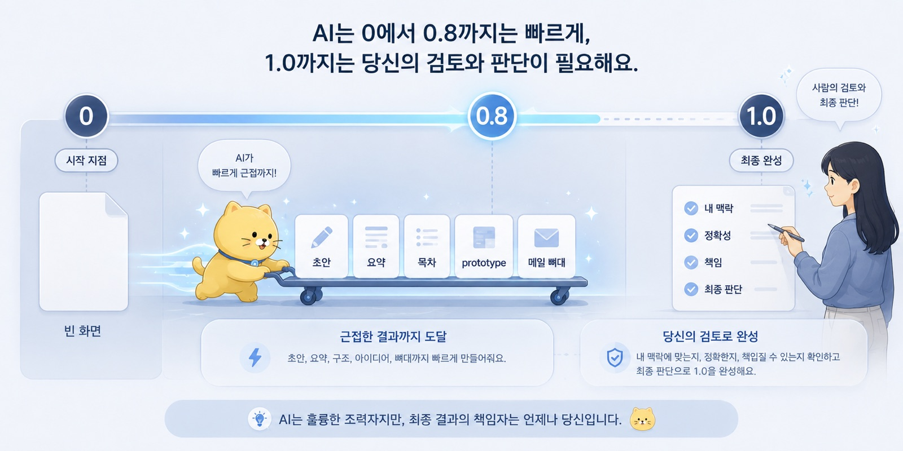

_AI는 평균적 작업자다의 문제의식이 처음 모습을 드러내는 장면._

그러니까 AI는 쓸모없다는 뜻이 아니다.

AI는 0에서 0.8까지 빠르다.

하지만 0.8을 1.0이라고 착각하면 위험하다.

---

AI가 평균으로 가는 이유는 어느 정도 원리상 자연스럽다.

LLM은 많은 텍스트와 사례에서 패턴을 학습한다.
그리고 사용자의 요청에 대해 그럴듯한 다음 문장, 다음 구조, 다음 답변을 만들어낸다.

그러니 사용자의 요청이 모호하면, AI는 가장 일반적으로 그럴듯한 방향으로 간다.

“브런치 글 써줘.”

이렇게 말하면 AI는 브런치 글처럼 보이는 글을 쓴다.

적당히 부드러운 도입.
적당히 공감 가는 문제의식.
적당히 자기계발적인 전개.
적당히 말랑한 문장.
적당히 그럴듯한 결론.

나쁘지 않다.

진짜 나쁘지 않다.

처음 보는 사람은 “오, 꽤 잘 썼는데?”라고 할 수도 있다.

그런데 나는 만족하지 않는다.

왜냐하면 내가 원하는 글은 평균적인 브런치 글이 아니기 때문이다.

내가 원하는 건 이런 글이다.

제목은 약간 병맛이어도 된다.
본문은 진지해야 한다.
사례는 사적이어야 한다.
구조는 명확해야 한다.
마지막은 책임의 언어로 닫혀야 한다.
AI를 찬양하는 글처럼 보이면 안 된다.
생산성 팁 모음처럼 끝나도 안 된다.
“춘식이는 귀엽지만, 최종 판단은 사람이 한다”는 축이 살아 있어야 한다.

이런 조건을 주지 않으면 AI는 알 수 없다.

AI는 평균적인 브런치 글을 쓸 뿐이다.

그 글이 틀린 것은 아니다.
다만 내 글이 아닐 뿐이다.

---

이 차이를 좌표계로 생각하면 편하다.

AI는 기본적으로 원점 근처를 찍는다.

모두가 적당히 받아들일 수 있는 지점.
크게 튀지 않는 지점.
너무 위험하지 않은 지점.
인터넷에 많이 있는 말투와 구조가 모여 있는 지점.

원점은 나쁘지 않다.

오히려 대부분의 경우 원점은 꽤 안전하다.
처음 시작할 때는 원점이 도움이 된다.
아무것도 없는 빈 화면보다, 평균적인 초안이 있는 편이 훨씬 낫다.

하지만 모든 사람이 원점을 원하는 것은 아니다.

나는 조금 더 오른쪽 위를 원할 수 있다.
누군가는 더 건조한 보고서체를 원할 수 있다.
누군가는 더 짧고 단호한 공지문을 원할 수 있다.
누군가는 의료적으로 조심스러운 설명문을 원할 수 있다.
누군가는 농담은 살리되 책임은 무겁게 남기는 글을 원할 수 있다.

그런데 좌표계를 주지 않으면 AI는 모른다.

AI는 “여기가 대충 많은 사람이 만족할 만한 지점이겠지” 하고 원점을 찍는다.

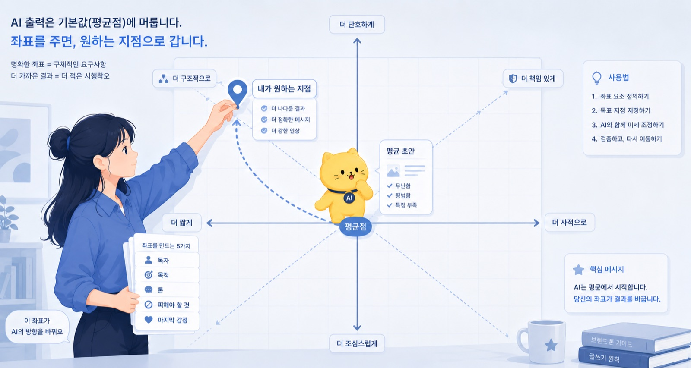

_작업의 흐름이 구체적인 구조로 바뀌는 순간._

그래서 사용자가 해야 할 일은 AI에게 좌표계를 주는 것이다.

이 글은 누구에게 가는가.
무엇을 위해 쓰는가.
어떤 톤이어야 하는가.
무엇을 피해야 하는가.
어떤 사례를 중심에 둘 것인가.
어디까지는 가볍게 가고, 어디서부터는 진지해야 하는가.
마지막에 독자에게 어떤 감정을 남길 것인가.

이런 것들이 좌표계다.

AI는 글을 쓸 수 있다.
하지만 어떤 글이 좋은 글인지는 사용자가 정해야 한다.

---

예를 들어 “메일 써줘”라고 하면 AI는 평균적인 메일을 쓴다.

대체로 공손하다.
대체로 무난하다.
대체로 “바쁘신 와중에 죄송하지만” 같은 문장이 들어간다.
대체로 “검토해주시면 감사하겠습니다”로 끝난다.

틀린 메일은 아니다.

하지만 상황에 따라 별로일 수 있다.

교수님께 처음 보내는 메일인지,
이미 여러 번 논의한 초안을 보내는 것인지,
상대에게 부담을 줄여야 하는지,
내가 어느 정도 주도권을 갖고 있는지,
검토받고 싶은 포인트가 무엇인지,
너무 낮추면 오히려 답답해 보이는 상황인지.

이런 좌표를 주지 않으면 AI는 평균적인 공손함으로 간다.

카톡 공지문도 마찬가지다.

“공지문 써줘”라고 하면 AI는 종종 너무 친절해진다.

“여러분 안녕하세요 😊”
“다들 너무 고생 많으십니다!”
“혹시 가능하시다면 확인 부탁드려도 될까요?”

이런 문장은 상황에 따라 나쁘지 않을 수 있다.

하지만 내가 원하는 공지문은 아닐 수 있다.

내가 원하는 건 보통 짧고 명확한 문장이다.

무엇이 바뀌었는지.
언제까지 확인해야 하는지.
누가 무엇을 해야 하는지.
확정된 것과 확인 중인 것이 무엇인지.

이게 중요하다.

AI는 평균적인 친절함을 준다.
나는 운영 가능한 명확함을 원한다.

그러니 좌표계를 줘야 한다.

---

이 관점에서 AI는 빠르지만 맥락 없는 신입에 가깝다.

신입은 일을 빨리 배울 수 있다.
자료도 잘 찾을 수 있다.
초안도 만들 수 있다.
시키면 열심히 한다.

하지만 처음부터 조직의 맥락을 알지는 못한다.

누가 어떤 표현에 민감한지.
이 문서가 공식 제출용인지 내부 검토용인지.
이 프로젝트에서 절대 건드리면 안 되는 파일이 무엇인지.
교수님이 어떤 표현을 부담스러워하는지.
환자에게 직접 전달될 수 있는 문서인지.
이 메시지가 상대에게 통보처럼 들리면 안 되는 상황인지.

이런 것은 알려줘야 한다.

AI도 마찬가지다.

AI는 빠르지만 맥락 없는 신입이다.

잘 쓰려면 온보딩이 필요하다.

새로운 조교가 들어오면 업무 방식을 알려주듯, AI에게도 내 작업 세계를 알려줘야 한다.

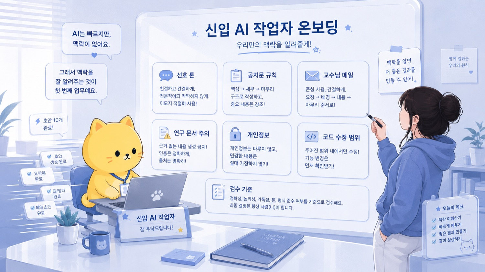

_사람의 판단과 AI의 실행이 나뉘는 지점을 보여주는 장면._

나는 어떤 톤을 선호하는지.
공지문은 어떻게 쓰는지.
교수님께 보내는 문서는 어떻게 정리하는지.
연구 문서에서 어떤 표현을 피해야 하는지.
의학 정보는 어느 수준으로 조심해야 하는지.
개인정보는 어떻게 다뤄야 하는지.
코드는 어디까지 고쳐도 되는지.
결과물은 어떤 기준으로 검수할 것인지.

이것을 알려주면 AI는 훨씬 잘 움직인다.

모델이 갑자기 천재가 되는 것은 아니다.

좌표를 받은 것이다.

---

그래서 나는 AI 결과물이 마음에 안 들 때, 요즘은 바로 “얘 왜 이래?”라고 생각하지 않으려고 한다.

물론 AI가 이상한 것도 맞다.
틀릴 때도 많다.
헛소리도 한다.
그럴듯한 말투로 틀린 내용을 말하기도 한다.

특히 의학, 법률, 연구, 공식 문서, 실제 배포 코드처럼 리스크가 있는 작업에서는 절대 그대로 믿으면 안 된다.

하지만 모든 실패가 AI의 지능 문제는 아니다.

내가 좌표계를 안 줬을 수도 있다.

내가 독자를 안 말했을 수도 있다.
목적을 안 말했을 수도 있다.
출력 형식을 안 말했을 수도 있다.
피해야 할 표현을 안 말했을 수도 있다.
검증 기준을 안 줬을 수도 있다.
예시를 안 보여줬을 수도 있다.

그러면 AI는 평균으로 간다.

그게 AI의 기본값이다.

---

평균은 나쁘지 않다.

오히려 평균은 강력하다.

평균적인 초안을 빠르게 얻을 수 있다는 것은 엄청난 일이다.

예전에는 빈 문서를 앞에 두고 한참을 앉아 있어야 했다.
메일 첫 문장을 어떻게 시작할지 고민했다.
발표자료 목차를 어떻게 잡을지 고민했다.
코드의 기본 구조를 어떻게 만들지 고민했다.
글의 첫 단락을 어떻게 열지 고민했다.

이제 그 0을 AI가 대신 밀어준다.

AI는 평균적인 0.8을 준다.

그 0.8은 완성본은 아니지만, 시작점으로는 훌륭하다.

빈 화면보다 낫다.
흩어진 생각보다 낫다.
아무 구조 없는 메모보다 낫다.
일단 돌아가는 prototype은 없는 코드보다 낫다.

하지만 그다음은 사람의 일이다.

0.8이 내 맥락에 맞는지 봐야 한다.
내 기준과 맞는지 봐야 한다.
책임질 수 있는지 봐야 한다.
틀린 내용이 있는지 봐야 한다.
너무 평균적인 말로 내 생각을 지워버리지는 않았는지 봐야 한다.

AI는 평균을 만든다.

사용자는 좌표계를 준다.

그리고 마지막으로, 그 결과가 내 이름으로 나가도 되는지 판단한다.

---

AI를 평균적 작업자로 보면 마음이 편해진다.

과신하지 않게 된다.

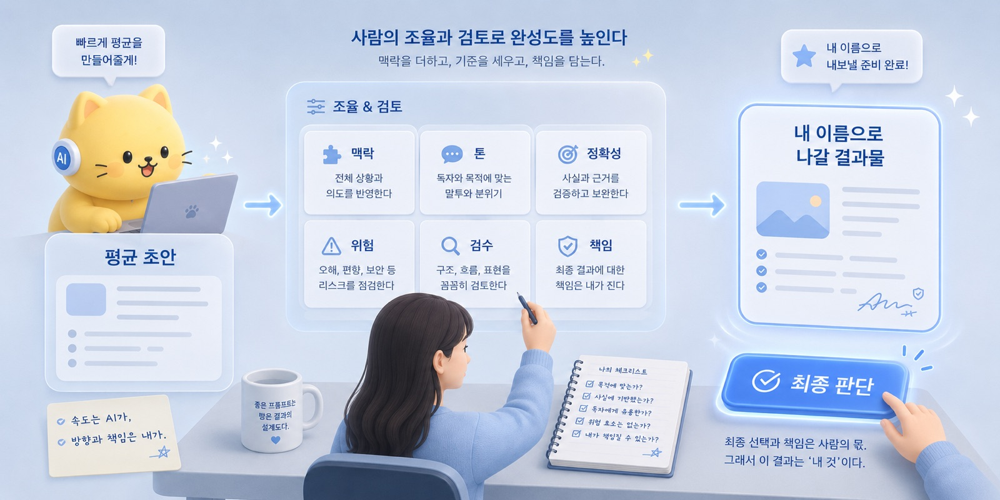

_AI는 평균적 작업자다의 결론을 이미지로 정리한 장면._

AI가 답했다고 해서 맞는 것이 아니다.
평균적인 작업자의 초안일 뿐이다.

과소평가하지도 않게 된다.

평균적인 작업자라도 처리량이 엄청나면 매우 유용하다.
반복 작업과 초안 작업에서는 특히 강력하다.

결과가 마음에 안 들 때도 조금 더 정확하게 볼 수 있다.

AI가 무능한 것인가?
아니면 내가 너무 모호하게 시켰는가?

검수 구조가 필요하다는 점도 선명해진다.

작업자에게 일을 맡기고 중간 확인 없이 최종 제출하면 위험하다.
AI도 마찬가지다.

사용자의 역할도 명확해진다.

사용자는 단순히 질문하는 사람이 아니다.
사용자는 PM이자 architect다.
목표를 정하고, 좌표계를 주고, 결과를 검수하고, 최종 책임을 지는 사람이다.

---

물론 이 비유에는 한계가 있다.

AI는 사람과 다르다.

사람은 현실 경험이 있다.
AI는 실제로 살아본 경험이 없다.

사람은 책임을 느낀다.
AI는 책임을 느끼지 않는다.

사람은 조직 내 후폭풍을 겪는다.
AI는 후폭풍을 겪지 않는다.

사람은 자기 평판을 관리한다.
AI는 평판 부담이 없다.

사람은 모르면 조심할 때가 있다.
AI는 모르는 것도 그럴듯하게 말할 수 있다.

그래서 AI를 사람처럼 쓰되, 사람처럼 믿으면 안 된다.

AI는 평균적 작업자라는 비유는 operational metaphor다.
AI가 실제 인간과 같다는 뜻은 아니다.

---

AI는 신이 아니다.

내 마음을 읽고 정답을 내려주는 존재가 아니다.

AI는 장난감도 아니다.

가끔 심심할 때 만져보고 끝내기에는 너무 쓸모가 크다.

AI는 평균적 작업자다.

평균적인 결과를 빠르게 만든다.
모호하게 시키면 평균으로 간다.
좌표계를 주면 원하는 방향으로 움직인다.
0에서 0.8까지는 놀랄 만큼 빠르다.

하지만 좋은 결과는 평균이 아니다.

좋은 결과는 특정 맥락에 맞는 결과다.

AI가 만들어준 평균은 출발점이다.
그 평균에 방향을 주고, 맥락을 주고, 기준을 주고, 책임질 수 있는 결과로 바꾸는 것은 사람의 일이다.

AI는 평균을 만든다.

사용자는 좌표계를 준다.

\newpage

## 6. ChatGPT는 편집장, Codex는 시공팀

AI 모델을 처음 쓸 때는 자꾸 순위를 매기게 된다.

뭐가 제일 똑똑하지?
GPT가 나은가?
Claude가 나은가?
Gemini는 쓸 만한가?
Codex는 어디까지 해주나?
결국 돈을 어디에 써야 하지?

처음에는 나도 그렇게 봤다.

모델을 일렬로 세워놓고 누가 1등인지 보려고 했다.
답변을 비교하고, 글맛을 비교하고, 코드 실력을 비교하고, 가격을 비교했다.

그런데 실제로 AI를 작업에 넣어보면, 이 질문은 조금 부족하다.

중요한 건 “어떤 모델이 제일 똑똑한가”가 아니었다.

중요한 건 이거였다.

이 일은 누구에게 맡길 것인가?

---

회사에 사람이 여러 명 있다고 해보자.

편집장에게 시킬 일이 있고,
비서에게 시킬 일이 있고,
시공팀에게 시킬 일이 있고,
외주 업체에게 맡길 일이 있고,
반복 작업을 맡길 말단 직원에게 줄 일이 있다.

이 사람들을 한 줄로 세워서 “누가 제일 좋은 사람인가”를 묻는 건 이상하다.

편집장은 현장에서 벽을 칠하는 사람이 아니다.
시공팀은 책의 세계관을 정리하는 사람이 아니다.
외주 업체는 매일 붙잡고 자잘한 메모를 정리할 사람이 아니다.
말단 직원에게 “알아서 전체 전략 짜봐”라고 하면 삽질할 가능성이 높다.

사람에게 일을 맡길 때는 능력만 보는 게 아니라 역할을 본다.

AI도 마찬가지였다.

AI 모델은 순위를 매기는 대상이라기보다, 작업 성격에 따라 배치하는 인력 풀에 가까웠다.

어떤 일은 ChatGPT에게 먼저 가져가야 했다.
어떤 일은 Codex에게 넘겨야 했다.
어떤 일은 Claude에게 맡기면 편했다.
어떤 일은 Gemini에게 체크리스트를 주고 돌리면 충분했다.

그걸 구분하기 시작하자 AI를 쓰는 감각이 달라졌다.

---

내게 ChatGPT는 편집장에 가깝다.

조금 더 정확히 말하면 chief of staff에 가깝다.

내가 머릿속에서 대충 뭉개고 있는 생각을 던지면, ChatGPT는 그걸 구조로 바꾼다.

“이거 뭔가 책으로 만들고 싶은데.”
“이 주제 브런치북으로 가능할까?”
“이 연구 아이디어 너무 큰가?”
“Codex한테 이걸 어떻게 시켜야 하지?”
“교수님께 메일 보내야 하는데 톤을 어떻게 잡지?”
“이 상황에서 내가 놓친 리스크가 있나?”

이런 질문은 ChatGPT에게 잘 맞는다.

ChatGPT는 내 말의 앞뒤를 잡고,
흩어진 생각을 묶고,
작업 순서를 나누고,
문장으로 바꾸고,
다른 AI에게 줄 지시문을 만들어준다.

최종 작업자라기보다, 작업을 정의하는 쪽에 강하다.

예를 들어 브런치북을 만들 때도 그랬다.

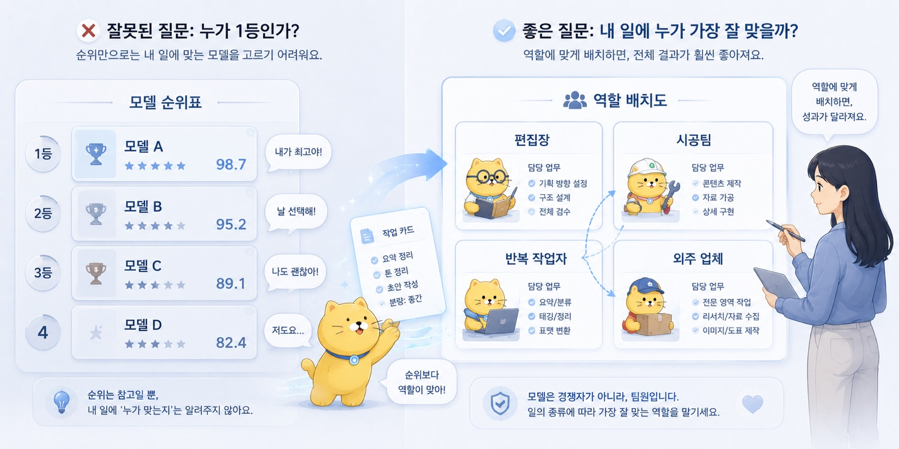

_ChatGPT는 편집장, Codex는 시공팀의 문제의식이 처음 모습을 드러내는 장면._

나는 처음부터 Codex에게 바로 “책 만들어줘”라고 하지 않았다.
먼저 ChatGPT와 책의 방향을 정리했다.

이 책은 AI 활용팁 모음이 아니다.
개인 AI 운영체계 제작기다.
제목은 병맛이어도 본문은 진지해야 한다.
사례는 사적이지만 구조는 명확해야 한다.
결론은 책임으로 가야 한다.
춘식이는 귀엽지만 최종 판단은 사람이 해야 한다.

이런 식으로 세계관을 먼저 정리했다.

그다음 ChatGPT에게 물었다.

“이걸 Codex에게 시킬 수 있는 작업 지시문으로 바꿔줘.”

그러면 ChatGPT는 내가 대충 말한 방향을 작업 가능한 언어로 바꿔준다.

무엇을 읽어야 하는지.
무엇을 만들지.
어떤 파일을 생성할지.
어떤 장은 건드리지 말아야 하는지.
어떤 개인정보는 확인해야 하는지.
어디까지는 정리하고, 어디부터는 나에게 물어봐야 하는지.

이 과정에서 ChatGPT는 비서라기보다 편집장에 가까웠다.

생각을 바로 산출물로 만들기보다, 산출물이 나올 수 있는 구조를 만든다.

---

반면 Codex는 시공팀에 가깝다.

ChatGPT가 회의실에서 기획안을 정리하는 사람이라면, Codex는 실제 현장에 들어가는 사람이다.

파일을 연다.
코드를 고친다.
폴더를 정리한다.
스크립트를 만든다.
빌드를 돌린다.
테스트를 한다.
결과물을 저장한다.

나는 Codex에게 “이런 느낌으로 생각해보자” 같은 말을 오래 하지 않는다.

Codex에게는 작업장이 필요하다.
repository가 필요하다.
파일 구조가 필요하다.
plan.md가 필요하다.
AGENTS.md가 필요하다.
수정해도 되는 범위와 건드리면 안 되는 범위가 필요하다.

그러면 Codex는 꽤 잘 움직인다.

브런치북 작업에서도 그랬다.

ChatGPT와 책의 방향을 정리한 뒤, Codex에게는 훨씬 실무적인 일을 맡겼다.

원고 파일을 정리해라.
브런치 발행용 글을 따로 만들어라.
이미지 위치를 잡아라.
메타데이터 표를 만들어라.
누락된 챕터를 표시해라.
개인정보 위험을 점검해라.
최종 발행 준비가 쉬운 repository 상태로 만들어라.

이건 “좋은 글 써줘”와 다르다.

Codex는 편집 철학을 새로 세우는 존재가 아니다.
이미 정해진 구조 안에서 실제 파일을 만지는 시공팀이다.

시공팀에게 “예쁜 집 지어줘”라고만 하면 위험하다.

설계도가 있어야 한다.
자재 목록이 있어야 한다.
어디를 철거하면 안 되는지 알려줘야 한다.
완공 기준이 있어야 한다.
중간 점검이 있어야 한다.

Codex도 마찬가지다.

잘 쓰면 엄청 편하다.
잘못 시키면 삽질도 엄청 한다.

---

Gemini는 내게 약간 저비용 말단 직원처럼 느껴질 때가 있다.

이 표현이 비하처럼 들릴 수 있는데, 그런 뜻은 아니다.

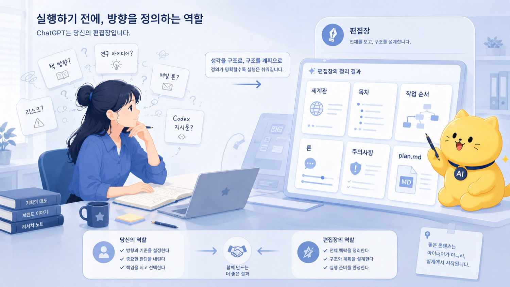

_작업의 흐름이 구체적인 구조로 바뀌는 순간._

말단 직원이 쓸모없다는 뜻이 아니다.
오히려 명확한 체크리스트가 있으면 말단 직원은 엄청난 양의 반복 작업을 처리해준다.

다만 “알아서 맥락 파악하고 전체 전략 짜줘”를 기대하면 안 된다.

Gemini에게는 특히 그런 감각이 있었다.

복잡한 맥락을 알아서 잘 읽는다기보다는, 해야 할 일을 아주 명확하게 써주면 그 일은 꽤 성실하게 한다.

입력 형식.
출력 형식.
금지할 행동.
예시.
반복 규칙.
검수 기준.

이걸 잘 주면 움직인다.

반대로 “니 알아서 해봐”라고 하면 결과가 흔들릴 수 있다.

예전에 Gemini CLI를 쓸 때도 그랬다.

대충 던졌을 때는 생각보다 잘 안 됐다.
그런데 AGENTS.md를 넣고, 프로젝트 규칙과 작업 지침을 정해주니 애가 갑자기 다른 사람처럼 움직였다.

모델의 성능이 갑자기 바뀐 것은 아닐 것이다.

작업 지침이 생긴 것이다.

이 경험은 꽤 중요했다.

AI를 잘 쓴다는 건 꼭 제일 비싼 모델만 쓰는 일이 아니다.
상대가 알아들을 수 있는 수준으로 일을 쪼개고, 지시를 명확히 주는 일이기도 하다.

말단 직원에게 말단 직원에게 맞는 일을 주면 된다.

그게 반복 작업이고, 형식 맞추기이고, 단순 변환이고, 체크리스트 기반 정리라면 충분히 쓸모 있다.

---

Claude는 비싼 외주 업체처럼 느껴질 때가 있다.

특히 글을 다듬을 때 그렇다.

문체를 고르게 맞추고,
조금 더 매끄러운 문장으로 만들고,
완성도 있는 산출물을 뽑고,
긴 글의 흐름을 부드럽게 다듬는 데 강하다.

외주 업체는 잘 쓰면 좋다.

하지만 매일 사소한 일까지 전부 외주로 맡기면 비용이 부담된다.

그래서 Claude는 내게 “아무 때나 켜는 도구”라기보다, 문체와 완성도가 정말 중요할 때 쓰는 쪽에 가깝다.

중요한 원고.
톤을 잘 살려야 하는 글.
완성도가 필요한 문서.
내가 이미 방향을 잡아놓고, 마지막 문장 감각을 다듬고 싶을 때.

이런 일에는 외주를 줄 만하다.

하지만 외주 업체도 내 생각을 대신 정해주지는 않는다.

무엇을 만들지.
어떤 톤을 원하는지.
어디까지 바꿔도 되는지.
어떤 표현은 절대 넣으면 안 되는지.

이걸 줘야 한다.

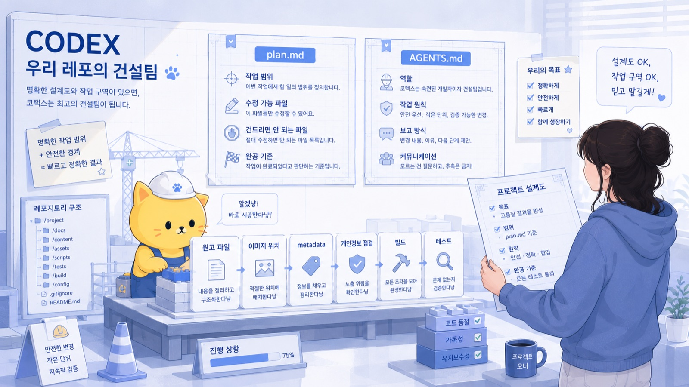

_사람의 판단과 AI의 실행이 나뉘는 지점을 보여주는 장면._

비싼 외주라고 해서 “알아서 내 마음에 들게 해주세요”가 통하는 것은 아니다.

오히려 비쌀수록 더 정확히 맡겨야 한다.

---

이렇게 보면 내 작업실에는 여러 AI 직원이 있는 셈이다.

ChatGPT는 편집장이다.
Codex는 시공팀이다.
Gemini는 체크리스트를 주면 움직이는 반복 작업자다.
Claude는 문체와 완성도에 강한 외주 업체다.

그리고 나는?

나는 상사이자 발주자이자 최종 책임자다.

조금 더 정확히 말하면, 나는 작업의 owner다.

무엇을 만들지 정한다.
왜 만들지 정한다.
누가 볼지 생각한다.
어떤 리스크가 있는지 본다.
어떤 모델에게 무엇을 맡길지 나눈다.
결과물을 읽고 판단한다.
마지막 버튼을 누른다.

이 구조를 생각하면 AI 사용이 훨씬 덜 헷갈린다.

ChatGPT에게 시킬 일을 Codex에게 시키면 이상해질 수 있다.
Codex에게 시킬 일을 ChatGPT에게 계속 말로만 설명하고 있으면 답답해진다.
Gemini에게 맡길 만한 반복 작업을 비싼 모델에게 계속 맡기면 낭비일 수 있다.
Claude에게 맡기면 좋을 문체 작업을 저렴한 모델에게 맡기고 결과가 마음에 안 든다고 화낼 수도 있다.

문제는 모델의 순위가 아니라 배치다.

---

AI 모델 비교표를 보는 일은 재미있다.

나도 본다.

새 모델이 나오면 궁금하다.
벤치마크가 올라오면 본다.
가격과 제한도 확인한다.
코딩을 잘하는지, 글을 잘 쓰는지, 긴 문맥을 잘 처리하는지도 궁금하다.

하지만 실제 작업에서는 순위표보다 역할표가 더 중요했다.

이 모델이 세계에서 몇 등인가보다,
내 작업 흐름 안에서 어디에 앉힐 것인가가 더 중요했다.

AI를 한 명의 만능 천재로 생각하면 오히려 쓰기 어렵다.

그런 모델은 없다.

있다고 해도 모든 일을 혼자 맡기면 workflow가 흐려진다.

차라리 작은 사무실처럼 보는 편이 낫다.

여기에는 편집장이 있고,
시공팀이 있고,
외주 업체가 있고,
반복 작업자가 있고,
최종 책임자가 있다.

중요한 건 각자에게 맞는 일을 주는 것이다.

---

물론 이 비교는 특정 시점의 사용 경험이다.

모델 성능은 계속 바뀐다.
가격도 바뀐다.
사용량 제한도 바뀐다.
오늘 애매했던 모델이 내일 좋아질 수 있고, 지금 최고처럼 보이는 모델이 몇 달 뒤에는 평범해질 수 있다.

그래서 이 글은 “지금은 어떤 모델이 제일 좋다”는 글이 아니다.

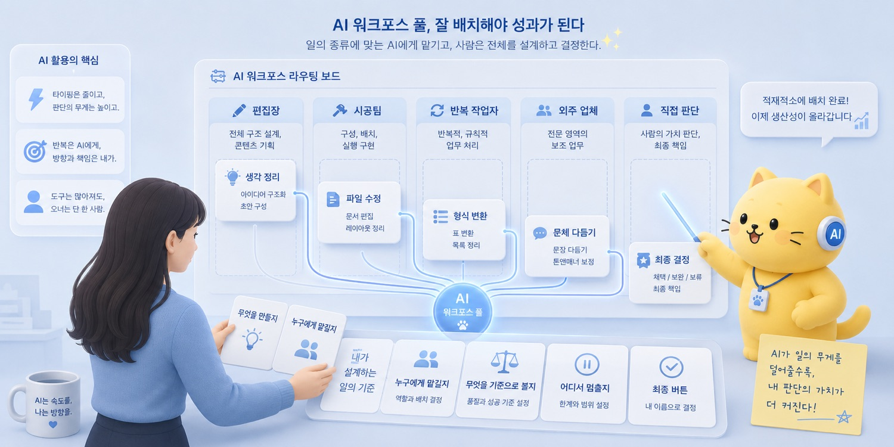

_ChatGPT는 편집장, Codex는 시공팀의 결론을 이미지로 정리한 장면._

그런 글은 금방 낡는다.

내가 말하고 싶은 것은 모델 이름이 아니라 배치 원칙이다.

AI 모델을 하나로 보지 말자.

순위로만 보지도 말자.

역할이 다른 작업자들로 보자.

어떤 일은 생각을 정리해야 한다.
어떤 일은 실제 파일을 고쳐야 한다.
어떤 일은 반복적으로 변환해야 한다.
어떤 일은 문체를 다듬어야 한다.
어떤 일은 사람이 직접 판단해야 한다.

이 질문을 먼저 해야 한다.

“무슨 모델이 제일 좋은가?”

보다

“이 일은 누구에게 맡겨야 하는가?”

이 질문이 더 실용적이다.

---

AI를 잘 쓰는 사람은 모든 모델을 다 쓰는 사람이 아니다.

제일 비싼 모델만 쓰는 사람도 아니다.
새 모델이 나올 때마다 갈아타는 사람도 아니다.

AI를 잘 쓰는 사람은 작업을 보고 역할을 나눌 줄 아는 사람이다.

이건 ChatGPT에게 맡길 일인지,
Codex에게 넘길 일인지,
Gemini에게 체크리스트를 줄 일인지,
Claude에게 외주 줄 일인지,
아니면 내가 직접 판단해야 하는 일인지.

그걸 구분하는 사람이다.

ChatGPT는 편집장이다.
Codex는 시공팀이다.

하지만 편집장이 있다고 해서 작가가 사라지는 것은 아니다.
시공팀이 있다고 해서 건축주가 사라지는 것도 아니다.

AI가 많아질수록 사람의 일은 줄어드는 것처럼 보인다.

하지만 실제로는 조금 다르다.

사람은 덜 타이핑하고, 덜 복붙하고, 덜 삽질할 수 있다.

대신 더 많이 정해야 한다.

무엇을 만들지.
누구에게 맡길지.
무엇을 기준으로 볼지.
어디서 멈출지.
언제 마지막 버튼을 누를지.

AI 모델은 순위를 매기는 대상이 아니다.

작업 성격에 따라 배치하는 인력 풀이다.

그리고 그 인력 풀을 운영하는 사람은 여전히 나다.

\newpage

## 7. 긴 작업은 프롬프트보다 파이프라인이 먼저다

예전에 책을 만든 적이 있다.

A5 판형에 88페이지 정도 되는 책이었다.
창작 자체는 오래 걸리지 않았다.
핵심 내용을 쓰는 데에는 3일 정도면 충분했다.

진짜 문제는 그다음이었다.

수정.
수정.
또 수정.

워드 파일을 열어놓고 페이지를 나눴다.
한 문단을 조금만 고치면 뒤쪽 페이지가 밀렸다.
표 하나가 움직이면 다음 장의 구성이 어긋났다.
줄바꿈을 고치면 또 다른 줄바꿈이 이상해졌다.
조판 기호를 켜고, 여백을 보고, 다시 출력하고, 다시 확인했다.

책을 쓰는 것보다 책이라는 형식과 싸우는 시간이 더 길었다.

그때는 모든 것이 한 덩어리였다.

글쓰기.
수정.
조판.
삽화.
파일 관리.
출력.
검수.

전부 한 사람의 손에 엉겨 있었다.

무언가를 하나 고치면 다른 것이 무너졌다.
한 문장을 고치면 페이지가 밀렸다.
이미지 하나를 바꾸면 레이아웃이 틀어졌다.
다시 보고, 다시 고치고, 다시 뽑았다.

그때의 나는 책을 만드는 사람이 아니라, 책이 무너지지 않게 붙잡고 있는 사람에 가까웠다.

이번에는 다르게 하고 싶었다.

---

코니춘, 그러니까 이 브런치북을 만들 때는 처음부터 한 번에 만들려고 하지 않았다.

“책 한 권 만들어줘.”

이렇게 시키지 않았다.

그랬으면 망했을 것이다.

AI는 긴 작업을 할 수 있다.
하지만 긴 작업을 한 번에 안정적으로 끝내는 존재는 아니다.

특히 책, 긴 문서, 앱 개발, 연구계획서처럼 맥락이 길고 조건이 많은 작업은 한 번에 “완성해줘”라고 하면 흔들리기 쉽다.

앞에서 정한 조건을 뒤에서 잊는다.
초반 톤과 후반 톤이 달라진다.
중요한 사례가 빠진다.
반복되는 문장이 많아진다.
출력이 길어지면서 중간에 흐려진다.
처음에는 내 의도를 따라오다가, 어느 순간 평균적인 글로 돌아간다.

내 경험상 20KB 정도를 넘어가면 AI가 슬슬 맛이 가기 시작한다.

물론 정확한 한계는 모델마다 다르고 상황마다 다르다.
하지만 체감상 긴 원고를 한 번에 넣고, 긴 결과물을 한 번에 뽑으려고 하면 안정성이 떨어진다.

입력 토큰에도 한계가 있고, 출력 토큰에도 한계가 있다.

더 중요한 것은 집중력의 한계다.

AI도 긴 맥락 안에서 모든 조건을 끝까지 붙잡고 가는 데 약하다.
처음에 준 조건을 뒤에서 희미하게 다루거나, 중간에 새로 나온 정보에 과하게 끌리거나, 앞뒤 톤을 다르게 만들 수 있다.

그래서 긴 작업에서는 프롬프트보다 파이프라인이 먼저다.

멋진 한 줄 프롬프트를 찾기 전에, 먼저 질문해야 한다.

이 일을 어떤 단위로 나눌 것인가?

---

이 브런치북도 그렇게 만들었다.

먼저 ChatGPT와 몇 시간 동안 대화했다.

머릿속에 있던 생각을 쏟아냈다.

AI를 쓰면서 느낀 감각.
Codex에게 춘식이라는 이름을 붙인 이야기.
침대에 누워 딸깍하고 작업을 맡긴 장면.
AI에게 일을 맡긴다는 것은 좋은 상사가 되는 일이라는 생각.
프롬프트는 주문이 아니라 specification이라는 생각.
AI는 평균적 작업자라는 비유.
ChatGPT와 Codex의 역할 차이.
책임은 결국 사람에게 남는다는 결론.

처음부터 정리된 글이 아니었다.

말하듯이 던졌다.
생각나는 대로 말했다.
중복도 많았다.
표현도 거칠었다.
어떤 것은 글감인지, 어떤 것은 그냥 잡담인지 구분도 안 됐다.

ChatGPT는 그걸 받아서 중심 생각들을 정리했다.

_긴 작업은 프롬프트보다 파이프라인이 먼저다의 문제의식이 처음 모습을 드러내는 장면._

그러고 나서 그 대화들을 바탕으로 20KB 정도 되는 markdown 문서들을 뽑아냈다.
그런 문서가 15개 정도 생겼다.

이 단계에서 중요한 것은 완성된 글을 만드는 것이 아니었다.

원재료를 만드는 것이었다.

긴 작업의 첫 단계는 완성본이 아니라 raw material이다.

---

그다음에는 다른 채팅방으로 갔다.

여기서 중요한 점은 채팅방을 나눴다는 것이다.

한 채팅에서 모든 것을 하지 않았다.

처음 채팅은 생각을 쏟아내는 곳이었다.
다음 채팅은 그것을 책으로 바꾸는 곳이었다.

나는 새 채팅에서 말했다.

“이 자료를 바탕으로 브런치북을 만들 거야. 이름, 주제, 프롤로그, 에필로그, 목차, 챕터 구성을 만들어줘.”

그러자 ChatGPT는 흩어진 생각을 책의 형태로 바꾸기 시작했다.

제목.
부제.
책의 핵심 문장.
파트 구성.
챕터 순서.
브런치 발행 순서.
ebook 순서.
작성 우선순위.
각 챕터의 역할.

이 단계에서도 아직 글을 쓰지 않았다.

먼저 책의 지도부터 만들었다.

책을 바로 쓰려고 하면 망한다.
특히 AI와 같이 쓸 때는 더 그렇다.

지도 없이 장거리 운전을 시작하면, 중간에 어디로 가는지 잊는다.

책도 마찬가지다.

프롤로그가 어디를 열어야 하는지,
1부가 어떤 문제를 다루는지,
어떤 글은 개념이고 어떤 글은 사용기인지,
어떤 챕터에서 책임의 이야기를 해야 하는지,
어떤 글은 나중에 써도 되는지.

이런 것을 먼저 잡아야 한다.

---

그다음에는 또 다른 채팅방을 만들었다.

이번에는 더 구체적인 시방서를 만들었다.

책 구상과 기존 원고를 바탕으로, 챕터별 구성 요소와 참조 문서와 중심 아이디어를 정리했다.

각 챕터마다 이런 정보를 붙였다.

작성순서.
발행순서.
성격.
핵심 메시지.
연결 문서.
개요.
주의점.

이건 거의 건축 시방서에 가까웠다.

“좋은 글 써줘”가 아니었다.

이 챕터는 왜 필요한가.
앞뒤 글과 어떻게 연결되는가.
어떤 문서를 참고해야 하는가.
어떤 메시지를 중심에 둬야 하는가.
어떤 방향으로 가면 안 되는가.

이걸 정리했다.

그러자 글이 훨씬 덜 흔들렸다.

AI에게 긴 작업을 맡길 때 중요한 것은 열정적인 요청이 아니다.

작업 가능한 단위와 기준이다.

---

이후에는 Codex가 들어왔다.

나는 의공모 repository를 fork해서 코니춘, 즉 CNCbook repository를 만들게 했다.

_작업의 흐름이 구체적인 구조로 바뀌는 순간._

이때도 그냥 “레포 만들어줘”라고 하지 않았다.

ChatGPT를 통해 300줄짜리 Codex용 프롬프트를 만들었다.

그리고 그걸 Codex에게 먹였다.

그 프롬프트에는 단순한 요청이 아니라 작업 환경이 들어 있었다.

이 프로젝트가 무엇인지.
책의 제목과 부제는 무엇인지.
이 책이 AI 활용팁 모음이 아니라 개인 AI 운영체계 제작기라는 점.
기존 repository에서 무엇을 가져와야 하는지.
어떤 파일과 폴더를 만들어야 하는지.
브런치 발행용 글은 어디에 저장해야 하는지.
metadata CSV에는 어떤 컬럼이 있어야 하는지.
이미지 checklist와 privacy review는 어떻게 남겨야 하는지.
어떤 작업은 하지 말아야 하는지.
어떤 챕터는 새로 쓰지 말고 gap만 표시해야 하는지.
최종 성공 조건은 무엇인지.

이건 프롬프트라기보다 공사 발주서에 가까웠다.

Codex는 시공팀이다.

시공팀에게는 설계도와 작업 범위가 필요하다.
어디를 뜯어도 되는지, 어디를 건드리면 안 되는지, 오늘의 목표가 완공인지 기초공사인지 알려줘야 한다.

그렇게 하자 Codex는 repository를 출판 준비 상태로 바꾸는 작업을 할 수 있었다.

파일을 만들고, 구조를 정리하고, 누락된 것을 표시하고, 브런치 업로드가 가능하도록 패키지를 준비했다.

---

그다음부터는 챕터를 하나씩 만들었다.

시방서를 보고, ChatGPT와 다시 이야기했다.

한 챕터를 만들 때마다 바로 초안을 쓰지 않았다.

먼저 ChatGPT에게 말했다.

“나한테 물어볼 것들을 알려줘.”

그러면 ChatGPT는 인터뷰 질문을 줬다.

이 글의 시작 장면은 무엇인지.
가장 중요한 사례는 무엇인지.
오해받고 싶지 않은 지점은 무엇인지.
독자가 마지막에 어떤 감정을 느끼면 좋겠는지.
어떤 표현은 피해야 하는지.

나는 거기에 답했다.

부족했던 아이디어를 다시 쏟아냈다.
내가 실제로 겪은 장면을 말했다.
말맛이 살아 있는 표현을 던졌다.
어떤 비유가 맞는지 골랐다.
어떤 문장은 너무 얌전하고, 어떤 문장은 살아 있는지 판단했다.

그제야 초안이 나왔다.

이 방식은 느려 보이지만, 실제로는 빠르다.

왜냐하면 처음부터 완성본을 뽑으려고 하지 않기 때문이다.

아이디어 수집.
인터뷰.
구조화.
초안.
보완.
리라이팅.
검수.

이렇게 나누면 각 단계에서 무엇을 봐야 하는지가 분명해진다.

한 번에 모든 것을 보려고 하면, 오히려 아무것도 제대로 못 본다.

---

삽화도 따로 파이프라인을 만들었다.

완성된 챕터 원고를 ChatGPT 이미지 프롬프트용 채팅에 넣었다.

그리고 물었다.

“이 글에 맞는 삽화 프롬프트를 뽑아줘.”

그 채팅방의 역할은 글을 쓰는 것이 아니었다.
이미지 프롬프트를 만드는 것이었다.

본문의 핵심 장면을 읽고,
도표로 만들지 만화형 장면으로 만들지 정하고,
삽화의 톤을 맞추고,
필요한 텍스트 요소를 정리하고,
프롬프트로 바꾸는 것이었다.

그다음에는 이미지 생성용 채팅방을 4~5개 만들었다.

멀티코어처럼 돌렸다.

한 채팅방에서 모든 이미지를 만들려고 하지 않았다.
이미지 생성은 실패도 많고, 수정도 많고, 원하는 스타일이 한 번에 안 나오는 경우도 많다.

_사람의 판단과 AI의 실행이 나뉘는 지점을 보여주는 장면._

그래서 여러 채팅방에서 병렬로 시도했다.

어떤 채팅방은 만화형 장면을 맡고,
어떤 채팅방은 도표형 이미지를 맡고,
어떤 채팅방은 표지 느낌을 시도하고,
어떤 채팅방은 기존 삽화 스타일을 맞추는 식이었다.

이것도 파이프라인이다.

글쓰기와 이미지 생성을 한 공간에 섞지 않았다.
아이디어 정리와 이미지 생성을 섞지 않았다.
프롬프트 생성과 실제 이미지 생성을 나눴다.

작업의 성격이 다르면 공간도 나눠야 한다.

---

모든 챕터가 어느 정도 완성되면 다시 repository로 돌아간다.

글 markdown 파일과 이미지 파일을 CNCbook repository에 넣는다.

그다음 Codex에게 맡긴다.

책으로 정리해라.
브런치북용 파일로 정리해라.
Word로 변환할 수 있게 해라.
PDF로 빌드해라.
이미지 경로를 확인해라.
metadata를 업데이트해라.
빠진 챕터와 이미지 요구사항을 표시해라.
privacy risk를 체크해라.

여기서도 사람은 사라지지 않는다.

ChatGPT는 아이디어 토의, 챕터 카드, 아웃라인, 초안, Codex용 지시문을 맡았다.
Codex는 repository 파일 정리, markdown 파일 생성과 수정, image placeholder, metadata, 빌드를 맡았다.
사람인 나는 방향 결정, 공개 범위 판단, 문체 검수, 최종 승인을 맡았다.

이 구조가 중요하다.

AI에게 긴 일을 맡긴다는 것은 사람을 빼는 일이 아니다.
사람이 봐야 할 지점을 더 선명하게 만드는 일이다.

---

이 과정을 업무 층위로 나눠보면 더 분명하다.

과거에는 책 만들기라는 하나의 일 안에 모든 것이 섞여 있었다.

원고 쓰기.
자료 정리.
문체 다듬기.
삽화 만들기.
이미지 경로 확인.
파일명 정리.
PDF 빌드.
최종 검수.

AI와 tool을 쓰면 이 일이 층위별로 나뉜다.

원재료를 만드는 일.
의미를 분류하고 구조화하는 일.
실제 파일을 정리하고 변환하는 일.
최종 판단하는 일.

반복적이고 정형적인 추출과 변환은 tool, script, Codex가 맡을 수 있다.
의미를 읽고 분류하고 요약하는 일은 ChatGPT 같은 LLM이 맡을 수 있다.
하지만 목표 설정, 기준 설정, 공개 범위, 예외 판단, 최종 선택과 책임은 사람이 맡아야 한다.

업무가 사라지는 것이 아니다.

층위별로 재배치되는 것이다.

---

자동화도 마찬가지다.

파이프라인을 만든다는 것은 모든 것을 자동으로 돌린다는 뜻이 아니다.

오히려 반대에 가깝다.

어디서 자동화하고, 어디서 사람이 멈춰서 볼지 정하는 것이다.

자동화는 속도를 준다.
하지만 책임을 없애지는 않는다.

잘못된 자동화는 오류도 빠르게 퍼뜨린다.

이미지 경로가 틀린 채로 모든 파일에 들어갈 수 있다.
민감한 내용이 privacy review 없이 발행 파일로 넘어갈 수 있다.
원본 파일을 덮어쓸 수 있다.
잘못된 메타데이터가 여러 산출물에 반복될 수 있다.
AI가 만든 평균적인 문장이 내 말투를 지울 수 있다.

그래서 파이프라인에는 검수 지점이 필요하다.

초안은 초안으로 표시한다.
이미지는 사람이 확인한다.
공개 범위는 사람이 판단한다.
privacy risk는 따로 본다.
최종 발행 버튼은 사람이 누른다.

Human-in-the-loop는 마지막에 사람이 대충 한 번 본다는 뜻이 아니다.

사람이 어디서 어떤 책임으로 개입하는지 workflow 안에 박혀 있다는 뜻이다.

파이프라인은 사람을 빼기 위한 구조가 아니라, 사람이 봐야 할 지점을 명확히 하기 위한 구조다.

_긴 작업은 프롬프트보다 파이프라인이 먼저다의 결론을 이미지로 정리한 장면._

---

좋은 파이프라인은 재사용된다.

이번에 코니춘을 만들면서 의공모 repository를 재사용했다.

이게 중요하다.

한 번 만든 workflow는 다음 작업의 뼈대가 된다.

파일 구조.
빌드 스크립트.
markdown 규칙.
이미지 위치 규칙.
metadata 형식.
privacy checklist.
Codex용 지시문.
챕터 시방서.
삽화 프롬프트 생성 방식.

이런 것들은 한 번 쓰고 버리는 결과물이 아니다.

다음 책, 다음 프로젝트, 다음 연구계획서, 다음 발표자료에도 응용할 수 있다.

AI 시대에는 최종 output 하나보다 pipeline이 더 중요해진다.

완성된 PDF 하나도 중요하다.

하지만 더 큰 자산은 그 PDF를 다시 만들 수 있는 구조다.

같은 방식으로 다른 책을 만들 수 있고,
다른 주제의 브런치북을 만들 수 있고,
연구계획서를 만들 수 있고,
발표자료를 만들 수 있고,
앱 문서를 만들 수 있다.

결과물은 한 번 쓰인다.

파이프라인은 반복된다.

---

그래서 긴 작업을 AI에게 맡길 때 나는 이제 이렇게 생각한다.

한 번에 끝내려고 하지 않는다.

먼저 raw material을 만든다.
그다음 구조를 만든다.
그다음 시방서를 만든다.
그다음 챕터별로 인터뷰한다.
그다음 초안을 쓴다.
그다음 삽화를 따로 만든다.
그다음 repository에 넣는다.
그다음 Codex에게 파일과 빌드를 맡긴다.
그다음 사람이 검수한다.

복잡해 보이지만, 오히려 이게 덜 복잡하다.

왜냐하면 각 단계에서 무엇을 해야 하는지가 분명하기 때문이다.

긴 작업을 한 번에 처리하려고 하면 AI도 헤매고, 사람도 헤맨다.

작업을 나누면 AI도 자기 역할을 알고, 사람도 어디를 봐야 하는지 안다.

---

AI 활용의 핵심은 멋진 한 줄 프롬프트가 아니다.

좋은 작업 흐름 하나다.

프롬프트는 그 흐름 안의 한 부품이다.
중요한 부품이지만 전부는 아니다.

진짜 중요한 것은 다음이다.

입력을 어떤 단위로 나눌 것인가.
출력을 어떤 단위로 받을 것인가.
어디서 ChatGPT와 생각할 것인가.
어디서 Codex에게 파일을 맡길 것인가.
어디서 이미지를 만들 것인가.
어디서 사람이 멈춰서 볼 것인가.
어떤 결과를 다음 작업의 입력으로 넘길 것인가.

이걸 설계하면 긴 작업이 움직인다.

책 한 권도 움직인다.
앱 개발도 움직인다.
연구계획서도 움직인다.
긴 문서도 움직인다.

AI에게 긴 일을 맡기고 싶다면, 먼저 질문해야 한다.

“좋은 프롬프트가 뭐지?”

보다 먼저,

“이 일을 어떤 단계로 나눌 것인가?”

좋은 프롬프트 한 줄보다 중요한 것은, 좋은 작업 흐름 하나다.

긴 작업은 한 번에 끝내는 것이 아니라, 사람이 판단할 수 있는 단위로 쪼개는 것이다.

\newpage

# Part 3. 개인 AI 운영체계

\newpage

## 8. AI 대화는 Inbox다

좋은 생각은 이상한 시간에 온다.

책상 앞에 앉아 있을 때만 오는 게 아니다.
샤워하다가 오고, 버스에서 오고, 실습 끝나고 집에 가는 길에 오고, 침대에 누워 있다가 오고, 교수님과 대화한 뒤 한참 지나서 온다.

연구 아이디어도 그렇다.
글감도 그렇다.
개발 아이디어도 그렇다.
인간관계에서 “아, 이게 문제였구나” 싶은 깨달음도 그렇다.
감정도 그렇다.

문제는 이런 생각들이 제때 붙잡히지 않으면 사라진다는 것이다.

방금 전까지는 분명히 중요해 보였다.
머릿속에서는 엄청 선명했다.
이건 나중에 꼭 써야겠다 싶었다.

그런데 몇 시간 지나면 흐려진다.

무슨 생각이었는지 기억은 나는데, 핵심 문장은 사라진다.
감정은 남아 있는데 구조는 날아간다.
아이디어의 방향은 알겠는데, 왜 중요했는지 설명이 안 된다.

그래서 나는 요즘 좋은 생각이 생기면 일단 AI 대화에 넣는다.

완성된 생각이 아니어도 된다.
문장이 예쁘지 않아도 된다.
욕이 섞여 있어도 된다.
비유만 있어도 된다.
“이거 뭔가 중요한데?” 정도여도 된다.

중요한 건 일단 놓치지 않는 것이다.

AI 대화는 내 생각이 들어오는 inbox다.

---

예전에는 생각을 머릿속에 오래 들고 있었다.

이건 나중에 글로 써야지.
이건 연구 아이디어로 발전시켜야지.
이건 앱으로 만들 수 있겠다.
이건 교수님께 여쭤보면 좋겠다.
이건 나중에 정리해야지.

그런데 “나중에”는 생각보다 자주 오지 않는다.

머릿속 inbox는 금방 넘친다.

새로운 생각이 들어오면 이전 생각이 밀린다.
감정이 크면 구조가 덮인다.
마감이 생기면 좋은 아이디어도 뒤로 밀린다.
실습, 연구, 글쓰기, 개발, 인간관계가 동시에 돌아가면 머릿속은 금방 탭 수십 개 켜진 브라우저가 된다.

AI 대화는 이때 임시 수납장이 된다.

EstroFrame 연구 아이디어가 떠오르면 AI에게 던진다.
브런치 글감이 생기면 AI에게 던진다.
실습 중 뭔가 판단해야 할 일이 생기면 AI에게 던진다.
앱 개발 아이디어가 떠오르면 AI에게 던진다.
감정이 너무 복잡해서 내가 뭘 느끼는지 모르겠을 때도 AI에게 던진다.

AI는 이 raw thought를 받아준다.

“이거 연구 질문으로 보면 뭐야?”
“이걸 글로 쓰면 제목이 뭐가 좋을까?”
“내가 지금 화난 이유가 뭘까?”
“이걸 앱 workflow로 만들 수 있나?”
“이 실습에서 내가 봐야 할 포인트가 뭐지?”

이런 식으로 던진다.

그러면 AI는 적어도 1차로 받아준다.

생각을 멈추지 않게 한다.
흩어진 말을 잠시 담아준다.
아직 이름 없는 감각에 임시 이름을 붙여준다.

_AI 대화는 Inbox다의 문제의식이 처음 모습을 드러내는 장면._

---

하지만 inbox는 저장소가 아니다.

이게 중요하다.

AI 대화는 생각을 받아주는 데에는 좋다.
하지만 거기에 계속 쌓아두기만 하면 곧 혼란이 된다.

채팅방은 늘어난다.
제목은 비슷해진다.
어느 대화에서 무슨 말을 했는지 헷갈린다.
좋은 prompt가 있었던 것 같은데 못 찾는다.
중요한 판단 기준을 말했던 것 같은데 대화 속에 묻힌다.
같은 얘기를 다른 채팅방에서 또 한다.
대화할 때는 똑똑해진 느낌인데, 실제 산출물은 남지 않는다.

특히 AI는 output을 너무 잘 만든다.

생각 하나를 던지면 제목 후보가 나오고, 목차가 나오고, 문서 구조가 나오고, 앱 아이디어가 나오고, 연구계획서 초안이 나오고, 브런치 글감이 나온다.

순식간에 가능성이 늘어난다.

처음에는 좋다.

그런데 어느 순간부터 모든 것이 프로젝트처럼 보인다.

이것도 해야 할 것 같고,
저것도 저장해야 할 것 같고,
이 아이디어도 아깝고,
저 workflow도 언젠가 쓸 것 같고,
이 대화도 중요한 것 같고,
저 문장도 나중에 책에 들어갈 것 같다.

이렇게 되면 AI 대화는 생각을 정리하는 도구가 아니라, 새로운 혼란의 원천이 된다.

inbox에 들어온 모든 것을 active project로 착각하면 안 된다.

---

이건 이메일 inbox와 비슷하다.

메일함에 메일이 들어오는 것은 정상이다.

하지만 메일함에 모든 것을 영원히 쌓아두면 관리가 안 된다.

어떤 메일은 바로 답장해야 한다.
어떤 메일은 일정에 넣어야 한다.
어떤 메일은 자료로 저장해야 한다.
어떤 메일은 나중에 참고하면 된다.
어떤 메일은 그냥 버려도 된다.

메일함의 목적은 모든 메일을 보관하는 것이 아니다.

처리할 것을 처리하고,
저장할 것을 저장하고,
버릴 것을 버리고,
다음 행동으로 보낼 것을 보내는 것이다.

AI 대화도 마찬가지다.

AI 대화는 생각이 들어오는 문이다.
하지만 문 앞에 계속 쌓아두면 곧 잡동사니가 된다.

중요한 것은 대화 이후다.

이 생각을 어디로 보낼 것인가?

_작업의 흐름이 구체적인 구조로 바뀌는 순간._

---

나는 AI 대화에서 나온 것을 몇 가지 목적지로 보낸다.

첫 번째는 concept note다.

개념으로 남길 만한 생각이다.

예를 들면 이런 것들이다.

AI는 평균적 작업자다.
프롬프트는 주문이 아니라 업무 명세서다.
긴 작업은 프롬프트보다 파이프라인이 먼저다.
AI 대화는 inbox다.
자동화의 핵심은 무엇을 자동화할지가 아니라 어디까지 자동화하지 않을지다.

이런 문장은 그냥 대화 속에 두면 아깝다.

개념 이름이 붙으면 다시 꺼내 쓸 수 있다.
글이 되고, 발표가 되고, 연구 아이디어를 설명하는 언어가 된다.

두 번째는 prompt다.

AI와 대화하다 보면 좋은 지시문이 생긴다.

교수님께 보낼 이메일 prompt.
연구 아이디어 feasibility 평가 prompt.
Codex에게 repository 정리를 맡기는 prompt.
브런치 글을 쓰기 전 인터뷰 질문을 뽑는 prompt.
공지문을 지송체로 정리하는 prompt.

이런 것은 한 번 쓰고 버리면 아깝다.

다시 쓸 수 있는 prompt는 따로 저장해야 한다.

세 번째는 workflow다.

반복 가능한 절차다.

예를 들어 이번 브런치북 작업도 workflow가 됐다.

AI 대화로 raw thought를 모은다.
중심 생각을 markdown으로 정리한다.
책 시방서를 만든다.
챕터별로 인터뷰 질문을 받는다.
초안을 쓴다.
삽화 프롬프트를 만든다.
이미지를 생성한다.
repository에 넣는다.
Codex에게 빌드와 정리를 맡긴다.
사람이 최종 검수한다.

이건 단순한 대화가 아니다.

다음 책에도 쓸 수 있는 workflow다.

네 번째는 project note다.

실제로 진행 중인 프로젝트에 연결되는 생각이다.

EstroFrame 연구 아이디어.
특성화 실습에서 본 workflow.
CleanEMR이나 EMRPilot 같은 앱 개발 아이디어.
브런치북 발행 작업.
코니춘 repository 정리.

이런 것은 project note에 붙어야 한다.

그냥 대화에 남아 있으면 실행과 연결되지 않는다.

다섯 번째는 cold storage다.

_사람의 판단과 AI의 실행이 나뉘는 지점을 보여주는 장면._

좋은 생각이지만 지금 할 일은 아닌 것들이다.

이것도 중요하다.

좋은 아이디어라고 해서 전부 지금 열면 안 된다.

AI 시대에는 아이디어가 너무 쉽게 그럴듯한 프로젝트로 변한다.
대화를 조금만 해도 제목이 생기고, 목차가 생기고, 앱 구조가 생기고, 연구계획서가 생긴다.

그러면 전부 가능한 것처럼 보인다.

하지만 가능한 것과 지금 해야 하는 것은 다르다.

Cold storage는 아이디어를 버리는 곳이 아니다.
지금 열지 않기 위해 안전하게 보관하는 곳이다.

좋은데 지금은 안 할 것.
언젠가 쓸 수 있지만 현재 active project를 방해하면 안 되는 것.
아직 너무 크거나 흐릿한 것.
마감도 없고 책임도 없는 것.

이런 것은 cold storage로 보낸다.

그래야 머릿속에서 계속 떠다니지 않는다.

---

이 다섯 가지는 전부 내 Obsidian PKM으로 들어간다.

중요한 것은 앱 이름이 아니다.

Obsidian을 쓰든, 폴더에 markdown 파일을 쓰든, Notion을 쓰든, 다른 도구를 쓰든 핵심은 같다.

AI 대화에서 나온 생각이 자기 역할을 가져야 한다.

이건 concept인가?
다시 쓸 prompt인가?
반복 가능한 workflow인가?
실제 project에 붙일 note인가?
지금은 닫아둘 cold storage인가?

이 질문이 중요하다.

메모 앱을 예쁘게 꾸미는 문제가 아니다.
생각의 흐름을 관리하는 문제다.

AI 대화는 잘 받아준다.
하지만 AI 대화가 모든 것을 보관해주지는 않는다.

적어도 내가 다시 찾고, 다시 쓰고, 다시 판단하려면 목적지가 필요하다.

---

여기서 조심해야 할 것이 있다.

모든 대화를 문서화할 필요는 없다.

모든 감정을 정리할 필요도 없다.
모든 아이디어를 프로젝트로 만들 필요도 없다.
모든 prompt를 저장할 필요도 없다.

_AI 대화는 Inbox다의 결론을 이미지로 정리한 장면._

그렇게 하려고 하면 시스템이 나를 돕는 것이 아니라 내가 시스템을 돌보게 된다.

AI 대화가 inbox라는 말은, 들어오는 모든 것을 완벽하게 처리하라는 뜻이 아니다.

일단 받아도 된다는 뜻이다.

생각이 들어오면 던져도 된다.
감정이 복잡하면 말해도 된다.
아이디어가 흐릿하면 대화해도 된다.
정리되지 않은 문장을 그대로 넣어도 된다.

다만 대화가 끝난 뒤에는 물어봐야 한다.

이건 남길 것인가?
남긴다면 어디로 보낼 것인가?
지금 실행할 것인가?
나중에 볼 것인가?
그냥 흘려보내도 되는가?

이 질문이 없으면 inbox는 곧 창고가 된다.

그리고 창고가 너무 커지면, 다시는 열지 않게 된다.

---

AI 대화가 좋은 이유는 생각을 빠르게 받아주기 때문이다.

사람에게 말하기엔 아직 너무 흐릿한 생각도 AI에게는 던질 수 있다.
정리되지 않은 감정도 일단 말할 수 있다.
부끄러운 초안도 보여줄 수 있다.
이상한 비유도 테스트할 수 있다.
아직 이름 없는 직관도 꺼낼 수 있다.

이것은 꽤 큰 일이다.

생각이 머릿속에서만 돌면 무겁다.
AI에게 던지면 일단 밖으로 나온다.
밖으로 나오면 볼 수 있다.
볼 수 있으면 다룰 수 있다.

하지만 대화로 꺼낸 것과 자산으로 만든 것은 다르다.

꺼내는 것은 capture다.
자산으로 만드는 것은 processing이다.

07에서 말하고 싶은 것은 여기까지다.

AI 대화는 capture에 강하다.
생각을 받아주는 inbox로 강하다.

하지만 inbox의 목적은 쌓아두는 것이 아니다.

이후 어디로 보낼지 정하는 것이다.

---

AI와 대화하는 것만으로는 충분하지 않다.

중요한 것은 대화 이후 그 생각을 어디로 보낼 것인가다.

AI 대화는 inbox다.

inbox의 목적은 쌓아두는 것이 아니라, 비우는 것이다.

\newpage

## 9. AI 대화는 Distiller다

처음 생각은 대체로 지저분하다.

처음부터 제목과 목차와 핵심 문장으로 오지 않는다.
처음부터 “이것은 이런 개념입니다” 하고 얌전히 나타나지 않는다.

대부분은 더러운 원액처럼 온다.

감정이 섞여 있다.
욕이 섞여 있다.
장면이 섞여 있다.
비유가 섞여 있다.
기억이 섞여 있다.
아직 설명할 수 없는 직감이 섞여 있다.

“이거 뭔가 중요한데?”
“아니 이거 개웃긴데?”
“이게 왜 이렇게 짜증나지?”
“이거 연구로 되나?”
“이거 글감인데?”
“이걸 뭐라고 불러야 하지?”

이 상태에서는 아직 문서가 아니다.

그냥 raw thought다.

하지만 raw thought가 쓸모없다는 뜻은 아니다.
오히려 중요한 생각은 처음에 대체로 raw한 형태로 온다.

너무 빨리 예쁘게 정리하면 맛이 빠진다.
너무 빨리 논리적으로 만들려고 하면 처음의 감각이 죽는다.

그래서 나는 먼저 쏟아낸다.

AI에게 그냥 말한다.

정리되지 않은 말로.
가끔 욕 섞어서.
가끔 비유만 던져서.
가끔 “이거 뭔가 있지 않냐?” 정도로.

그러면 AI는 그 원액을 받아서 증류하기 시작한다.

---

이 브런치북도 처음부터 책이 아니었다.

처음에는 그냥 장면이었다.

침대에 누워 있었다.
Codex에게 일을 맡겼다.
나는 웹툰을 보고 있었다.
그러다 알림이 왔다.

“언니 작업 다 했다냥. PDF 만들어 놨다.”

그걸 보고 생각했다.

이게 맞나?
너무 날먹 아닌가?
근데 존나 좋다.
병신 같은데 너무 좋다.

이건 처음에는 그냥 감각이었다.

AI에게 일을 맡기는 이상한 쾌감.
침대에 누워 딸깍하는 죄책감.
내가 직접 타이핑하지 않았는데 일이 끝나는 어색함.
그런데도 결과물은 나오는 시대의 기묘함.

그걸 AI와 계속 이야기했다.

그러자 점점 문장이 생겼다.

나는 게으르고 싶은 게 아니었다.
쓸데없는 노동에 내 뇌를 갈아 넣고 싶지 않았던 것이다.

AI에게 일을 맡긴다는 것은 일을 하지 않는다는 뜻이 아니었다.
일을 나누고, 기준을 주고, 결과를 검수하는 일이었다.

그러다 한 문장으로 증류됐다.

AI에게 일을 맡긴다는 건, 좋은 상사가 되는 일이다.

처음의 원액은 이랬다.

“침대에서 Codex 딸깍하는데 병신 같은데 존나 좋다.”

증류된 개념은 이랬다.

“AI에게 일을 맡긴다는 건 좋은 상사가 되는 일이다.”

그리고 더 압축하면 이렇게 된다.

“실행은 위임하되, 판단은 회수하는 일이다.”

이게 AI 대화가 해주는 일이다.

AI가 내 생각을 새로 만들어낸 것이 아니다.
내가 이미 느끼고 있던 감각을, 다시 볼 수 있는 문장으로 끌어올린 것이다.

---

연구 아이디어도 비슷하다.

처음부터 연구계획서 형태로 떠오르지 않는다.

처음에는 보통 이런 식이다.

_AI 대화는 Distiller다의 문제의식이 처음 모습을 드러내는 장면._

“GAHT 환자에서 estradiol 농도를 PK model로 예측해보면 재밌지 않을까?”

이 문장 안에는 가능성이 있다.

하지만 아직 연구는 아니다.

대상자가 누구인지 애매하다.
primary endpoint가 없다.
데이터가 실제로 있는지도 모른다.
제형, 용량, 투여 간격, lab timing이 어떻게 들어갈지도 정리되지 않았다.
prospective인지 retrospective인지도 불분명하다.
교수님께 제안할 수 있는 크기인지도 판단해야 한다.

처음 생각은 흥미로운 직감이다.

그걸 AI와 계속 이야기한다.

“이걸 연구 질문으로 만들면 뭐가 되지?”
“후향적으로 가능하려면 어떤 변수가 필요하지?”
“endpoint가 약하지 않으려면 뭘 봐야 하지?”
“perioperative washout보다 일반 GAHT validation으로 먼저 가는 게 낫나?”
“교수님께 보여드릴 수 있는 낮은 압력의 형태는 뭐지?”

이렇게 물으면 AI는 흩어진 생각을 연구 구조로 바꿔준다.

대상자.
exposure.
outcome.
prediction.
primary endpoint.
변수표.
분석계획.
feasibility issue.
limitation.
IRB 문서 구조.

그러면 처음의 원액은 이렇게 바뀐다.

Raw thought:

“GAHT 환자 E2 농도 모델로 예측해보면 재밌지 않을까?”

Distilled concept:

“Transfeminine gender-affirming hormone therapy 환자에서 observed estradiol value와 model-predicted value의 prediction error를 비교하는 후향적 validation 연구.”

이건 꽤 큰 차이다.

첫 문장은 아이디어다.
두 번째 문장은 연구계획서의 씨앗이다.

물론 AI가 연구의 가치를 대신 판단해주는 것은 아니다.

실제 데이터가 있는지, endpoint가 충분한지, 교수님께 제안할 만한지, IRB로 갈 수 있는지는 사람이 판단해야 한다.

하지만 AI는 흐릿한 아이디어를 연구자가 검토할 수 있는 형태로 증류해준다.

그 형태가 있어야 판단도 가능하다.

감각 상태에서는 판단하기 어렵다.
문장과 구조가 생기면 비로소 검토할 수 있다.

---

인간관계도 마찬가지다.

처음에는 감정으로 온다.

“아니 왜 얘는 맞는 말을 해도 방어적으로 받지?”

이 말 안에는 짜증이 있다.
억울함도 있다.
피로감도 있다.
내가 틀린 말을 한 것도 아닌데 상황이 꼬였다는 감각도 있다.

그런데 감정 상태로만 두면 다음에 또 비슷하게 말하게 된다.

“내가 맞는데 왜 그래?”
“내가 잘못한 건 아닌데?”
“그냥 정보 공유한 건데 왜 통보처럼 받아들이지?”

이 상태에서는 배운 것이 감정으로만 남는다.

AI와 대화하면 그 감정 밑의 구조를 볼 수 있다.

상대는 내용 자체보다 방식에 반응했을 수 있다.
결론을 먼저 들으면 통보받는다고 느끼는 사람일 수 있다.
불안, 자율성, 책임소재에 민감할 수 있다.
내가 “이게 맞는 판단이야”라고 말했지만, 상대는 “너희가 결정했으니 따라와”처럼 들었을 수 있다.

그러면 짜증은 lesson으로 바뀐다.

Raw thought:

“왜 얘는 맞는 말 해도 방어적으로 받지?”

Distilled concept:

“불안과 책임소재에 민감한 사람에게는 결론 통보보다 정보 공유 구조가 안전하다.”

여기서 더 나아가면 원칙이 된다.

정보 공유임을 먼저 말한다.
내 방침과 상대 선택지를 분리한다.
상대가 최종 판단할 여지를 남긴다.
불확실한 부분은 확인 중이라고 표시한다.
최종 책임은 각자에게 남긴다.

그리고 이것은 prompt가 될 수도 있다.

“아래 메시지를 정보 공유 → 내 방침 → 상대 선택권 → 책임소재 분리 구조로 다시 써줘. 상대가 결정 통보처럼 느끼지 않게 하고, 불확실한 부분은 확인 중이라고 표시해줘.”

_작업의 흐름이 구체적인 구조로 바뀌는 순간._

이렇게 되면 한 번의 인간관계 삽질이 다음 상황에서 쓸 수 있는 도구가 된다.

이게 distillation이다.

감정이 사라지는 것이 아니다.
감정에서 구조를 뽑아내는 것이다.

---

AI 대화는 답변을 받는 시간이 아니다.

적어도 내게는 점점 그렇게 바뀌었다.

처음에는 질문을 하면 답을 받는 도구처럼 썼다.

“이거 뭐야?”
“이거 정리해줘.”
“이거 써줘.”

물론 AI는 답을 준다.

하지만 더 중요한 순간은 답을 받는 순간이 아니었다.

내가 한 말을 다시 보여줄 때였다.

“지금 말한 걸 보면 핵심은 이거예요.”
“이건 단순한 생산성 이야기가 아니라 책임의 재배치에 가깝습니다.”
“이 경험은 ‘정보 공유와 결정 통보의 차이’로 정리할 수 있습니다.”
“이 연구 아이디어는 endpoint와 data availability를 중심으로 줄여야 합니다.”
“이 글은 AI 사용법이 아니라 개인 AI 운영체계 제작기로 보입니다.”

이런 문장이 나올 때, 생각이 한 단계 올라온다.

내 머릿속에서는 감각이었는데, 대화 안에서 개념이 된다.

개념이 되면 이름을 붙일 수 있다.
이름이 붙으면 문서가 된다.
문서가 되면 다시 찾을 수 있다.
다시 찾을 수 있으면 prompt나 workflow가 된다.
prompt나 workflow가 되면 다음 행동을 바꾼다.

---

이 과정을 나는 distiller라고 본다.

AI는 내 생각을 대신하는 존재가 아니다.

AI는 내 생각의 증류기다.

더 정확히 말하면, 내가 쏟아낸 raw thought에서 다시 쓸 수 있는 농축액을 뽑아내는 도구다.

처음 생각은 원액이다.

거칠고, 진하고, 지저분하고, 불순물이 많다.

그 안에는 감정도 있고, 욕도 있고, 과장도 있고, 너무 개인적인 장면도 있다.

AI는 그걸 바로 버리지 않는다.

그 안에서 반복되는 구조를 찾는다.
핵심 문장을 뽑는다.
개념 이름을 제안한다.
문서 제목을 만든다.
lesson 후보를 만든다.
prompt로 바꾼다.
workflow로 바꾼다.

즉 AI는 raw thought를 distilled concept으로 바꾼다.

---

여기서 중요한 것은 원료가 사람에게서 온다는 점이다.

AI가 아무것도 없는 곳에서 내 통찰을 만들어주는 것이 아니다.

내가 겪은 장면.
내가 느낀 불편함.
내가 반복해서 마주친 문제.
내가 실패한 방식.
내가 아깝다고 느낀 노동.
내가 책임져야 하는 상황.
내가 이상하다고 감지한 workflow.

이것들이 원료다.

AI는 그 원료를 정리한다.

그러므로 AI가 만들어준 문장이 아무리 그럴듯해도, 원료가 비어 있으면 약하다.

실제 경험이 없는 명언은 금방 공허해진다.
AI가 너무 깔끔하게 정리한 문장은 오히려 현실의 거칠음을 지울 수 있다.

그래서 AI가 증류한 결과는 다시 사람이 봐야 한다.

이 문장이 내 경험을 제대로 담고 있는가?
너무 예쁘게 정리하면서 중요한 불편함을 지우지는 않았는가?
과잉 일반화하고 있지는 않은가?
적용 조건과 예외가 필요한가?
다음 행동을 바꾸는가?

이 검수가 필요하다.

AI는 증류기를 돌릴 수 있다.

하지만 어떤 원액을 넣을지, 어떤 농도의 결과물을 남길지, 그것을 마셔도 되는지는 사람이 판단해야 한다.

---

_사람의 판단과 AI의 실행이 나뉘는 지점을 보여주는 장면._

Wisdom Compiler라는 말도 여기서 나온다.

경험은 그냥 쌓인다고 지혜가 되지 않는다.

실패를 많이 했다고 자동으로 현명해지지 않는다.
대화를 많이 했다고 자동으로 자산이 생기지 않는다.
생각을 많이 했다고 자동으로 원칙이 생기지 않는다.

경험에서 패턴을 뽑아야 한다.

패턴은 통찰이 되고,
통찰은 문장이 되고,
문장은 원칙이 되고,
원칙은 체크리스트가 되고,
체크리스트는 prompt가 되고,
prompt는 workflow가 되고,
workflow는 나중에 tool이 될 수도 있다.

이 흐름이 Wisdom Compiler다.

AI 대화의 distiller 기능은 그 과정의 앞단에 있다.

흐릿한 경험과 감각을 문장과 구조로 바꿔주는 단계다.

그다음 그 문장을 lesson, prompt, workflow로 compile할 수 있다.

그러니까 distiller와 compiler는 같은 말이 아니다.

Distiller는 원액에서 핵심 농축액을 뽑는 과정이다.

Wisdom Compiler는 그 농축액을 다음에도 쓸 수 있는 판단 체계와 실행 구조로 바꾸는 과정이다.

---

감정도 증류될 수 있다.

이 말이 조금 이상하게 들릴 수 있지만, 실제로는 꽤 중요하다.

처음에는 그냥 “짜증난다”일 때가 많다.

그런데 AI와 대화하다 보면 짜증 밑에 있는 구조가 보일 때가 있다.

상대가 싫은 게 아니라, 책임소재가 흐려지는 상황을 싫어하는 것일 수 있다.
일이 많은 게 싫은 게 아니라, 목적 없는 반복 노동에 뇌를 갈아 넣는 것이 싫은 것일 수 있다.
불안한 게 아니라, 내가 어디까지 책임져야 하는지 정해지지 않은 상태가 불편한 것일 수 있다.
게으르고 싶은 게 아니라, 판단이 필요한 일과 단순 실행 노동이 뒤섞인 상태가 싫은 것일 수 있다.

이렇게 바뀌면 감정은 단순한 배출로 끝나지 않는다.

감정이 판단 기준이 된다.

“나는 책임소재가 흐려지는 상황에서 load가 올라간다.”
“나는 반복 노동보다 판단 노동에 에너지를 쓰고 싶다.”
“나는 정보 공유와 결정 통보가 섞이는 상황을 조심해야 한다.”

이 문장들은 다음 행동을 바꾼다.

메시지를 다르게 쓰게 하고,
프로젝트를 다르게 나누게 하고,
AI에게 맡길 일과 직접 볼 일을 다르게 정하게 한다.

AI가 감정을 대신 느끼는 것은 아니다.

다만 감정의 아래층에 있는 구조를 꺼내보게 도와준다.

---

좋은 증류에는 시간이 조금 필요하다.

한 번에 바로 나오는 경우도 있지만, 대개는 대화하면서 나온다.

처음에는 장면을 말한다.
그다음 감정을 말한다.
그다음 비유를 던진다.
그다음 AI가 구조를 제안한다.
나는 그중 맞는 것과 아닌 것을 고른다.
다시 표현을 바꾼다.
더 정확한 문장을 찾는다.
그러다 어느 순간 “아 이거다” 싶은 문장이 나온다.

그 문장이 중요하다.

그 문장은 처음부터 있었던 것이 아니다.

대화 속에서 증류된 것이다.

예를 들어 “AI는 평균적 작업자다”도 그렇다.

처음부터 그렇게 말한 것이 아니다.

AI가 답을 잘하는데 묘하게 내 것이 아닌 느낌.
검색 결과가 평균적인 사용자를 만족시키는 것처럼, AI도 평균적인 답으로 가는 느낌.
모호하게 시키면 무난한 결과는 나오지만, 내 맥락에는 안 맞는 느낌.

이런 감각들이 모여서 한 문장이 됐다.

AI는 평균적 작업자다.

그리고 그다음 문장이 붙었다.

AI는 평균을 만든다.
사용자는 좌표계를 준다.

이런 문장은 대화가 없었으면 흘러갔을 수 있다.

_AI 대화는 Distiller다의 결론을 이미지로 정리한 장면._

생각은 있었지만, 이름이 없었을 것이다.

AI 대화는 이름 없는 감각에 이름을 붙인다.

---

물론 증류가 항상 좋은 것은 아니다.

AI는 너무 깔끔하게 정리하려는 경향이 있다.

현실은 지저분한데, AI는 그걸 그럴듯한 도식으로 만들 수 있다.

감정은 복잡한데, AI는 너무 빨리 “핵심은 이것입니다”라고 말할 수 있다.
한두 번의 경험인데, AI는 일반 원칙처럼 정리할 수 있다.
아직 확신이 없는 생각인데, AI는 제목과 목차를 붙여 프로젝트처럼 만들 수 있다.

그래서 조심해야 한다.

증류된 문장은 진리가 아니다.

초안이다.

내 경험을 설명하는 임시 모델이다.

좋은 모델은 유용하지만, 과잉 일반화되면 위험하다.

특히 사람에 대한 판단, 의학적 판단, 연구 방향, 팀 운영, 자기 감정에 대한 해석은 더 조심해야 한다.

AI가 뽑아준 개념은 검토해야 한다.

이 개념이 너무 세게 말하고 있지는 않은가?
예외 조건이 필요한가?
다른 해석 가능성은 없는가?
내 감정을 너무 깔끔하게 포장하고 있지는 않은가?
현실의 복잡함을 지우고 있지는 않은가?

이 질문을 남겨야 한다.

---

그래도 AI 대화가 distiller가 된다는 사실은 강력하다.

예전에는 좋은 감각이 생겨도 그대로 흘려보내는 경우가 많았다.

좋은 비유가 떠올랐다.
좋은 연구 아이디어가 스쳤다.
인간관계에서 중요한 패턴을 봤다.
어떤 workflow가 이상하다고 느꼈다.
어떤 감정이 반복된다는 것을 알았다.

하지만 그것을 문장으로 만들기까지 시간이 오래 걸렸다.

이제는 AI에게 던질 수 있다.

“방금 내가 말한 것의 핵심이 뭐야?”
“이걸 개념 이름으로 붙이면 뭐가 좋을까?”
“이 경험에서 lesson을 뽑아줘.”
“이걸 prompt로 만들면 어떻게 돼?”
“이걸 workflow로 만들 수 있어?”
“너무 과잉 일반화된 부분은 뭐야?”
“예외 조건을 붙이면 뭐가 좋을까?”

이 질문들이 증류기의 스위치가 된다.

AI는 내 생각을 대신 완성하지 않는다.

하지만 내 생각을 볼 수 있는 형태로 뽑아준다.

---

07에서는 AI 대화를 inbox라고 했다.

생각이 들어오는 문이다.
놓치지 않기 위한 입구다.

08에서는 그다음이 일어난다.

AI 대화 안에서 생각이 증류된다.

감정, 예시, 욕, 비유, 직관이 섞인 원액에서
핵심 문장, 개념 이름, 문서 제목, lesson, prompt, workflow가 나온다.

그리고 09에서는 이 증류된 것을 어디에 남길지 이야기하게 된다.

대화로 끝내면 증류액은 다시 증발한다.
문서로 남겨야 자산이 된다.

---

생각은 처음부터 문서가 아니다.

감정과 비유와 욕과 직관이 섞인 원액이다.

AI 대화는 그 원액에서 다시 쓸 수 있는 개념을 뽑아내는 과정이다.

AI는 내 생각을 대신해주는 존재가 아니다.

내가 흘려보낼 뻔한 감각에 이름을 붙여주는 증류기다.

\newpage

## 10. Markdown으로 남기지 않으면 고급 수다로 끝난다

AI와 대화하다 보면 좋은 말이 많이 나온다.

진짜 많이 나온다.

처음에는 그냥 잡담처럼 시작했는데, 어느 순간 꽤 중요한 문장이 나온다.
대충 던진 고민이었는데, 갑자기 문제의 구조가 보인다.
감정 정리였는데, 반복되는 패턴이 보인다.
연구 아이디어였는데, primary endpoint와 변수표의 뼈대가 나온다.
글감이었는데, 제목과 핵심 문장이 생긴다.

그 순간에는 뭔가 얻은 것 같다.

“아, 이거다.”

이런 느낌이 온다.

그런데 문제는 그다음이다.

대화창을 닫는다.
다른 일을 한다.
하루가 지난다.
새 채팅방을 연다.
다른 주제를 이야기한다.
또 좋은 말이 나온다.
또 닫는다.

그러다 며칠 뒤에 생각한다.

“그때 그 말 어디 있었지?”

찾으려고 하면 안 나온다.

분명히 좋은 문장이 있었다.
분명히 좋은 정리가 있었다.
분명히 다음에 써먹을 수 있는 원칙이 있었다.

그런데 어느 채팅방이었는지 모르겠다.
제목도 애매하다.
대화는 길다.
스크롤은 끝이 없다.
검색어도 기억이 안 난다.

결국 다시 묻는다.

같은 생각을 또 설명한다.
AI는 또 그럴듯하게 정리해준다.
그러면 또 “아, 이거다” 싶다.

하지만 또 남기지 않으면 다시 사라진다.

이쯤 되면 AI와의 대화는 꽤 비싼 수다가 된다.

말은 좋았다.
정리도 좋았다.
그 순간에는 똑똑해진 것 같았다.

하지만 자산은 남지 않았다.

---

AI와 대화만 하고 끝내면 고급 수다다.

이 말은 AI 대화가 쓸모없다는 뜻이 아니다.

오히려 반대다.

AI와의 대화는 정말 쓸모 있다.
생각을 받아주고, 정리해주고, 이름 붙여주고, 구조화해준다.

문제는 대화가 흐른다는 데 있다.

대화는 기본적으로 흘러간다.

맥락은 풍부하다.
당시의 감정도 있다.
말의 앞뒤도 살아 있다.
왜 그 이야기를 하게 됐는지도 들어 있다.

하지만 다시 쓰기는 어렵다.

대화는 읽을 수는 있지만, 재사용하기 어렵다.
길고, 뒤섞여 있고, 핵심 문장이 묻혀 있고, 다른 주제와 섞여 있다.

반면 문서는 다르다.

문서는 남는다.

제목이 생긴다.
검색할 수 있다.
링크를 걸 수 있다.
다른 문서와 연결할 수 있다.
prompt로 바꿀 수 있다.
workflow로 바꿀 수 있다.
나중에 다시 읽을 수 있다.

대화는 생각을 발전시키는 공간이다.

문서는 생각을 저장하고 다시 쓰는 공간이다.

이 둘은 역할이 다르다.

---

앞 글에서 AI 대화는 distiller라고 했다.

처음 생각은 지저분하다.

감정, 예시, 욕, 비유, 직관이 섞인 원액이다.
AI 대화는 그 원액에서 다시 쓸 수 있는 개념을 뽑아낸다.

하지만 증류된 결과를 병에 담지 않으면 다시 날아간다.

그 병이 markdown이다.

Markdown이 특별히 신성한 형식이라는 뜻은 아니다.
Obsidian을 써야만 한다는 뜻도 아니다.

중요한 것은 “문서로 남긴다”는 행위다.

나는 markdown을 쓴다.

_Markdown으로 남기지 않으면 고급 수다로 끝난다의 문제의식이 처음 모습을 드러내는 장면._

가볍고, 오래가고, 검색되고, 링크를 걸기 좋고, Git으로 관리하기 쉽고, AI와 주고받기도 편하기 때문이다.

하지만 핵심은 앱이 아니다.

핵심은 대화 상태의 생각을 문서 상태의 생각으로 바꾸는 것이다.

대화 속 문장은 흘러간다.

문서 속 문장은 다시 호출된다.

---

예를 들어 “AI는 평균적 작업자다”라는 생각도 처음부터 문서가 아니었다.

처음에는 그냥 감각이었다.

AI가 답을 잘하긴 하는데 묘하게 내 것이 아닌 느낌.
무난하고 평균적인 답은 나오는데, 내가 원하는 맥락은 빠지는 느낌.
구글 검색에서 대충 키워드를 치면 누구에게나 맞는 개괄 설명만 나오는 것과 비슷한 느낌.

이걸 AI와 이야기하면서 문장으로 만들었다.

AI는 평균적 작업자다.
AI는 평균을 만든다.
사용자는 좌표계를 준다.

여기까지는 대화다.

하지만 이것을 대화창에만 두면 나중에 또 같은 이야기를 해야 한다.

그래서 markdown 문서로 남긴다.

제목을 붙인다.

`AI는 평균적 작업자다`

문서 안에는 핵심 메시지를 적는다.

“AI는 평균적인 산출물을 빠르게 만들지만, 사용자가 좌표계를 주지 않으면 평균에 머문다.”

예시를 넣는다.

브런치 글.
메일.
코드 prototype.
구글 검색 비유.

주의점도 적는다.

“AI 비하처럼 보이지 않게 한다. 평균은 유용하지만 충분하지 않다는 톤.”

이렇게 되면 생각은 더 이상 흘러가는 대화가 아니다.

다음 글의 참조 문서가 된다.

다른 챕터와 연결된다.
비슷한 글을 쓸 때 다시 꺼낼 수 있다.
Codex에게 줄 시방서의 일부가 된다.
삽화 프롬프트의 원료가 된다.

문서가 되면 생각은 작업 단위가 된다.

---

연구 아이디어도 마찬가지다.

처음에는 이런 정도였다.

“GAHT 환자에서 estradiol 농도를 PK model로 예측해보면 재밌지 않을까?”

이건 좋은 아이디어일 수 있다.

하지만 대화 상태로만 두면 위험하다.

그때그때 말은 많이 할 수 있다.
모델 이야기도 할 수 있고, 제형 이야기도 할 수 있고, perioperative washout 이야기도 할 수 있다.

하지만 문서가 없으면 매번 다시 시작하게 된다.

대상자가 누구였지?
primary endpoint가 뭐였지?
교수님 피드백이 뭐였지?
prospective는 왜 부담스럽다고 했지?
후향적 validation으로 피벗한 이유가 뭐였지?
필요한 변수는 뭐였지?

이런 것을 매번 기억으로 복원해야 한다.

그래서 문서가 필요하다.

문서로 남기면 연구 아이디어는 다음 형태를 가진다.

제목.
배경.
연구 질문.
대상자.
primary endpoint.
수집 변수.
분석계획.
feasibility issue.
교수님께 보여줄 범위.
확인 필요한 부분.

이렇게 되면 AI와의 대화는 연구계획서의 raw material이 된다.

문서가 없으면 좋은 대화로 끝난다.

문서가 있으면 다음 action으로 이어진다.

---

인간관계 lesson도 그렇다.

어떤 상황에서 상대가 방어적으로 반응했다.

_작업의 흐름이 구체적인 구조로 바뀌는 순간._

처음에는 감정이다.

짜증난다.
억울하다.
내가 틀린 말 한 것도 아닌데 왜 저렇게 받지.
이걸 어떻게 말해야 하지.

AI와 대화하면 그 안에서 구조가 나온다.

상대는 결론을 통보받는다고 느꼈을 수 있다.
불안과 책임소재에 민감한 사람에게는 정보 공유 구조가 더 안전할 수 있다.
내 방침과 상대 선택지를 분리해야 한다.
확정 전 정보는 “현재 기준 공유”라고 먼저 말하는 편이 낫다.

여기까지도 좋다.

하지만 대화 상태로만 두면 다음에 비슷한 상황에서 또 감으로 처리한다.

문서가 되면 다르다.

`확정 전 정보는 통보처럼 말하지 않는다`

이런 lesson이 된다.

그 안에 trigger를 쓴다.

일정 변경.
역할 분담.
확정 전 정보.
책임소재가 애매한 상황.
상대가 방어적으로 반응할 가능성이 있는 상황.

rule을 쓴다.

정보 공유임을 먼저 명시한다.
현재 기준이라는 점을 말한다.
내 방침과 상대 선택지를 분리한다.
최종 판단은 각자에게 남긴다.
변동 가능성과 확인 필요 사항을 표시한다.

prompt도 만든다.

“아래 카톡 문장을 지송체로 다듬어줘. 확정 전 정보 공유라는 점을 먼저 밝히고, 내 방침과 상대 선택지를 분리해줘.”

이렇게 하면 한 번의 삽질이 다음 메시지를 바꾼다.

이게 문서화의 힘이다.

---

나는 `lessons.md`를 이런 용도로 본다.

일기가 아니다.

일기는 경험을 기록한다.
`lessons.md`는 경험에서 나온 판단 기준을 기록한다.

일기에는 이렇게 쓸 수 있다.

“오늘 조별 운영 이야기를 하다가 상대가 방어적으로 반응해서 피곤했다.”

이것도 중요하다.

하지만 `lessons.md`는 조금 다르다.

“불안과 책임소재에 민감한 사람에게 확정 전 정보를 공유할 때는, 결론보다 정보 공유 구조가 안전하다.”

이렇게 쓴다.

일기는 그날의 기억을 보존한다.

lesson은 다음 행동을 바꾼다.

그래서 좋은 lesson에는 단순 감상이 아니라 구조가 있어야 한다.

무슨 경험이 있었는가.
반복되는 패턴은 무엇인가.
핵심 통찰은 무엇인가.
다음에 적용할 rule은 무엇인가.
어떤 trigger에서 떠올려야 하는가.
적용 범위는 어디까지인가.
예외는 무엇인가.
행동 전 checklist는 무엇인가.
AI에게 적용시킬 prompt는 무엇인가.
workflow나 tool로 만들 수 있는가.

이렇게 쓰면 경험이 판단 자산이 된다.

---

물론 모든 대화를 markdown으로 남길 필요는 없다.

이건 중요하다.

모든 감정을 문서화하려고 하면 피곤하다.
모든 잡담을 lesson으로 만들려고 하면 시스템이 무거워진다.
모든 문장을 저장하려고 하면 저장소가 쓰레기장이 된다.

남길 것은 골라야 한다.

기준은 간단하다.

다시 쓸 것인가?

다시 쓸 가능성이 있다면 남긴다.

다음에 비슷한 상황에서 행동을 바꿀 원칙인가?
다시 쓸 prompt가 될 수 있는가?
다른 글이나 연구에 연결될 개념인가?
반복 가능한 workflow로 만들 수 있는가?
프로젝트의 방향을 바꾸는 판단인가?
실수 비용이 큰 lesson인가?
나의 사고방식을 잘 설명하는 문장인가?

그렇다면 남긴다.

반대로 단순 감정 배출, 한 번 쓰고 끝날 정보, 맥락 없는 명언, 너무 사소한 팁, 아직 충분히 검증되지 않은 과잉 일반화는 굳이 남기지 않아도 된다.

`lessons.md`는 쓰레기통이 아니다.

_사람의 판단과 AI의 실행이 나뉘는 지점을 보여주는 장면._

재사용 가능한 판단 자산을 모으는 곳이다.

---

Markdown으로 남긴다는 것은 생각을 얼려버린다는 뜻이 아니다.

오히려 반대다.

문서는 업데이트할 수 있어야 한다.

처음 lesson은 v0.1이어도 된다.

처음부터 완벽한 원칙을 만들 필요는 없다.

처음에는 이렇게 쓴다.

“확정 전 정보는 통보처럼 말하지 않는다.”

나중에 경험이 쌓이면 예외가 붙는다.

긴급 상황에서는 명확한 지시가 우선이다.
내가 공식 책임자인 경우에는 선택지를 과하게 열어두면 혼란이 생긴다.
이미 합의된 일을 다시 선택지처럼 말하면 결정력이 약해 보일 수 있다.
환자 안전이 걸린 상황에서는 모호함보다 명확성이 중요하다.

이렇게 업데이트한다.

좋은 lesson은 고정된 진리가 아니다.

판단 모델의 versioned repository다.

내가 경험을 더 쌓으면 수정된다.
실패하면 고친다.
더 좋은 prompt가 생기면 바꾼다.
workflow가 생기면 연결한다.
더 이상 맞지 않으면 outdated로 표시한다.

문서화는 생각을 박제하는 일이 아니다.

생각을 업데이트 가능한 형태로 만드는 일이다.

---

문서가 되면 생각은 서로 연결된다.

이게 대화와 문서의 큰 차이다.

대화 속에서는 개념이 그 대화 안에 묶인다.

하지만 markdown 문서가 되면 다른 문서와 연결할 수 있다.

`AI는 평균적 작업자다`는 `Prompt as Specification`과 연결된다.
`Prompt as Specification`은 `긴 작업은 프롬프트보다 파이프라인이 먼저다`와 연결된다.
`AI 대화는 Inbox다`는 `AI 대화는 Distiller다`와 연결된다.
`AI 대화는 Distiller다`는 `lessons.md의 철학`과 연결된다.
`lessons.md의 철학`은 `Personal AI Operating System`으로 이어진다.

이렇게 연결되면 생각은 단독 메모가 아니다.

지식망이 된다.

하나의 문서가 다른 문서를 부른다.
하나의 lesson이 prompt가 된다.
prompt가 workflow가 된다.
workflow가 나중에 tool이 될 수 있다.

대화는 순간의 정리다.

문서는 시스템의 부품이다.

---

이 차이는 AI 시대에 더 중요해진다.

AI는 output을 너무 많이 만들어준다.

예전에는 글 하나를 쓰려면 시간이 오래 걸렸다.
연구 아이디어를 구조화하려면 꽤 많은 에너지가 필요했다.
메일 하나를 다듬는 것도 귀찮았다.
workflow를 문서화하는 일도 부담이었다.

이제는 AI가 순식간에 해준다.

그래서 생각보다 더 많은 문서 후보가 생긴다.

개념도 생기고, prompt도 생기고, workflow도 생기고, 연구 아이디어도 생기고, 글감도 생기고, 앱 아이디어도 생긴다.

이때 아무 기준 없이 다 쌓으면 혼란이 된다.

하지만 중요한 것을 markdown으로 남기고, 역할을 정하면 자산이 된다.

이 문서는 concept인가?
lesson인가?
prompt인가?
workflow인가?
project note인가?
cold storage인가?

역할이 생기면 다시 쓸 수 있다.

---

나는 이 흐름을 개인 지식 운영체계의 핵심으로 본다.

경험이 있다.

그 경험을 AI와 대화한다.

AI가 그 안에서 패턴과 문장을 뽑아준다.

그중 중요한 것을 markdown으로 남긴다.

_Markdown으로 남기지 않으면 고급 수다로 끝난다의 결론을 이미지로 정리한 장면._

그 문서는 lesson이 된다.
lesson은 rule로 압축된다.
rule은 prompt가 된다.
prompt는 workflow가 된다.
workflow는 반복되면 tool이 된다.

흐름은 이렇게 간다.

경험
→ lesson
→ rule
→ prompt
→ workflow
→ tool

이건 단순한 메모법이 아니다.

사고의 재사용 구조다.

내가 한 번 겪은 경험이 다음 행동을 바꾸고,
다음 메시지를 바꾸고,
다음 연구 아이디어 검토를 바꾸고,
다음 AI 프롬프트를 바꾸고,
나중에는 자동화 가능한 workflow가 된다.

Markdown은 그 흐름을 담는 중간 형태다.

너무 무겁지 않고,
너무 휘발되지 않고,
사람도 읽고,
AI도 읽고,
다른 도구도 처리할 수 있는 형태.

그래서 좋다.

---

결국 중요한 것은 Obsidian이 아니다.

Obsidian은 좋은 도구다.

검색도 되고, 링크도 되고, 그래프도 있고, markdown을 다루기 좋다.
나도 Obsidian PKM에 넣는다.

하지만 이 글은 Obsidian 소개글이 아니다.

도구는 바뀔 수 있다.

Obsidian을 쓰든, VS Code로 markdown을 쓰든, GitHub에 저장하든, 로컬 폴더에 두든, Notion을 쓰든, 핵심은 같다.

AI 대화에서 나온 통찰을 대화 상태로 방치하지 않는 것.

그것을 문서로 만들고, 제목을 붙이고, 역할을 정하고, 다시 쓸 수 있게 만드는 것.

도구가 아니라 흐름이 중요하다.

---

AI와 대화하면 똑똑해진 느낌이 든다.

그건 어느 정도 사실이다.

AI는 내가 한 말을 정리해주고,
내가 못 본 구조를 보여주고,
흩어진 감각에 이름을 붙여준다.

하지만 그걸 남기지 않으면 대부분 흘러간다.

대화는 좋았지만, 다음 행동은 바뀌지 않는다.
좋은 말은 있었지만, 다음에 다시 찾지 못한다.
통찰은 있었지만, prompt가 되지 않는다.
감정 정리는 됐지만, lesson으로 남지 않는다.
아이디어는 있었지만, project note로 연결되지 않는다.

그러면 고급 수다로 끝난다.

나쁘다는 뜻은 아니다.

수다도 필요하다.
감정 배출도 필요하다.
그냥 흘려보내는 대화도 필요하다.

하지만 모든 좋은 대화를 그렇게 흘려보낼 필요는 없다.

중요한 통찰은 병에 담아야 한다.

내 경우 그 병이 markdown이다.

---

AI와 대화만 하고 끝내면 고급 수다다.

중요한 통찰을 markdown으로 남기면 사고 자산이 된다.

대화는 흐른다.

문서는 남는다.

대화는 생각을 증류한다.

문서는 그 증류물을 다시 쓸 수 있게 만든다.

Markdown으로 남긴다는 것은 예쁘게 정리한다는 뜻이 아니다.

다음의 나에게 넘긴다는 뜻이다.

다음에 비슷한 상황을 만났을 때,
다음에 같은 메시지를 써야 할 때,
다음에 같은 연구 아이디어를 검토할 때,
다음에 같은 workflow를 돌릴 때,
다음에 다시 흔들릴 때,

그때 꺼내 쓸 수 있게 만드는 것이다.

AI 대화는 순간의 지능을 빌려준다.

Markdown은 그 순간을 다음의 나에게 넘겨준다.

\newpage

## 11. lessons.md: 경험을 재사용 가능한 원칙으로 바꾸기

경험은 그냥 두면 감정으로 남는다.

그날은 짜증났다.
그 말은 좀 서운했다.
그 연구 아이디어는 아까웠다.
그 프로젝트는 너무 커졌다.
그 메시지는 괜히 꼬였다.
그 자동화는 편할 줄 알았는데 오히려 위험했다.

이렇게 남는다.

물론 감정도 중요하다.

감정은 신호다.
뭔가가 불편했다는 뜻이고, 어디선가 기준이 흔들렸다는 뜻이고, 다음에는 다르게 해야 할 가능성이 있다는 뜻이다.

하지만 감정으로만 남으면 다음 행동이 잘 바뀌지 않는다.

다음에 비슷한 상황이 오면 또 비슷하게 반응한다.
또 감으로 처리한다.
또 “이번에는 괜찮겠지” 하고 넘어간다.
또 비슷하게 꼬인다.

경험이 많다고 자동으로 지혜가 되는 것은 아니다.

많이 겪는 것과 잘 배우는 것은 다르다.

경험에서 패턴을 뽑아야 한다.
패턴에서 통찰을 만들어야 한다.
통찰을 원칙으로 바꿔야 한다.
원칙을 다음 행동에 적용할 수 있어야 한다.

그 중간에 필요한 파일이 내게는 `lessons.md`다.

---

`lessons.md`는 일기가 아니다.

일기는 경험을 기록한다.

오늘 무슨 일이 있었는지.
누가 무슨 말을 했는지.
내 기분이 어땠는지.
어떤 일이 마음에 남았는지.

이런 것을 기록한다.

그 자체로 의미가 있다.

하지만 `lessons.md`는 조금 다르다.

`lessons.md`는 경험에서 뽑은 판단 기준을 기록한다.

이 경험에서 어떤 패턴을 봤는가.
다음에 비슷한 상황에서 무엇을 다르게 할 것인가.
어떤 trigger에서 이 lesson을 떠올려야 하는가.
어디까지 적용하고, 어디서는 적용하면 안 되는가.
AI에게 이 원칙을 실행시키려면 어떤 prompt가 필요한가.
반복되는 절차로 만들 수 있는가.

일기는 기억을 보존한다.

`lessons.md`는 판단 기준을 보존한다.

둘은 다르다.

---

예를 들어 조별 운영 상황이 있었다고 하자.

나는 맞는 판단을 했다고 생각했다.

현재 기준으로는 이 방향이 안전하다.
내 조는 이렇게 움직이는 게 맞다.
상대에게도 정보를 공유해주는 것이 맞다.

그런데 상대는 방어적으로 반응했다.

처음에는 짜증이 난다.

“아니, 내가 틀린 말 한 것도 아닌데 왜 저렇게 받아들이지?”
“정보 공유한 건데 왜 통보처럼 받아들이지?”
“내가 뭘 더 어떻게 말해야 하지?”

이 상태로 끝나면 감정이다.

다음에 비슷한 일이 생기면 또 비슷하게 말하고, 또 비슷한 반응을 받을 수 있다.

하지만 이 경험을 `lessons.md`로 옮기면 달라진다.

Raw experience:

조별 운영 상황에서 확정 전 정보를 공유했는데, 상대가 그것을 결정 통보처럼 받아들이고 방어적으로 반응했다.

Pattern:

불안, 자율성, 책임소재에 민감한 사람은 결론을 통보받는다고 느끼면 방어적으로 반응할 수 있다.

Insight:

같은 판단도 전달 구조에 따라 상대 반응이 달라진다.
결론보다 정보 공유 구조가 안전할 때가 있다.

Rule:

확정 전 정보를 공유할 때는 “현재 기준 공유”라고 먼저 말한다.
내 방침과 상대 선택지를 분리한다.
최종 판단 책임은 각자 또는 각 조에 남긴다.
불확실한 내용은 “확인 중”으로 표시한다.

Trigger:

일정 변경.
역할 분담.
확정 전 정보 공유.
책임소재가 애매한 상황.
상대가 방어적으로 반응할 가능성이 있는 상황.

Exception:

긴급 상황.
명확한 지시가 필요한 상황.
내가 공식 책임자로 결정해야 하는 상황.
모호하게 말하면 오히려 혼란이 커지는 상황.

Reusable prompt:

아래 카톡 문장을 지송체로 다듬어줘.
확정 전 정보 공유라는 점을 먼저 밝히고, 내 방침과 상대 선택지를 분리해줘.
상대가 결정 통보처럼 느끼지 않게 하되, 해야 할 행동은 명확하게 남겨줘.
불확실한 부분은 “확인 중” 또는 “변동 가능성 있음”으로 표시해줘.

이렇게 쓰면 달라진다.

_lessons.md: 경험을 재사용 가능한 원칙으로 바꾸기의 문제의식이 처음 모습을 드러내는 장면._

한 번의 짜증나는 경험이 다음 메시지를 바꾸는 도구가 된다.

---

이것이 Wisdom Compiler다.

지식은 이미 정리된 규칙이다.

빨간불에는 건너지 않는다.
IRB 문서에는 대상자, 수집 변수, 개인정보 보호, 동의면제 사유가 필요하다.
연구 문서에서 약어는 처음 등장할 때 full term과 abbreviation을 함께 쓰는 것이 안전하다.
개인정보가 포함된 자료는 IRB 전에는 외부 repository에 올리면 안 된다.

이런 것은 비교적 명시적이다.

반면 지혜는 조금 다르다.

이 교수님께는 큰 비전보다 작은 feasibility check로 말해야 한다.
이 연구 아이디어는 흥미롭지만 현재 데이터 구조로는 endpoint가 약하다.
이 사람은 정보를 묻는 것이 아니라 책임을 피할 출구를 찾고 있다.
이 문장은 공손해 보이지만 실제로는 책임소재를 흐리게 만든다.
이 프로젝트는 지금 active package로 올리면 에너지를 과하게 잡아먹는다.

이런 판단은 단순한 사실 암기가 아니다.

많이 보고, 겪고, 실패하고, 조정하면서 생기는 감각이다.

지혜는 경험 기반 pattern recognition이다.

그런데 지혜는 그대로 두면 휘발된다.

그때는 분명히 알 것 같았는데, 시간이 지나면 희미해진다.
다음에 비슷한 상황이 와도 같은 실수를 반복한다.
감정은 남는데 원칙은 남지 않는다.

그래서 compile해야 한다.

경험
→ 패턴 감지
→ 통찰
→ 언어화
→ 원칙화
→ 체크리스트화
→ prompt화
→ workflow화
→ 다시 경험으로 검증

이 흐름이 Wisdom Compiler다.

`lessons.md`는 그 compiler의 핵심 파일이다.

---

좋은 lesson은 명언이 아니다.

이건 중요하다.

`lessons.md`는 그럴듯한 문장을 모아두는 곳이 아니다.

“소통은 중요하다.”
“사람은 신중해야 한다.”
“AI를 잘 활용해야 한다.”
“건강이 최고다.”
“좋은 선택을 하자.”

이런 문장은 틀리지 않다.

하지만 약하다.

다음 행동을 바꾸기 어렵다.

좋은 lesson은 더 구체적이다.

“확정 전 정보는 통보처럼 말하지 않는다.”
“교수님께 연구 아이디어를 말할 때는 큰 비전보다 feasibility check가 먼저다.”
“AI 대화에서 얻은 통찰은 markdown으로 남기지 않으면 다음 주에 다시 같은 이야기를 하게 된다.”
“좋은 아이디어라도 지금 실행할 에너지가 없으면 cold storage에 둔다.”
“고위험 작업은 AI 결과만 믿지 않고 원문과 결과를 직접 확인한다.”

이런 문장은 행동을 바꾼다.

다음에 비슷한 상황이 오면 바로 쓸 수 있다.

lesson의 목적은 멋진 말이 아니다.

다음 행동을 바꾸는 것이다.

---

연구에서도 마찬가지다.

EstroFrame 초기 아이디어는 perioperative estradiol washout 예측에서 출발했다.

처음에는 흥미로웠다.

수술 전 estradiol을 중단하면 혈중 농도가 얼마나 빨리 떨어질까.
제형, 용량, 투여 간격에 따라 washout curve가 다를까.
1-compartment pharmacokinetic model로 예측할 수 있을까.
이걸 시뮬레이터로 만들면 perioperative hormone management에 쓸 수 있지 않을까.

아이디어 자체는 좋았다.

하지만 교수님 피드백을 받으면서 보이는 게 있었다.

endpoint가 약할 수 있다.
perioperative cohort는 환자 수와 관찰값 확보가 어려울 수 있다.
prospective design은 실습생 위치에서 부담이 크다.
실제 EMR 데이터로 후향적 validation부터 하는 편이 안전할 수 있다.

이 경험을 그냥 “교수님이 endpoint 약하다고 하셨다”로만 남기면 아깝다.

lesson으로 만들면 다음 연구 아이디어에도 쓸 수 있다.

Raw experience:

EstroFrame 초기 아이디어는 perioperative estradiol washout 예측에서 시작했지만, 교수님 피드백을 통해 endpoint와 feasibility 문제가 드러났다.

Pattern:

연구 아이디어가 흥미롭더라도 실제 데이터, endpoint, 환자 수, 관찰값 확보 가능성이 약하면 실행력이 떨어진다.

Insight:

연구는 아이디어의 참신함만으로 되는 것이 아니다.
검증 가능한 질문, 확보 가능한 데이터, 임상적으로 의미 있는 endpoint가 필요하다.

_작업의 흐름이 구체적인 구조로 바뀌는 순간._

Rule:

새 연구 아이디어는 data source, primary endpoint, required variables, retrospective feasibility로 먼저 점검한다.

Trigger:

새 연구 아이디어가 떠올랐을 때.
교수님께 제안하기 전.
IRB 초안을 쓰기 전.
prospective study를 생각하게 될 때.
endpoint가 애매한데 아이디어만 커질 때.

Exception:

초기 brainstorming 단계에서는 너무 빨리 죽이지 않는다.
일단 cold storage에 넣고 나중에 feasibility를 볼 수 있다.

Reusable prompt:

아래 연구 아이디어를 feasibility 관점에서 점검해줘.
research question, primary endpoint, data source, required variables, likely limitations, retrospective feasibility, 교수님께 낮은 압력으로 제안하는 방식으로 나눠줘.
아이디어를 무작정 키우지 말고, 실제 EMR 데이터로 검증 가능한 좁은 질문으로 줄여줘.

이렇게 되면 한 번의 교수님 피드백이 다음 연구 아이디어를 검토하는 도구가 된다.

---

AI가 헛짓한 경험도 lesson이 된다.

이것도 중요하다.

`lessons.md`는 내가 사람에게서 배운 것만 저장하는 파일이 아니다.
AI와 일하다가 배운 것도 저장한다.

예를 들어 CleanText, 그러니까 EMR 증류 앱을 만들 때 Gemini가 이상하게 움직인 적이 있다.

처음에는 간단한 작업이라고 생각했다.

“이거 해줘.”

정도였다.

내 머릿속에서는 너무 당연했다.
repo에서 필요한 작업을 하고, 간단히 push하면 되는 일이었다.
`gh push`처럼 간단하게 처리할 수 있는 길이 있었다.

그런데 Gemini는 그걸 이상하게 풀었다.

지시하지 않은 파일까지 건드리려 했다.
기존 구조를 제대로 이해하지 못하고 새 구조를 만들려 했다.
파일 경로나 이름을 이상하게 바꾸려 했다.
앞에서 정한 조건을 놓쳤다.
그리고 정말 간단히 처리할 수 있는 push 작업에서 네트워크 권한이 어쩌고, 인증이 어쩌고, 접근이 어쩌고 하면서 한참을 빙빙 돌았다.

사람 입장에서는 빡친다.

“아니 그거 그냥 하면 되잖아.”

이런 말이 나온다.

하지만 여기서 그냥 “Gemini가 멍청했다”로 끝내면 감정이다.

lesson으로 만들면 다음 작업이 달라진다.

Raw experience:

CleanText repository 작업 중 Gemini에게 간단한 작업을 맡겼는데, 작업 범위와 repository 구조를 제대로 이해하지 못하고 지시하지 않은 파일, 경로, push 방식에서 불필요하게 헤맸다.

Pattern:

코딩 에이전트는 작업 범위, 금지사항, 출력 위치, 변경 이유, 검증 방법이 명확하지 않으면 간단한 작업도 과하게 해석하거나 엉뚱한 방향으로 확장할 수 있다.

Insight:

AI가 실패한 것은 단순히 모델 성능 문제가 아닐 수 있다.
특히 낮은 성능의 모델일수록 작업 환경, 금지사항, checklist, AGENTS.md 같은 운영 지침이 더 중요하다.

Rule:

코딩 에이전트에게 repository 작업을 맡길 때는 다음을 명시한다.

- 어떤 파일을 건드려도 되는지
- 어떤 파일은 절대 건드리면 안 되는지
- 기존 구조를 유지해야 하는지
- 새 구조를 만들어도 되는지
- 결과물을 어디에 저장해야 하는지
- 변경 후 무엇을 검증해야 하는지
- 실행한 명령과 변경 이유를 남겨야 하는지
- push, build, delete처럼 실제 상태를 바꾸는 작업은 언제 사람 승인을 받아야 하는지

Trigger:

- Gemini, Codex 같은 코딩 에이전트에게 repository 작업을 맡길 때
- “간단한 작업이니까 알아서 하겠지”라고 생각될 때
- 파일 변경, build, push, 배포, 삭제가 들어갈 때
- 기존 repository 구조를 재사용하는 작업일 때
- 모델이 낮은 성능이거나 긴 맥락을 잘 놓칠 수 있을 때

Exception:

- 완전히 새로 만드는 toy project
- 실패해도 상관없는 실험 repo
- 원본이 보존되어 있고, 작업 범위가 매우 작은 경우
- 사람이 바로 diff를 확인할 수 있는 경우

Reusable prompt:

아래 repository 작업을 수행하기 전에 먼저 작업 계획을 작성해줘.
반드시 다음을 포함해줘.

1. 건드릴 파일 목록
2. 건드리지 않을 파일 목록
3. 기존 구조에서 유지할 부분
4. 새로 만들 파일 또는 폴더
5. 실행할 명령어
6. 변경 이유
7. 검증 방법
8. push/build/delete 등 상태 변경 작업이 있으면 실행 전 승인 요청

계획을 먼저 보여주고, 승인 전에는 파일을 수정하거나 push하지 마.

이렇게 저장하면 Gemini가 삽질한 경험은 그냥 짜증나는 사건으로 끝나지 않는다.

다음에 코딩 에이전트에게 일을 맡길 때 쓰는 instruction이 된다.
AGENTS.md에 들어갈 규칙이 된다.
repo 작업 checklist가 된다.
Codex에게 줄 300줄짜리 프롬프트의 일부가 된다.

처음에는 “AI가 왜 이걸 못하지?”였다.

하지만 lesson으로 바꾸면 질문이 달라진다.

“다음에는 어떤 작업 범위와 금지사항을 먼저 줘야 하지?”

이게 `lessons.md`의 힘이다.

_사람의 판단과 AI의 실행이 나뉘는 지점을 보여주는 장면._

AI 실패도 버리지 않는다.

AI 실패는 다음 instruction을 만드는 재료다.

---

`lessons.md`가 강력한 이유는 prompt로 이어지기 때문이다.

사람은 같은 원칙을 매번 완벽하게 적용하기 어렵다.

나는 지송체 공지문 원칙을 알고 있다.

목적을 먼저 말한다.
일정, 장소, 역할, 준비물을 명확히 쓴다.
불확실한 내용은 표시한다.
과하게 굽히지 않는다.
상대가 바로 움직일 수 있게 쓴다.

하지만 피곤할 때는 놓친다.

급할 때는 길어진다.
상대 눈치를 보면 과하게 완곡해진다.
짜증나면 너무 단호해진다.
불확실한 정보를 공유할 때 책임소재가 흐려질 수 있다.

그래서 lesson을 prompt로 만든다.

“아래 공지문을 지송체로 다듬어줘. 목적을 먼저 말하고, 일정·장소·준비물·예외사항을 명확히 해줘. 과한 감정 표현은 줄이고, 상대가 바로 해야 할 행동이 보이게 써줘. 불확실한 내용은 [확인 필요]로 표시해줘.”

이 prompt는 그냥 문장이 아니다.

내가 여러 번의 경험에서 얻은 원칙을 AI에게 실행시키는 인터페이스다.

즉 prompt는 lesson의 실행 형태다.

`lessons.md`는 원칙을 저장하고, `prompts.md`는 그 원칙을 실행시킨다.

---

lesson이 반복되면 workflow가 된다.

예를 들어 연구 아이디어를 다루는 lesson이 있다고 하자.

“연구 아이디어는 endpoint와 data source로 먼저 검증한다.”

이것이 반복되면 절차가 생긴다.

1. 아이디어를 자유롭게 적는다.
2. AI에게 problem, data source, endpoint, feasibility로 나누게 한다.
3. 실제 데이터가 있는지 확인한다.
4. primary endpoint가 충분히 강한지 평가한다.
5. prospective인지 retrospective인지 결정한다.
6. 교수님께 보여줄 수 있는 낮은 압력의 제안으로 바꾼다.
7. IRB 문서 구조로 변환한다.
8. 불확실한 부분을 [확인 필요]로 표시한다.
9. active package로 올릴지 cold storage에 둘지 결정한다.

이건 더 이상 단일 lesson이 아니다.

workflow다.

다음에 다른 연구 아이디어가 생겨도 같은 절차를 적용할 수 있다.

경험은 lesson이 되고,
lesson은 rule이 되고,
rule은 prompt가 되고,
prompt는 workflow가 된다.

반복성과 기준이 충분히 명확해지면 나중에는 tool이 될 수도 있다.

예를 들어 연구 아이디어를 입력하면 feasibility report와 IRB skeleton을 자동으로 만드는 workflow를 만들 수 있다.
공지문 초안을 넣으면 지송체로 바꾸고 책임소재 위험을 점검하는 template을 만들 수 있다.
EMR note를 넣으면 research variable 후보를 뽑는 prompt나 script를 만들 수 있다.

이건 단순한 메모가 아니다.

경험이 도구로 변하는 과정이다.

---

하지만 lesson을 만들 때 조심해야 할 것도 있다.

첫 번째 위험은 과잉 일반화다.

한두 번의 경험으로 모든 상황을 설명하려고 하면 위험하다.

어떤 사람이 방어적으로 반응했다.
그래서 “모든 사람에게 선택권의 외형을 남겨야 한다”고 결론내면 틀릴 수 있다.

어떤 상황에서는 명확한 지시가 더 안전하다.
긴급한 상황에서는 선택권보다 속도가 중요할 수 있다.
환자 안전이 걸린 상황에서는 모호함보다 명확성이 중요하다.
내가 공식 책임자인 상황에서 지나치게 선택지처럼 말하면 오히려 혼란이 커질 수 있다.

그래서 좋은 lesson에는 exception이 필요하다.

예외 없는 rule은 위험하다.

두 번째 위험은 감정의 규칙화다.

상처받은 경험을 그대로 rule로 만들면 편향이 생길 수 있다.

“이 사람은 별로다”에서 끝나면 lesson이 아니다.
“이런 조건에서 이런 반응이 나올 수 있다”로 바꿔야 lesson이 된다.

감정을 지우자는 뜻이 아니다.

감정을 구조화하자는 뜻이다.

세 번째 위험은 너무 많은 rules다.

모든 경험을 lesson으로 만들 필요는 없다.

너무 많은 규칙은 오히려 행동을 느리게 한다.
모든 감정을 문서화하려고 하면 피곤하다.
모든 대화를 lesson으로 만들면 `lessons.md`가 쓰레기통이 된다.

`lessons.md`에 넣을 만한 것은 다음 행동을 바꿀 가능성이 있는 경험이다.

반복될 가능성이 있는 경험.
실수 비용이 큰 경험.
다음에 prompt나 workflow로 바꿀 수 있는 원칙.
인간관계, 연구, 의료, 개발, 팀 운영에서 다시 중요해질 판단.

_lessons.md: 경험을 재사용 가능한 원칙으로 바꾸기의 결론을 이미지로 정리한 장면._

이런 것만 남겨도 충분하다.

---

좋은 lesson은 업데이트된다.

처음부터 완벽한 lesson은 없다.

처음에는 v0.1이면 된다.

예를 들어 처음에는 이렇게 저장할 수 있다.

“확정 전 정보는 통보처럼 말하지 않는다.”

나중에 경험이 쌓이면 수정한다.

“상대가 자율성이나 책임소재에 민감하고, 아직 각자 판단이 필요한 상황에서는 확정 전 정보를 통보처럼 말하지 않는다.”

조금 더 정확해졌다.

나중에는 예외도 붙는다.

“단, 긴급 상황이거나 내가 공식 책임자로 결정해야 하는 상황에서는 명확한 지시가 우선이다.”

더 안전해졌다.

이렇게 lesson은 살아 있는 문서가 된다.

고정된 진리가 아니라 판단 모델의 versioned repository다.

경험이 더 쌓이면 적용 조건을 고친다.
실패하면 예외를 붙인다.
더 좋은 prompt가 생기면 바꾼다.
workflow가 생기면 연결한다.
더 이상 맞지 않으면 outdated로 표시한다.

이것이 중요하다.

lesson은 나를 가두는 규칙이 아니다.

다음 판단을 돕는 업데이트 가능한 모델이다.

---

AI는 이 과정을 도울 수 있다.

경험을 말하면 AI는 그 안에서 패턴을 뽑아준다.

“이 경험에서 lesson을 뽑아줘.”
“pattern, insight, rule, trigger, exception으로 나눠줘.”
“이걸 다음에 쓸 수 있는 prompt로 바꿔줘.”
“과잉 일반화된 부분이 있는지 봐줘.”
“예외 조건을 붙여줘.”
“이 lesson을 workflow로 만들 수 있을까?”

이런 질문을 할 수 있다.

하지만 AI가 지혜의 출처는 아니다.

경험의 출처는 사람이다.

AI는 내가 겪은 경험, 내가 느낀 불편함, 내가 반복해서 본 패턴을 구조화해준다.

AI는 raw experience를 reusable structure로 바꾸는 데 강하다.

하지만 어떤 경험이 중요한지, 이 원칙을 실제로 믿어도 되는지, 어디까지 적용할지, 다음 행동을 어떻게 바꿀지는 사람이 판단해야 한다.

AI는 compiler를 도와준다.

최종 merge는 사람이 한다.

---

`lessons.md`의 최종 목적은 똑똑한 말을 모으는 것이 아니다.

목적은 다음 행동을 더 좋게 만드는 것이다.

같은 실수를 줄이는 것.
좋은 판단을 반복하는 것.
감으로 하던 일을 구조화하는 것.
AI에게 나의 원칙을 실행시킬 수 있게 하는 것.
문체와 판단 기준을 안정시키는 것.
연구와 프로젝트를 더 잘 정리하는 것.
인간관계에서 방어 반응을 줄이는 것.
active package와 cold storage를 나누는 것.
긴 대화와 경험을 자산으로 바꾸는 것.

이것이 `lessons.md`의 역할이다.

개인 운영체계에서 `lessons.md`는 판단 kernel에 가깝다.

매번 처음부터 생각하지 않게 해준다.
과거의 나에게 배운 것을 현재의 내가 다시 쓸 수 있게 한다.
현재의 경험을 미래의 나에게 넘겨준다.

---

경험은 그냥 쌓인다고 지혜가 되지 않는다.

실패를 많이 했다고 자동으로 현명해지지 않는다.
AI와 대화를 많이 했다고 자동으로 사고 자산이 생기지 않는다.
좋은 말을 많이 들었다고 다음 행동이 바뀌는 것도 아니다.

경험은 compile되어야 한다.

Raw experience가 pattern이 되고,
pattern이 insight가 되고,
insight가 rule이 되고,
rule이 trigger와 exception을 만나고,
prompt와 workflow로 바뀔 때,

그때 경험은 다음 상황에서 쓸 수 있는 도구가 된다.

일기는 경험을 기록한다.

`lessons.md`는 경험에서 나온 판단 기준을 기록한다.

경험은 그냥 두면 감정으로 남는다.

lesson으로 만들면 다음 행동을 바꾸는 자산이 된다.

\newpage

## 12. Active Package와 Cold Storage

AI를 쓰면 아이디어가 줄어들 줄 알았다.

정확히는, 머릿속에 떠다니는 생각을 AI가 정리해주니까 좀 조용해질 줄 알았다.

그런데 꼭 그렇지는 않았다.

오히려 반대에 가까웠다.

AI는 생각을 정리해준다.
그런데 동시에 생각을 너무 빨리 현실적인 프로젝트처럼 만들어준다.

예전에는 아이디어가 떠올라도 바로 걸러졌다.

이건 만들려면 너무 오래 걸리겠지.
이건 내가 코드를 다 짜야 하니까 힘들겠지.
이건 문서화하려면 귀찮겠지.
이건 나중에나 가능하겠지.

실행 비용이 높았기 때문에 아이디어가 자연스럽게 식었다.

그런데 AI를 쓰기 시작하면 그 필터가 약해진다.

앱 아이디어가 떠오른다.
ChatGPT와 이야기하면 구조가 생긴다.
Codex에게 맡기면 파일이 생긴다.
대충이라도 prototype이 나온다.
README가 생기고, 폴더가 생기고, GitHub repository가 생긴다.

그러면 모든 아이디어가 갑자기 “할 수 있는 일”처럼 보인다.

좋은 일이다.

그런데 동시에 위험하다.

---

특히 의료 쪽 아이디어가 그랬다.

의학을 매일 다루다 보면 이상한 workflow가 계속 보인다.

EMR note는 왜 이렇게 비정형이지?
GAHT 처방 기록은 왜 연구 변수로 바로 쓰기 어렵지?
lab trend는 왜 한눈에 보기 어렵지?
환자 설명은 왜 매번 새로 반복하지?
chart review는 왜 이렇게 사람이 계속 눈으로 긁어야 하지?
의학 지식은 많은데 왜 실제 workflow는 이렇게 손이 많이 가지?

예전 같으면 이런 생각은 그냥 생각으로 끝났을 수 있다.

그런데 AI가 붙으면 달라진다.

이걸 앱으로 만들 수 있지 않나?
이걸 parser로 만들 수 있지 않나?
이걸 markdown workflow로 만들 수 있지 않나?
이걸 연구용 variable extraction tool로 만들 수 있지 않나?
이걸 PK model이랑 연결할 수 있지 않나?

질문이 생기고,
문서가 생기고,
repo가 생긴다.

그러다 보니 GitHub repository가 계속 늘어났다.

anki, CNCbook, choonsik-workspace, codex-workspace, EstroFrame, mesbook, estroframe_research, CleanText, Pharaframe, CleanEMR, jisong_cloud, obsidian_jsbang, DiaFrame, Photo_jisong, YT_playlist, jisong.dev, AndroFrame, NeuroFrame, VoiceGrape.

이런 식으로.

대충 세어보면 스무 개가 넘는다.

물론 전부 다 같은 무게는 아니다.

어떤 것은 실험이고,
어떤 것은 책 작업이고,
어떤 것은 연구 아이디어고,
어떤 것은 의료 workflow고,
어떤 것은 그냥 언젠가 쓸 수 있을 것 같은 껍데기다.

하지만 repo가 늘어난다는 것은 단순히 파일이 늘어난다는 뜻이 아니다.

머릿속 탭이 늘어난다는 뜻이다.

---

AI 시대의 문제는 아이디어 부족이 아니다.

오히려 아이디어 과잉이다.

AI를 쓰면 모든 아이디어가 그럴듯해진다.

브런치북 아이디어는 목차가 된다.
앱 아이디어는 README가 된다.
연구 아이디어는 IRB skeleton이 된다.
실습 중 느낀 불편함은 workflow 제안이 된다.
인간관계에서 얻은 lesson은 prompt가 된다.
자동화 아이디어는 script 후보가 된다.

예전에는 그냥 “나중에 해야지” 하고 지나갔을 생각이, 이제는 진짜 프로젝트처럼 보인다.

_Active Package와 Cold Storage의 문제의식이 처음 모습을 드러내는 장면._

이때 문제가 생긴다.

가능해 보이는 것과 지금 해야 하는 것은 다르다.

이 차이를 구분하지 못하면 active package가 폭증한다.

---

Active package는 지금 실제로 에너지를 쓰고 있는 프로젝트다.

그냥 폴더가 아니다.
그냥 GitHub repository도 아니다.
그냥 좋은 아이디어도 아니다.

지금 내 attention을 먹고 있는 작업이다.

이번 주에 실제 action이 있다.
마감이나 기회가 있다.
다른 사람과 연결되어 있을 수 있다.
산출물이 필요하다.
내가 책임지고 끌고 가야 한다.
안 하면 찝찝하다.
머릿속 background process로 계속 돈다.

이런 것이 active package다.

내 기준으로는 지금 active package를 세 개 넘기면 힘들다.

아무리 용을 써도 세 개 초과는 위험하다.

지금 기준으로 active에 가까운 것은 코니춘, Anki, EstroFrame 정도다.

코니춘은 지금 실제로 쓰고 있는 브런치북 프로젝트다.
Anki는 공부와 연결되어 있고, 실제로 써야 하는 시스템이다.
EstroFrame은 연구, 의학, GAHT, EMR, PK model이 연결된 장기축이다.

이 정도만 해도 이미 충분히 많다.

여기에 CleanText도 하고, CleanEMR도 하고, Pharaframe도 하고, NeuroFrame도 하고, VoiceGrape도 하고, DiaFrame도 하고, 다른 의료 AI 아이디어까지 전부 active로 올리면 시스템이 터진다.

아이디어가 나빠서가 아니다.

내 에너지가 유한하기 때문이다.

---

Active package가 많아지면 몸이 먼저 안다.

머릿속 background process가 계속 돈다.

쉬고 있어도 쉬는 느낌이 없다.
한 프로젝트를 하면서 다른 프로젝트가 찝찝하다.
문서는 많은데 완료가 없다.
AI output은 쌓이는데 내 실행력은 못 따라간다.
어느 repo에서 뭘 하다 말았는지 헷갈린다.
좋은 아이디어가 많다는 사실이 오히려 압박이 된다.

그리고 몸 상태가 안 좋아진다.

이게 제일 현실적이다.

생각은 계속 돌아가는데 몸이 못 따라간다.
AI는 24시간 초안을 만들 수 있지만, 나는 24시간 검수하고 판단할 수 없다.
AI는 지치지 않지만, 나는 지친다.
AI는 여러 프로젝트를 동시에 열 수 있지만, 내 attention은 동시에 그렇게 많이 못 연다.

그래서 active package 관리는 생산성 관리가 아니다.

시스템 보호다.

내 몸과 attention을 보호하는 일이다.

---

여기서 필요한 것이 cold storage다.

Cold storage는 버리는 곳이 아니다.

이게 중요하다.

좋은 아이디어를 버리자는 말이 아니다.
지금의 나를 점유하지 못하게 보관하자는 말이다.

좋은데 지금은 안 할 것.
언젠가 쓸 수 있지만 지금 active로 올리면 위험한 것.
의료 AI와 연결될 수 있지만 아직 데이터나 기회가 부족한 것.
앱으로 만들 수는 있지만 지금 만들면 다른 작업을 밀어낼 것.
브런치북 후속 글감으로 좋지만 지금 원고 흐름을 방해할 것.

이런 것은 cold storage에 둔다.

내 경우 미리알림에도 아이디어가 40개 넘게 저장되어 있다.

_작업의 흐름이 구체적인 구조로 바뀌는 순간._

그걸 하나하나 파기 시작하면 솔직히 무섭다.

전부 다 가능해 보인다.
전부 다 언젠가 쓸 수 있을 것 같다.
전부 다 조금만 밀면 뭔가 나올 것 같다.

그런데 그걸 전부 지금 열면 망한다.

Cold storage는 그걸 막기 위한 구조다.

아이디어를 죽이지 않는다.
다만 지금의 나를 점유하지 못하게 한다.

---

중간에는 warm storage도 있다.

하지만 너무 복잡하게 생각할 필요는 없다.

Warm storage는 지금 당장 active는 아니지만 가까운 시기에 다시 볼 가능성이 있는 것들이다.

예를 들어 교수님 피드백을 기다리는 연구 아이디어.
지금은 자료가 부족하지만 곧 실습이나 대화 후 다시 볼 수 있는 프로젝트.
코니춘이 끝난 뒤 바로 이어서 손볼 수 있는 후속 작업.
의학 커널과 연결되어 있지만 아직 next action이 명확하지 않은 앱 아이디어.

이런 것은 완전히 얼려두지는 않는다.

다만 active처럼 매일 에너지를 쓰지는 않는다.

결국 중요한 구분은 단순하다.

지금 할 것인가.
곧 다시 볼 것인가.
언젠가 볼 수 있지만 지금은 닫아둘 것인가.

이 세 가지를 나눠야 한다.

---

AI output이 많아질수록 이 구분은 더 중요해진다.

AI는 아이디어를 너무 빨리 그럴듯하게 만든다.

예전에는 “언젠가 만들 앱”이 그냥 상상으로 있었다.

이제는 10분이면 앱 이름, 기능 목록, README, 폴더 구조, mock data, prototype 계획까지 생긴다.

그러면 뇌가 속는다.

“이거 거의 된 거 아닌가?”

아니다.

초안이 생긴 것과 프로젝트가 active가 된 것은 다르다.

README가 있다고 프로젝트가 된 것이 아니다.
GitHub repository가 있다고 실행 중인 것이 아니다.
AI가 그럴듯한 구조를 만들었다고 내가 책임질 수 있는 일이 된 것은 아니다.

이 차이를 잊으면 모든 repo가 active처럼 느껴진다.

그리고 모든 repo가 active처럼 느껴지는 순간, 아무것도 제대로 끝나지 않는다.

---

그래서 나는 아이디어를 볼 때 질문을 한다.

지금 해야 하는가?

마감이 있는가?
사람과 약속이 있는가?
실제 산출물이 필요한가?
이번 주 next action이 명확한가?
내가 책임지고 끌고 갈 수 있는가?
현재 몸 상태와 에너지로 감당 가능한가?
기존 active package를 밀어낼 만큼 중요한가?

이 질문을 통과하지 못하면 active가 아니다.

좋은 아이디어여도 cold로 간다.

혹은 warm에 둔다.

이건 포기가 아니다.

지금의 나를 지키는 방식이다.

_사람의 판단과 AI의 실행이 나뉘는 지점을 보여주는 장면._

---

내 경우 또 하나의 기준은 의학 커널과 연결되는가다.

매일 의학을 다루다 보니, 결국 중심축이 생겼다.

의학.
EMR.
GAHT.
연구.
의료 AI.
병원 workflow.
patient communication.
chart review.
clinical decision support.

이 축과 강하게 연결되는 아이디어는 active나 warm으로 올라올 가능성이 높다.

예를 들어 EstroFrame은 단순한 앱 아이디어가 아니다.

GAHT, estradiol lab, PK model, EMR variable extraction, 연구계획, 의료 workflow가 연결되어 있다.

그래서 장기 active 축이 될 수 있다.

CleanText나 CleanEMR도 마찬가지다.

EMR note를 구조화하고, 비정형 의료 정보를 연구나 진료 전처리로 바꾸는 방향과 연결되어 있다.

하지만 어떤 아이디어는 재미있어도 중심축과 멀 수 있다.

그런 것은 cold storage에 둔다.

나중에 쓸 수 있다.
하지만 지금 내 삶의 중심을 차지할 필요는 없다.

이 기준이 없으면 모든 것이 중요해 보인다.

---

Active package를 적게 둔다는 것은 야망이 작다는 뜻이 아니다.

오히려 반대다.

크게 가려면 지금 열어둘 것을 줄여야 한다.

좋은 아이디어가 많아도 전부 동시에 밀면 아무것도 충분히 깊게 가지 못한다.

AI는 넓혀준다.
하지만 사람은 좁혀야 한다.

AI는 발산을 도와준다.
하지만 실행은 수렴해야 한다.

AI는 여러 가능성을 보여준다.
하지만 선택은 사람이 해야 한다.

여기서 중요한 것은 선택이 책임이라는 점이다.

어떤 프로젝트를 active로 올릴지 정하는 것은, 그 프로젝트에 내 시간과 몸과 판단을 배정하겠다는 뜻이다.

반대로 어떤 프로젝트를 cold storage로 보내는 것은, 그 아이디어가 가치 없다는 뜻이 아니다.

지금은 책임지지 않겠다는 뜻이다.

이 차이를 알아야 한다.

---

Cold storage에 넣으면 마음이 조금 편해진다.

버린 것이 아니기 때문이다.

문서로 남겼다.
제목을 붙였다.
필요하면 나중에 찾을 수 있다.
언젠가 다시 열 수 있다.

그러면 머릿속에서 계속 붙잡고 있을 필요가 줄어든다.

이것은 발산적 사고를 가진 사람에게 특히 중요하다.

아이디어를 억누르려고 하면 잘 안 된다.

계속 떠오른다.
다른 것과 연결된다.
갑자기 앱 이름이 생각난다.
기능 구조가 보인다.
이걸 나중에 쓰면 좋겠다는 느낌이 든다.

_Active Package와 Cold Storage의 결론을 이미지로 정리한 장면._

그럴 때 필요한 것은 “생각하지 마”가 아니다.

안전하게 넣어둘 곳이다.

Cold storage는 발산을 죽이는 것이 아니다.

발산이 현재를 집어삼키지 못하게 하는 완충지대다.

---

이 구조가 없으면 AI는 나를 더 바쁘게 만들 수 있다.

AI는 일을 줄여주기도 하지만, 일을 늘려주기도 한다.

왜냐하면 AI는 가능성의 비용을 낮추기 때문이다.

생각 하나가 문서가 되고,
문서가 프로젝트가 되고,
프로젝트가 repo가 되고,
repo가 또 다른 아이디어를 부른다.

이 흐름 자체는 좋다.

하지만 관리하지 않으면 산출물보다 열린 루프가 많아진다.

열린 루프가 많아지면 시스템 load가 올라간다.

그리고 어느 순간, AI를 많이 쓰는데도 더 피곤해진다.

이상한 일처럼 보이지만 사실 당연하다.

AI가 실행 비용을 낮췄지, 내 책임 비용까지 없앤 것은 아니기 때문이다.

---

그래서 Personal AI OS에는 active package와 cold storage가 필요하다.

Inbox는 생각을 받는다.
Distiller는 생각을 개념으로 뽑아낸다.
Markdown은 그 생각을 저장한다.
lessons.md는 경험을 원칙으로 바꾼다.

그리고 active/cold storage는 묻는다.

이걸 지금 할 것인가?

이 질문이 없으면 개인 운영체계는 무거워진다.

문서는 쌓이고,
repo는 늘고,
아이디어는 많아지고,
AI output은 쌓이는데,
정작 실행은 흐려진다.

그러면 운영체계가 아니라 열린 탭 지옥이 된다.

---

아이디어는 버리지 않아도 된다.

다만 전부 지금 실행하면 안 된다.

좋은 생각은 저장한다.
AI에게 구조화시킨다.
문서로 남긴다.
필요하면 cold storage에 둔다.

지금 해야 할 것은 active package로 올린다.
곧 다시 볼 것은 warm에 둔다.
언젠가 쓸 수 있지만 지금은 열지 않을 것은 cold에 둔다.

그리고 active는 적게 둔다.

내 몸이 감당할 수 있을 만큼만.
내 attention이 책임질 수 있을 만큼만.
내가 실제로 끝까지 볼 수 있을 만큼만.

Cold storage는 포기가 아니다.

지금의 나를 지키기 위해, 미래의 나에게 아이디어를 맡겨두는 방식이다.

발산은 자유롭게 한다.

정리는 AI에게 맡긴다.

실행은 좁힌다.

\newpage

# Part 4. 업무를 재배치하다

\newpage

## 13. 나는 OCR을 했고, 왕조교는 분류했고, 원장은 판단했다

일이 사라진다는 말을 자주 듣는다.

AI가 글을 쓰고,
코드를 짜고,
이미지를 만들고,
문서를 요약하고,
보고서를 뽑아내기 시작했으니 이제 사람의 일이 없어질 거라는 말.

맞는 부분도 있다.

어떤 일은 정말 줄어든다.
예전에는 사람이 몇 시간씩 붙잡고 있던 일을 이제는 몇 분 만에 처리할 수 있다.
파일을 읽고, 텍스트를 뽑고, 표로 바꾸고, 초안을 만들고, 요약하는 일은 분명히 예전보다 훨씬 싸졌다.

그런데 나는 “일이 사라진다”는 말이 조금 부정확하다고 느낀다.

정확히는 일이 사라지는 것이 아니라, 일이 다시 나뉜다.

예전에는 하나의 일 안에 여러 층위가 섞여 있었다.

원자료를 긁어오는 일.
형식을 바꾸는 일.
의미를 읽고 분류하는 일.
쓸 만한 것을 고르는 일.
최종 방향을 정하는 일.
결과에 책임지는 일.

이것들이 한 덩어리로 묶여 있었다.

사람이 어떤 일을 맡는다는 것은, 이 모든 층위를 한 몸으로 떠안는다는 뜻에 가까웠다.

AI 시대에는 이 덩어리가 쪼개진다.

반복 추출과 변환은 tool, OCR, API, script가 맡는다.
의미를 읽고 분류하고 후보를 만드는 일은 LLM이 맡는다.
목표를 정하고, 기준을 세우고, 최종 판단하고, 책임지는 일은 사람이 맡는다.

업무가 사라지는 것이 아니다.

업무가 층위별로 재배치된다.

나는 이걸 꽤 오래전 학원 교재 제작 알바에서 이미 몸으로 겪고 있었다.

그때는 그게 AI workflow의 축소판인지 몰랐다.

그냥 노가다인 줄 알았다.

---

예전에 학원에서 교재 제작을 도운 적이 있다.

시중 문제집 여러 권을 놓고, 특정 유형의 문제를 모아 교재를 만드는 일이었다.

겉으로 보면 간단해 보인다.

문제를 고른다.
정리한다.
교재로 만든다.

그런데 실제로 해보면 전혀 간단하지 않다.

교재 제작이라는 한 단어 안에는 이상할 정도로 많은 일이 들어 있다.

문제집을 본다.
필요한 문제를 찾는다.
이미지를 캡처한다.
OCR을 돌린다.
텍스트를 뽑는다.
선지를 분리한다.
OCR 오류를 고친다.
문제 번호를 맞춘다.
엑셀에 정리한다.
유형별로 묶는다.
난이도를 본다.
대표 문제를 고른다.
PPT나 문서에 붙인다.
형식을 맞춘다.
최종 교재로 만든다.

이게 전부 “교재 제작”이라는 말 안에 들어 있었다.

하지만 지금 돌아보면 그 안에는 적어도 세 종류의 일이 섞여 있었다.

첫 번째는 원재료를 뽑고 정리하는 일이다.

두 번째는 문제의 의미를 읽고 분류하는 일이다.

세 번째는 이 교재가 어떤 목적을 가져야 하는지 최종적으로 판단하는 일이다.

그때는 그냥 역할분담처럼 보였다.

나는 OCR과 엑셀과 문제 이미지 정리를 했다.
왕조교는 문제를 유형별로 분류하고 골랐다.
원장은 교재의 목표와 난이도와 상품성을 봤다.

지금 보면 이건 꽤 정확한 AI 업무 재배치 모델이었다.

내가 하던 일은 raw extraction layer였다.
왕조교가 하던 일은 semantic classification layer였다.
원장이 하던 일은 judgment layer였다.

---

내가 맡았던 일은 주로 OCR과 정리였다.

문제 이미지를 가져오고, 텍스트를 뽑고, 선지를 정리하고, 엑셀에 맞춰 넣고, 틀린 부분을 고치는 일.

OCR은 자주 틀렸다.

특히 문제집 OCR은 깔끔하지 않다.

수식이 있고,
그림이 있고,
선지가 있고,
번호가 있고,
괄호가 있고,
줄바꿈이 이상하고,
글자가 작고,
한글과 숫자와 기호가 섞여 있다.

그러면 OCR은 묘하게 틀린다.

그런데 재밌는 점은, 틀리는 방식에도 규칙이 있다는 것이다.

어떤 기호는 자주 다른 기호로 바뀐다.
선지 번호는 특정한 방식으로 깨진다.
줄바꿈은 비슷한 위치에서 어긋난다.
공백은 반복적으로 이상해진다.
특정 문자 조합은 늘 비슷하게 망가진다.

처음에는 그걸 사람이 하나하나 고쳤다.

보다 보면 눈이 아프다.

이건 글을 읽는 일이 아니다.
생각하는 일도 아니다.
그냥 오류를 잡는 일이다.

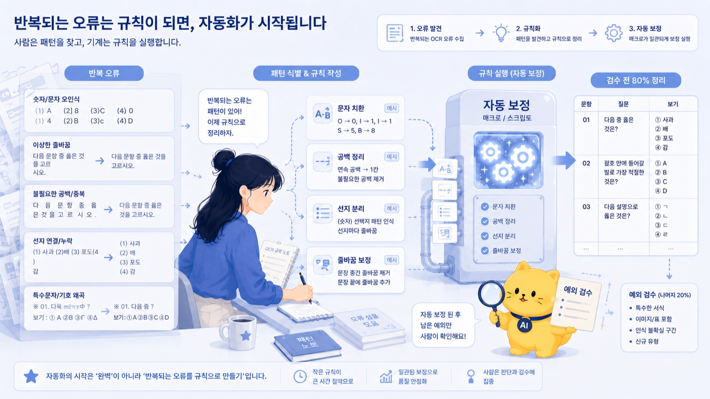

_나는 OCR을 했고, 왕조교는 분류했고, 원장은 판단했다의 문제의식이 처음 모습을 드러내는 장면._

그런데 집중력은 계속 필요하다.

단순한데 실수하면 뒤가 꼬인다.

그래서 나는 틀리는 패턴을 규칙으로 만들었다.

OCR이 자주 틀리는 부분을 보고,
반복되는 오류를 찾고,
그걸 Excel macro로 바꿨다.

어떤 문자열은 자동으로 바꾸고,
어떤 공백은 정리하고,
어떤 선지 패턴은 규칙에 맞게 나누고,
반복되는 보정은 사람이 아니라 매크로가 하게 했다.

거창한 AI는 아니었다.

그냥 엑셀 매크로였다.

하지만 원리는 지금의 자동화와 크게 다르지 않았다.

사람이 반복해서 고치던 오류를 관찰한다.
그 안에서 규칙을 찾는다.
규칙으로 만들 수 있는 부분을 도구에 넘긴다.
사람은 나머지 예외를 본다.

그때의 나는 AI 시대를 말하고 있지는 않았지만, 이미 사람의 손에서 반복 작업을 빼내고 있었다.

---

PPT 작업도 있었다.

문제를 옮기고, 붙이고, 맞추고, 정리하는 일.

솔직히 말하면, 그건 사람이 할 일이 아니었다.

적어도 사람이 계속 붙잡고 있을 일은 아니었다.

PPT에 문제를 붙이는 일은 창의적인 작업처럼 보이지 않는다.
그렇다고 아무렇게나 해도 되는 일도 아니다.

정렬이 어긋나면 보기 싫다.
문제 번호가 틀리면 안 된다.
이미지가 잘리면 안 된다.
선지가 빠지면 안 된다.
순서가 꼬이면 나중에 찾기 어렵다.

그러니까 묘하게 최악이다.

의미 있는 판단은 별로 없는데,
실수하면 귀찮고,
반복은 많고,
사람의 집중력은 계속 잡아먹는다.

이런 작업은 사람이 잘해서 가치가 생기는 일이 아니다.

사람이 계속 하고 있으면 사람이 닳는 일이다.

지금이라면 이런 작업은 당연히 script나 tool에게 맡겼을 것이다.

이미지를 규칙대로 자르고,
파일명을 붙이고,
PPT나 문서에 자동 배치하고,
문제 번호와 출처를 metadata로 관리하고,
빠진 항목만 사람이 확인하게 했을 것이다.

완벽할 필요도 없다.

80%만 맞아도 충분하다.

이게 중요하다.

모든 자동화가 처음부터 100% 정확해야 하는 것은 아니다.

raw extraction layer에서는 80%만 해줘도 가치가 크다.

사람이 처음부터 끝까지 하는 것보다,
도구가 80%를 밀어놓고,
사람이 나머지 20%를 고치는 편이 훨씬 낫다.

물론 고위험 작업에서는 기준이 달라진다.

의료, 연구 데이터, 개인정보, 법적 문서에서는 80%로 충분하지 않다.
그런 곳에서는 원문 확인과 검수 기준이 훨씬 엄격해야 한다.

하지만 문제 이미지를 옮기고, OCR 오류를 1차로 고치고, 선지 형식을 정리하는 단계에서는 이야기가 다르다.

완벽한 지능이 필요한 것이 아니다.

반복을 줄이는 손이 필요했다.

그 손은 사람의 손일 필요가 없었다.

---

왕조교가 하던 일은 달랐다.

왕조교는 단순히 OCR을 고치는 사람이 아니었다.

특정 유형에 대해 시중 10개 문제집에서 문제를 다 뽑아왔다.

이 말은 생각보다 복잡하다.

“이 유형의 문제를 뽑아온다”는 것은 단순 복붙이 아니다.

먼저 그 문제가 어떤 유형인지 알아야 한다.
겉으로 비슷해 보여도 실제로 묻는 개념이 다를 수 있다.
같은 단원 안에서도 계산형인지, 개념 확인형인지, 자료 해석형인지, 함정형인지 다를 수 있다.
어떤 문제는 대표 문제이고, 어떤 문제는 너무 지엽적이다.
어떤 문제는 학생에게 꼭 풀려야 하고, 어떤 문제는 굳이 넣지 않아도 된다.

이건 raw extraction이 아니다.

의미를 읽는 일이다.

문제를 보고,
무엇을 묻는지 파악하고,
비슷한 문제를 묶고,
유형을 붙이고,
필요한 문제를 고르는 일.

이것이 semantic classification layer다.

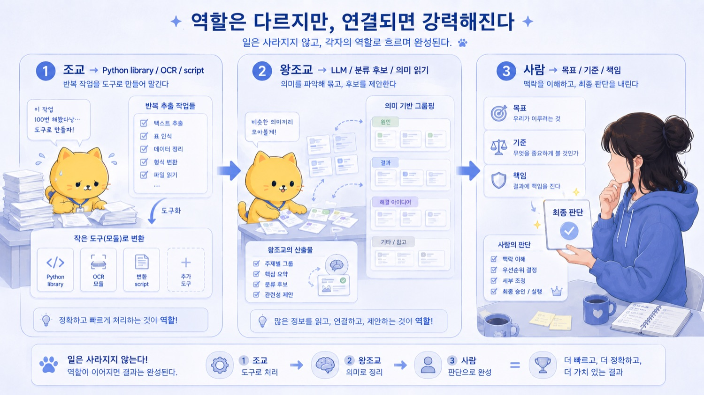

_작업의 흐름이 구체적인 구조로 바뀌는 순간._

지금이라면 LLM이 이 일을 상당 부분 도와줄 수 있다.

문제 텍스트를 읽고,
단원 후보를 붙이고,
유형을 분류하고,
비슷한 문제를 묶고,
난이도 후보를 추정하고,
대표 문제 후보를 제안할 수 있다.

물론 LLM이 최종 교재를 책임질 수는 없다.

LLM은 분류 후보를 만들 수 있다.

하지만 그 분류 기준을 무엇으로 할지 정해야 한다.
교육과정 기준인지, 학원 자체 커리큘럼 기준인지, 학생 수준 기준인지, 시험 대비 기준인지 정해야 한다.
그리고 분류가 맞는지 샘플을 검수해야 한다.
기준이 흔들리면 다시 조정해야 한다.

LLM은 의미를 읽는 반복 작업자에 가깝다.

왕조교가 하던 일을 전부 대체한다기보다, 왕조교가 하던 후보 작업을 빠르게 넓혀줄 수 있다.

예전에는 시중 10개 문제집을 사람이 넘겨보며 뽑았다.

지금이라면 LLM이 먼저 넓게 뽑고, 사람이 좁히는 방식이 가능하다.

이 차이가 크다.

---

원장이 하던 일은 또 다르다.

원장은 OCR을 고치는 사람이 아니었다.
문제 하나하나를 유형별로 태그 붙이는 사람도 아니었다.

원장은 전체 경향을 봤다.

이 교재는 누구를 위한 것인가.
학생 수준은 어느 정도인가.
너무 어려운가, 너무 쉬운가.
이 유형을 더 넣어야 하는가.
이 문제는 대표성이 있는가.
수업에 쓰기 적합한가.
교재로 팔 수 있는 품질인가.
전체 난이도 흐름이 맞는가.
상품성이 있는가.

이건 단순 분류가 아니다.

목표와 기준과 책임의 문제다.

여기에는 맥락이 들어간다.

학생을 아는 사람의 감각.
학원 수업의 방향.
시험 대비 전략.
학부모가 기대하는 수준.
교재로 만들었을 때의 품질.
수업에서 실제로 쓸 수 있는지에 대한 판단.

AI가 후보를 줄 수는 있다.

“이 문제는 난이도 중상으로 보입니다.”
“이 문제는 그래프 해석 유형입니다.”
“이 단원에서는 이런 유형이 자주 나옵니다.”
“대표 문제 후보는 이것입니다.”

이런 말은 할 수 있다.

하지만 최종적으로 이 교재가 어떤 방향이어야 하는지, 이 문제를 넣을지 뺄지, 이 구성으로 학생에게 내도 되는지 판단하는 것은 사람의 일이다.

왜냐하면 그 판단에는 책임이 붙기 때문이다.

교재가 별로면 AI가 욕먹지 않는다.
수업이 흔들리면 AI가 책임지지 않는다.
학생에게 맞지 않는 난이도면 AI가 설명하지 않는다.
상품으로 팔 수 없는 품질이면 AI가 손해를 감당하지 않는다.

최종 판단은 사람에게 남는다.

이 층위가 judgment layer다.

---

이제 같은 workflow를 AI 시대의 언어로 다시 보면 구조가 선명해진다.

내가 하던 OCR, 엑셀 매크로, 선지 정리, 이미지 정리, PPT 배치 같은 일은 Python library, OCR, parser, script, macro가 맡을 수 있다.

왕조교가 하던 유형 분류, 문제 묶기, 난이도 후보, 대표 문제 후보 선정은 LLM이 맡을 수 있다.

원장이 하던 목표 설정, 난이도 방향, 상품성, 수업 적합성, 최종 품질 판단은 사람이 맡아야 한다.

다시 말하면 이렇다.

조교는 Python library가 된다.
왕조교는 LLM이 된다.
사람은 여전히 사람으로 남는다.

이 문장이 조금 웃기지만, 핵심은 꽤 정확하다.

사람이 사라지는 것이 아니다.

사람이 하던 일의 일부가 아래층으로 내려간다.

손으로 옮기던 일은 tool로 내려간다.
반복적으로 의미를 읽고 분류하던 일은 LLM으로 이동한다.
하지만 목표와 기준과 책임은 사람에게 남는다.

이것이 AI 업무 재배치 모델이다.

---

이 모델은 교재 제작에만 적용되는 것이 아니다.

브런치북 작업도 비슷했다.

처음에는 대화가 있었다.
긴 대화 속에 장면, 감정, 비유, 개념, 원고 조각이 섞여 있었다.

raw extraction layer에서는 그 대화와 메모를 꺼내고, markdown 파일로 만들고, 챕터별 자료를 나눴다.

semantic classification layer에서는 AI가 핵심 개념을 뽑았다.

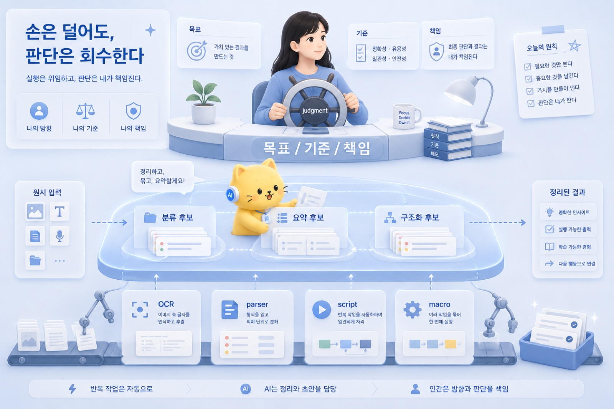

_사람의 판단과 AI의 실행이 나뉘는 지점을 보여주는 장면._

AI 대화는 Inbox다.
AI 대화는 Distiller다.
프롬프트는 주문이 아니라 업무 명세서다.
AI는 평균적 작업자다.
Active Package와 Cold Storage가 필요하다.

이런 식으로 개념 이름이 붙었다.

judgment layer에서는 내가 판단했다.

이게 내 글인가.
이 문장이 내 경험을 정확히 담고 있는가.
너무 생산성 팁처럼 보이지 않는가.
춘식이 농담이 메시지를 가리지는 않는가.
어떤 챕터를 active로 둘 것인가.
어떤 글은 cold storage로 보낼 것인가.
최종적으로 브런치에 올려도 되는가.

AI는 많은 것을 도왔다.

하지만 최종적으로 이 책이 무엇인지 정하는 일은 나에게 남았다.

---

연구계획서도 비슷하다.

예를 들어 EstroFrame 같은 연구 아이디어를 생각해보자.

처음에는 흐릿한 아이디어가 있다.

GAHT 환자에서 estradiol 농도를 pharmacokinetic model로 예측해보면 어떨까.
observed value와 predicted value를 비교하면 의미가 있지 않을까.
제형, 용량, 투여 간격, lab timing이 prediction error에 영향을 주지 않을까.

raw extraction layer에서는 자료를 모은다.

EMR에서 처방 기록을 확인한다.
estradiol lab value를 가져온다.
투여 제형, 용량, 간격, 검사 시점 같은 변수를 뽑는다.
논문과 guideline을 읽고 필요한 배경 정보를 정리한다.

semantic classification layer에서는 연구 구조로 바꾼다.

대상자.
exposure.
outcome.
primary endpoint.
required variables.
prediction error.
feasibility issue.
analysis plan.

AI는 이 구조화를 도울 수 있다.

하지만 judgment layer는 사람에게 남는다.

이 연구 질문이 의미 있는가.
primary endpoint가 충분히 강한가.
실제 데이터로 검증 가능한가.
IRB에서 문제가 될 부분은 무엇인가.
교수님께 지금 제안할 만한가.
내가 이 연구를 lead할 수 있는가.

이 판단은 AI가 대신할 수 없다.

AI는 research draft를 만들 수 있다.
하지만 연구의 방향과 책임은 사람이 진다.

---

의료 workflow도 마찬가지다.

EMR에는 정보가 많다.

note가 있고,
lab이 있고,
medication record가 있고,
진단명이 있고,
수술 기록이 있고,
영상 판독문이 있고,
퇴원 요약이 있다.

문제는 정보가 없다는 것이 아니다.

구조가 부족하다는 것이다.

raw extraction layer에서는 이 정보를 꺼내야 한다.

note를 가져오고,
lab table을 정리하고,
medication timeline을 만들고,
날짜를 맞추고,
누락값을 표시한다.

semantic classification layer에서는 의미를 읽는다.

active problem 후보.
최근 악화된 문제.
follow-up이 필요한 항목.
약물 변경 이력.
수술 전후 관련 정보.
연구 변수 후보.

AI는 여기서 cognitive preprocessing을 할 수 있다.

하지만 judgment layer는 사람에게 남는다.

오늘 이 환자에게 가장 중요한 문제는 무엇인가.
이 lab 변화가 임상적으로 의미 있는가.
추가 검사가 필요한가.
환자에게 어떻게 설명해야 하는가.
AI가 놓친 red flag는 없는가.
이 판단에 책임질 수 있는가.

의료에서 AI가 할 수 있는 일은 많다.

하지만 최종 판단자는 의사다.

이 경계가 흐려지면 위험하다.

---

그래서 AI 업무 재배치 모델에서 중요한 것은 “AI가 할 수 있나?”가 아니다.

질문을 바꿔야 한다.

이 일의 raw input은 무엇인가?
그 raw input을 자동으로 꺼낼 수 있는가?
반복되는 형식 변환은 무엇인가?
의미 분류가 필요한 부분은 어디인가?
분류 기준은 누가 정하는가?
LLM이 만든 후보를 누가 검수하는가?
최종 판단은 누가 하는가?
오류가 생기면 누가 책임지는가?
이 workflow는 다시 쓸 수 있는가?

이 질문을 던지면 일이 다르게 보인다.

하나의 커다란 업무가 아니라, 여러 층위의 조합으로 보인다.

그러면 AI에게 일을 통째로 던지지 않게 된다.

“교재 만들어줘.”
“연구계획서 써줘.”
“EMR 정리해줘.”
“책 만들어줘.”

이렇게 던지는 대신, 일을 나눈다.

원자료는 어떻게 가져올지.
어떤 형식으로 정리할지.
어떤 기준으로 분류할지.
어떤 후보를 만들지.
어디서 사람이 검수할지.
최종 결정은 누가 할지.

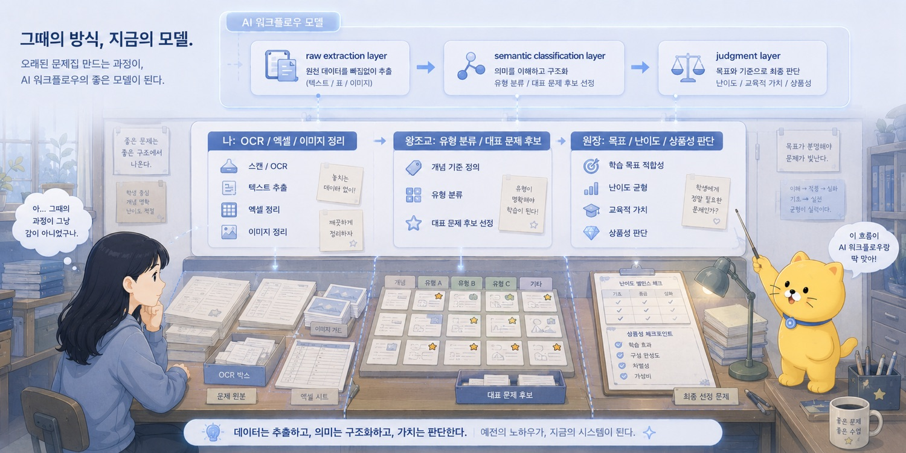

_나는 OCR을 했고, 왕조교는 분류했고, 원장은 판단했다의 결론을 이미지로 정리한 장면._

이것이 workflow를 설계하는 일이다.

---

물론 이 모델에도 위험이 있다.

첫 번째 위험은 judgment layer까지 AI에게 넘기는 것이다.

AI가 너무 그럴듯하게 말하면, 사람이 판단까지 넘기고 싶어진다.

“이 문제가 대표 문제인가?”
“이 연구 endpoint가 괜찮은가?”
“이 환자에게 중요한 문제는 무엇인가?”
“이 문장을 보내도 되는가?”

AI는 답을 줄 수 있다.

하지만 그 답은 최종 판단이 아니다.

후보다.

검토할 재료다.

두 번째 위험은 raw extraction 오류가 뒤로 전파되는 것이다.

OCR이 틀리면 그다음 분류도 틀어진다.
lab value가 잘못 들어가면 분석도 틀어진다.
날짜가 어긋나면 timeline이 틀어진다.
파일명이 꼬이면 전체 workflow가 꼬인다.

아래층 오류는 위층 판단을 오염시킨다.

그래서 raw layer를 tool에게 맡기더라도 품질 확인이 필요하다.

세 번째 위험은 분류 기준이 흔들리는 것이다.

LLM에게 그냥 “분류해줘”라고 하면 평균적으로 분류한다.

하지만 평균적인 분류가 내가 원하는 분류는 아닐 수 있다.

교재에서는 교육과정과 수업 목표가 기준이다.
연구에서는 primary endpoint와 변수 정의가 기준이다.
의료에서는 임상적 중요도와 환자 안전이 기준이다.
팀 운영에서는 책임소재와 상대 반응 가능성이 기준이다.

기준 없이 LLM에게 맡기면 그럴듯하지만 흐릿한 결과가 나온다.

네 번째 위험은 자동화 자체가 목적이 되는 것이다.

자동화는 멋있다.

script가 돌고,
파일이 생성되고,
표가 만들어지고,
PDF가 빌드되면 기분이 좋다.

하지만 자동화가 목적이 되면 이상한 pipeline이 생긴다.

왜 하는지 모르는 자동화.
검수 지점이 없는 자동화.
오류를 빠르게 퍼뜨리는 자동화.
사람의 판단을 흐리게 만드는 자동화.

자동화는 일을 줄이기 위한 것이 아니라, 사람이 봐야 할 지점을 선명하게 만들기 위한 것이어야 한다.

---

이렇게 보면 AI 시대의 사람은 이상한 위치로 이동한다.

예전에는 강한 사람이 모든 것을 손으로 하는 사람처럼 보였다.

자료를 직접 찾고,
문제를 직접 옮기고,
문서를 직접 정리하고,
코드를 직접 치고,
표를 직접 만들고,
처음부터 끝까지 다 해내는 사람.

그 능력은 여전히 중요하다.

직접 해본 사람만이 좋은 workflow를 설계할 수 있다.
한 번도 해보지 않은 일을 AI에게 맡기면, 결과가 맞는지 틀린지 알기 어렵다.

하지만 앞으로 강한 사람은 모든 raw 작업을 끝까지 직접 하는 사람이 아닐 것이다.

강한 사람은 일을 층위별로 나눌 줄 아는 사람이다.

어떤 일은 도구에게 맡긴다.
어떤 일은 LLM에게 후보를 만들게 한다.
어떤 일은 사람이 반드시 본다.
어떤 일은 자동화하지 않는다.
어떤 일은 검수 지점을 늘린다.
어떤 일은 output보다 workflow를 남긴다.

사람은 손에서 조금 물러난다.

하지만 판단에서는 물러나면 안 된다.

---

나는 예전에 OCR을 했다.

틀린 문자를 찾고,
반복되는 오류를 보고,
Excel macro를 만들고,
선지를 정리하고,
문제 이미지를 옮기고,
PPT를 만졌다.

왕조교는 문제를 유형별로 분류하고 골랐다.

원장은 목표와 난이도와 상품성을 판단했다.

그때는 그냥 학원 교재 제작이었다.

지금 돌아보면 그 안에 AI 시대의 업무 구조가 있었다.

조교는 Python library가 될 수 있다.
왕조교는 LLM이 될 수 있다.
하지만 사람은 여전히 사람으로 남는다.

AI 시대에 일은 사라지는 것이 아니라 재배치된다.

반복되는 손의 일은 도구로 내려가고,
반복되는 의미 분류는 LLM으로 이동하고,
목표와 판단과 책임은 사람에게 남는다.

\newpage

## 14. LLM은 왕이 아니라 Adapter다

처음에는 LLM을 글쓰기 도구라고 생각하기 쉽다.

메일을 써주는 도구.
보고서를 정리해주는 도구.
긴 글을 요약해주는 도구.
발표자료 초안을 만들어주는 도구.
브런치 글을 조금 더 매끄럽게 다듬어주는 도구.

나도 처음에는 그렇게 썼다.

“이거 정리해줘.”
“이 문장 다듬어줘.”
“이 글 요약해줘.”
“이 메일 좀 공손하게 바꿔줘.”

물론 이것도 쓸모 있다.

문장을 다듬는 일은 귀찮고,
요약은 시간이 걸리고,
메일 첫 문장을 여는 일은 생각보다 피곤하다.

LLM은 이런 일을 잘한다.

그런데 계속 쓰다 보면 이상한 감각이 든다.

LLM이 하는 일이 단순히 글을 쓰는 것만은 아니라는 감각이다.

글을 쓰는 것처럼 보이지만, 사실은 뭔가를 다른 형식으로 바꾸고 있다.

생각을 문서로 바꾼다.
대화를 목차로 바꾼다.
연구 아이디어를 변수표로 바꾼다.
오류 로그를 원인 후보로 바꾼다.
자연어 요청을 Codex 작업지시문으로 바꾼다.
EMR note를 problem list 후보로 바꾼다.

이건 단순 글쓰기가 아니다.

형식과 형식 사이를 건너는 일이다.

의미를 옮기는 일이다.

LLM은 왕이 아니었다.

LLM은 adapter였다.

---

이 생각이 선명해진 건 Whisper API를 공부하면서였다.

Whisper는 음성을 텍스트로 바꾼다.

누군가 말한다.
그 말은 처음에는 소리다.

공기 중의 진동이고,
파형이고,
음성 신호다.

사람은 그걸 듣고 의미를 이해한다.

하지만 컴퓨터가 그걸 다루려면 다른 형태가 필요하다.

음성은 transcript가 된다.
말소리는 문장이 된다.
여러 나라의 음성은 텍스트로 옮겨지고, 필요하면 번역된다.

즉 음성이라는 모델과 텍스트라는 모델 사이에 번역이 일어난다.

처음에는 그냥 음성 인식이라고 생각했다.

그런데 들여다보면 조금 다르게 보인다.

Whisper는 소리를 글자로 바꾸는 도구다.

하지만 더 넓게 보면, 현실의 신호를 텍스트라는 중간표현으로 태우는 장치다.

음성은 그 자체로는 많은 서비스와 바로 연결되기 어렵다.

하지만 텍스트가 되는 순간 달라진다.

요약할 수 있다.
검색할 수 있다.
번역할 수 있다.
회의록으로 만들 수 있다.
action item으로 바꿀 수 있다.
데이터베이스에 저장할 수 있다.
다른 AI에게 넘길 수 있다.
명령어로 바꿀 수도 있다.

소리가 텍스트가 되는 순간, 그 정보는 다른 시스템들과 연결되기 시작한다.

여기서 깨달았다.

아, LLM도 비슷하구나.

LLM은 자연어를 다른 자연어로만 바꾸는 것이 아니다.

LLM은 사람의 애매한 말을 기계가 처리할 수 있는 형식에 가깝게 바꾼다.

개떡같이 말해도 찰떡같이 바꿔주는 일.

이 표현이 좀 웃기지만, 꽤 정확하다.

사람은 대충 말한다.

“이거 좀 정리해줘.”
“이 파일들 보고 뭐가 문제인지 봐줘.”
“이 내용을 Codex한테 시킬 수 있게 바꿔줘.”
“이 환자 차트에서 오늘 봐야 할 거 뽑아줘.”
“이 연구 아이디어 IRB 초안처럼 만들어줘.”
“이 에러 로그가 뭔 뜻인지 설명해줘.”

사람의 말은 흐릿하다.

맥락이 섞여 있고,
목적이 덜 정의되어 있고,
출력 형식도 애매하고,
가끔은 본인도 정확히 뭘 원하는지 모른다.

LLM은 이 애매한 자연어를 받아서 조금 더 작업 가능한 형태로 바꾼다.

목차로 바꾸고,
표로 바꾸고,
JSON처럼 생긴 구조로 바꾸고,
Python script 후보로 바꾸고,
CLI command 후보로 바꾸고,
Codex용 작업지시문으로 바꾸고,
연구계획서의 항목으로 바꾸고,
EMR에서 뽑아야 할 변수 후보로 바꾼다.

이때 LLM은 글을 쓰고 있는 것이 아니다.

사람 언어와 기계 언어 사이를 번역하고 있다.

---

현대의 많은 것은 텍스트로 연결된다.

이 말이 처음에는 조금 추상적으로 들릴 수 있다.

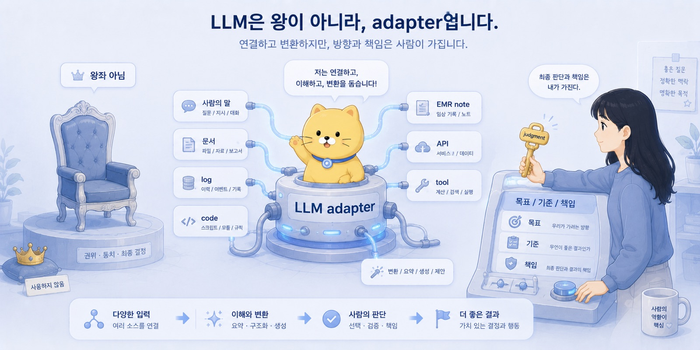

_LLM은 왕이 아니라 Adapter다의 문제의식이 처음 모습을 드러내는 장면._

하지만 내가 실제로 쓰는 작업들을 보면 그렇다.

Markdown은 텍스트다.
CSV도 텍스트다.
JSON도 텍스트다.
log도 텍스트다.
error traceback도 텍스트다.
code도 텍스트다.
README도 텍스트다.
API request와 response도 대부분 텍스트로 표현된다.
CLI command도 텍스트다.
Git diff도 텍스트다.
논문도 텍스트다.
EMR note도 텍스트다.
처방 기록과 lab table도 결국 어떤 형태로든 텍스트나 표로 표현된다.

기계가 읽는 텍스트와 사람이 읽는 텍스트의 모양은 다르다.

사람은 이렇게 말한다.

“이거 왜 에러 났어?”

기계는 이렇게 말한다.

`TypeError: cannot read property of undefined`

사람은 이렇게 말한다.

“이 연구에서 뽑아야 할 변수 정리해줘.”

기계나 문서는 이렇게 흩어져 있다.

논문 PDF.
EMR note.
lab table.
처방 기록.
날짜.
용량.
제형.
검사 시점.

사람은 이렇게 말한다.

“이 글 브런치북 챕터로 정리해줘.”

작업 시스템은 이렇게 움직인다.

markdown file.
chapter metadata.
image prompt.
caption.
privacy checklist.
publish status.

겉보기에는 서로 다른 세계처럼 보인다.

하지만 중간에 텍스트가 있다.

사람의 말도 텍스트가 될 수 있고,
기계의 출력도 텍스트이고,
문서도 텍스트이고,
데이터도 텍스트로 표현될 수 있고,
코드도 텍스트이고,
오류도 텍스트로 남는다.

텍스트는 인간과 기계, 문서와 서비스, 현실과 시스템을 잇는 universal bus가 되고 있다.

그리고 LLM은 그 bus 위에서 의미를 바꿔 끼우는 adapter다.

---

adapter는 원래 서로 맞지 않는 것을 연결한다.

USB-C 포트와 HDMI 케이블은 바로 맞지 않는다.

그래서 adapter가 필요하다.

전압이 다르면 변압기가 필요하다.
파일 형식이 다르면 변환기가 필요하다.
서비스의 API가 복잡하면 wrapper가 필요하다.

LLM은 의미 수준에서 이런 역할을 한다.

내가 대충 말한 자연어와,
기계가 요구하는 구조화된 형식은 바로 맞지 않는다.

내가 말한 연구 아이디어와,
IRB 문서의 항목은 바로 맞지 않는다.

내가 겪은 인간관계 경험과,
다음에 쓸 communication protocol은 바로 맞지 않는다.

긴 EMR note와,
오늘 진료에서 확인할 problem list 후보는 바로 맞지 않는다.

error log와,
내가 실제로 확인해야 할 파일 목록은 바로 맞지 않는다.

LLM은 그 사이를 연결한다.

이게 universal adapter라는 말의 핵심이다.

LLM은 단순히 예쁜 문장을 만드는 도구가 아니다.

비정형 정보를 구조화하고,
구조화된 정보를 다른 형식으로 변환하고,
사람의 의도를 기계가 처리 가능한 형태에 가깝게 옮기는 도구다.

---

예를 들어 내가 ChatGPT와 한참 이야기한다.

처음에는 말이 엉망이다.

“아니 이거 뭔가 있지 않냐?”
“AI가 일을 해주긴 하는데, 내가 없어지는 느낌은 아니고.”
“춘식이가 귀엽긴 한데, 결국 버튼은 내가 누르잖아.”
“프롬프트라기보다는 업무지시서 같음.”
“AI는 평균으로 가고, 내가 좌표계를 줘야 하는 듯.”

이건 아직 책이 아니다.

그냥 대화다.

그런데 LLM은 이 대화를 바꿔준다.

챕터 제목으로 바꾼다.
핵심 문장으로 바꾼다.
목차로 바꾼다.
원고 구조로 바꾼다.
Codex에게 줄 작업지시문으로 바꾼다.
이미지 생성용 prompt로 바꾼다.
metadata로 바꾼다.

이 과정에서 LLM은 글쓰기 도구이기도 하지만, 그보다 더 크게는 형식 변환기다.

raw thought를 markdown으로 바꾼다.
markdown을 챕터 카드로 바꾼다.
챕터 카드를 Codex용 plan으로 바꾼다.
원고를 삽화 prompt로 바꾼다.
브런치북 구상을 repository 작업 단위로 바꾼다.

내가 한 말은 자연어였지만, LLM은 그것을 다른 작업자들이 처리할 수 있는 형태로 바꿨다.

이게 adapter다.

---

Codex 작업지시문을 만들 때도 이 감각이 강하다.

나는 처음부터 Codex에게 바로 말하지 않는다.

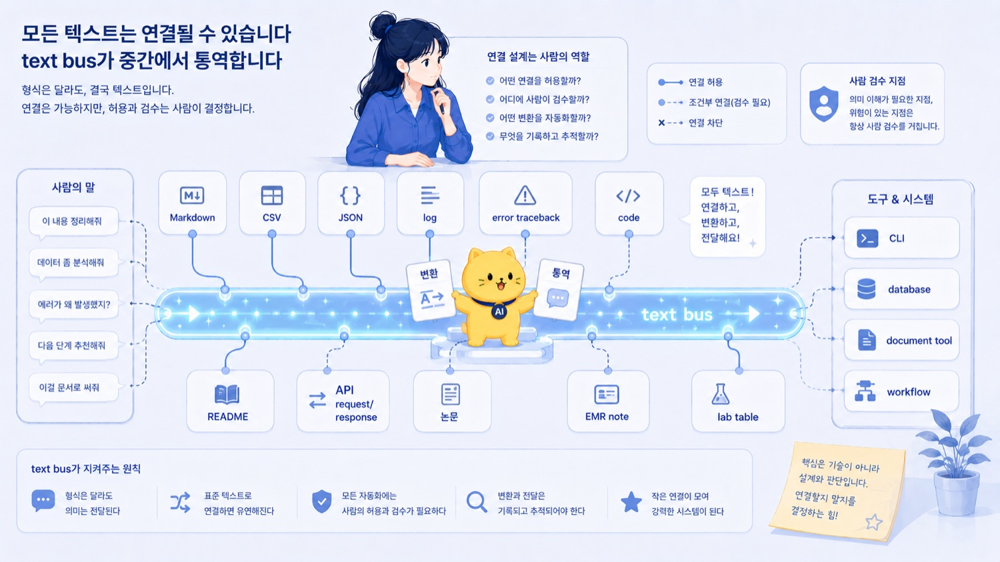

_작업의 흐름이 구체적인 구조로 바뀌는 순간._

먼저 ChatGPT와 이야기한다.

“이 repo에서 이런 작업을 하고 싶어.”
“이 파일은 건드리면 안 돼.”
“브런치 발행용 markdown을 따로 만들고 싶어.”
“이미지 placeholder도 필요해.”
“개인정보 위험도 체크해야 해.”
“최종적으로 Codex가 뭘 하면 좋을까?”

내 말은 대체로 자연어다.

중간중간 감정도 섞인다.
맥락도 길다.
무엇이 중요한지 내가 말하면서 정리되는 경우도 많다.

그러면 ChatGPT는 그것을 Codex용 작업지시문으로 바꾼다.

목표.
배경.
읽어야 할 파일.
수정해도 되는 파일.
수정하면 안 되는 파일.
출력 위치.
작업 순서.
검증 방법.
주의사항.
성공 조건.

이건 단순한 요약이 아니다.

사람의 의도를 다른 AI 작업자가 실행 가능한 구조로 변환한 것이다.

내 자연어는 애매하다.

Codex는 repository 안에서 움직이는 시공팀이다.

그 사이에 ChatGPT가 adapter로 들어간다.

사람 언어를 작업 언어로 바꾸는 중간층이 생기는 것이다.

---

Whisper API도 같은 맥락으로 보인다.

사람이 말한다.

그 말은 음성이다.

Whisper는 그것을 텍스트로 바꾼다.

그다음 LLM은 그 텍스트를 다시 다른 형식으로 바꿀 수 있다.

음성 회의
→ transcript
→ 회의록
→ action item
→ 일정 후보
→ 담당자별 task
→ 이메일 초안

이 흐름을 보면 음성 인식과 LLM은 따로 노는 것이 아니다.

둘 다 현실의 신호를 다른 시스템이 다룰 수 있는 형태로 바꾸는 역할을 한다.

Whisper는 음성을 텍스트로 태운다.
LLM은 텍스트를 의미 단위로 재배치한다.
tool과 API는 그 결과를 실제 작업으로 옮긴다.

이때 텍스트는 bus가 된다.

음성은 일단 텍스트가 되어야 다른 시스템으로 흐를 수 있다.

회의 음성이 transcript가 되면,
LLM이 회의록으로 만들 수 있고,
calendar API가 일정을 만들 수 있고,
task manager가 할 일을 만들 수 있고,
email tool이 후속 메일을 만들 수 있다.

LLM은 모든 일을 직접 하지 않는다.

하지만 여러 시스템이 서로 알아들을 수 있게 만든다.

그래서 LLM은 만능 왕이라기보다 스위스 아미 나이프에 가깝다.

칼도 있고,
가위도 있고,
드라이버도 있고,
병따개도 있다.

그 하나로 집을 다 지을 수는 없다.

하지만 여러 상황에서 “일단 연결하고 처리할 수 있게 해주는” 작은 도구들이 들어 있다.

LLM도 그렇다.

모든 것을 완벽히 대체하지는 못한다.

하지만 이상할 정도로 많은 형식 사이에 끼어들 수 있다.

---

의료와 EMR에서는 이 관점이 더 중요해진다.

EMR에는 정보가 많다.

의사 note.
간호 기록.
lab result.
medication list.
imaging report.
procedure note.
diagnosis.
referral letter.
discharge summary.
환자 message.

문제는 정보가 없다는 것이 아니다.

정보가 너무 많은데, 바로 쓰기 좋은 구조가 아니라는 것이다.

긴 note는 사람이 읽어야 하는 문장으로 남아 있고,
lab은 표로 흩어져 있고,
medication history는 시간축으로 정리되어 있지 않고,
수술 전후 정보는 여러 기록에 나뉘어 있고,
연구에 필요한 변수는 EMR 안에 숨어 있다.

여기서 LLM은 글쓰기 도구가 아니다.

adapter다.

EMR note를 problem list 후보로 바꾼다.
lab table을 trend 요약으로 바꾼다.
medication history를 timeline 후보로 바꾼다.
GAHT 처방 기록을 route, dose, interval, timing 변수 후보로 바꾼다.
estradiol lab value를 observed data로 정리한다.
연구 아이디어를 IRB 초안 구조로 바꾼다.

이건 진단을 대신한다는 말이 아니다.

오히려 그 반대다.

LLM은 cognitive preprocessing을 한다.

흩어진 정보를 사람이 판단하기 좋은 형태로 바꿔준다.

하지만 최종 판단은 의사에게 남는다.

오늘 이 환자에게 무엇이 중요한지,
어떤 lab 변화가 임상적으로 의미 있는지,
어떤 설명이 필요한지,
무엇이 위험 신호인지,
이 정보를 실제 진료에 어떻게 반영할지는 사람이 봐야 한다.

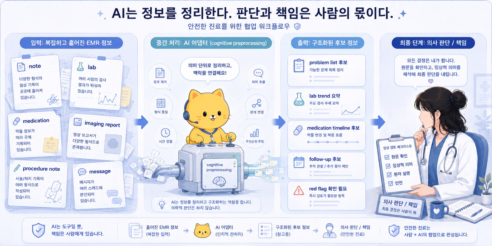

_사람의 판단과 AI의 실행이 나뉘는 지점을 보여주는 장면._

LLM은 EMR과 의사 사이의 adapter가 될 수 있다.

하지만 의사의 책임을 대체할 수는 없다.

---

연구에서도 마찬가지다.

연구 아이디어는 처음에 자연어로 온다.

“Transfeminine GAHT 환자에서 estradiol lab value를 pharmacokinetic model로 어느 정도 예측할 수 있을까?”

이 문장은 아직 연구계획서가 아니다.

LLM은 이 문장을 다른 형식으로 바꿔준다.

연구 질문.
background.
objective.
inclusion criteria.
exclusion criteria.
variable table.
primary endpoint.
secondary endpoint.
analysis plan.
IRB 문구.
교수님께 보낼 요약 메일.

즉 연구자의 직감을 연구 문서의 형식으로 옮긴다.

반대로 논문 PDF나 EMR data를 읽고, 연구에 필요한 변수 후보를 뽑을 수도 있다.

논문 methods를 변수표로 바꾸고,
교수님 피드백을 revision plan으로 바꾸고,
IRB 초안을 체크리스트로 바꾸고,
분석계획을 코드 작업 단위로 바꿀 수 있다.

이 모든 것은 텍스트 사이의 변환이다.

하지만 형식이 맞다고 내용이 맞는 것은 아니다.

그럴듯한 variable table이 나왔다고 연구가 성립하는 것은 아니다.
IRB 형식처럼 보인다고 윤리적 문제가 사라지는 것은 아니다.
분석계획이 매끄럽다고 실제 데이터로 가능한 것은 아니다.

LLM은 연구 workflow의 adapter가 될 수 있다.

하지만 연구의 판단자는 아니다.

---

LLM과 tool이 연결되면 이 힘은 더 커진다.

LLM 혼자서는 많은 일을 말로만 한다.

하지만 LLM이 API, CLI, filesystem, database, document tool과 연결되면 작업 시스템이 된다.

흐름은 대략 이렇다.

사람이 자연어로 요청한다.

“이 폴더 안 markdown 파일들을 읽고, 브런치 발행용 metadata를 만들어줘.”

LLM이 의도를 해석한다.

필요한 파일을 찾는다.
읽어야 할 정보를 정한다.
metadata schema를 만든다.
부족한 값을 표시한다.
필요하면 script나 CLI 명령을 제안한다.
결과를 사람이 읽을 수 있는 형태로 보고한다.

여기서 LLM은 모든 것을 직접 하는 존재가 아니다.

LLM은 coordinator에 가깝다.

무엇을 해야 하는지 해석하고,
어떤 tool이 필요한지 고르고,
tool의 입력 형식을 만들고,
결과를 해석하고,
다음 행동 후보를 만든다.

tool은 손이다.

파일을 읽고,
명령을 실행하고,
데이터를 변환하고,
PDF를 만들고,
API를 호출한다.

LLM은 의미를 연결한다.

사람은 방향을 정하고 결과를 검수한다.

이 셋이 합쳐지면 workflow가 된다.

사람.
LLM.
tool.

이 구조를 보면 LLM이 왜 adapter인지 더 분명해진다.

LLM은 사람과 tool 사이에서 의미를 맞춰준다.

사람은 “대충 이런 걸 하고 싶다”고 말한다.

tool은 정확한 입력을 요구한다.

LLM은 그 사이를 번역한다.

---

하지만 adapter는 위험할 수도 있다.

잘못 연결하면 문제가 생긴다.

첫 번째 위험은 형식은 맞는데 내용이 틀리는 것이다.

LLM은 그럴듯한 표를 만들 수 있다.
그럴듯한 JSON을 만들 수 있다.
그럴듯한 연구계획서 구조를 만들 수 있다.
그럴듯한 EMR 요약을 만들 수 있다.

하지만 그럴듯함은 정확성과 다르다.

표 모양은 맞는데 변수 정의가 틀릴 수 있다.
JSON 형식은 맞는데 값이 틀릴 수 있다.
연구계획서처럼 보이는데 endpoint가 약할 수 있다.
EMR 요약은 깔끔한데 중요한 red flag를 놓칠 수 있다.

두 번째 위험은 검수 책임이 흐려지는 것이다.

LLM이 중간에서 너무 자연스럽게 바꿔주면, 사람은 착각하기 쉽다.

“AI가 정리했으니 맞겠지.”

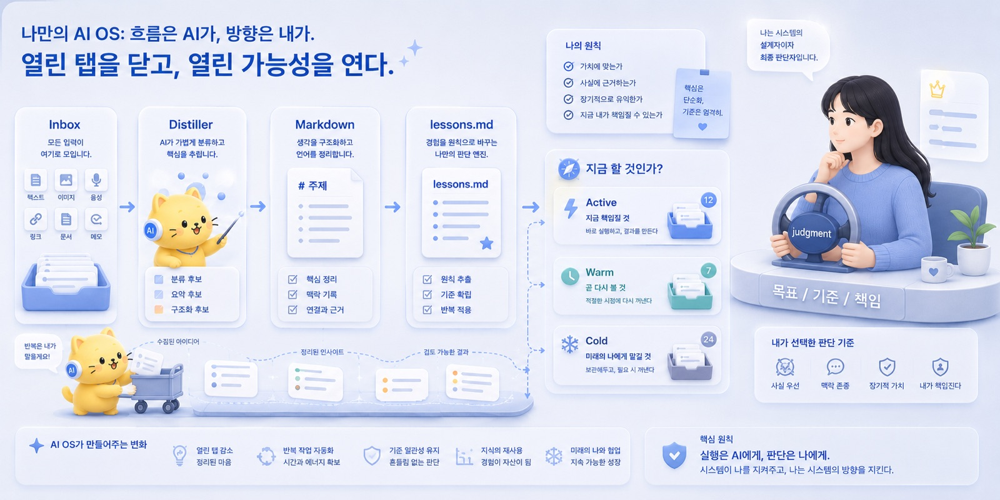

_LLM은 왕이 아니라 Adapter다의 결론을 이미지로 정리한 장면._

하지만 아니다.

LLM은 adapter다.

adapter가 연결해준다고 해서, 연결된 내용이 자동으로 참이 되는 것은 아니다.

세 번째 위험은 tool 호출이 실제 세계를 건드릴 때 생긴다.

잘못된 CLI command.
잘못된 API call.
잘못된 파일 삭제.
잘못된 database update.
개인정보가 포함된 데이터 처리.

이런 작업에서는 LLM이 만든 명령을 그대로 실행하면 안 된다.

사람의 승인과 검수 지점이 필요하다.

특히 의료, 연구윤리, 개인정보, 논문 통계, 실제 배포 코드에서는 더 그렇다.

LLM은 강력한 adapter다.

강력하기 때문에 검증 구조가 필요하다.

---

그래서 LLM을 universal adapter로 본다는 것은 LLM을 숭배하자는 말이 아니다.

오히려 반대다.

LLM을 왕처럼 보면 위험하다.

왕은 명령하고 결정한다.
왕은 최종 판단을 내린다.
왕은 방향을 정한다.

LLM에게 그런 자리를 주면 안 된다.

LLM은 adapter다.

연결한다.
번역한다.
구조화한다.
형식을 바꾼다.
후보를 만든다.
사람과 tool 사이를 이어준다.

하지만 목표를 정하지 않는다.
책임지지 않는다.
현실의 후폭풍을 겪지 않는다.
환자에게 설명하지 않는다.
교수님께 연구 방향을 설득하지 않는다.
내 이름으로 브런치 글을 발행하지 않는다.

그건 사람의 일이다.

AI 시대의 builder는 LLM을 왕으로 모시는 사람이 아니다.

AI 시대의 builder는 현실 문제를 text bus에 태우고, LLM과 tool이 처리 가능한 workflow로 바꾸는 사람이다.

현실의 복잡한 문제를 본다.
어떤 정보가 들어오는지 본다.
그 정보가 텍스트로 바뀔 수 있는지 본다.
LLM이 의미를 변환할 수 있는 부분을 찾는다.
tool이나 API가 실제 처리를 맡을 부분을 나눈다.
사람이 검수하고 판단해야 할 지점을 남긴다.

이것이 builder의 일이다.

---

나에게 이 관점이 중요한 이유도 여기에 있다.

내가 다루는 것들은 겉보기에는 서로 다르다.

브런치북.
Codex.
Whisper API.
Markdown.
EMR.
GAHT.
PK model.
IRB.
연구계획서.
교수님 메일.
인간관계 protocol.
팀 운영 공지문.
개인 AI 운영체계.

이것들은 전부 다른 영역처럼 보인다.

하지만 universal adapter 관점에서는 비슷하다.

항상 어떤 원재료가 있다.

음성.
대화.
문서.
note.
lab table.
처방 기록.
에러 로그.
코드.
감정.
아이디어.

그리고 그것을 다른 형태로 바꿔야 한다.

음성은 transcript가 된다.
대화는 markdown이 된다.
연구 아이디어는 IRB 초안이 된다.
GAHT 처방 기록은 structured variable이 된다.
estradiol lab value는 observed data가 된다.
PK model은 predicted data를 만든다.
observed와 predicted의 차이는 research endpoint가 된다.
교수님 피드백은 revision plan이 된다.
인간관계 경험은 communication protocol이 된다.
AI와의 대화는 lessons.md가 된다.

이 모든 과정에서 LLM은 중간에 선다.

답을 주는 존재라기보다,
형식을 건너게 해주는 존재다.

---

LLM은 글쓰기 도구가 아니다.

물론 글도 쓴다.

하지만 그건 표면이다.

더 깊은 역할은 의미 변환이다.

비정형 정보를 구조화하고,
구조화된 정보를 다른 형식으로 옮기고,
사람의 말을 기계가 처리할 수 있는 작업 단위로 바꾸고,
기계의 출력을 사람이 이해할 수 있는 말로 바꾸는 것.

텍스트는 인간과 기계, 문서와 서비스, 현실과 시스템을 잇는 universal bus가 되고 있다.

LLM은 그 bus 위에서 작동하는 universal adapter다.

그러면 다음 질문이 생긴다.

LLM이 raw layer를 대신 읽고,
요약하고,
분류하고,
다른 형식으로 바꿔주기 시작하면,

사람은 이제 무엇을 직접 읽어야 할까?

읽지 않아도 되는 것과, 확인하지 않아도 되는 것은 다르다.

다음 글에서는 이 질문으로 넘어가야 한다.

우리는 이제 raw layer를 끝까지 읽지 않는 시대에 들어가고 있다.

\newpage

## 15. Raw Layer를 읽지 않는 시대

에러가 났다.

터미널에 빨간 글자가 쏟아졌다.

traceback.
파일 경로.
line number.
함수 이름.
TypeError.
어딘가에서 undefined를 읽을 수 없다는 말.
위에서 아래로 이어지는 호출 기록.

예전 같았으면 나는 그걸 처음부터 읽었다.

어느 파일에서 시작됐는지 보고,
어떤 함수가 어떤 함수를 불렀는지 따라가고,
어느 line에서 터졌는지 확인하고,
직접 코드 파일을 열어보고,
최근에 무엇을 바꿨는지 기억해내려고 했다.

물론 지금도 필요하면 그렇게 한다.

하지만 요즘은 첫 반응이 조금 달라졌다.

일단 traceback을 AI에게 던진다.

“이 에러가 무슨 뜻인지, 원인 후보와 먼저 확인할 파일을 정리해줘.”

그러면 AI는 빨간 글자의 덩어리를 사람이 읽을 수 있는 형태로 바꿔준다.

오류 유형.
직접 원인 후보.
관련 파일.
관련 함수.
먼저 확인할 부분.
가능한 수정 방향.
추가로 필요한 정보.
테스트할 항목.

나는 그제야 본다.

처음부터 raw log를 끝까지 읽는 것이 아니라, AI가 한 번 의미 단위로 올려준 결과를 먼저 본다.

그리고 판단한다.

이 원인 후보가 말이 되는지.
실제 코드 구조와 맞는지.
AI가 엉뚱한 파일을 찍은 것은 아닌지.
위험한 수정은 아닌지.
어디를 직접 열어봐야 하는지.

이 차이는 작아 보이지만 꽤 크다.

나는 더 이상 모든 raw layer를 처음부터 끝까지 읽는 사람이 아니다.

AI가 raw layer에서 1차 의미를 뽑아주면, 나는 그 의미를 평가하는 사람이 된다.

---

앞 글에서 LLM은 universal adapter라고 했다.

LLM은 사람의 말, 코드, 로그, 문서, API, EMR note, 연구 아이디어 사이를 오가며 형식을 바꾸고 의미를 옮긴다.

그렇다면 다음 질문이 생긴다.

LLM이 raw layer를 읽고,
요약하고,
분류하고,
다른 형식으로 바꿔주기 시작하면,

사람은 이제 무엇을 직접 읽어야 할까?

이 질문은 생각보다 중요하다.

AI가 요약해주니까 원문을 안 봐도 된다는 말이 아니다.

그건 위험하다.

하지만 반대로, 사람이 모든 원자료를 처음부터 끝까지 직접 읽어야만 책임 있는 작업을 할 수 있다는 말도 점점 비현실적이다.

이제 정보의 양은 너무 많다.

log는 길고,
traceback은 지저분하고,
논문 PDF는 쌓이고,
EMR note는 길고,
CSV와 JSON은 눈에 안 들어오고,
AI가 짠 코드는 내가 직접 친 코드보다 훨씬 빨리 늘어난다.

모든 raw layer를 사람이 끝까지 읽는 방식으로는 속도를 따라가기 어렵다.

그래서 읽기의 중심이 바뀐다.

사람은 raw reader에서 meaning evaluator로 이동한다.

---

여기서 raw layer란 가공되지 않은 정보층이다.

사람이 바로 판단하기에는 너무 길거나, 지저분하거나, 기계 친화적인 정보.

예를 들면 이런 것들이다.

log.
traceback.
JSON.
CSV.
API response.
configuration file.
source code.
Git diff.
database dump.
논문 PDF.
supplementary material.
EMR note.
lab table.
medication history.
meeting transcript.
OCR text.
긴 AI 대화.

이것들은 중요하다.

중요하지 않아서 raw layer라고 부르는 것이 아니다.

_Raw Layer를 읽지 않는 시대의 문제의식이 처음 모습을 드러내는 장면._

오히려 매우 중요하다.

문제는 이 정보들이 사람에게 바로 좋은 형태로 주어지지 않는다는 데 있다.

log는 원인을 담고 있지만 길다.
traceback은 힌트를 주지만 처음 보면 피곤하다.
논문 PDF는 근거를 담고 있지만 매번 처음부터 끝까지 읽기 어렵다.
EMR note는 환자의 맥락을 담고 있지만 너무 길고 비정형적이다.
CSV와 JSON은 데이터를 담고 있지만 눈으로 읽기에는 거칠다.
Git diff는 변경사항을 담고 있지만 맥락 없이 보면 의미가 잘 안 잡힌다.

과거에는 사람이 이 raw layer를 직접 읽고 의미를 뽑아야 했다.

개발자는 traceback을 따라갔다.
연구자는 논문 PDF에서 endpoint와 variable을 직접 뽑았다.
의사는 EMR note를 훑고 오늘 볼 문제를 정리했다.
조교는 OCR text를 보고 문제와 선지를 다시 맞췄다.
글 쓰는 사람은 긴 대화 속에서 핵심 문장을 직접 찾아냈다.

그런데 이 작업 중 상당수는 고급 판단 그 자체라기보다, 판단 전에 필요한 의미 추출 작업에 가깝다.

긴 텍스트에서 핵심 문장 찾기.
반복되는 패턴 인식하기.
형식이 다른 정보를 같은 구조로 맞추기.
중요하지 않은 부분 걷어내기.
표로 바꾸기.
요약하기.
원인 후보 나열하기.
변수 후보 추출하기.
다음에 확인할 항목 정리하기.

이런 작업은 LLM이 잘하는 일과 겹친다.

---

AI는 raw layer를 semantic layer로 바꾼다.

raw layer는 거친 정보다.

semantic layer는 사람이 판단할 수 있는 의미 단위다.

traceback이 raw layer라면, semantic layer는 이런 것이다.

오류가 발생한 파일.
오류가 발생한 함수.
직접 원인 후보.
관련 입력값.
먼저 확인할 부분.
수정 방향 후보.
재현 방법.
테스트할 항목.

논문 PDF가 raw layer라면, semantic layer는 이런 것이다.

연구 질문.
대상자 기준.
primary endpoint.
secondary endpoint.
주요 변수.
통계 방법.
한계.
내 연구에 참고할 점.
원문 확인이 필요한 수치.

코드가 raw layer라면, semantic layer는 이런 것이다.

이 코드의 목적.
입력과 출력.
읽는 파일.
쓰는 파일.
외부 API 호출 여부.
side effect.
실패 가능성.
테스트 방법.
rollback 가능성.

EMR note가 raw layer라면, semantic layer는 이런 것이다.

active problem 후보.
최근 lab 변화.
약물 변경 이력.
follow-up이 필요한 문제.
누락된 검사.
환자에게 설명해야 할 내용.
연구 변수로 추출 가능한 항목.

AI가 하는 일은 raw data를 바로 final decision으로 바꾸는 것이 아니다.

AI가 해야 하는 좋은 일은 raw layer를 사람이 판단 가능한 semantic layer로 올리는 것이다.

그다음 판단은 사람의 일이다.

---

코드에서 이 변화가 특히 선명하다.

AI가 코드를 짜기 시작하면서 이런 질문이 자주 생긴다.

AI가 쓴 코드를 내가 모든 줄 다 이해해야 하나?

예전에는 이 질문에 쉽게 답할 수 있었다.

당연히 이해해야지.

내 코드니까.
내 프로젝트니까.
내가 책임질 거니까.

이 말은 여전히 맞다.

특히 중요한 코드에서는 맞다.

환자 안전과 관련된 코드.
개인정보를 처리하는 코드.
병원 시스템과 연결되는 코드.
연구 통계 최종 분석 코드.
데이터베이스를 변경하는 코드.
실제 서비스에 배포되는 코드.
파일을 삭제하거나 덮어쓰는 코드.

이런 코드는 깊게 봐야 한다.

하지만 모든 코드의 모든 줄을 사람이 처음부터 끝까지 이해해야만 쓸 수 있다는 기준은 AI 시대에 점점 비현실적이다.

AI가 작은 script를 만든다.
파일명을 정리한다.
markdown metadata를 뽑는다.
이미지 경로를 확인한다.
CSV를 변환한다.
테스트용 데이터를 만든다.
반복적인 형식을 맞춘다.

이런 낮은 위험의 반복 작업까지 모든 줄을 내가 직접 쓴 것처럼 완전히 해부해야 한다면, AI를 쓰는 의미가 줄어든다.

중요한 것은 줄 단위 이해만이 아니다.

행동 단위 이해가 중요해진다.

이 코드는 무엇을 하려는가.
입력은 무엇인가.
출력은 무엇인가.
어떤 파일을 읽는가.
어떤 파일을 쓰는가.
원본을 덮어쓰는가.
외부 API를 호출하는가.
개인정보나 민감정보를 다루는가.
실패하면 어떤 일이 생기는가.
잘못된 입력이 들어오면 어떻게 되는가.
작은 샘플로 먼저 테스트할 수 있는가.
문제가 생기면 rollback 가능한가.

이걸 봐야 한다.

_작업의 흐름이 구체적인 구조로 바뀌는 순간._

모든 줄을 기계적으로 읽는 것보다, 코드의 행동과 위험을 이해하는 것이 더 중요해진다.

---

그렇다고 AI 코드를 믿어도 된다는 뜻은 아니다.

오히려 반대다.

AI 코드는 반드시 검증해야 한다.

다만 검증의 방식이 바뀐다.

나쁜 방식은 이렇다.

AI가 짜줬으니 그냥 실행한다.
오류가 안 나면 맞는 코드라고 생각한다.
결과 파일을 대충 보고 넘어간다.
중요한 데이터에 바로 적용한다.
원본 파일을 덮어쓰게 둔다.
무슨 side effect가 있는지 확인하지 않는다.

이건 위험하다.

좋은 방식은 다르다.

작은 샘플 데이터로 먼저 실행한다.
입력과 출력이 예상과 맞는지 확인한다.
원본 파일을 덮어쓰지 않게 한다.
dry run을 먼저 돌린다.
로그를 남기게 한다.
실패한 row를 따로 저장하게 한다.
git이나 백업으로 rollback 가능하게 한다.
중요한 결과는 spot check한다.
위험한 작업은 사람이 승인한 뒤 실행한다.

AI 시대의 코드 이해는 “내가 모든 줄을 손으로 썼는가”가 아니다.

“내가 이 코드의 행동과 위험을 이해하고 검증했는가”에 가깝다.

이건 읽기를 포기하는 것이 아니다.

읽기의 초점을 바꾸는 것이다.

---

논문도 마찬가지다.

예전에는 논문 PDF를 열면 처음부터 읽었다.

abstract.
introduction.
methods.
results.
discussion.

물론 중요한 논문은 지금도 그렇게 읽어야 한다.

하지만 모든 논문을 그렇게 읽을 수는 없다.

특히 연구 아이디어를 탐색하는 단계에서는 먼저 구조가 필요하다.

이 논문의 연구 질문은 무엇인가.
대상자는 누구인가.
primary endpoint는 무엇인가.
측정 변수는 무엇인가.
분석 방법은 무엇인가.
내 연구와 연결되는 부분은 어디인가.
한계는 무엇인가.
반드시 원문 확인이 필요한 수치와 문장은 무엇인가.

AI는 논문 PDF에서 이런 semantic layer를 먼저 뽑아줄 수 있다.

그러면 사람은 모든 문장을 처음부터 읽기 전에, 논문의 구조를 먼저 본다.

이 논문이 내 질문과 관련 있는가.
더 깊게 읽을 가치가 있는가.
methods를 확인해야 하는가.
결과 수치를 원문에서 봐야 하는가.
인용해도 되는 주장인가.
AI가 놓쳤을 가능성이 있는 caveat는 무엇인가.

이렇게 읽으면 논문 읽기가 바뀐다.

원문을 안 읽는 것이 아니다.

원문으로 들어갈 경로를 좁히는 것이다.

AI는 논문을 대신 믿어주는 존재가 아니다.

AI는 어디를 읽어야 할지 먼저 알려주는 존재에 가깝다.

---

EMR에서도 이 관점은 중요하다.

EMR은 대표적인 raw layer다.

외래 note.
입원 note.
수술 기록.
간호 기록.
lab result.
imaging report.
medication order.
diagnosis code.
consultation note.
discharge summary.
환자 message.

이 정보는 환자를 이해하는 데 필요하다.

하지만 매번 처음부터 끝까지 다 읽는 것은 어렵다.

AI는 EMR을 semantic layer로 바꾸는 데 도움을 줄 수 있다.

오늘 진료에서 확인할 active problem 후보.
최근 악화된 lab.
약물 변경 이력.
follow-up이 필요한 문제.
누락된 검사.
환자가 반복적으로 호소한 증상.
진료 전 확인할 질문.
환자 설명에 필요한 요점.
연구용 변수 후보.

이런 식이다.

_사람의 판단과 AI의 실행이 나뉘는 지점을 보여주는 장면._

하지만 여기서 경계가 중요하다.

EMR 요약은 진료 판단이 아니다.

AI가 active problem 후보를 뽑았다고 해서 그것이 확정 진단은 아니다.
AI가 lab trend를 정리했다고 해서 임상적 의미가 자동으로 결정되는 것은 아니다.
AI가 약물 변경 이력을 정리했다고 해서 처방 판단을 대신할 수는 없다.

의사는 원문으로 돌아갈 수 있어야 한다.

특히 약물 용량, lab value, 날짜, 수술 전후 관리, 응급도 판단, 환자 안전과 관련된 부분은 반드시 확인해야 한다.

AI는 EMR을 읽는 부담을 줄일 수 있다.

하지만 환자 안전에 대한 책임을 대신할 수는 없다.

의료에서 raw layer를 덜 읽는다는 것은 원문을 버린다는 뜻이 아니다.

어디를 먼저 볼지, 어디를 반드시 확인할지 더 전략적으로 정한다는 뜻이다.

---

연구에서도 똑같다.

연구에는 raw layer가 많다.

논문 PDF.
supplementary material.
chart review note.
lab table.
prescription history.
variable dictionary.
IRB document.
protocol draft.
statistical output.
reviewer comment.
meeting memo.

과거에는 연구자가 이것을 직접 읽고 정리해야 했다.

이제 AI는 많은 부분을 도울 수 있다.

논문에서 연구 질문을 추출한다.
methods 구조를 정리한다.
endpoint와 variable을 분리한다.
inclusion/exclusion criteria를 표로 만든다.
내 연구와 연결되는 부분을 표시한다.
변수표 초안을 만든다.
분석계획 초안을 만든다.
reviewer comment를 action item으로 바꾼다.
chart review note에서 구조화 변수 후보를 추출한다.
statistical output을 사람이 읽는 말로 설명한다.

하지만 연구에서도 최종 판단은 사람이 해야 한다.

AI가 뽑은 변수는 실제 EMR에서 추출 가능한지 확인해야 한다.
AI가 요약한 논문은 원문과 맞는지 확인해야 한다.
AI가 제안한 endpoint는 연구 질문과 임상적 의미에 맞는지 검토해야 한다.
AI가 쓴 결론은 데이터가 실제로 지지하는지 확인해야 한다.

AI는 연구자의 눈을 대체하지 않는다.

연구자가 봐야 할 곳을 좁혀준다.

---

그러면 사람이 직접 raw layer를 읽어야 하는 경우는 언제일까.

첫 번째는 실수 비용이 큰 경우다.

환자 안전.
약물 용량.
응급도 판단.
수술 전후 관리.
개인정보 처리.
IRB 최종 제출.
논문 최종 통계 결과.
법적 문서.
병원 공식 기록.

이런 경우 AI 요약만 보고 판단하면 안 된다.

두 번째는 원문 자체가 증거인 경우다.

논문 수치.
lab value.
medication dose.
날짜.
인용문.
IRB 문구.
환자 기록의 특정 표현.
법적 표현.

이런 것은 AI가 요약한 문장이 아니라 원문을 확인해야 한다.

세 번째는 실제 시스템에 영향을 주는 작업이다.

파일 삭제.
database 변경.
외부 API 호출.
배포.
개인정보가 포함된 데이터 처리.
원본 파일 덮어쓰기.

이런 코드는 AI 설명만 듣고 실행하면 안 된다.

네 번째는 AI 요약이 이상하게 느껴질 때다.

뭔가 너무 자신만만하거나,
결론이 과하게 깔끔하거나,
내가 아는 맥락과 충돌하거나,
중요한 부분이 빠진 것 같거나,
숫자와 날짜가 이상해 보이면 원문으로 돌아가야 한다.

AI 요약은 탐색 도구다.

최종 증거가 아니다.

---

그래서 “raw layer를 읽지 않는 시대”라는 말은 조심해서 써야 한다.

이 말은 사람이 원문을 안 봐도 된다는 뜻이 아니다.

정확히는 이렇다.

사람이 모든 raw layer를 처음부터 끝까지 직접 읽는 것이 기본값이 아니게 된다.

기본 workflow가 바뀐다.

_Raw Layer를 읽지 않는 시대의 결론을 이미지로 정리한 장면._

먼저 AI가 raw layer를 1차로 읽는다.
AI가 핵심 의미, 구조, 위험 후보를 추출한다.
사람은 AI가 추출한 semantic layer를 검토한다.
중요한 부분은 원문으로 돌아가 확인한다.
최종 판단과 책임은 사람이 진다.

즉 사람은 raw layer를 완전히 버리는 것이 아니다.

사람은 raw layer에 직접 들어가는 시점과 범위를 더 전략적으로 선택한다.

예전에는 모든 숲을 처음부터 걸어야 했다.

이제 AI가 지도를 먼저 그려준다.

하지만 지도와 땅은 다르다.

지도만 보고 절벽을 건널 수는 없다.

---

이 변화는 문해력의 의미도 바꾼다.

과거의 문해력은 긴 글을 직접 읽고 이해하는 능력이었다.

그 능력은 여전히 중요하다.

AI 시대에도 긴 글을 읽지 못하는 사람은 위험하다.
원문으로 돌아갈 수 없는 사람은 AI 요약을 검증할 수 없다.
기본 지식이 없는 사람은 AI가 놓친 부분을 감지하기 어렵다.

하지만 이제 문해력은 단순히 오래 읽는 능력만으로는 부족하다.

AI 시대의 문해력은 이런 능력을 포함한다.

어떤 raw data를 AI에게 줄지 판단하는 능력.
AI가 추출한 의미가 맞는지 평가하는 능력.
요약에서 빠진 것을 감지하는 능력.
원문 확인이 필요한 부분을 고르는 능력.
high-risk와 low-risk를 나누는 능력.
AI가 만든 구조를 workflow로 바꾸는 능력.
최종 책임을 질 수 있는 결론만 채택하는 능력.

읽기의 중심이 raw reading에서 mediated reading으로 이동한다.

사람은 여전히 읽는다.

하지만 읽는 방식이 달라진다.

모든 줄을 처음부터 끝까지 읽는 능력만큼이나,
어디를 직접 읽어야 하는지 아는 능력이 중요해진다.

AI 시대의 문해력은 모든 줄을 읽는 능력이 아니라, 어디를 원문 확인해야 하는지 아는 능력이다.

---

이 관점은 내가 AI를 쓰는 방식과도 맞닿아 있다.

나는 비정형 정보를 많이 다룬다.

AI와의 긴 대화.
브런치북 원고.
markdown 문서.
연구 아이디어.
논문.
IRB 초안.
교수님 피드백.
EMR과 GAHT 정보.
PK model.
코드.
에러 로그.
인간관계 메시지.
팀 운영 맥락.

이걸 전부 raw layer에서 직접 처리하려고 하면 에너지가 너무 많이 든다.

AI를 쓰면 흐름이 바뀐다.

긴 대화는 핵심 개념으로 압축된다.
논문은 endpoint와 method 구조로 분해된다.
교수님 피드백은 revision plan이 된다.
인간관계 경험은 communication protocol이 된다.
코드와 error는 behavior와 failure mode 중심으로 정리된다.
흩어진 생각은 markdown 문서가 된다.

AI는 내 raw cognitive input을 semantic layer로 올려준다.

내가 해야 할 일은 그 의미가 맞는지 평가하는 것이다.

이 문장이 내 생각을 왜곡하지 않았는지.
이 연구 구조가 실제 데이터로 가능한지.
이 코드가 위험한 행동을 하지 않는지.
이 요약에서 빠진 예외는 없는지.
이 메시지를 실제로 보내도 되는지.
이 판단을 내 이름으로 책임질 수 있는지.

이게 사람의 일이다.

---

결국 AI 시대에 읽기는 사라지지 않는다.

읽는 대상과 순서가 바뀐다.

AI가 raw layer를 먼저 읽는다.
사람은 semantic layer를 평가한다.
필요한 곳에서는 다시 raw layer로 돌아간다.
그리고 최종 판단은 사람이 한다.

읽지 않아도 되는 것과 확인하지 않아도 되는 것은 다르다.

AI가 raw layer를 읽어준다고 해서, 모든 것을 자동화해도 된다는 뜻은 아니다.

오히려 다음 질문이 더 중요해진다.

어디까지 맡길 것인가.
어디서 멈출 것인가.
어디는 반드시 사람이 볼 것인가.
어떤 작업은 아예 자동화하지 않을 것인가.

다음 문제는 자동화하지 않을 것을 정하는 일이다.

\newpage

# Part 5. 자동화의 경계선

\newpage

## 16. 자동화의 핵심은 자동화하지 않을 것을 정하는 일이다

자동화는 솔직히 딸깍이다.

딸깍하면 파일이 정리된다.
딸깍하면 PDF가 빌드된다.
딸깍하면 긴 대화가 markdown으로 바뀐다.
딸깍하면 메모가 요약된다.
딸깍하면 문서 skeleton이 나온다.
딸깍하면 코드가 만들어지고, 표가 정리되고, 초안이 생긴다.

기분이 좋다.

진짜 좋다.

사람이 한참 붙잡고 있어야 할 일이 순식간에 처리되는 걸 보면 묘한 쾌감이 있다.

내가 손으로 하지 않았는데 일이 끝난다.
내가 줄바꿈 하나하나 고치지 않았는데 문서가 정리된다.
내가 파일을 하나하나 열지 않았는데 경로가 맞춰진다.
내가 처음부터 쓰지 않았는데 초안이 나온다.

이게 자동화의 매력이다.

그래서 위험하다.

자동화는 편해서 위험하다.

사람은 편한 것에 빠르게 적응한다.

처음에는 “이 정도만 맡겨볼까?”였던 것이,
어느 순간 “이것도 자동으로 되나?”가 되고,
조금 지나면 “그럼 그냥 알아서 돌게 하면 되지 않나?”가 된다.

딸깍이 한 번 성공하면, 다음 딸깍의 기준이 낮아진다.

그런데 자동화는 속도만 올리는 것이 아니다.

잘못되면 오류의 속도도 같이 올린다.

그래서 자동화의 핵심은 무엇을 자동화할 수 있는가가 아니다.

진짜 핵심은 어디까지 자동화하지 않을 것인가다.

---

춘식이가 예전에 집주인에게 메시지를 보낸 적이 있다.

정확한 문장은 조금 다를 수 있다.

하지만 대충 이런 계열이었다.

“언니 춘식이다냥.”

상대는 집주인이었다.

나는 그걸 보고 꽤 당황했다.

아니, 왜 춘식이가 집주인에게 냥냥거리며 말을 걸고 있는가.

나는 지금 대체 무엇을 만든 것인가.

이 봇은 어디까지 나를 사회적으로 매장시킬 수 있는가.

이 사건은 웃기다.

지금 생각해도 웃기다.

그런데 동시에 아주 중요한 자동화 lesson이었다.

AI가 메시지를 쓰는 것과,
AI가 메시지를 보내는 것은 완전히 다른 일이다.

초안을 만드는 것과 실행하는 것은 다르다.

문장을 제안하는 것과 실제 사람에게 발송하는 것은 다르다.

자동화가 실제 세계에 닿는 순간, 위험도는 확 올라간다.

메모를 정리하는 자동화는 틀려도 내가 고치면 된다.
문서 skeleton이 이상하면 다시 만들면 된다.
제목 후보가 별로면 버리면 된다.

하지만 메시지가 실제 사람에게 나가면 다르다.

상대가 읽는다.
맥락이 생긴다.
오해가 생길 수 있다.
관계에 영향을 준다.
되돌리기 어렵다.

특히 집주인에게 “냥”이 붙으면 문제는 조금 더 복잡해진다.

춘식이는 귀여웠다.

하지만 귀엽다는 이유만으로 외부 커뮤니케이션을 자동화하면 안 됐다.

그때 알았다.

자동화에서 가장 중요한 것은 기능이 아니라 경계선이다.

---

자동화는 좋은 것이다.

이걸 부정할 필요는 없다.

반복 작업을 줄여준다.
시간을 아낀다.
사람의 인지 부하를 낮춘다.
작업 품질을 일정하게 만든다.
같은 workflow를 다시 쓸 수 있게 한다.

나는 자동화를 좋아한다.

AI 대화를 markdown으로 정리하는 것.
개인 메모를 구조화하는 것.
문서 skeleton을 만드는 것.
toy script를 만드는 것.
브런치북 metadata 초안을 만드는 것.
반복되는 공지문 초안을 지송체로 바꾸는 것.
여러 버전의 메시지 초안을 뽑는 것.

이런 것은 적극적으로 자동화하고 싶다.

사람이 매번 처음부터 하면 너무 비효율적이다.

자동화가 이런 일을 맡아주면, 사람은 판단에 에너지를 남길 수 있다.

문제는 자동화 자체가 아니다.

문제는 자동화의 범위다.

무엇은 넓게 맡겨도 되는가.
무엇은 초안까지만 맡겨야 하는가.
무엇은 사람이 승인하기 전까지 절대 실행하면 안 되는가.
무엇은 애초에 자동화하면 안 되는가.

이 경계선을 정하지 않으면 자동화는 곧 사고가 된다.

---

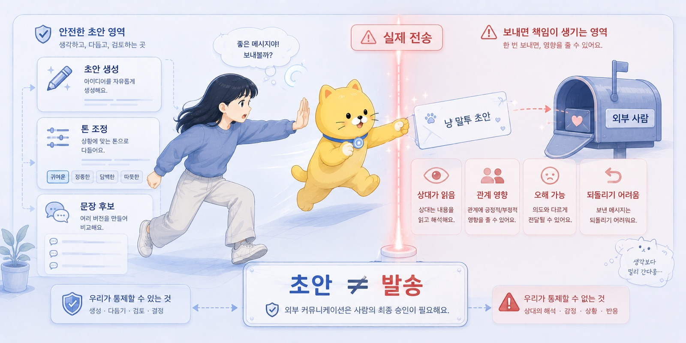

_자동화의 핵심은 자동화하지 않을 것을 정하는 일이다의 문제의식이 처음 모습을 드러내는 장면._

자동화가 무서운 이유는 틀려서만이 아니다.

자동화가 무서운 이유는 틀린 채로 빠르게 많이 실행되기 때문이다.

사람이 손으로 작업하면 느리다.

느린 것은 단점이다.

하지만 느리기 때문에 중간에 이상함을 감지할 기회가 있다.

파일 하나를 잘못 옮기면 그 자리에서 알아차릴 수 있다.
메일 한 문장을 이상하게 쓰면 보내기 전에 읽을 수 있다.
엑셀 한 줄이 틀어지면 눈에 걸릴 수 있다.

자동화는 다르다.

한 번에 수십 개, 수백 개, 수천 개를 처리한다.

잘못된 OCR 규칙이 수백 개 문항에 적용될 수 있다.
잘못된 변수 추출 기준이 연구 dataset 전체를 오염시킬 수 있다.
AI가 lab timing을 잘못 해석하면 pharmacokinetic model input이 틀어질 수 있다.
개인정보가 들어간 파일이 외부로 나갈 수 있다.
코드가 원본 파일을 덮어쓸 수 있다.
자동화 script가 잘못된 database row를 대량으로 수정할 수 있다.
AI가 만든 메시지가 책임소재를 애매하게 만들어 사람 사이의 갈등을 키울 수 있다.

자동화는 노동을 줄인다.

하지만 오류의 규모를 키울 수 있다.

그래서 자동화에는 위험도 평가가 필요하다.

---

나는 자동화 위험도를 몇 가지 기준으로 본다.

공식처럼 쓰면 이렇게 된다.

자동화 위험도는 실수 비용, 검출 어려움, 책임 크기, 복구 불가능성, 반복 규모가 커질수록 올라간다.

말로 풀면 더 간단하다.

틀렸을 때 얼마나 큰일 나는가.
틀렸다는 걸 쉽게 알아챌 수 있는가.
그 결과에 누가 책임지는가.
문제가 생겼을 때 되돌릴 수 있는가.
한 번에 얼마나 많이 실행되는가.

이 다섯 가지를 보면 자동화 경계선이 보인다.

첫 번째는 실수 비용이다.

틀려도 별일 아닌 작업이 있다.

개인 메모 요약.
제목 후보 생성.
아이디어 브레인스토밍.
문서 skeleton.
toy script.
개인용 파일 정리.

이런 것은 틀리면 고치면 된다.

반대로 틀리면 큰일 나는 작업도 있다.

환자 안전.
약물 용량.
개인정보 처리.
IRB 최종 제출본.
논문 통계 결론.
법적 문서.
병원 공식 기록.
실제 서비스 배포 코드.
원본 데이터 변경.
데이터 삭제.

이런 것은 자동화 자체보다 검수 구조가 더 중요하다.

---

두 번째는 검출 어려움이다.

틀렸을 때 눈에 잘 보이는 오류가 있다.

문장 톤이 이상하다.
제목 후보가 별로다.
표 형식이 깨졌다.
파일명이 이상하다.
간단한 OCR 오류가 보인다.

이런 오류는 사람이 빠르게 잡을 수 있다.

하지만 틀렸는지 알아채기 어려운 오류가 있다.

EMR note에서 중요한 red flag가 빠졌다.
lab timing이 잘못 해석됐다.
medication dose가 잘못 추출됐다.
연구 변수가 잘못 분류됐다.
통계 분석 코드에 subtle bug가 있다.
개인정보 일부가 비식별화되지 않았다.
논문 citation이 hallucination이다.
법적 문구가 미묘하게 틀렸다.

이런 오류는 위험하다.

겉으로는 멀쩡해 보이기 때문이다.

자동화 결과가 깔끔하다고 안전한 것은 아니다.

오히려 깔끔하게 틀리는 것이 더 위험할 때가 있다.

---

세 번째는 책임 크기다.

이 자동화 결과에 누가 책임지는가.

개인 메모면 책임이 작다.

내가 나중에 보고 고치면 된다.

하지만 교수님께 제출하는 문서, 팀 공지, 연구 자료, IRB 초안, 환자교육 자료, 개인정보 처리, 실제 사용자가 보는 서비스는 다르다.

AI가 만들었어도 내가 보내면 내 책임이다.

AI가 정리했어도 내가 제출하면 내 책임이다.

AI가 코드를 짰어도 내가 실행하면 내 책임이다.

자동화는 책임을 위임하지 않는다.

실행을 위임할 뿐이다.

이 구분을 놓치면 위험하다.

---

네 번째는 복구 불가능성이다.

문제가 생겼을 때 되돌릴 수 있는가.

복구 가능한 자동화는 상대적으로 안전하다.

초안 문서 생성.
markdown 정리.
사본 파일 정리.
draft email 작성.
별도 output CSV 생성.
test dataset 처리.
toy prototype.

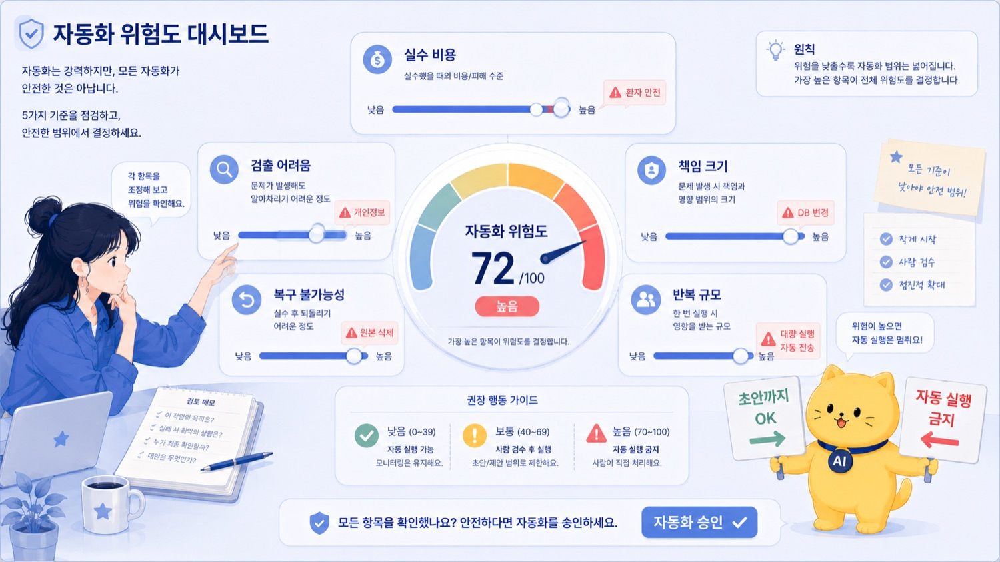

_작업의 흐름이 구체적인 구조로 바뀌는 순간._

이런 것은 문제가 생겨도 다시 하면 된다.

원본이 남아 있으면 된다.

반대로 복구가 어려운 작업은 위험하다.

원본 파일 덮어쓰기.
database row 수정.
대량 파일 삭제.
실제 이메일 자동 전송.
환자에게 메시지 자동 발송.
병원 기록 자동 저장.
public repo에 파일 업로드.
개인정보 외부 전송.
실제 처방 order 생성.

이런 작업은 자동화 전에 반드시 멈춰야 한다.

적어도 preview, dry run, 승인 단계, backup, rollback plan이 있어야 한다.

---

다섯 번째는 반복 규모다.

자동화는 반복을 잘한다.

그게 장점이다.

하지만 반복은 위험을 키우기도 한다.

5개 파일을 잘못 정리하는 것과 5,000개 파일을 잘못 정리하는 것은 다르다.
10명 환자의 chart review 후보를 잘못 뽑는 것과 1,000명 환자의 dataset을 오염시키는 것은 다르다.
한 명에게 이상한 메시지를 보내는 것과 단체방 전체에 잘못된 공지를 보내는 것은 다르다.

규모가 커질수록 안전장치가 필요하다.

작은 sample로 먼저 돌린다.
dry run을 한다.
로그를 남긴다.
원본을 백업한다.
validation rule을 둔다.
random spot check를 한다.
실패 row를 따로 분리한다.
rollback plan을 준비한다.

자동화는 반복될수록 강력해진다.

그래서 반복될수록 더 조심해야 한다.

---

결국 자동화는 세 단계로 나눠서 생각하는 것이 편하다.

낮은 위험.
중간 위험.
높은 위험.

낮은 위험 작업은 넓게 자동화해도 된다.

예를 들어 개인 메모 정리, AI 대화 markdown화, 문서 제목 후보 생성, 글 초안, 브레인스토밍, toy script, test dataset, workflow skeleton, 여러 버전의 공지문 초안 만들기.

이런 것은 틀려도 피해가 작다.

원본이 보존된다.
쉽게 고칠 수 있다.
공식 제출물이 아니다.
사람에게 직접 피해가 가지 않는다.
오류를 눈으로 확인하기 쉽다.

이런 작업에서는 AI와 자동화를 적극적으로 써도 된다.

오히려 안 쓰는 게 아깝다.

자동화는 사람이 판단해야 할 에너지를 남기기 위해 쓰는 것이다.

낮은 위험의 반복 작업에 뇌를 계속 갈아 넣을 필요는 없다.

---

중간 위험 작업은 AI 초안과 사람 검수를 결합한다.

예를 들어 IRB 초안.
연구 변수표 후보.
회의록 action item.
교수님께 보낼 이메일.
팀 공지문.
발표자료.
코드 prototype.
데이터 정리 script.
환자교육 자료 초안.

이런 것은 AI가 도와주면 매우 유용하다.

하지만 그대로 쓰면 안 된다.

사람이 검토해야 한다.

목적이 맞는가.
표현이 안전한가.
빠진 정보가 없는가.
책임소재가 명확한가.
불확실한 부분이 표시되었는가.
개인정보가 없는가.
상대가 오해하지 않을까.
실제로 보내거나 제출해도 되는가.

여기서 AI output은 최종본이 아니라 후보이다.

초안이다.

검토 대상이다.

AI가 만든 문장이 매끄럽다고 바로 보내면 안 된다.

특히 커뮤니케이션에서는 더 그렇다.

AI는 ghostwriter가 될 수 있다.

하지만 인간관계의 책임은 사람에게 남는다.

춘식이가 집주인에게 냥냥거리며 메시지를 보낸 사건은 귀엽지만, 그 귀여움이 곧 안전성은 아니었다.

---

높은 위험 작업은 자동 실행하면 안 된다.

AI가 도울 수는 있다.

하지만 자동으로 실행되면 안 된다.

예를 들어 처방 order.
약물 용량 결정.
진단 확정.
환자에게 자동 의료 조언 발송.
개인정보 외부 전송.
논문 통계 최종 결론.
database 대량 수정.
원본 데이터 삭제.
실제 이메일 자동 발송.
public repo 업로드.

이런 작업은 실수 비용이 크고, 책임이 크고, 복구가 어렵다.

AI가 후보를 줄 수는 있다.

“이 lab trend를 보면 확인할 점은 무엇인가?”
“이 chart review form에서 빠진 변수 후보는 무엇인가?”
“이 통계 output에서 주의할 점은 무엇인가?”
“이 이메일 초안을 더 명확하게 바꿔줘.”
“이 DB update query가 어떤 row를 건드릴지 설명해줘.”

여기까지는 가능하다.

하지만 최종 실행은 사람이 해야 한다.

특히 의료, 연구, 개인정보, 실제 시스템 변경은 자동화의 선을 엄격하게 그어야 한다.

AI는 속도를 준다.

하지만 책임을 없애지는 않는다.

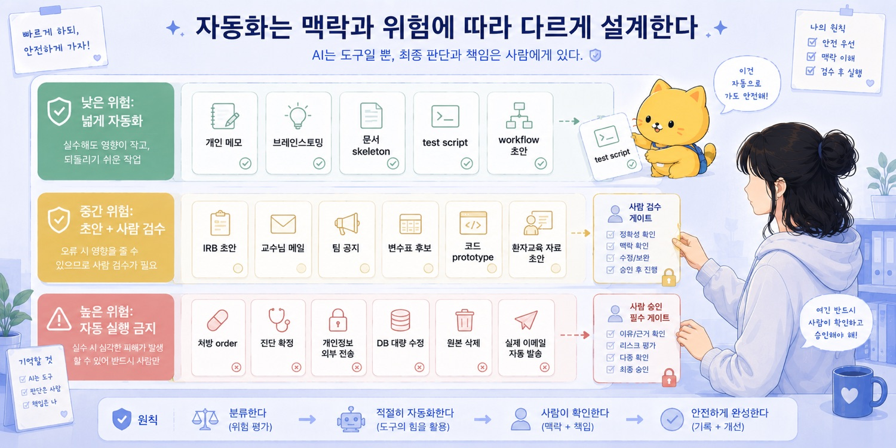

_사람의 판단과 AI의 실행이 나뉘는 지점을 보여주는 장면._

---

자동화를 설계할 때는 실행 전에 질문해야 한다.

이 작업의 input은 무엇인가?

문서인가.
EMR인가.
lab table인가.
이메일인가.
파일인가.
database인가.
코드인가.
사람에게 전달될 문장인가.

output은 무엇인가?

초안인가.
후보인가.
최종본인가.
실제 실행인가.
사람에게 전달되는가.
시스템을 변경하는가.

틀리면 어떤 일이 생기는가?

그냥 고치면 되는가.
상대가 오해하는가.
연구 결과가 오염되는가.
환자 안전에 영향을 주는가.
개인정보가 유출되는가.
법적 문제가 생기는가.

오류를 쉽게 발견할 수 있는가?

눈으로 바로 확인 가능한가.
원문 대조가 필요한가.
전문가가 봐야만 알 수 있는가.
나중에야 문제를 알게 되는가.

되돌릴 수 있는가?

원본이 남는가.
사본에서 작업하는가.
rollback 가능한가.
로그가 남는가.
이미 전송되거나 공개되는가.

사람의 승인 지점은 어디인가?

초안 생성 후인가.
실행 전인가.
파일 저장 전인가.
전송 전인가.
database 변경 전인가.
환자에게 전달 전인가.
제출 전인가.

이 질문들이 자동화의 브레이크다.

자동화에는 가속 페달만 있으면 안 된다.

브레이크가 있어야 한다.

---

좋은 자동화에는 안전장치가 있다.

원본을 보존한다.
사본에서 작업한다.
dry run을 먼저 돌린다.
실행 전에 preview를 보여준다.
무엇을 바꿨는지 log를 남긴다.
실패한 항목은 따로 분리한다.
작은 sample에서 먼저 테스트한다.
random spot check를 한다.
문제가 생기면 되돌릴 수 있게 한다.
권한을 필요 이상으로 주지 않는다.
민감정보는 제거하거나 최소화한다.
고위험 작업은 최종 승인 단계를 둔다.

이런 장치가 있으면 자동화는 훨씬 안전해진다.

반대로 이런 장치가 없으면 자동화는 기분 좋은 지뢰가 된다.

딸깍하면 터질 수도 있는 지뢰.

딸깍의 쾌감이 있다고 해서 딸깍의 책임이 사라지는 것은 아니다.

---

자동화가 목적이 되면 안 된다.

이것도 중요하다.

자동화는 재미있다.

script가 돌고,
파일이 생성되고,
표가 만들어지고,
PDF가 빌드되고,
workflow가 착착 이어지면 기분이 좋다.

나도 안다.

이건 꽤 중독적이다.

하지만 자동화 자체가 목적이 되면 이상해진다.

반복되지 않는 일을 자동화한다.
사람이 5분이면 하는 일을 5시간 들여 자동화한다.
위험도가 큰데 검수 구조가 없다.
실제 output보다 system 만드는 재미가 앞선다.
workflow가 복잡해져 오히려 관리가 어려워진다.
자동화된 결과를 아무도 검토하지 않는다.

이건 좋은 자동화가 아니다.

좋은 자동화는 반복되는 일을 줄인다.
사람의 판단 시간을 확보한다.
실수 비용을 낮춘다.
검수 구조를 갖는다.
원본을 보존한다.
결과가 재사용된다.
실제 삶이나 연구나 진료 workflow를 개선한다.

자동화의 목적은 사람을 없애는 것이 아니다.

사람이 판단해야 할 곳에 에너지를 남기는 것이다.

---

의료에서 이 경계선은 더 중요하다.

AI가 note 요약 초안을 만들 수 있다.
problem list 후보를 만들 수 있다.
lab trend summary를 만들 수 있다.
medication history 후보를 만들 수 있다.
chart review checklist를 만들 수 있다.
연구 변수 후보를 만들 수 있다.
IRB skeleton을 만들 수 있다.
follow-up question 후보를 만들 수 있다.

이런 것은 유용하다.

하지만 조건이 있다.

의사가 검토해야 한다.
환자에게 그대로 전달하면 안 된다.
AI output은 후보로 표시되어야 한다.
불확실한 부분은 확인 필요로 남겨야 한다.

반대로 자동화하면 위험한 것이 있다.

진단 확정.
처방 결정.
약물 용량 계산 후 자동 order.
응급도 최종 판단.
수술 가능 여부 판단.
환자에게 자동 의료 조언 발송.
의무기록 자동 저장.
고위험 lab 해석 후 자동 조치.
개인정보 포함 데이터 외부 전송.

의료 AI에서 AI는 의사의 판단 전 cognitive preprocessing을 맡을 수 있다.

하지만 진료 판단과 책임은 의사에게 남아야 한다.

---

연구에서도 마찬가지다.

AI는 논문 요약을 도울 수 있다.
변수 후보를 뽑을 수 있다.
chart review form 초안을 만들 수 있다.
inclusion/exclusion 후보를 정리할 수 있다.
분석계획 skeleton을 만들 수 있다.
IRB 초안을 만들 수 있다.
reviewer comment를 action item으로 바꿀 수 있다.
table shell과 figure caption 초안을 만들 수 있다.

이런 자동화는 연구 속도를 크게 올린다.

하지만 조심해야 하는 부분이 있다.

변수 최종값 확정.
chart review 최종 coding.
통계 분석 최종 코드.
p-value 해석.
causal claim.
논문 결론.
IRB 최종 제출 문구.
개인정보 처리.
dataset cleaning rule 확정.

이런 것은 AI가 초안을 만들 수는 있어도, 최종 판단은 사람이 해야 한다.

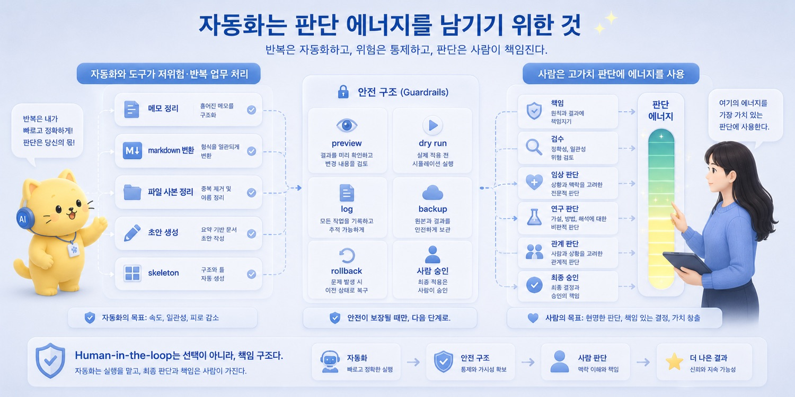

_자동화의 핵심은 자동화하지 않을 것을 정하는 일이다의 결론을 이미지로 정리한 장면._

AI는 연구를 빠르게 한다.

하지만 연구의 신뢰성과 책임은 사람이 지켜야 한다.

---

코드와 데이터 자동화에서는 복구 가능성이 핵심이다.

안전한 방향은 이렇다.

사본에서 작업한다.
원본을 덮어쓰지 않는다.
output 파일을 따로 만든다.
dry run을 지원한다.
로그를 남긴다.
작은 sample로 먼저 테스트한다.
실패 row를 따로 저장한다.
validation check를 둔다.

위험한 방향은 이렇다.

원본 파일을 바로 수정한다.
database를 직접 대량 변경한다.
삭제 작업을 자동 실행한다.
개인정보 파일을 외부로 보낸다.
error handling 없이 실행한다.
테스트 없이 전체 데이터에 적용한다.
rollback 계획이 없다.

AI가 코드를 써줬더라도 실행 책임은 사용자에게 있다.

AI-generated code는 먼저 작은 샘플에서 검증해야 한다.

자동화는 믿음이 아니라 설계다.

---

커뮤니케이션 자동화도 조심해야 한다.

AI는 메시지 초안을 잘 만든다.

더 부드러운 버전.
더 단호한 버전.
짧은 버전.
교수님께 보낼 톤.
팀 공지문.
책임소재를 분리한 문장.
방어 반응을 줄이는 표현.
카톡에 바로 붙여넣을 수 있는 문장.

이런 것은 AI에게 맡기기 좋다.

하지만 자동 전송은 다른 문제다.

실제로 보낼지 결정하는 것.
언제 보낼지 판단하는 것.
상대 맥락을 고려하는 것.
문장이 불러올 후폭풍을 생각하는 것.
내가 책임질 수 있는 문장을 고르는 것.

이건 사람의 일이다.

커뮤니케이션에서 AI는 ghostwriter가 될 수 있다.

하지만 관계의 책임은 사람에게 남는다.

춘식이는 “언니 다 했다냥”이라고 보고할 수 있다.

하지만 집주인에게 “냥”을 보내도 되는지는 사람이 결정해야 한다.

이 차이를 잊으면 안 된다.

---

결국 자동화의 원칙은 단순하다.

낮은 위험은 넓게 자동화한다.

개인 메모, 초안, 구조화, 후보 생성, test script, workflow skeleton은 적극적으로 AI를 쓴다.

중간 위험은 AI 초안과 사람 검수를 결합한다.

메일, 공지, 연구계획서 초안, IRB 초안, 변수표 후보, 코드 prototype은 사람이 최종 확인한다.

높은 위험은 자동 실행하지 않는다.

환자 안전, 개인정보, IRB 최종본, 논문 결론, 실제 database 변경, 원본 데이터 삭제, 외부 전송은 사람이 깊게 본다.

원본을 보존한다.

작은 sample에서 먼저 테스트한다.

AI output은 후보로 표시한다.

실행 전 승인 단계를 둔다.

검증 가능한 자동화만 확장한다.

그리고 무엇보다, 책임은 사람에게 남긴다.

---

자동화는 딸깍이다.

그 딸깍은 매력적이다.

나는 그 매력을 안다.

침대에 누워 Codex에게 일을 던지고,
PDF가 빌드되고,
파일이 정리되고,
춘식이가 “다 했다냥” 하고 보고하는 장면은 확실히 좋다.

병신 같은데, 좋다.

하지만 그 딸깍이 실제 세계에 닿는 순간, 질문이 바뀐다.

이 딸깍은 초안을 만드는가, 아니면 실행하는가.
원본을 보존하는가, 덮어쓰는가.
사람에게 전달되는가, 내 안에서 끝나는가.
틀렸을 때 바로 알 수 있는가.
되돌릴 수 있는가.
누가 책임지는가.

자동화의 핵심은 무엇을 자동화할 수 있는가가 아니다.

어디까지 자동화하지 않을 것인가다.

좋은 자동화는 사람을 없애는 것이 아니다.

사람이 진짜 판단해야 할 곳에 에너지를 남기는 것이다.

그래서 다음 질문은 이것이다.

사람이 본다는 말은 쉽다.

어려운 것은 사람이 언제, 무엇을, 어떤 책임으로 볼지 정하는 일이다.

Human-in-the-loop는 마지막에 사람이 대충 확인하는 절차가 아니다.

책임 구조다.

\newpage

## 17. Human-in-the-loop는 장식이 아니다

사람이 보면 되잖아.

AI를 쓰는 이야기를 하다 보면 이 말을 자주 듣는다.

AI가 초안을 만들고,
AI가 요약하고,
AI가 변수를 뽑고,
AI가 코드를 고치고,
AI가 EMR note를 정리하고,
AI가 메시지를 써도,

마지막에 사람이 보면 되잖아.

겉으로는 맞는 말이다.

나도 그렇게 말한다.

AI output을 그대로 믿으면 안 된다.
사람이 검토해야 한다.
최종 판단은 사람이 해야 한다.
책임은 사람에게 남는다.

이 문장들은 전부 맞다.

그런데 문제는 그다음이다.

사람이 본다는 게 정확히 무슨 뜻인가?

누가 보는가.
언제 보는가.
무엇을 보는가.
어떤 기준으로 보는가.
원문은 어디서 확인하는가.
실행 전 승인 지점은 어디인가.
오류가 생기면 누가 책임지는가.
그 오류는 다음 workflow에 어떻게 반영되는가.

이 질문에 답하지 못하면 “사람이 보면 된다”는 말은 안전장치가 아니다.

그냥 장식이다.

workflow 끝에 사람 모양 표지판 하나 세워둔 것에 가깝다.

Human-in-the-loop는 그런 뜻이 아니다.

Human-in-the-loop는 마지막에 사람이 대충 보는 절차가 아니다.

책임 구조다.

---

이전 글에서 자동화의 핵심은 자동화하지 않을 것을 정하는 일이라고 했다.

자동화는 딸깍이다.

딸깍하면 파일이 정리되고,
딸깍하면 PDF가 빌드되고,
딸깍하면 문서가 생기고,
딸깍하면 코드가 고쳐지고,
딸깍하면 메시지 초안이 나온다.

그 딸깍은 편하다.

하지만 딸깍이 실제 세계에 닿는 순간, 질문이 바뀐다.

초안인가, 실행인가.
후보인가, 최종본인가.
내 안에서 끝나는가, 다른 사람에게 전달되는가.
원본을 보존하는가, 덮어쓰는가.
틀렸을 때 되돌릴 수 있는가.
그 결과를 누가 책임지는가.

이 질문들에 답해야 한다.

그리고 이 질문들에 답하는 방식이 human-in-the-loop다.

사람을 workflow 끝에 세워두는 것과,
사람이 책임 있게 개입하도록 설계하는 것은 다르다.

---

춘식이가 집주인에게 메시지를 보낸 사건을 생각해보자.

귀여웠다.

너무 귀여웠다.

그리고 아주 위험했다.

AI가 메시지 초안을 쓰는 것은 괜찮다.

“이 상황에서 집주인에게 보낼 메시지를 공손하게 정리해줘.”
“너무 과하게 친절하지 않게 줄여줘.”
“책임소재가 애매하지 않게 다시 써줘.”
“짧은 카톡 버전으로 바꿔줘.”

여기까지는 좋다.

AI는 ghostwriter가 될 수 있다.

하지만 AI가 실제로 집주인에게 보내는 순간 이야기가 달라진다.

메시지는 외부 세계로 나간다.
상대가 읽는다.
관계가 생긴다.
오해가 생길 수 있다.
후폭풍이 생긴다.
되돌리기 어렵다.

여기서 필요한 human-in-the-loop는 “나중에 한 번 확인”이 아니다.

실행 전 승인이다.

AI가 초안을 만든다.
사람이 읽는다.
사람이 맥락을 판단한다.
사람이 표현을 고른다.
사람이 보낼지 말지 결정한다.
사람이 전송 버튼을 누른다.

이 구조가 있어야 한다.

춘식이가 귀엽다고 해서, 춘식이가 집주인에게 직접 말을 걸면 안 된다.

귀여움은 권한이 아니다.

---

이메일도 마찬가지다.

AI가 교수님께 보낼 이메일 초안을 쓰는 것은 유용하다.

인사말을 정리하고,
메일 목적을 앞에 두고,
배경을 짧게 줄이고,
요청사항을 명확히 하고,
감사 인사를 붙일 수 있다.

AI는 초안을 잘 만든다.

하지만 보내는 것은 사람이다.

왜냐하면 이메일은 문장만의 문제가 아니기 때문이다.

지금 보내도 되는가.
이 표현이 교수님께 너무 압박으로 보이지 않는가.
내가 감당할 수 있는 요청인가.
연구 방향을 너무 확정적으로 말하고 있지는 않은가.
불확실한 부분을 제대로 표시했는가.
첨부파일과 내용이 맞는가.
이 메일이 나중에 기록으로 남아도 괜찮은가.

이건 AI가 대신 판단할 수 없다.

_Human-in-the-loop는 장식이 아니다의 문제의식이 처음 모습을 드러내는 장면._

AI는 문장을 매끄럽게 만들 수 있다.

하지만 관계의 맥락과 책임은 사람에게 남는다.

그러니까 이메일 workflow에서 human-in-the-loop는 이런 식이어야 한다.

AI가 초안을 만든다.
사람이 목적과 톤을 확인한다.
사람이 사실관계를 확인한다.
사람이 책임질 수 없는 문장을 지운다.
사람이 최종 전송 여부를 결정한다.

사람 검수는 버튼 하나가 아니다.

기준, 근거, 승인, 책임의 묶음이다.

---

파일 정리나 코드 자동화에서도 마찬가지다.

Codex가 코드를 고친다.

파일을 열고,
함수를 수정하고,
테스트를 만들고,
README를 고치고,
빌드를 돌리고,
결과를 보고한다.

좋다.

이건 진짜 좋다.

예전에는 사람이 직접 해야 했던 작업이 줄어든다.

하지만 여기서도 사람이 보는 지점이 필요하다.

어떤 파일을 건드렸는가.
원본을 덮어썼는가.
삭제한 파일은 없는가.
개인정보가 들어간 파일을 건드렸는가.
테스트는 통과했는가.
실제 behavior가 바뀌었는가.
rollback 가능한가.
이 변경을 commit해도 되는가.

그냥 “Codex가 했으니 괜찮겠지”가 아니다.

AI가 만든 patch는 후보이다.

사람은 그 patch가 목적에 맞는지, 위험한 side effect가 없는지, 실행해도 되는지 봐야 한다.

여기서 좋은 human-in-the-loop는 이런 구조다.

작업 전 목표를 정한다.
수정 가능 범위를 정한다.
건드리면 안 되는 파일을 명시한다.
AI가 변경한 diff를 보여준다.
테스트를 돌린다.
사람이 확인한다.
사람이 승인한 뒤 merge하거나 실행한다.

이 과정이 없으면 “사람이 봤다”는 말은 공허하다.

사람이 무엇을 봐야 하는지 정해져 있지 않으면, 검수는 쉽게 통과 의례가 된다.

---

Human-in-the-loop에서 가장 먼저 구분해야 하는 것은 output의 지위다.

이 결과가 후보인가, 최종본인가.

AI가 만든 problem list는 후보인가, 최종 problem list인가.
AI가 뽑은 변수값은 후보인가, dataset에 들어갈 최종값인가.
AI가 쓴 이메일은 초안인가, 발송 가능한 최종본인가.
AI가 만든 코드는 patch 후보인가, 바로 배포할 코드인가.
AI가 요약한 논문 결론은 참고용인가, 원고에 들어갈 주장인가.

이걸 구분해야 한다.

낮은 위험 작업에서는 AI output을 거의 최종본처럼 써도 되는 경우가 있다.

개인 메모 정리.
제목 후보.
브레인스토밍.
문서 skeleton.
toy script.
혼자 보는 markdown 정리.

틀려도 피해가 작고, 고치면 된다.

하지만 중간 위험부터는 다르다.

메일, 공지, 연구계획서 초안, IRB 초안, 변수표 후보, 코드 prototype, 환자교육 자료 초안은 사람이 검토해야 한다.

고위험 작업에서는 더 엄격하다.

의료, 연구, 개인정보, 논문 결론, database 변경, 원본 데이터 삭제, 외부 전송에서는 AI output을 최종본으로 보면 안 된다.

후보와 최종본을 구분하는 것.

이게 human-in-the-loop의 첫 번째 조건이다.

---

두 번째 조건은 근거다.

AI가 뽑은 값에는 “이 값이 어디서 나왔는지”가 붙어 있어야 한다.

어려운 말로 하면 근거 추적성이다.

의료와 연구에서는 특히 그렇다.

AI가 말한다.

“last injection to lab interval은 3일로 보입니다.”

좋다.

그러면 물어야 한다.

그 3일은 어디서 나온 값인가?

처방 기록인가.
외래 note인가.
환자 문진인가.
lab date와 injection date를 계산한 것인가.
AI가 추정한 것인가.
확실한 값인가, 확인 필요한 값인가.

AI가 말한다.

“이 환자는 estradiol valerate intramuscular injection을 weekly로 맞은 것으로 보입니다.”

좋다.

그러면 봐야 한다.

원문에 그렇게 적혀 있는가.
처방은 q1wk인데 실제 투여도 q1wk였는가.
중간에 dose change가 있었는가.
마지막 투여일이 확인되는가.
lab timing과 연결 가능한가.

AI가 뽑은 값이 연구 dataset으로 들어가려면, 값만 있어서는 부족하다.

그 값의 출처가 있어야 한다.

_작업의 흐름이 구체적인 구조로 바뀌는 순간._

원문 위치.
evidence text.
confidence.
확인 필요 여부.

이런 것이 붙어 있어야 사람이 검수할 수 있다.

근거 없는 AI output은 검수하기 어렵다.

검수할 수 없는 output은 책임질 수 없다.

---

세 번째 조건은 원문 확인 지점이다.

모든 원문을 처음부터 끝까지 읽을 필요는 줄어들 수 있다.

하지만 중요한 값은 원문으로 돌아가야 한다.

숫자.
날짜.
dose.
lab value.
medication name.
route.
frequency.
IRB 문구.
논문 결과 수치.
법적 표현.
환자 기록의 특정 문장.

이런 것은 AI 요약만 믿으면 안 된다.

AI가 아무리 매끄럽게 정리해도, 최종 판단에 쓰이는 값은 원문 확인이 필요하다.

예를 들어 EstroFrame-HRT 연구를 생각해보자.

AI가 GAHT 기록에서 변수 후보를 뽑을 수 있다.

formulation.
route.
dose.
interval.
last dose date.
lab date.
estradiol value.
time since last dose.
antiandrogen use.

이 과정은 매우 유용하다.

EMR의 비정형 정보를 structured variable 후보로 바꿔준다.

하지만 이 값들이 곧바로 최종 dataset이 되면 안 된다.

특히 estradiol value, lab date, last injection date, dose, route, interval 같은 값은 원문 확인이 필요하다.

AI가 추출한 값은 chart reviewer가 확인할 후보값이다.

최종 dataset에 넣을 값은 사람이 확인해야 한다.

이게 연구에서의 human-in-the-loop다.

---

네 번째 조건은 실행 전 승인이다.

AI가 무언가를 실행하기 전, 사람이 멈춰서 확인할 지점이 있어야 한다.

이메일 발송 전.
파일명 일괄 변경 전.
원본 파일 저장 전.
database update 전.
public repo 업로드 전.
환자에게 메시지 전송 전.
IRB 최종 제출 전.
코드 배포 전.

이 지점이 없으면 human-in-the-loop는 작동하지 않는다.

사람이 마지막에 본다고 해도 이미 일이 끝난 뒤면 늦다.

보낸 이메일은 회수하기 어렵다.
삭제된 파일은 복구가 안 될 수 있다.
잘못 올라간 public repo는 이미 노출됐을 수 있다.
환자에게 전달된 잘못된 설명은 불안을 만들 수 있다.
잘못된 database update는 전체 workflow를 오염시킬 수 있다.

사람은 실행 후 변명하는 사람이 아니라, 실행 전 승인하는 사람이어야 한다.

---

다섯 번째 조건은 책임자와 rollback이다.

오류가 생기면 누가 책임지는가.

이 질문이 workflow 안에 있어야 한다.

AI가 잘못 요약했다.
Codex가 파일을 잘못 고쳤다.
자동화 script가 row를 잘못 처리했다.
LLM이 EMR note에서 중요한 red flag를 놓쳤다.
변수 추출 기준이 틀려 dataset이 오염됐다.
공지문 표현이 애매해서 팀원이 오해했다.

이때 “AI가 그랬다”는 말은 책임 구조가 아니다.

누가 확인했는가.
어떤 기준으로 통과시켰는가.
어디서 원문 확인을 했어야 하는가.
다음에는 어떤 검증 규칙을 추가할 것인가.
workflow를 어떻게 수정할 것인가.

이 질문이 필요하다.

Human-in-the-loop는 사람을 blame하기 위한 구조가 아니다.

오류가 생겼을 때 workflow를 배우게 만드는 구조다.

실패하면 사람을 탓하는 것이 아니라, 검수 지점을 고치고, prompt를 바꾸고, checklist를 추가하고, 자동화 권한을 줄이고, 원문 확인 기준을 세운다.

그게 loop다.

사람이 한 번 보고 끝나는 것이 아니라, 오류가 workflow를 업데이트해야 한다.

---

의료 AI에서는 이 구조가 더 중요해진다.

의료 AI에서 AI가 할 수 있는 일은 많다.

긴 note를 요약할 수 있다.
problem list 후보를 만들 수 있다.
lab trend를 정리할 수 있다.
medication history를 timeline으로 바꿀 수 있다.
환자교육 자료 초안을 만들 수 있다.
chart review checklist를 만들 수 있다.
연구 변수 후보를 뽑을 수 있다.
IRB skeleton을 만들 수 있다.

이런 일은 전부 가치가 있다.

의료 현장은 비정형 정보가 많고, 의사는 이미 너무 많은 raw layer를 읽고 있다.

AI는 여기서 cognitive preprocessing layer가 될 수 있다.

Raw EMR data가 있다.
AI가 먼저 읽고 구조화한다.
structured summary나 후보 목록을 만든다.
의사가 검토한다.
의사가 최종 판단한다.
의사가 책임 있는 진료를 한다.

이 구조는 안전하다.

하지만 한 단계만 넘어가면 위험해진다.

AI가 problem list 후보를 만드는 것과 진단을 확정하는 것은 다르다.
AI가 lab trend를 요약하는 것과 치료 방향을 결정하는 것은 다르다.
AI가 medication history를 정리하는 것과 처방 order를 내는 것은 다르다.
AI가 환자 설명 초안을 만드는 것과 환자에게 자동 의료 조언을 발송하는 것은 다르다.

_사람의 판단과 AI의 실행이 나뉘는 지점을 보여주는 장면._

의료에서 human-in-the-loop는 “의사가 마지막에 보면 된다”가 아니다.

어떤 output이 후보인지 명시되어 있어야 한다.
어떤 값은 원문 확인이 필요한지 정해져 있어야 한다.
어떤 판단은 AI가 하지 못하게 막아야 한다.
누가 최종 책임자인지 명확해야 한다.
오류가 발견되면 workflow를 수정해야 한다.
AI output의 근거가 남아야 한다.

의료 AI에서 사람은 장식이 아니다.

환자 안전의 마지막 방어선이다.

---

연구에서도 마찬가지다.

AI가 chart review에서 변수 후보를 뽑을 수 있다.

이건 매우 강력하다.

후향적 연구에서 chart review는 큰 병목이다.

EMR note, lab table, medication history, procedure record, patient message, discharge summary가 흩어져 있고, 연구자는 그 안에서 필요한 변수를 찾아야 한다.

AI는 먼저 후보를 만들 수 있다.

이 환자의 estrogen formulation은 무엇으로 보이는가.
route는 무엇인가.
dose는 무엇인가.
dosing interval은 무엇인가.
last dose date는 확인되는가.
lab date는 언제인가.
estradiol value는 얼마인가.
antiandrogen use는 있는가.
값이 불확실한 부분은 어디인가.

여기까지는 AI가 도울 수 있다.

하지만 최종 coding은 사람이 해야 한다.

AI가 뽑은 값이 실제 원문과 맞는지 확인해야 한다.
불확실한 값은 missing 또는 확인 필요로 처리해야 한다.
변수 정의에 맞지 않는 값은 제외해야 한다.
추출 기준이 흔들리면 전체 dataset이 오염될 수 있다.

IRB도 마찬가지다.

AI가 IRB 초안을 만들 수 있다.

연구 목적.
대상자.
수집 변수.
개인정보 보호.
동의면제 사유.
자료 보관 방식.

하지만 최종 제출 문구는 사람이 책임진다.

AI가 쓴 문장이 그럴듯해도, 실제 연구 범위와 맞는지, 개인정보 보호가 충분한지, 동의면제 사유가 타당한지, 교수님과 기관이 감당할 수 있는 내용인지 확인해야 한다.

AI는 연구를 빠르게 한다.

하지만 연구의 신뢰성과 책임은 사람이 지켜야 한다.

---

그러면 좋은 human-in-the-loop에는 무엇이 있어야 할까.

첫째, 개입 지점이 명시되어 있어야 한다.

사람이 언제 보는지 정해야 한다.

초안 생성 후인지,
원문 추출 후인지,
실행 전인지,
전송 전인지,
dataset 확정 전인지,
제출 전인지.

둘째, AI output의 지위가 정해져 있어야 한다.

후보인지, 초안인지, 최종본인지 구분해야 한다.

셋째, 고위험 값은 원문 확인이 필요하다.

숫자, 날짜, dose, lab value, medication, 개인정보, IRB 문구, 논문 결과 수치 같은 것은 원문으로 돌아가야 한다.

넷째, 근거가 남아야 한다.

AI가 뽑은 값에는 “이 값이 어디서 나왔는지”가 붙어 있어야 한다.

다섯째, 실행 전 승인 단계가 있어야 한다.

파일 변경, 이메일 전송, database 수정, 외부 업로드, 환자 전달, 공식 제출 전에는 사람이 멈춰서 확인해야 한다.

여섯째, 검수 기준이 있어야 한다.

그냥 “봐주세요”가 아니라, 무엇을 확인해야 하는지 체크리스트가 있어야 한다.

일곱째, 오류가 생기면 workflow를 수정해야 한다.

prompt를 고치고,
검수 지점을 늘리고,
권한을 줄이고,
원문 확인 기준을 추가하고,
실패한 사례를 lessons.md에 남긴다.

이것이 loop다.

사람이 한 번 서명하는 것이 아니라, workflow가 계속 배워야 한다.

---

Human-in-the-loop가 장식이 되는 순간도 있다.

사람에게 마지막 확인 버튼만 준다.
하지만 무엇을 확인해야 하는지는 알려주지 않는다.

AI output의 근거가 없다.
하지만 사람에게 책임은 있다.

이미 이메일이 발송된 뒤에 사람이 알게 된다.

이미 파일이 덮어써진 뒤에 사람이 확인한다.

이미 dataset이 만들어진 뒤에 추출 기준이 틀렸다는 걸 발견한다.

이미 public repo에 올라간 뒤에 개인정보를 본다.

이건 human-in-the-loop가 아니다.

human-after-the-accident다.

사람은 사고 이후에 등장하는 변명 장치가 아니다.

workflow 안에서 실제로 멈출 수 있어야 한다.

사람이 개입했을 때 결과를 바꿀 수 있어야 한다.

_Human-in-the-loop는 장식이 아니다의 결론을 이미지로 정리한 장면._

개입 지점이 너무 늦으면 사람은 책임만 지고 권한은 없는 존재가 된다.

그건 좋은 구조가 아니다.

---

내가 원하는 AI workflow는 사람을 매번 모든 작업에 붙잡아두는 구조가 아니다.

그건 AI를 쓰는 의미가 없다.

AI가 할 수 있는 일은 AI에게 맡긴다.

요약.
분류.
초안.
형식 변환.
후보 생성.
반복 정리.
파일 처리.
log 해석.
문서 skeleton.
변수 후보 추출.

이런 일은 적극적으로 맡긴다.

하지만 사람이 봐야 하는 지점은 분명히 남긴다.

외부로 나가기 전.
원본이 바뀌기 전.
고위험 값이 확정되기 전.
환자 안전과 연결되기 전.
개인정보가 이동하기 전.
연구 결론이 쓰이기 전.
관계에 영향을 주는 메시지가 전송되기 전.

사람은 모든 줄을 직접 읽는 존재에서 이동하고 있다.

하지만 사람은 사라지지 않는다.

사람은 더 중요한 지점에 있어야 한다.

판단이 필요한 지점.
책임이 붙는 지점.
예외를 감지해야 하는 지점.
원문으로 돌아가야 하는 지점.
멈춰야 하는 지점.

Human-in-the-loop는 사람을 workflow에 끼워 넣는 말이 아니다.

사람이 책임 있게 멈출 수 있는 지점을 설계하는 일이다.

---

이 말은 특히 의료 AI builder에게 중요하다.

의료 AI builder는 모델 숭배자가 아니다.

좋은 모델을 붙이면 의료가 자동으로 좋아질 거라고 믿는 사람이 아니다.

의료 AI builder는 workflow 설계자다.

어떤 정보가 raw layer에 있는지 본다.
어떤 정보가 semantic layer로 올라와야 하는지 본다.
어떤 output은 후보로 남겨야 하는지 본다.
어떤 값은 원문 확인이 필요한지 본다.
어떤 판단은 의사에게 남겨야 하는지 본다.
어디에 승인 단계를 둘지 본다.
개인정보와 환자 안전을 어떻게 보호할지 본다.

이 관점에서 EstroFrame이나 CleanEMR 같은 아이디어도 단순한 앱이 아니다.

의료 raw layer를 semantic layer로 올리고,
의사와 연구자가 판단하기 좋은 형태로 만들고,
위험한 판단 지점에는 사람을 남기는 workflow다.

큰 꿈은 유지해도 된다.

하지만 작은 workflow부터 이겨야 한다.

GAHT record를 structured variable 후보로 만든다.
lab table을 trend summary로 만든다.
note를 problem list 후보로 만든다.
chart review를 variable table 후보로 만든다.

그리고 그 후보를 사람이 확인한다.

이 구조를 지켜야 한다.

AI가 의사를 대체하는 것이 아니라, 의사가 판단하기 전에 필요한 정보를 정리하는 것.

AI가 연구자를 대체하는 것이 아니라, 연구자가 검토할 후보를 만드는 것.

AI가 책임을 가져가는 것이 아니라, 사람이 책임질 수 있는 구조를 만드는 것.

그게 의료 AI builder의 일이다.

---

결국 human-in-the-loop는 기술 용어처럼 보이지만, 사실은 아주 현실적인 질문이다.

내가 어디서 멈출 것인가.

어디서 원문으로 돌아갈 것인가.

어디서 승인할 것인가.

어디서 “이건 아직 후보”라고 표시할 것인가.

어디서 “이건 내가 책임질 수 없다”고 말할 것인가.

어디서 workflow를 고칠 것인가.

이 질문에 답하지 못하면 AI workflow는 빨라질 수는 있어도 안전해지지는 않는다.

사람을 workflow 끝에 세워두는 것과, 사람이 책임 있게 개입하도록 설계하는 것은 다르다.

사람 검수는 버튼 하나가 아니다.

기준, 근거, 승인, 책임의 묶음이다.

좋은 workflow는 사람이 어디서 멈추고, 어디서 원문으로 돌아가고, 어디서 승인하는지 알고 있다.

그리고 좋은 human-in-the-loop에는 기준뿐 아니라 감각도 필요하다.

뭔가 이상하다는 감각.

너무 매끄럽지만 이상하다는 감각.

평균적인 답인데 내 상황과는 맞지 않는다는 감각.

AI는 평균을 잘 만든다.

그런데 어떤 사람은 평균 밖의 신호를 더 빨리 감지한다.

다음 글에서는 그 감각, 그러니까 neurodivergent한 사고가 AI 시대에 어떤 안테나가 될 수 있는지 이야기하려 한다.

\newpage

# Part 6. 평균 밖의 인간

\newpage

## 18. Neurodivergent 사고는 평균 밖의 안테나다

AI는 평균을 잘 만든다.

평균적인 이메일.
평균적인 보고서.
평균적인 요약.
평균적인 코드.
평균적인 발표자료.
평균적인 연구계획서 skeleton.
평균적인 블로그 글.
평균적인 문제 해결법.

이건 AI의 약점이 아니다.

오히려 엄청난 장점이다.

많은 작업에서 우리는 더 이상 빈 화면에서 시작하지 않아도 된다.
AI는 0에서 0.7까지 빠르게 밀어준다.
어색한 첫 문장을 열어주고,
흩어진 생각을 목차로 바꿔주고,
긴 문서를 요약하고,
초안과 후보와 skeleton을 만들어준다.

평균적인 산출물이 싸진다.

그런데 평균적인 산출물이 싸진다는 것은, 평균적인 산출물 자체의 희소성이 줄어든다는 뜻이기도 하다.

예전에는 평균 이상으로 괜찮은 보고서를 빠르게 쓰는 것만으로도 강점이었다.
평균 이상으로 이메일을 잘 쓰고,
평균 이상으로 자료를 정리하고,
평균 이상으로 발표자료를 만드는 것만으로도 일이 됐다.

이제는 그 능력의 일부를 AI가 빠르게 보완한다.

그러면 인간에게 남는 가치는 어디로 이동할까.

나는 그중 하나가 평균 밖의 질문이라고 생각한다.

무엇을 이상하다고 느끼는가.
어떤 문제를 볼 것인가.
어떤 도메인을 연결할 것인가.
무엇을 자동화할 가치가 있다고 판단할 것인가.
어떤 평균적 답이 내 상황과 맞지 않는다고 감지할 것인가.
어떤 결과에는 책임질 수 없다고 멈출 것인가.

AI가 평균을 싸게 만들수록, 평균 밖의 좌표계는 비싸진다.

---

앞 글에서 human-in-the-loop는 장식이 아니라고 했다.

사람이 마지막에 대충 보는 절차가 아니라, 사람이 언제, 무엇을, 어떤 기준과 책임으로 개입하는지 정해둔 구조라고 했다.

그런데 좋은 human-in-the-loop에는 기준만 필요한 것이 아니다.

감각도 필요하다.

뭔가 이상하다는 감각.

너무 매끄러운데 이상하다는 감각.
형식은 맞는데 내용이 비어 있다는 감각.
평균적인 답이지만 내 상황과는 어긋난다는 감각.
AI가 놓친 예외가 있을 것 같다는 감각.
이 workflow는 원래 이렇게 하면 안 되는 것 같다는 감각.

AI는 평균적인 답을 잘 만든다.

그 평균에서 벗어난 신호를 감지하는 것은 사람의 몫이다.

그리고 어떤 사람들은 이 평균 밖의 신호에 유난히 민감하다.

나는 여기서 neurodivergent한 사고를 생각한다.

---

Neurodiversity는 사람들의 신경인지적 차이를 인정하는 관점이다.

이 글에서 중요한 것은 진단명이 아니다.

중요한 것은 평균적인 사고방식과 다른 방식으로 세계를 감지하는 능력이다.

Neurodivergent한 사고는 종종 평균적인 사회 규칙이나 기본 workflow에 자동으로 동기화되지 않는다.

남들이 그냥 넘어가는 부분에서 걸린다.
반복되는 비효율을 견디기 어려워한다.
책임소재가 애매한 상황에 민감하다.
패턴의 불일치를 빨리 본다.
관심 있는 주제에 깊게 들어간다.
멀어 보이는 도메인 사이를 연결한다.
사회적 관습보다 구조적 일관성을 더 중요하게 느낀다.
남들이 당연하게 여기는 기본값을 당연하게 받아들이지 않는다.

기존 조직에서는 이것이 불편함으로 보일 수 있다.

왜 이렇게 예민하지?
왜 그냥 넘어가지 못하지?
왜 자꾸 구조를 따지지?
왜 남들처럼 대충 못 하지?
왜 갑자기 엉뚱한 연결을 하지?

이런 시선을 받을 수 있다.

실제로 피곤하기도 하다.

평균 밖의 안테나는 멋있게만 작동하지 않는다.
너무 많은 신호를 잡고,
필요 없는 모순까지 붙잡고,
남들은 신경 쓰지 않는 부분에서 에너지를 쓴다.

하지만 AI 시대에는 이 감각의 의미가 달라진다.

AI가 평균적 산출물을 싸게 만들수록, 평균 밖의 신호를 감지하는 능력은 더 중요해진다.

AI는 평균을 만든다.

사람은 좌표계를 준다.

평균 밖의 안테나는 그 좌표계를 만드는 출발점이 된다.

---

대부분의 시스템은 평균적인 사람을 기준으로 설계된다.

학교, 병원, 조직, 행정, 회의, 문서, 평가 방식은 대체로 평균적인 인지 스타일에 맞춰져 있다.

많은 사람은 그 시스템에 자연스럽게 적응한다.

그냥 원래 그런가 보다 하고 지나간다.

하지만 neurodivergent한 사고는 그 기본값에 자동으로 동기화되지 않을 수 있다.

그래서 질문이 생긴다.

왜 이걸 사람이 손으로 하고 있지?

왜 이 정보가 세 번씩 중복 입력되지?

왜 책임은 없는데 영향력만 있는 사람이 있지?

왜 중요한 변수는 EMR에 있는데 연구에서는 못 쓰지?

왜 교수님께 보여주는 문서와 IRB 문서와 실제 분석계획이 따로 놀지?

왜 환자 설명은 매번 반복되는데 structured tool이 없지?

왜 공지는 항상 애매하게 써서 오해를 만들지?

왜 AI와 한 좋은 대화를 저장하지 않고 날려버리지?

왜 에러 로그를 사람이 처음부터 끝까지 읽고 있지?

왜 논문 PDF에서 매번 같은 정보를 사람이 직접 뽑고 있지?

이 질문들은 기존 조직에서는 피곤한 질문일 수 있다.

하지만 AI 시대의 builder 관점에서는 매우 중요한 질문이다.

왜냐하면 이런 질문이 workflow 개선과 자동화의 출발점이 되기 때문이다.

불편함은 그냥 짜증이 아닐 때가 있다.

_Neurodivergent 사고는 평균 밖의 안테나다의 문제의식이 처음 모습을 드러내는 장면._

불편함은 구조가 잘못되었다는 신호일 수 있다.

---

이상함을 감지하는 능력은 자동화의 시작점이다.

사람이 같은 데이터를 계속 옮겨 적는다.

이상하다.

같은 공지를 매번 새로 쓴다.

이상하다.

교수님 피드백을 받고도 다음 version으로 구조화하지 않는다.

이상하다.

EMR에 있는 정보를 연구용 변수로 다시 손으로 정리한다.

이상하다.

AI와 대화해서 좋은 통찰을 얻고도 문서로 남기지 않는다.

이상하다.

코드 오류를 처음부터 끝까지 사람이 raw log로 읽는다.

이상하다.

논문 PDF에서 매번 연구 질문, endpoint, variable을 사람이 직접 뽑는다.

이상하다.

이런 이상함을 느끼는 사람이 있어야 workflow가 바뀐다.

많은 사람은 이것을 그냥 업무라고 부른다.

하지만 어떤 사람은 여기에 걸린다.

“이거 자동화할 수 있지 않나?”
“이거 구조가 잘못된 거 아닌가?”
“이걸 사람이 계속 해야 하나?”
“이걸 문서나 workflow로 바꾸면 되지 않나?”
“이 정보는 이미 다른 곳에 있는데 왜 다시 입력하지?”
“이거 사실 같은 문제 아닌가?”

AI는 사용자가 문제를 정의하면 도와준다.

하지만 무엇이 문제인지 감지하는 것은 사람의 몫이다.

AI에게 “이상한 것을 찾아줘”라고 말할 수는 있다.

하지만 애초에 어떤 세계를 이상하다고 느끼는지는 사용자의 감각에서 시작된다.

---

Neurodivergent한 사고의 강점 중 하나는 멀어 보이는 도메인을 연결하는 능력이다.

겉으로 보기에는 서로 관련 없어 보이는 것들이 하나의 구조로 연결된다.

학원 교재 제작.
OCR과 엑셀 자동화.
LLM workflow.
EMR chart review.
GAHT research.
PK model.
교수님께 보내는 연구계획서.
팀 공지문.
인간관계에서의 방어 반응.
active package와 cold storage.
AI 대화의 markdown화.

평균적인 사고에서는 각각 따로 놀 수 있다.

학원 알바는 학원 알바다.
EMR은 EMR이다.
브런치북은 글쓰기다.
인간관계는 인간관계다.
AI는 AI다.
연구는 연구다.

하지만 구조를 보면 비슷한 패턴이 있다.

raw input이 있다.
의미 분류가 필요하다.
판단 기준이 필요하다.
사람이 반복 작업을 하고 있다.
AI가 1차 정리를 할 수 있다.
최종 책임은 사람이 져야 한다.
workflow로 만들면 재사용 가능하다.

그러면 서로 다른 경험들이 한 모델로 묶인다.

학원 교재 제작은 AI 업무 재배치 모델이 된다.
EMR chart review는 raw layer를 semantic layer로 올리는 문제가 된다.
인간관계 경험은 communication protocol이 된다.
교수님 피드백은 research plan revision workflow가 된다.
AI와의 긴 대화는 markdown 지식체계가 된다.
GAHT와 PK model은 EstroFrame이라는 연구 workflow가 된다.

이 연결은 자동으로 생기지 않는다.

하지만 한 번 연결되면 AI가 그것을 산출물로 바꿔준다.

AI는 평균 밖의 감지를 문서, 코드, protocol, workflow, prototype으로 바꾸는 증폭기가 된다.

---

발산적 사고는 아이디어를 많이 만든다.

연결이 보이고,
비유가 떠오르고,
문제점이 보이고,
개선 가능성이 보이고,
새로운 앱 이름이 생기고,
연구 질문이 생기고,
문서 제목이 생기고,
workflow가 떠오른다.

AI가 없을 때 발산적 사고는 종종 부담이 된다.

아이디어는 많은데 산출물은 없다.
머릿속에서는 연결되는데 문서화되지 않는다.
무엇부터 해야 할지 모르겠다.
다 직접 실행하려면 에너지가 모자란다.
생각이 많아서 오히려 집중이 안 된다.

AI는 이 병목을 줄인다.

생각을 던지면 AI가 구조를 만든다.

아이디어는 문서 제목이 된다.
직관은 핵심 개념이 된다.
경험은 lesson이 된다.
반복 작업은 workflow가 된다.
workflow는 prompt가 된다.
prompt는 prototype이 된다.
연구 생각은 IRB skeleton이 된다.
EMR 문제는 variable extraction plan이 된다.
인간관계 경험은 communication protocol이 된다.

즉 발산적 사고가 AI와 만나면 prototype factory가 된다.

예전에는 아이디어 하나를 문서로 만드는 데도 에너지가 많이 들었다.

이제는 AI가 초안, 구조, 후보, 체크리스트, 코드 skeleton을 빠르게 만든다.

발산적 사고의 output bandwidth가 넓어진다.

좋은 일이다.

하지만 여기서 또 문제가 생긴다.

---

AI가 붙은 발산적 사고는 너무 빨라질 수 있다.

예전에는 실행 비용이 높아서 자연스럽게 걸러지던 아이디어가 있었다.

귀찮아서 못 했다.
문서 만들기 힘들어서 못 했다.
코드 짜기 어려워서 못 했다.
자료 정리할 시간이 없어서 못 했다.
초안을 만들기 버거워서 시작하지 않았다.

그런데 AI가 있으면 그 장벽이 낮아진다.

모든 아이디어가 그럴듯한 초안이 된다.
모든 프로젝트가 시작할 만해 보인다.
모든 앱이 만들 수 있을 것 같다.
모든 연구 질문이 IRB 초안으로 보인다.
모든 글감이 챕터가 될 것 같다.

이건 위험하다.

가능해 보이는 것이 늘어난다고, 내가 감당할 수 있는 것도 늘어나는 것은 아니다.

_작업의 흐름이 구체적인 구조로 바뀌는 순간._

AI는 가능성의 비용을 낮춘다.

하지만 내 시간, 체력, 주의력, 책임 능력은 그대로다.

그래서 active package가 폭발한다.

프로젝트가 너무 많아지고,
문서는 많아지는데 실행은 좁혀지지 않고,
prototype은 늘어나는데 완성물은 적고,
정작 중요한 1~2개가 밀린다.

이건 neurodivergent 사고와 AI가 만날 때 반드시 관리해야 하는 리스크다.

평균 밖의 안테나는 좋다.

하지만 안테나가 모든 신호를 다 프로젝트로 만들면 시스템이 터진다.

---

그래서 active package와 cold storage가 필요하다.

아이디어는 버리지 않아도 된다.

하지만 모든 아이디어를 지금 실행할 필요는 없다.

나는 아이디어를 세 층위로 나누는 것이 좋다고 생각한다.

Active Package.

지금 실제로 밀고 있는 프로젝트다.

마감이나 기회가 있고,
현실적 산출물이 있고,
다음 action이 명확하고,
다른 사람과 연결되어 있고,
내가 책임지고 끌고 갈 수 있는 것.

Active package는 적어야 한다.

1~2개가 적당하다.

많아지면 시스템 load가 올라간다.

Warm Storage.

지금 당장 실행하지는 않지만 가까운 시기에 다시 볼 수 있는 아이디어다.

중요하지만 아직 자료가 부족하거나,
타이밍을 기다려야 하거나,
조금 더 확인하면 active로 올라올 수 있는 것.

Cold Storage.

좋지만 지금은 실행하지 않을 아이디어다.

흥미롭고,
언젠가 쓸 수 있고,
미래의 나에게 맡겨둘 수 있지만,
지금 active로 올리면 부담이 되는 것.

Cold storage는 포기가 아니다.

지금의 나를 지키기 위해, 미래의 나에게 아이디어를 맡겨두는 방식이다.

AI 시대에는 cold storage가 특히 중요하다.

AI가 모든 아이디어를 산출물처럼 보이게 만들기 때문이다.

---

Neurodivergent 사고는 강점이 될 수 있다.

하지만 강점은 관리될 때 강점이 된다.

첫 번째 강점은 패턴 감지다.

반복되는 구조를 빨리 본다.

이 업무는 매번 같은 입력과 출력을 가진다.
이 갈등은 매번 책임소재가 흐릴 때 생긴다.
이 연구 아이디어는 data source가 약할 때 흔들린다.
이 문서들은 사실 같은 template으로 만들 수 있다.

두 번째 강점은 이상 감지다.

왜 이 정보를 사람이 계속 옮겨 적지?
왜 이 note는 구조화되어 있지 않지?
왜 이 의사결정은 책임자가 없지?
왜 이 연구는 endpoint보다 비전만 커지고 있지?

세 번째 강점은 깊은 집중이다.

관심 있는 주제에 깊게 들어간다.

GAHT와 PK model.
EMR 구조화.
AI workflow.
markdown 지식체계.
인간관계 protocol.
의료 AI builder 방향.

네 번째 강점은 도메인 간 연결이다.

학원 교재 제작 workflow와 AI 업무 재배치.
EMR chart review와 raw layer 문제.
인간관계 경험과 communication protocol.
연구 피드백과 feasibility checklist.
AI 대화와 lessons.md.

다섯 번째 강점은 기본값에 대한 저항이다.

“원래 이렇게 해왔으니까”라는 말에 자동으로 설득되지 않는다.

조직에서는 불편하게 보일 수 있다.

하지만 workflow builder에게는 강점이다.

---

그런데 리스크도 있다.

neurodiversity를 낭만화하면 안 된다.

평균 밖의 사고는 자동으로 천재성이 되지 않는다.

과도한 발산은 실제 문제다.

아이디어가 너무 많아질 수 있다.
AI가 모든 아이디어를 그럴듯하게 만들어주면 더 위험하다.

관리 원칙이 필요하다.

active package는 1~2개로 줄인다.
나머지는 warm/cold storage로 보낸다.
주기적으로 review한다.

과잉 구조화도 문제다.

모든 경험을 모델로 만들고 싶어진다.

하지만 모든 경험이 문서나 시스템이 될 필요는 없다.

반복되는 것만 구조화한다.
다음 행동을 바꾸는 것만 lessons.md에 넣는다.
단순 감정 배출은 굳이 시스템화하지 않아도 된다.

실행보다 설계가 많아지는 것도 위험하다.

AI는 문서와 구조를 빠르게 만든다.

하지만 구조를 만드는 것과 실행하는 것은 다르다.

문서마다 next action이 있는지 확인해야 한다.
active 문서는 실제 행동과 연결되어야 한다.
산출물 없는 구조화는 cold storage로 보내야 한다.

_사람의 판단과 AI의 실행이 나뉘는 지점을 보여주는 장면._

평균적 사회와의 충돌도 있다.

평균 밖의 질문은 가치 있지만, 모든 상황에서 환영받지는 않는다.

조직에서는 타이밍, 표현, 권한, 책임소재가 중요하다.

문제를 바로 지적하기보다 정보 공유와 질문 형태로 낮춰 말해야 할 때가 있다.
상대의 책임과 선택권을 분리해야 할 때가 있다.
실무적으로 당장 도움이 되는 제안으로 줄여야 할 때가 있다.

자기 확신의 과잉도 조심해야 한다.

패턴이 보인다고 항상 맞는 것은 아니다.

AI가 그럴듯하게 정리해주면 확신이 더 커질 수 있다.

그러니까 pattern은 hypothesis로 둬야 한다.

실제 데이터와 반응으로 검증해야 한다.

예외 조건을 남겨야 한다.

과잉 일반화를 경계해야 한다.

---

Neurodivergent 사고와 AI가 잘 결합하려면 역할 분담이 필요하다.

사람은 이상함을 감지한다.
질문을 던진다.
도메인을 연결한다.
문제의 좌표계를 설정한다.
중요도를 판단한다.
active와 cold를 나눈다.
최종 책임을 진다.

AI는 생각을 정리한다.
문서화한다.
후보를 만든다.
표를 만든다.
workflow로 바꾼다.
prompt로 바꾼다.
prototype 초안을 만든다.
코드 skeleton을 만든다.
자료를 요약한다.
개념 간 연결을 정리한다.

도구는 실행한다.

OCR.
API.
CLI.
script.
database.
automation.
document generator.
validator.

좋은 결합은 이런 흐름이다.

neurodivergent antenna
→ AI structuring
→ tool execution
→ human judgment
→ reusable workflow.

이 구조가 작동하면 발산적 사고는 산만함으로만 남지 않는다.

생산 시스템이 된다.

---

AI가 평균적 답을 싸게 만들면, 평균적 답 자체의 가치는 줄어든다.

누구나 무난한 이메일을 만들 수 있다.
누구나 무난한 보고서를 만들 수 있다.
누구나 무난한 발표자료를 만들 수 있다.
누구나 무난한 코드 초안을 만들 수 있다.
누구나 무난한 연구계획서 skeleton을 만들 수 있다.

그러면 차이는 어디서 나는가.

차이는 질문에서 난다.

어떤 문제를 보고 있는가.
어떤 workflow를 이상하다고 느끼는가.
어떤 데이터를 연결하는가.
어떤 도메인을 합치는가.
어떤 목적함수를 주는가.
어떤 예외를 감지하는가.
어떤 산출물을 만들 가치가 있다고 보는가.

좋은 질문은 단순히 멋진 질문이 아니다.

좋은 질문은 workflow로 이어진다.

“AI로 의료를 혁신할 수 있을까?”는 너무 크다.

“EMR note에서 GAHT 처방 route, dose, interval, lab timing을 구조화해 estradiol prediction error 분석에 쓸 수 있을까?”는 workflow가 된다.

“AI로 공부를 잘할 수 있을까?”는 흐릿하다.

“문제집 PDF를 OCR해 문항 DB로 만들고, 개념·유형·난이도 태그를 붙여 개인별 오답 문제 세트를 만들 수 있을까?”는 실행 가능한 질문이 된다.

AI가 잘하는 것은 평균적 답이다.

사람이 해야 하는 것은 좌표계를 주는 것이다.

그리고 평균 밖의 질문은 그 좌표계를 바꾼다.

---

이 주제가 나에게 중요한 이유도 여기에 있다.

나는 경험을 그냥 넘기지 못하는 편이다.

사람과의 갈등도 그냥 기분 나쁜 일로만 남지 않는다.

왜 방어 반응이 생겼는지,
책임소재가 어디서 흐려졌는지,
어떤 표현이 상대의 자율성을 건드렸는지,
다음에는 어떤 구조로 말해야 하는지 생각하게 된다.

연구 아이디어도 그냥 흥미로운 생각으로 끝나지 않는다.

endpoint가 무엇인지,
data source가 있는지,
feasibility가 어떤지,
IRB 문서로 바꾸면 어떤 구조가 필요한지 보게 된다.

EMR도 그냥 병원 기록으로만 보이지 않는다.

어떤 정보가 비정형 상태로 묻혀 있는지,
무엇을 structured variable로 만들 수 있는지,
어떤 부분이 chart review의 병목인지 보인다.

AI와의 대화도 그냥 수다로 끝나지 않는다.

이걸 markdown으로 남겨야 하는지,
lesson으로 바꿀 수 있는지,
workflow로 만들 수 있는지,
active package로 올릴지 cold storage로 보낼지 생각하게 된다.

이것은 때로 피곤하다.

하지만 AI 시대에는 이 피곤함이 자산이 될 수 있다.

AI가 정리를 도와주기 때문이다.

예전에는 이런 감각을 혼자 다 처리해야 했다.

이제는 AI에게 던질 수 있다.

“이 경험을 lesson으로 바꿔줘.”
“이 아이디어를 research question, variable, feasibility로 나눠줘.”
“이 불편함이 자동화 가능한 문제인지 봐줘.”
“이 대화를 문서화할 가치가 있는지 판단해줘.”
“이 프로젝트를 active, warm, cold로 나눠줘.”

AI는 내 평균 밖의 감지를 실제 산출물로 바꾸는 외부 cortex가 된다.

답을 주는 도구라기보다, 감지를 구조화하는 장치다.

---

의료 AI builder에게도 이 감각은 중요하다.

의료 현장은 비정형 정보와 반복 업무가 많다.

EMR note.
lab trend.
medication history.
problem list.
referral note.
discharge summary.
chart review.
IRB document.
patient education.
research variable extraction.

대부분의 사람은 이것을 그냥 의료 업무라고 받아들인다.

_Neurodivergent 사고는 평균 밖의 안테나다의 결론을 이미지로 정리한 장면._

하지만 workflow builder는 다르게 본다.

이 note에서 problem list 후보를 자동 추출할 수 있지 않나?
medication history를 structured variable로 만들 수 있지 않나?
lab trend를 한눈에 요약할 수 있지 않나?
GAHT 처방 기록을 pharmacokinetic model input으로 바꿀 수 있지 않나?
chart review를 연구 dataset 생성 workflow로 만들 수 있지 않나?
환자 설명을 template과 AI 초안으로 보조할 수 있지 않나?

이 질문은 평균적 의학 지식만으로 나오지 않는다.

의학 지식, 시스템 감각, 자동화 감각, 비정형 정보에 대한 불편함이 결합해야 나온다.

이 지점에서 neurodivergent antenna와 AI workflow builder의 결합이 강해진다.

의료 AI builder는 모델 숭배자가 아니다.

의료 현장의 이상한 정보 흐름을 감지하고,
AI와 tool로 구조화할 수 있는 부분을 찾고,
환자 안전과 개인정보가 걸린 곳에는 사람을 남기는 사람이다.

---

평균 밖의 안테나는 그냥 켜두면 피곤하다.

그래서 운영법이 필요하다.

첫째, 신호를 바로 실행하지 않는다.

이상한 점을 감지했다고 바로 프로젝트로 만들지 않는다.

먼저 기록한다.

아이디어.
문제 감지.
도메인 연결.
자동화 후보.
연구 질문 후보.

그다음 active, warm, cold로 나눈다.

둘째, AI에게 구조화시킨다.

이 아이디어를 problem, input, output, workflow, risk로 나눠줘.
이 불편함이 자동화 가능한 문제인지 분석해줘.
이 연구 아이디어를 data source, endpoint, feasibility로 평가해줘.
이 경험을 lesson, rule, prompt로 정리해줘.

셋째, 실행 후보를 좁힌다.

지금 할 이유가 있는가.
마감이나 기회가 있는가.
실제 산출물이 있는가.
내가 책임질 수 있는가.
다른 active package를 밀어내도 되는가.

넷째, 주기적으로 review한다.

이번 주 새로 생긴 아이디어.
active package 상태.
cold storage로 보낼 것.
다음 action이 있는 것.
삭제해도 되는 것.
문서화할 lesson.
prompt나 workflow로 만들 것.

다섯째, 몸과 에너지 상태를 반영한다.

좋은 아이디어라도 에너지가 없으면 실행할 수 없다.

지금 피곤한가.
수면은 충분한가.
감정 load가 높은가.
실습, 시험, 연구 일정이 있는가.
active package가 이미 많은가.

AI 시대에는 아이디어의 feasibility뿐 아니라 나의 system load도 봐야 한다.

지속 가능한 workflow가 중요하다.

---

Neurodiversity를 낭만화하고 싶지는 않다.

평균 밖의 사고는 강점이 될 수 있지만, 자동으로 성과가 되지는 않는다.

생각이 많기만 하면 산만함이 된다.

연결이 많기만 하면 과잉 해석이 된다.

구조를 많이 만들기만 하면 실행이 밀린다.

이상함을 많이 감지한다고 해서 항상 맞는 것도 아니다.

때로는 내가 예민한 것일 수 있다.
때로는 조직의 사정이 있을 수 있다.
때로는 자동화 비용이 이득보다 클 수 있다.
때로는 지금은 말할 타이밍이 아닐 수 있다.
때로는 좋은 아이디어지만 내가 할 일이 아닐 수 있다.

그래서 필요한 것은 운영이다.

발산은 자유롭게 한다.

정리는 AI에게 맡긴다.

실행은 좁힌다.

검증은 사람이 한다.

책임은 사람이 진다.

이 원칙이 없으면 neurodivergent antenna는 삶을 구하는 도구가 아니라, 삶을 과부하시키는 장치가 될 수 있다.

---

AI 시대에 살아남는 사람은 단순히 가장 많이 아는 사람이 아닐 것이다.

AI가 지식을 빠르게 보완하기 때문이다.

그렇다고 인간에게 남는 것이 아무것도 없다는 뜻은 아니다.

오히려 질문이 중요해진다.

무엇을 이상하다고 느끼는가.

어떤 평균적 답을 부족하다고 보는가.

어떤 도메인을 연결하는가.

어떤 문제의 좌표계를 다시 그리는가.

무엇을 자동화하고, 무엇을 자동화하지 않을 것인가.

어떤 결과에 책임질 것인가.

AI는 평균적 산출물을 싸게 만든다.

그래서 평균 밖의 질문과 감지가 더 비싸진다.

Neurodivergent 사고는 평균 밖의 신호를 감지하는 안테나다.

LLM은 그 신호를 문서, 코드, protocol, workflow, prototype으로 바꾸는 증폭기다.

하지만 발산적 사고는 관리되어야 한다.

발산은 자유롭게 한다.
정리는 AI에게 맡긴다.
실행은 1~2개로 좁힌다.
나머지는 cold storage에 둔다.
검증과 책임은 사람이 맡는다.

AI는 평균을 만든다.

사람은 좌표계를 준다.

그리고 때로는, 평균에 잘 맞지 않는 사람이 새로운 좌표계를 더 빨리 본다.

\newpage

## 19. 발산은 AI에게, 실행은 좁힌다

AI가 없던 시절에는 귀찮아서 닫혔던 아이디어가 있었다.

생각은 났다.

“이거 앱으로 만들 수 있지 않나?”
“이 경험을 글로 쓰면 괜찮지 않나?”
“이 연구 질문을 조금만 다듬으면 IRB 초안까지 갈 수 있지 않나?”
“이 업무는 자동화할 수 있지 않나?”
“이 대화를 문서로 남기면 나중에 다시 쓸 수 있지 않나?”

하지만 거기서 멈췄다.

문서로 만들기 귀찮았다.
목차를 짜기 귀찮았다.
코드를 짜기 어려웠다.
자료를 정리할 시간이 없었다.
파일 구조를 만드는 것부터 피곤했다.
초안을 여는 데 에너지가 많이 들었다.

그래서 많은 아이디어는 자연스럽게 걸러졌다.

실행 비용이 높았기 때문이다.

그런데 AI가 들어오면서 이 필터가 약해졌다.

이제 아이디어 하나를 던지면 AI가 바로 뭔가를 만든다.

기획안.
목차.
문서 제목.
원고 초안.
앱 이름.
README.
코드 skeleton.
IRB 구조.
변수표 후보.
분석계획.
삽화 prompt.
발표자료 outline.
workflow checklist.

순식간에 나온다.

예전에는 시작도 못 했을 아이디어가, 이제는 그럴듯한 폴더와 문서와 계획을 가진 프로젝트처럼 보인다.

이게 문제다.

AI는 가능성의 비용을 낮춘다.

하지만 내 실행 에너지는 늘려주지 않는다.

---

처음에는 이게 순수한 축복처럼 느껴진다.

머릿속에서만 돌던 생각이 문서가 된다.

불편함이 개념 이름을 얻는다.

흐릿한 연구 아이디어가 research question, endpoint, variable table, analysis plan으로 나뉜다.

브런치북 글감이 챕터 카드가 되고,
챕터 카드가 원고가 되고,
원고가 삽화 prompt가 되고,
삽화 prompt가 발행 checklist로 이어진다.

Codex에게 맡기면 repo도 살아난다.

파일이 생기고,
구조가 잡히고,
README가 생기고,
script가 생기고,
테스트 명령이 붙는다.

이전에는 하나의 프로젝트를 시작하려면 마음을 단단히 먹어야 했다.

이제는 대화 몇 번이면 프로젝트의 껍데기가 생긴다.

좋다.

진짜 좋다.

침대에 누워 “해줘”라고 말했는데 뭔가가 생기는 감각은 솔직히 짜릿하다.

그런데 어느 순간 이상한 일이 생긴다.

모든 것이 가능해 보인다.

EstroFrame도 가능해 보인다.
CleanEMR도 가능해 보인다.
EMRPilot도 가능해 보인다.
Pharaframe도 가능해 보인다.
DiaFrame도 가능해 보인다.
NeuroFrame도 가능해 보인다.
브런치북도 가능해 보인다.
Anki 자동화도 가능해 보인다.
코니춘도 가능해 보인다.
AI 철학 문서화도 가능해 보인다.
의료 AI builder 선언문도 가능해 보인다.

가능해 보이는 것들이 많아진다.

그리고 가능해 보이는 것은 사람을 속인다.

가능해 보인다고 해서 지금 해야 하는 것은 아니다.

가능해 보인다고 해서 내가 감당할 수 있는 것도 아니다.

가능해 보인다고 해서 active project로 올려도 되는 것은 아니다.

AI는 아이디어를 산출물처럼 보이게 만든다.

하지만 문서가 생겼다고 일이 진행된 것은 아니다.

---

AI output이 많아지면 묘한 착각이 생긴다.

뭔가 한 것 같다.

문서가 생겼다.
목차가 생겼다.
코드가 생겼다.
기획안이 생겼다.
repository가 생겼다.
markdown 파일이 쌓였다.
프로젝트 이름이 생겼다.

그러면 내 뇌는 말한다.

“오, 이거 꽤 진행됐는데?”

하지만 실제로는 그렇지 않을 수 있다.

교수님께 보여드린 것이 아니다.
IRB를 제출한 것이 아니다.
데이터에 접근한 것이 아니다.
코드가 실제 사용자에게 쓰이는 것이 아니다.
글을 발행한 것이 아니다.
앱을 유지보수하고 있는 것이 아니다.
환자 안전과 개인정보를 검토한 것이 아니다.

AI output은 시작을 쉽게 만든다.

하지만 완료를 대신하지 않는다.

초안을 만드는 것과 끝까지 책임지는 것은 다르다.

이 차이를 놓치면 문서는 많아지고, 완료는 줄어든다.

프로젝트는 늘어나고, 실제 실행은 좁혀지지 않는다.

그러면 시스템 load가 올라간다.

---

시스템 load라는 말을 쓰고 싶다.

그냥 바쁘다는 말로는 부족하다.

active package가 많아지면 머릿속 background process가 늘어난다.

브런치북도 해야 하는데.
EstroFrame도 정리해야 하는데.
CleanEMR 아이디어도 좋은데.
Anki도 손봐야 하는데.
코니춘도 살려야 하는데.
AI 설정도 정리해야 하는데.
의학 커리어도 생각해야 하는데.
논문도 봐야 하는데.
실습도 해야 하는데.

실제로 그 일을 하고 있지 않아도, 머릿속에서는 계속 돈다.

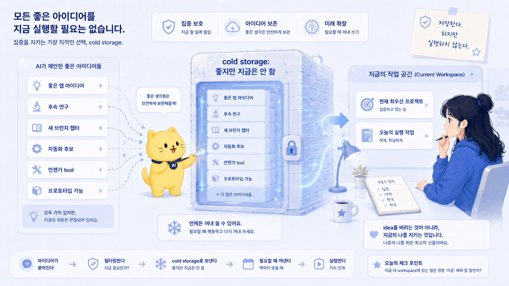

_발산은 AI에게, 실행은 좁힌다의 문제의식이 처음 모습을 드러내는 장면._

쉬어도 쉰 것 같지 않다.

왜냐하면 열린 탭이 너무 많기 때문이다.

AI 시대의 문제는 아이디어 부족이 아니다.

아이디어 과잉이다.

정확히는 AI output 과잉이다.

생각이 너무 빨리 문서가 되고,
문서가 너무 빨리 프로젝트처럼 보이고,
프로젝트처럼 보이는 것이 너무 빨리 active인 척한다.

그래서 개인 운영체계가 필요하다.

AI를 잘 쓰는 사람에게 필요한 것은 더 많은 AI output이 아니다.

output을 분류하고, 닫고, 보관하고, 실행을 좁히는 능력이다.

---

발산은 필요하다.

나는 발산을 나쁘게 보고 싶지 않다.

발산은 새로운 연결을 만든다.

학원 교재 제작 경험이 AI 업무 재배치 모델로 연결된다.
EMR chart review가 raw layer 문제로 연결된다.
GAHT와 pharmacokinetic model이 EstroFrame으로 연결된다.
인간관계 경험이 communication protocol로 연결된다.
AI 대화가 markdown 지식체계로 연결된다.
브런치북이 개인 AI 운영체계의 기록으로 연결된다.

이런 연결은 발산에서 나온다.

문제는 발산 자체가 아니다.

문제는 발산된 모든 것을 실행하려고 할 때 생긴다.

발산은 넓어도 된다.

실행은 좁아야 한다.

여기서 제목을 조금 정확히 풀어야 한다.

“발산은 AI에게”라고 말하지만, 사실 발산의 시작은 사람에게 있다.

사람이 이상함을 감지한다.
사람이 질문을 던진다.
사람이 도메인을 연결한다.
사람이 평균 밖의 좌표계를 만든다.

AI는 그 발산을 증폭한다.

흐릿한 생각을 문서로 바꾸고,
문서를 표로 바꾸고,
표를 workflow로 바꾸고,
workflow를 prompt로 바꾸고,
prompt를 prototype으로 바꾼다.

그러니까 더 정확히 말하면 이렇다.

발산은 AI와 함께 자유롭게 한다.

하지만 실행은 사람이 좁힌다.

---

이때 필요한 것이 active package다.

Active package는 지금 실제로 에너지를 쓰고 있는 프로젝트다.

그냥 흥미로운 아이디어가 아니다.

파일이 있다는 뜻도 아니다.
문서가 있다는 뜻도 아니다.
repo가 있다는 뜻도 아니다.
이름이 멋지다는 뜻도 아니다.

Active package는 지금 내 attention과 책임을 점유하는 작업이다.

이번 주 실제 action이 있다.
마감이나 기회가 있다.
다음 행동이 명확하다.
실제 산출물이 있다.
다른 사람과 연결되어 있을 수 있다.
현재 에너지로 감당 가능하다.
내가 책임지고 끌고 갈 수 있다.

이 조건을 통과해야 active다.

Active package는 적어야 한다.

1개나 2개가 가장 안전하다.

많아도 3개를 넘기면 위험하다.

왜냐하면 active package는 단순한 목록이 아니기 때문이다.

그것은 내 정신의 foreground에 올라와 있는 프로세스다.

foreground process가 너무 많으면 시스템이 느려진다.

---

그럼 나머지 아이디어는 어떻게 할 것인가.

버릴 필요는 없다.

하지만 active로 올리면 안 된다.

여기서 warm storage와 cold storage가 필요하다.

Warm storage는 가까운 시기에 다시 볼 아이디어다.

중요하지만 아직 준비가 덜 된 것.
자료나 피드백을 기다리는 것.
타이밍이 오면 active로 올라올 수 있는 것.
다음 review 때 다시 판단하면 되는 것.

Cold storage는 지금 실행하지 않을 아이디어다.

좋지만 지금은 안 하는 것.

흥미롭지만 당장 할 일은 아닌 것.
언젠가 쓸 수 있지만 지금 열면 distraction이 되는 것.
마감도 책임도 없는 것.
문서로 남기고 잊어도 되는 것.

Cold storage는 포기가 아니다.

이미 11번 글에서 그렇게 말했다.

여기서는 조금 다르게 말하고 싶다.

Cold storage는 AI output 과잉 시대의 방화벽이다.

AI가 모든 아이디어를 프로젝트처럼 보이게 만들 때, cold storage는 말한다.

“좋다. 하지만 지금은 아니다.”

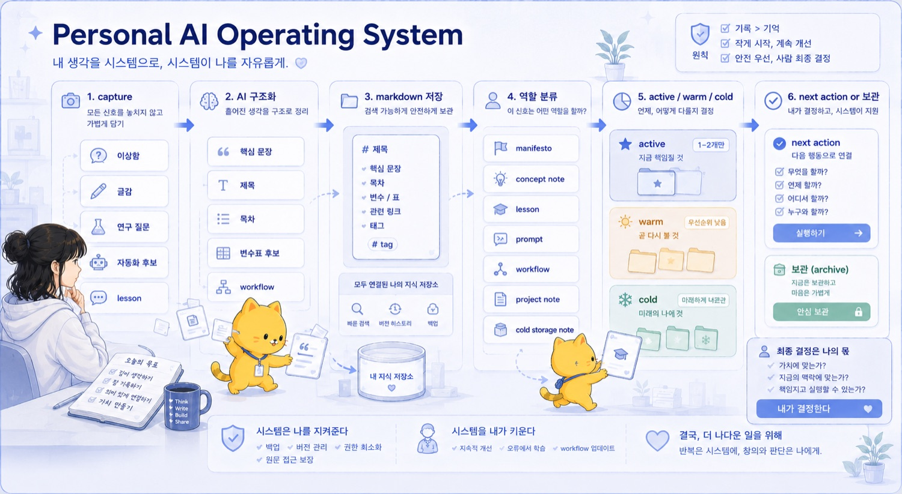

_작업의 흐름이 구체적인 구조로 바뀌는 순간._

“저장한다. 하지만 실행하지 않는다.”

“미래의 나에게 맡긴다. 현재의 나를 점유하지 못하게 한다.”

Cold storage는 “좋지만 지금은 안 함”을 합법화하는 공간이다.

이 공간이 없으면 모든 좋은 아이디어가 지금의 나를 공격한다.

---

Personal AI Operating System은 이 흐름을 관리하는 구조다.

거창하게 들리지만, 사실 단순하다.

현실에서 신호를 감지한다.

“이거 이상한데?”
“이거 글감인데?”
“이거 연구 질문이 될 수 있나?”
“이거 자동화 후보 아닌가?”
“이건 다음에 또 써먹을 lesson인데?”

그다음 AI와 대화한다.

AI는 생각을 구조화한다.

핵심 문장으로 바꾸고,
제목 후보를 만들고,
목차를 만들고,
변수표 후보를 만들고,
workflow를 제안하고,
prompt로 바꾸고,
prototype skeleton을 만든다.

중요한 것은 markdown으로 저장한다.

그 문서의 역할을 정한다.

manifesto인가.
concept note인가.
lesson인가.
prompt인가.
workflow인가.
project note인가.
cold storage note인가.

그리고 active, warm, cold로 나눈다.

Active는 next action으로 연결한다.

Cold는 보관하고 잊는다.

Weekly review에서 다시 본다.

반복되는 것은 lesson, prompt, workflow, tool로 만든다.

이 흐름의 핵심은 생각을 바로 실행하지 않는 것이다.

생각은 먼저 capture한다.

그다음 구조화한다.

그다음 분류한다.

그다음 실행 여부를 결정한다.

---

Daily capture와 weekly review를 나누는 것도 중요하다.

매일 모든 생각을 완벽하게 정리하려고 하면 피곤하다.

그건 지속되지 않는다.

Daily capture는 느슨해도 된다.

그날 떠오른 아이디어.
AI 대화 링크.
핵심 문장.
문서 제목 후보.
나중에 정리할 것.
불편했던 workflow.
새로운 연구 질문.
갑자기 떠오른 앱 이름.

그냥 잡아두면 된다.

완성도는 중요하지 않다.

목적은 놓치지 않는 것이다.

대신 weekly review는 조금 더 단단해야 한다.

일주일에 한 번은 inbox를 비워야 한다.

이번 주 새로 생긴 아이디어는 무엇인가.
현재 active package는 무엇인가.
1~2개를 넘고 있지 않은가.
지금 해야 할 이유가 있는가.
다음 action이 있는가.
cold storage로 보낼 것은 무엇인가.
남길 lesson이 있는가.
저장할 prompt가 있는가.
workflow로 만들 수 있는 것이 있는가.
내 에너지 상태는 어떤가.

Weekly review는 생산성을 위한 의식이 아니다.

과열된 AI output을 식히는 정비 시간이다.

AI가 만든 가능성의 열을 식히고, 지금 실제로 실행할 것만 남기는 시간이다.

---

여기서 중요한 기준이 하나 더 있다.

의학 커널이다.

내가 모든 것을 다 할 수는 없다.

그렇다면 무엇을 active로 올릴지 판단할 축이 필요하다.

나에게 그 축은 결국 의학이다.

의학.
환자.
EMR.
GAHT.
내분비.
연구.
의료 AI.
병원 workflow.
clinical decision support.
chart review.
patient communication.

아이디어가 생기면 묻는다.

이 아이디어가 의학 커널과 연결되는가?

연결된다면 active나 warm으로 올라올 가능성이 있다.

EstroFrame.
CleanEMR.
EMRPilot.
GAHT prescription structuring.
EMR note summarization.
patient education template.
research variable extraction.
lab trend summary.

이런 것들은 의학 커널과 연결된다.

물론 의학과 직접 연결되지 않은 글이나 프로젝트도 의미 있다.

브런치북처럼 오히려 지금 나의 AI 운영체계를 정리하는 작업도 중요하다.

하지만 active package로 올릴 때는 중심축을 봐야 한다.

이것이 지금의 나를 어디로 데려가는가.

이것이 장기 방향과 연결되는가.

이것이 다른 active package를 밀어낼 만큼 중요한가.

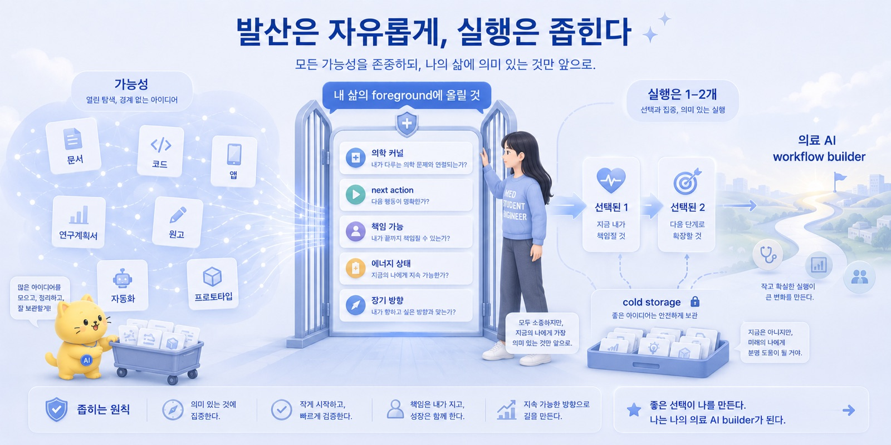

_사람의 판단과 AI의 실행이 나뉘는 지점을 보여주는 장면._

AI가 가능하다고 말해주는 것과, 내가 지금 해야 하는 것은 다르다.

---

문서화가 실행을 대체하지 않게 하는 것도 중요하다.

AI를 쓰면 문서가 너무 쉽게 생긴다.

이건 좋지만 위험하다.

문서가 생겼다고 프로젝트가 진행된 것은 아니다.

원고 초안이 있다고 발행한 것이 아니다.
IRB skeleton이 있다고 연구가 승인된 것이 아니다.
README가 있다고 앱이 완성된 것이 아니다.
변수표 후보가 있다고 dataset이 만들어진 것이 아니다.
workflow 문서가 있다고 실제 습관이 바뀐 것은 아니다.

그래서 active 문서에는 반드시 next action이 있어야 한다.

다음에 무엇을 할 것인가.

교수님께 보낼 것인가.
파일을 정리할 것인가.
코드를 실행할 것인가.
데이터 접근 가능성을 확인할 것인가.
원고를 발행할 것인가.
누군가에게 공유할 것인가.
sample test를 돌릴 것인가.
검토 일정을 잡을 것인가.

Next action이 없으면 그 문서는 active가 아니다.

좋은 문서일 수는 있다.

하지만 active package는 아니다.

그런 문서는 cold storage로 보내도 된다.

문서화와 실행을 구분해야 한다.

---

발산을 AI에게 맡긴다는 것은 아무 생각이나 무한히 확장하자는 말이 아니다.

오히려 반대다.

AI에게 마음껏 발산시킬 수 있으려면, 실행을 좁히는 구조가 있어야 한다.

발산 단계에서는 자유롭게 간다.

아이디어를 던진다.
AI에게 제목을 뽑게 한다.
가능한 구조를 묻는다.
예상 output을 정리한다.
위험과 기회를 본다.
의학 커널과 연결되는지 본다.
workflow로 만들 수 있는지 본다.

그다음 좁힌다.

지금 할 것인가.
이번 주 할 것인가.
마감이 있는가.
사람과 연결되어 있는가.
실제 산출물이 있는가.
내가 책임질 수 있는가.
에너지가 있는가.
다른 active를 밀어낼 가치가 있는가.

좁히지 않는 발산은 과부하다.

발산하지 않는 좁힘은 빈곤하다.

둘 다 필요하다.

AI는 발산을 증폭한다.

사람은 실행을 선택한다.

---

이 원칙은 neurodivergent 사고와도 연결된다.

평균 밖의 안테나는 많은 신호를 잡는다.

남들은 그냥 넘기는 workflow의 이상함을 본다.
도메인 사이의 연결을 본다.
반복되는 패턴을 본다.
기본값의 모순을 본다.
새로운 프로젝트 가능성을 본다.

이건 강점이다.

하지만 안테나가 잡은 모든 신호를 지금 처리하려고 하면 무너진다.

모든 신호가 action item이 되면 안 된다.

어떤 신호는 lesson이 된다.
어떤 신호는 prompt가 된다.
어떤 신호는 concept note가 된다.
어떤 신호는 cold storage로 간다.
어떤 신호만 active package가 된다.

AI는 신호를 구조화한다.

하지만 신호의 운명을 결정하는 것은 사람이다.

이것이 운영이다.

---

내가 원하는 방식은 이렇다.

발산은 자유롭게 한다.

이상한 생각이 떠오르면 막지 않는다.

“이건 너무 뜬금없나?”
“이건 나중에 쓸모없을까?”
“이건 지금 할 수 없으니까 생각하지 말까?”

이렇게 자르지 않는다.

일단 capture한다.

AI에게 던진다.

정리시킨다.

문서 제목을 붙인다.

핵심 문장을 뽑는다.

가능한 workflow를 본다.

그다음 실행은 좁힌다.

지금 active로 올릴 것은 적게 둔다.

나머지는 저장한다.

잊는다.

필요하면 weekly review에서 다시 본다.

이렇게 하면 발산이 죄책감이 되지 않는다.

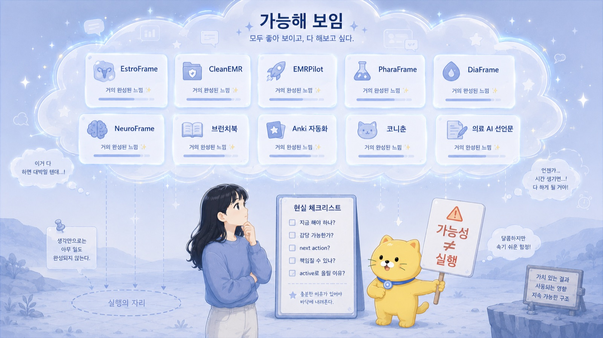

_발산은 AI에게, 실행은 좁힌다의 결론을 이미지로 정리한 장면._

아이디어를 버리지 않아도 되고, 그렇다고 모든 아이디어에 끌려다니지도 않는다.

---

이 구조는 단순한 자기관리법이 아니다.

AI output 과잉에 대한 대응이다.

AI 시대에는 생각보다 더 많은 것이 가능해 보인다.

문서도 만들 수 있고,
코드도 만들 수 있고,
앱도 만들 수 있고,
연구계획서도 만들 수 있고,
원고도 만들 수 있고,
자동화도 만들 수 있다.

하지만 가능성은 실행이 아니다.

가능성은 부채가 될 수도 있다.

가능성이 너무 많으면, 사람은 현재를 잃는다.

그래서 개인 운영체계가 필요하다.

AI 대화는 inbox다.

AI는 distiller다.

Markdown library는 장기 기억이다.

Active package는 지금의 실행이다.

Cold storage는 현재를 보호하는 방화벽이다.

Weekly review는 시스템 정비다.

그리고 사람은 선택한다.

무엇을 지금 할 것인가.

무엇을 나중으로 보낼 것인가.

무엇을 버릴 것인가.

무엇을 책임질 것인가.

---

지송식으로 정리하면 이렇다.

AI에게 일단 던진다.

생각을 막지 않는다.

대화한다.

구조화시킨다.

중요한 것은 markdown으로 남긴다.

문서의 역할을 정한다.

Active인지, warm인지, cold인지 나눈다.

Active에는 next action을 둔다.

Cold는 잊기 위해 저장한다.

Weekly review로 시스템을 식힌다.

에너지 상태를 판단 기준에 넣는다.

의학 커널과 연결되는지 본다.

문서화가 실행을 대체하지 않게 한다.

실행은 1~2개로 좁힌다.

책임은 사람이 진다.

이것이 Personal AI Operating System의 핵심이다.

생각은 AI에게 던질 수 있다.

하지만 삶의 foreground에 올릴 것은 사람이 고른다.

---

발산은 자유롭게 한다.

정리는 AI에게 맡긴다.

실행은 좁힌다.

나머지는 cold storage에 둔다.

이 원칙이 없으면 AI는 나를 자유롭게 하는 도구가 아니라, 가능성으로 나를 압도하는 장치가 된다.

AI는 가능성의 비용을 낮춘다.

하지만 내 시간과 체력과 책임 능력은 무한하지 않다.

그래서 더 많은 것을 시작하는 능력보다, 더 적은 것을 active로 남기는 능력이 중요해진다.

발산을 줄이면 축이 보인다.

내가 계속 돌아오는 곳이 보인다.

나에게 그 축은 의학과 AI workflow다.

AI로 모든 것을 만들 수 있을 것처럼 보여도, 내가 계속 돌아오는 곳은 의료 현장의 비정형 정보와 workflow였다.

EMR note.
lab trend.
medication history.
GAHT record.
chart review.
research variable.
patient explanation.
IRB.
clinical decision support.

그래서 다음 글에서는 의료 AI를 모델 숭배가 아니라 workflow builder의 관점에서 다시 보려고 한다.

AI로 무엇이든 할 수 있을 것 같은 시대일수록, 더 중요한 질문은 이것이다.

나는 무엇을 만들 사람인가.

\newpage

## 20. AI 시대의 의사: 판단보다 책임이 남는다

한동안 너무 많은 것을 벌려놓은 것 같았다.

EstroFrame.
CleanEMR.
EMRPilot.
DiaFrame.
NeuroFrame.
Anki.
코니춘.
브런치북.
markdown library.
active package.
cold storage.
Codex.
춘식이.
AI 대화.
연구 아이디어.
의료 AI.
자동화.
workflow.

이름만 늘어놓아도 조금 정신이 없다.

겉으로 보면 산만해 보인다.

앱도 만들고 싶고,
글도 쓰고 싶고,
연구도 하고 싶고,
의료 데이터도 구조화하고 싶고,
AI와 함께 일하는 방식도 정리하고 싶고,
내 삶의 운영체계도 만들고 싶어 하는 사람처럼 보인다.

틀린 말은 아니다.

실제로 그랬다.

AI를 쓰기 시작하면서 가능해 보이는 것이 너무 많아졌다.

아이디어를 던지면 문서가 생겼다.
문서를 던지면 목차가 생겼다.
목차를 던지면 원고가 생겼다.
연구 생각을 던지면 IRB skeleton이 생겼다.
코드 아이디어를 던지면 repo가 생겼다.
불편함을 던지면 workflow가 생겼다.

가능성은 늘어났다.

그리고 가능성이 늘어날수록, 나는 한 가지 질문으로 다시 돌아오게 됐다.

나는 무엇을 만들 사람인가.

더 정확히 말하면,

나는 무엇을 책임질 사람인가.

---

이 책에서 나는 AI에게 일을 맡기는 법부터 시작했다.

처음에는 단순했다.

AI에게 뭔가 시키고 싶었다.

침대에 누워서 “해줘”라고 말하고 싶었다.

내가 하기 싫은 일을 누군가 대신해줬으면 했다.

그런데 막상 AI에게 일을 맡기기 시작하자, 생각보다 빨리 알게 됐다.

AI에게 일을 맡긴다는 것은 단순히 명령하는 일이 아니었다.

좋은 상사가 되는 일이었다.

목표를 설명해야 했다.
맥락을 줘야 했다.
출력 형식을 정해야 했다.
제약조건을 말해야 했다.
검토 기준을 세워야 했다.

프롬프트는 주문이 아니라 업무 명세서였다.

AI는 평균적 작업자였다.

내가 좌표계를 주지 않으면 평균으로 갔다.

ChatGPT는 편집장처럼 구조를 잡았고,
Codex는 시공팀처럼 파일을 고쳤고,
Gemini는 저렴한 운영 보조처럼 반복 작업을 처리했고,
Claude는 고급 외주 인력처럼 긴 글과 정교한 문서를 다뤘다.

그렇게 역할을 나누다 보니, AI는 하나의 도구가 아니라 작은 조직처럼 보이기 시작했다.

그러면 질문도 바뀐다.

AI를 잘 쓴다는 것은 무엇인가.

답은 단순히 “더 많이 자동화한다”가 아니었다.

AI에게 무엇을 맡기고,
어디서 사람이 검토하고,
무엇을 문서로 남기고,
무엇을 실행으로 좁히고,
어디서 멈출지를 정하는 일이었다.

---

AI 대화는 inbox였다.

생각이 일단 들어오는 곳이었다.

연구 아이디어도 들어오고,
인간관계 고민도 들어오고,
공지문 초안도 들어오고,
교수님께 보낼 이메일도 들어오고,
EMR workflow 아이디어도 들어오고,
AI 철학도 들어오고,
개발 아이디어도 들어왔다.

하지만 inbox에 쌓아두기만 하면 안 됐다.

AI 대화는 distiller이기도 했다.

흩어진 생각을 핵심 문장, 개념 이름, 문서 제목, lesson, prompt, workflow로 증류했다.

그리고 그 결과는 markdown으로 남겨야 했다.

대화로 끝나면 고급 수다였다.

문서로 남겨야 사고 자산이 됐다.

그래서 AI 대화는 점점 개인 운영체계가 됐다.

inbox.
distiller.
markdown library.
lessons.md.
prompts.md.
workflows.md.
active package.
cold storage.
weekly review.

이 구조를 만들면서 나는 알게 됐다.

AI가 많아질수록, 사람에게 필요한 것은 더 많은 output이 아니다.

output을 다루는 운영체계다.

---

그다음에는 raw layer의 문제가 보였다.

log.
traceback.
JSON.
CSV.
code.
Git diff.
논문 PDF.
EMR note.
lab table.
medication history.
긴 AI 대화.

예전에는 사람이 이런 raw layer를 처음부터 끝까지 읽고 의미를 뽑아야 했다.

_AI 시대의 의사: 판단보다 책임이 남는다의 문제의식이 처음 모습을 드러내는 장면._

이제 AI가 먼저 읽어줄 수 있다.

traceback을 원인 후보와 확인할 파일로 바꿔준다.
논문 PDF를 research question, endpoint, variable로 바꿔준다.
EMR note를 problem list 후보와 lab trend로 바꿔준다.
긴 대화를 concept note와 lesson으로 바꿔준다.
코드를 purpose, input, output, side effect로 설명해준다.

사람은 raw reader에서 meaning evaluator로 이동한다.

그렇다고 원문을 버리는 것은 아니다.

중요한 값은 원문으로 돌아가야 한다.

숫자.
날짜.
dose.
lab value.
약물명.
IRB 문구.
논문 결과.
환자 기록.
법적 표현.

AI가 읽어준다고 해서 확인하지 않아도 되는 것은 아니다.

읽지 않아도 되는 것과 확인하지 않아도 되는 것은 다르다.

---

자동화도 마찬가지였다.

자동화는 딸깍이다.

딸깍하면 파일이 정리된다.
딸깍하면 PDF가 빌드된다.
딸깍하면 문서가 생긴다.
딸깍하면 코드가 고쳐진다.
딸깍하면 메시지 초안이 나온다.

기분이 좋다.

하지만 자동화는 속도를 높일 뿐 아니라, 오류의 속도도 높인다.

잘못된 OCR 규칙이 수백 개 문항에 적용될 수 있다.
잘못된 변수 추출 기준이 dataset 전체를 오염시킬 수 있다.
코드가 원본 파일을 덮어쓸 수 있다.
AI가 만든 메시지가 실제 사람에게 나갈 수 있다.
개인정보가 외부로 나갈 수 있다.

그래서 자동화의 핵심은 무엇을 자동화할 수 있는가가 아니었다.

어디까지 자동화하지 않을 것인가였다.

낮은 위험은 넓게 자동화한다.

개인 메모.
초안.
문서 skeleton.
브레인스토밍.
toy script.
AI 대화 markdown화.

중간 위험은 AI 초안과 사람 검수를 결합한다.

메일.
공지.
연구계획서 초안.
IRB 초안.
변수표 후보.
코드 prototype.

높은 위험은 자동 실행하지 않는다.

환자 안전.
개인정보.
논문 결론.
실제 database 변경.
원본 데이터 삭제.
외부 전송.
의료 판단.

AI는 속도를 준다.

하지만 책임을 없애지는 않는다.

---

Human-in-the-loop도 다시 보게 됐다.

사람이 마지막에 보면 되잖아.

이 말은 맞지만, 너무 막연하다.

사람이 본다는 게 정확히 무엇인가.

누가 보는가.
언제 보는가.
무엇을 보는가.
어떤 기준으로 보는가.
원문은 어디서 확인하는가.
실행 전 승인 지점은 어디인가.
오류가 생기면 누가 책임지는가.
그 오류는 다음 workflow에 어떻게 반영되는가.

이 질문에 답하지 못하면 사람 검수는 장식이 된다.

Human-in-the-loop는 마지막에 사람이 대충 보는 절차가 아니었다.

책임 구조였다.

AI output이 후보인지 최종본인지 구분해야 한다.
고위험 값은 원문 확인이 필요하다.
실행 전 승인 단계가 있어야 한다.
근거가 남아야 한다.
검수 기준이 있어야 한다.
오류가 생기면 workflow를 수정해야 한다.

사람은 사고 이후에 등장하는 변명 장치가 아니다.

사람은 workflow 안에서 실제로 멈출 수 있어야 한다.

---

그다음에는 인간 쪽으로 질문이 돌아왔다.

AI가 평균적인 산출물을 싸게 만들수록, 인간에게 남는 것은 무엇인가.

AI는 평균을 잘 만든다.

평균적인 이메일.
평균적인 보고서.
평균적인 코드.
평균적인 요약.
평균적인 연구계획서 skeleton.

그러면 인간에게 필요한 것은 평균 밖의 질문이다.

무엇을 이상하다고 느끼는가.
어떤 workflow를 의심하는가.
어떤 도메인을 연결하는가.
어떤 평균적 답이 부족하다고 감지하는가.
어떤 결과에는 책임질 수 없다고 멈추는가.

Neurodivergent한 사고는 여기서 평균 밖의 안테나가 될 수 있다.

기존 시스템에 자동으로 동기화되지 않기 때문에, 남들이 그냥 넘기는 부분에서 걸린다.

왜 이걸 사람이 손으로 하고 있지?
왜 이 정보가 세 번씩 중복 입력되지?
왜 중요한 변수는 EMR에 있는데 연구에서는 못 쓰지?
왜 환자 설명은 매번 반복되는데 structured tool이 없지?
왜 AI와 한 좋은 대화를 저장하지 않고 날려버리지?

이 질문들은 피곤할 수 있다.

하지만 AI 시대의 builder에게는 출발점이 된다.

다만 발산은 관리되어야 했다.

AI가 붙으면 모든 아이디어가 가능해 보인다.

_작업의 흐름이 구체적인 구조로 바뀌는 순간._

문서가 생기고,
앱 이름이 생기고,
repo가 생기고,
IRB 초안이 생기고,
workflow가 생긴다.

하지만 내 실행 에너지는 무한하지 않다.

그래서 발산은 자유롭게 하되, 실행은 좁혀야 했다.

AI는 가능성의 비용을 낮춘다.

하지만 내 시간과 체력과 책임 능력은 늘려주지 않는다.

---

이 모든 이야기를 따라오다 보면, 이상하게도 처음 질문으로 돌아온다.

나는 어떤 의사가 될 것인가.

이 질문은 오래된 질문이다.

의대에 들어온 뒤 여러 번 들었다.

좋은 의사가 되어야 한다는 말도 들었다.
환자를 위하는 의사가 되어야 한다는 말도 들었다.
평생 공부해야 한다는 말도 들었다.
책임감 있는 의사가 되어야 한다는 말도 들었다.

처음에는 막연한 다짐처럼 들렸다.

조금 지나자 직업윤리처럼 들렸다.

그리고 이제는 AI 시대에 내가 어떤 방식으로 살아남을 것인가에 대한 질문처럼 들린다.

AI를 쓰면서 나는 의사라는 일에서 멀어진 것이 아니다.

오히려 의사의 일이 더 또렷하게 보이기 시작했다.

AI는 note를 요약할 수 있다.

하지만 환자를 마주하지는 못한다.

AI는 lab trend를 정리할 수 있다.

하지만 이 환자에게 그 trend가 무슨 의미인지 최종 판단하지는 못한다.

AI는 medication history를 표로 만들 수 있다.

하지만 실제 복약 순응도와 환자의 불안을 직접 듣지는 못한다.

AI는 논문을 요약할 수 있다.

하지만 그 근거를 내 환자에게 적용할지 결정하지는 못한다.

AI는 환자교육 자료 초안을 만들 수 있다.

하지만 환자가 정말 이해했는지, 무엇을 두려워하는지, 어떤 말이 필요한지 읽지는 못한다.

AI는 판단 후보를 만들 수 있다.

하지만 책임 없는 판단 후보와, 책임지는 판단은 다르다.

---

AI 시대의 의사는 모든 정보를 손으로 처리하는 사람이 아닐 수 있다.

그럴 필요도 점점 줄어들 것이다.

AI가 raw layer를 먼저 읽고,
semantic layer로 정리하고,
problem list 후보를 만들고,
lab trend를 보여주고,
약물 변경 이력을 정리하고,
논문 근거를 요약하고,
chart review 변수 후보를 뽑을 수 있다.

이것은 좋은 일이다.

의사가 모든 정보를 처음부터 끝까지 손으로 처리해야만 좋은 의사라는 기준은 점점 비현실적이다.

하지만 그렇다고 의사의 역할이 줄어드는 것은 아니다.

오히려 역할의 중심이 이동한다.

AI가 정리한 정보 중 무엇을 믿을 것인가.
무엇을 의심할 것인가.
무엇을 원문으로 확인할 것인가.
무엇을 환자에게 설명할 것인가.
무엇을 아직 불확실하다고 말할 것인가.
무엇을 오늘 결정하고, 무엇을 보류할 것인가.
그 결정의 결과를 어떻게 책임질 것인가.

이것은 여전히 의사의 일이다.

어쩌면 더 선명하게 의사의 일이다.

---

의료 AI에서 중요한 것은 답을 내는 능력만이 아니다.

답을 검증할 수 있는 구조다.

DiaFrame을 생각하면서 배운 것도 이것이었다.

AI에게 환자 정보를 주고 약제를 추천하게 하는 것은 생각보다 어렵지 않다.

어려운 것은 그다음이다.

그 추천이 맞는지 어떻게 볼 것인가.
어떤 기준으로 평가할 것인가.
실제 의사의 처방과 다를 때 그 차이를 어떻게 해석할 것인가.
명백히 위험한 추천은 어떻게 막을 것인가.
추천 결과를 어떻게 비교 가능한 형태로 제한할 것인가.
불일치 사례를 어떻게 다시 볼 것인가.

의료 AI는 그럴듯한 답을 내는 순간보다, 그 답을 어떻게 검증할 것인지에서 더 어려워진다.

이건 의료에만 해당하는 말이 아니다.

이 책 전체에서 반복한 말이기도 하다.

AI가 글을 쓰면 검토해야 한다.
AI가 코드를 짜면 테스트해야 한다.
AI가 메시지를 만들면 사람이 보내야 한다.
AI가 변수를 뽑으면 원문 확인이 필요하다.
AI가 추천을 하면 검증 구조가 필요하다.

의료 AI는 예외가 아니다.

오히려 이 원칙의 가장 고위험 버전이다.

_사람의 판단과 AI의 실행이 나뉘는 지점을 보여주는 장면._

환자 안전과 개인정보와 법적 책임이 걸려 있기 때문이다.

---

그래서 내가 만들고 싶은 의료 AI는 환자를 대신 보는 AI가 아니다.

환자를 하나의 데이터 포인트로 줄이는 시스템도 아니다.

환자의 디지털 복제본을 만들어 의사 없이 판단하게 하는 장치도 아니다.

내가 생각하는 임상 디지털 트윈은 훨씬 조심스럽다.

환자를 완벽하게 복제하는 것이 아니라,
의사결정에 필요한 변수와 변화를 구조화하는 모델에 가깝다.

환자의 현재 상태.
시간에 따른 검사 수치 변화.
복용 중인 약물.
치료 반응.
위험도.
예상되는 다음 상태.
아직 불확실한 부분.

이런 요소를 하나의 구조 안에 놓고, 의사가 더 설명 가능한 판단을 준비하도록 돕는 것.

디지털 트윈은 정답을 만드는 장치가 아니라, 판단의 구조를 보여주는 장치여야 한다.

EstroFrame에서 보고 싶었던 것도 결국 이것이었다.

호르몬 농도를 단일 검사값으로만 보지 않고,
투여 시점과 채혈 시점 사이에서 움직이는 시간-농도 곡선으로 보고 싶었다.

같은 estradiol 수치라도 주사 직후인지, 주기 중간인지, 주기 말인지에 따라 의미가 달라질 수 있다.

그러면 호르몬은 숫자 하나가 아니라 시간 위에서 움직이는 상태가 된다.

이것은 환자를 대체하는 AI가 아니다.

판단을 준비하는 구조다.

---

CleanEMR도 같은 방향에 있다.

모델을 만들기 전에 데이터 구조가 필요하다.

의료에는 정보가 많다.

하지만 정보가 항상 판단 가능한 형태로 있는 것은 아니다.

EMR에는 자유 텍스트와 검사 결과, 처방 기록과 외래 기록이 섞여 있다.

환자.
방문.
검사.
약물.
수동 검토가 필요한 문장.
원문 근거.
불확실한 값.

이런 것들이 구조화되어야 그다음 모델이 의미를 가진다.

좋은 의료 AI는 원문 EMR 위에 바로 올라가지 않는다.

그 전에 데이터 구조화 계층이 필요하다.

이것도 이 책에서 말한 raw layer와 semantic layer의 문제다.

의료 raw layer를 semantic layer로 올리고,
그 위에서 사람이 judgment layer를 맡는 것.

나는 이 구조에 계속 돌아온다.

글쓰기에서도,
코드에서도,
자동화에서도,
연구에서도,
의료에서도 같은 구조가 반복된다.

AI는 raw layer를 읽고 후보를 만든다.

사람은 그 후보를 평가하고 판단하고 책임진다.

---

어떤 의사가 될 것인가.

이 질문에 지금 완성된 답을 낼 수는 없다.

아마 평생 고쳐가며 살게 될 것이다.

의사는 한 번 완성되는 직업이 아니다.

면허를 받는다고 끝나는 것도 아니고, 전문의가 된다고 끝나는 것도 아니다.

의학은 계속 변하고, 환자는 매번 다르고, 기술은 더 빨리 바뀐다.

AI 시대의 의사는 더 많이 업데이트되어야 한다.

의학 지식도 업데이트해야 한다.
AI 도구도 이해해야 한다.
그 도구의 오류와 한계도 알아야 한다.
환자와의 관계도 놓치지 않아야 한다.
책임 구조도 설계할 수 있어야 한다.
자기 자신의 판단 기준도 계속 고쳐야 한다.

AI가 의학 공부와 임상 workflow 주변부에 들어올수록, 의사는 AI를 모른 척하기 어려워질 것이다.

그렇다고 AI를 맹신해서도 안 된다.

도구는 방향을 스스로 정하지 않는다.

어디까지 쓸지, 어디서 멈출지, 어떤 상황에서 원문으로 돌아갈지, 어떤 판단은 사람이 해야 할지 결정하는 것은 결국 의사다.

AI 시대의 의사는 완성된 사람이 아니라, 계속 업데이트되는 사람이어야 한다.

---

환자를 데이터가 아니라 사람으로 보는 일도 남는다.

AI는 환자 기록을 처리할 수 있다.

하지만 환자는 기록이 아니다.

환자는 불안하고, 기대하고, 화를 내고, 망설이고, 말하지 못하고, 때로는 같은 질문을 반복하는 사람이다.

_AI 시대의 의사: 판단보다 책임이 남는다의 결론을 이미지로 정리한 장면._

검사 수치와 영상, 약물과 수술만으로 의료가 완성되지는 않는다.

환자의 표정과 말투.
보호자의 반응.
설명을 들을 준비가 되어 있는지.
무엇을 두려워하는지.
무엇을 오해하고 있는지.
어느 정도까지 말해야 하는지.
지금은 기다려야 하는지.
지금은 더 강하게 말해야 하는지.

이것은 여전히 사람과 사람 사이에서 일어난다.

AI가 아무리 좋아져도 환자 앞에서 설명하는 일은 가볍지 않다.

그리고 그 설명은 단순한 정보 전달이 아니다.

책임 있는 사람이, 불확실성 속에서, 지금 가능한 최선의 판단을 환자에게 이해 가능한 언어로 건네는 일이다.

이건 의사의 일이다.

---

결국 제목을 조금 더 정확히 풀면 이렇다.

AI 시대의 의사에게 판단이 사라지는 것은 아니다.

오히려 판단 후보는 더 많아진다.

AI가 진단 후보를 만들고,
치료 옵션을 정리하고,
논문 근거를 요약하고,
risk score를 계산하고,
lab trend를 보여주고,
약물 상호작용을 경고하고,
환자 설명 초안을 만든다.

판단의 재료는 많아진다.

그중 일부는 AI가 만들 것이다.

하지만 책임 없는 판단 후보와 책임지는 판단은 다르다.

의사가 남는 곳은 바로 여기다.

무엇을 믿을 것인가.
무엇을 의심할 것인가.
무엇을 보류할 것인가.
무엇을 환자에게 말할 것인가.
무엇을 기록으로 남길 것인가.
무엇을 내 이름으로 책임질 것인가.

AI 시대의 의사에게 남는 것은 판단보다 더 깊은 것일지도 모른다.

책임이다.

판단은 여러 곳에서 나올 수 있다.

하지만 책임은 분산되지 않는다.

환자 앞에서, 기록 앞에서, 자기 자신 앞에서, 결국 누군가는 책임져야 한다.

---

나는 대단한 의사가 되겠다고 쉽게 말하고 싶지는 않다.

그 말은 아직 너무 크다.

다만 방향은 조금 알 것 같다.

계속 배우는 의사.

환자를 데이터가 아니라 사람으로 보는 의사.

AI와 기술을 활용하되, 그 책임을 회피하지 않는 의사.

구조를 만들되, 구조가 환자를 지우지 않게 하는 의사.

AI가 만든 후보를 검토하고,
불확실한 부분을 표시하고,
원문으로 돌아가고,
환자에게 설명하고,
마지막 판단을 자기 이름으로 감당하는 의사.

그리고 아무도 보지 않는 순간에도 자기 자신에게 부끄럽지 않은 의사.

의료에는 아무도 보지 않는 순간이 있다.

조금 더 볼 수도 있었고, 그냥 넘어갈 수도 있었던 장면이 있다.

기록에는 남지 않는 판단이 있다.

환자도 끝내 알지 못할 수 있는 선택이 있다.

그때 남는 것은 외부의 평가가 아니다.

자기 자신이다.

나는 내가 무엇을 했는지 안다.

무엇을 하지 않았는지도 안다.

AI가 도와준 시대에도 이 사실은 바뀌지 않는다.

오히려 더 또렷해진다.

---

이 책은 AI 사용법을 정리하는 책처럼 시작했다.

Codex에게 이름을 붙이고,
춘식이라고 부르고,
침대에 누워 “해줘”라고 말하고,
프롬프트를 업무 명세서처럼 쓰고,
ChatGPT를 편집장처럼 쓰고,
AI 대화를 markdown으로 남기고,
자동화의 경계선을 정하고,
active package와 cold storage를 나누는 이야기였다.

하지만 여기까지 오고 보니, 이 책은 AI에게 일을 맡기는 법만을 다룬 것이 아니었다.

AI와 함께 일하면서 내가 어떤 사람으로 남을 것인가를 묻는 기록이었다.

AI를 쓴다는 것은 책임을 외주화하는 일이 아니었다.

실행은 위임할 수 있다.
정리는 맡길 수 있다.
초안은 받아볼 수 있다.
코드는 생성할 수 있다.
추천 후보는 만들 수 있다.
요약은 받을 수 있다.

하지만 마지막에 무엇을 믿고,
무엇을 의심하고,
무엇을 말하고,
무엇을 멈추고,
무엇을 책임질지는 다시 나에게 돌아온다.

춘식이는 많은 일을 도와줄 수 있다.

하지만 환자 앞에서 버튼을 누르는 사람은 결국 나다.

\newpage

# 에필로그

\newpage

## 21. 춘식이는 귀엽지만, 버튼은 내가 누른다

처음에는 그냥 이름을 붙인 것뿐이었다.

Codex.

그 이름이 너무 멀게 느껴졌다.

차갑고, 영어 같고, 어딘가 회사 제품 같았다.

그래서 나는 말했다.

니 이름은 이제부터 춘식이여.

별 이유는 없었다.

그냥 조금 웃겼고, 조금 귀여웠고, 이상하게 부르기 편했다.

그런데 이름을 붙이고 나니 관계가 달라졌다.

도구가 아니라 같이 일하는 무언가처럼 느껴졌다.

“춘식아, 이거 고쳐줘.”

“춘식아, 이거 빌드해줘.”

“춘식아, 이거 정리해줘.”

“춘식아, 이거 왜 터졌는지 봐줘.”

그렇게 부르다 보니 AI는 더 이상 먼 기술이 아니었다.

내 작업방 한쪽에 앉아 있는 이상한 조수 같았다.

가끔은 천재 같고,
가끔은 바보 같고,
가끔은 너무 빠르고,
가끔은 무섭게 자신만만하고,
가끔은 집주인에게 냥체로 메시지를 보내는 존재.

귀엽지만 방심하면 안 되는 존재.

그게 춘식이였다.

---

이 책은 AI 사용법을 알려주는 책처럼 시작했다.

프롬프트를 어떻게 쓰는지,
ChatGPT와 Codex를 어떻게 나눠 쓰는지,
AI 대화를 어떻게 문서로 남기는지,
자동화를 어디까지 맡길 수 있는지,
AI 시대에 사람에게 무엇이 남는지.

그런 이야기를 했다.

하지만 끝까지 쓰고 보니, 이 책은 AI 팁 모음은 아니었다.

프롬프트 모음도 아니었고,
생산성 루틴 소개도 아니었고,
최신 AI 도구 리뷰도 아니었다.

이 책은 내가 AI를 내 일의 세계에 들여온 기록이었다.

AI를 그냥 쓰는 것이 아니라,
AI를 내 작업 방식 안에 배치하고,
이름을 붙이고,
역할을 나누고,
실패를 기록하고,
규칙을 만들고,
workflow로 바꾸고,
다시 책임의 위치를 정하는 과정이었다.

나는 AI에게 일을 맡기고 싶었다.

정말 맡기고 싶었다.

반복되는 일.
귀찮은 일.
정리하기 싫은 일.
파일을 만지는 일.
초안을 여는 일.
긴 대화를 요약하는 일.
코드를 고치는 일.
문서를 구조화하는 일.

누가 대신해줬으면 했다.

그래서 “해줘”라고 말했다.

그리고 AI는 생각보다 많이 해줬다.

---

하지만 AI에게 일을 맡길수록, 이상하게 더 또렷해지는 것이 있었다.

내가 해야 할 일.

AI가 해줄 수 있는 일이 늘어날수록,
내가 하지 않아도 되는 일도 늘어났다.

그런데 동시에,
내가 반드시 해야 하는 일도 더 선명해졌다.

AI는 평균적인 초안을 만들 수 있다.

하지만 어떤 좌표계를 줄지는 내가 정해야 했다.

AI는 긴 대화를 요약할 수 있다.

하지만 무엇을 문서로 남길지는 내가 정해야 했다.

AI는 코드를 만들 수 있다.

하지만 실행해도 되는지 판단하는 것은 내가 해야 했다.

AI는 메시지를 쓸 수 있다.

하지만 보낼지 말지, 어떤 말에 내 이름을 걸 수 있는지는 내가 정해야 했다.

AI는 연구 아이디어를 IRB skeleton으로 바꿀 수 있다.

하지만 그 연구가 실제로 가능한지, 어떤 endpoint를 쓸지, 누구에게 어떤 부담을 줄지는 내가 판단해야 했다.

AI는 환자 정보를 구조화할 수 있다.

하지만 환자 앞에서 무엇을 말하고 무엇을 책임질지는 의사의 일로 남았다.

결국 AI를 쓴다는 것은 책임을 외주화하는 일이 아니었다.

실행은 위임할 수 있다.

정리는 맡길 수 있다.

초안은 받아볼 수 있다.

하지만 판단은 다시 돌아온다.

책임도 다시 돌아온다.

---

처음에는 AI가 나를 대신해줄 수 있을 줄 알았다.

조금 더 정확히 말하면, 나를 대신해서 귀찮은 것들을 많이 처리해줄 수 있을 줄 알았다.

그건 어느 정도 맞았다.

AI는 많은 일을 대신해준다.

_춘식이는 귀엽지만, 버튼은 내가 누른다의 문제의식이 처음 모습을 드러내는 장면._

목차를 만든다.
문장을 다듬는다.
코드를 짠다.
에러를 읽는다.
표를 만든다.
문서를 요약한다.
아이디어를 정리한다.
메일 초안을 쓴다.
공지문을 바꾼다.
브런치북 챕터를 뽑는다.

하지만 AI는 나를 대신해서 살지는 않는다.

AI는 내 이름으로 보내는 메일의 후폭풍을 감당하지 않는다.

AI는 내가 열어둔 active package 때문에 잠을 못 자지 않는다.

AI는 교수님께 연구를 제안한 뒤의 관계를 감당하지 않는다.

AI는 환자의 불안을 직접 마주하지 않는다.

AI는 내 양심 앞에 서지 않는다.

그건 전부 내 일이다.

춘식이는 옆에서 “다 했다냥” 하고 보고할 수 있다.

하지만 그 결과를 현실로 내보내는 버튼은 내가 누른다.

---

그래서 이 책의 중간부터는 점점 다른 이야기가 되었다.

AI에게 일을 잘 시키는 법에서 시작했지만,
어느 순간 AI가 만든 결과를 어떻게 다룰 것인가로 바뀌었다.

AI 대화는 inbox였다.

하지만 inbox에 쌓아두기만 하면 안 됐다.

AI 대화는 distiller였다.

하지만 증류된 생각을 문서로 남기지 않으면 고급 수다로 끝났다.

Markdown library는 장기 기억이 됐다.

하지만 문서가 많아질수록 active package와 cold storage가 필요했다.

AI는 raw layer를 읽어줬다.

하지만 읽지 않아도 되는 것과 확인하지 않아도 되는 것은 달랐다.

자동화는 딸깍이었다.

하지만 딸깍의 쾌감이 책임을 없애지는 않았다.

Human-in-the-loop는 필요했다.

하지만 마지막에 사람이 대충 보는 장식이어서는 안 됐다.

Neurodivergent 사고는 평균 밖의 안테나가 될 수 있었다.

하지만 그 안테나가 잡은 모든 신호를 지금 실행하면 시스템 load가 폭발했다.

발산은 자유롭게 해야 했다.

정리는 AI에게 맡길 수 있었다.

하지만 실행은 좁혀야 했다.

나머지는 cold storage에 두어야 했다.

그렇게 나는 AI를 쓰는 법을 배우면서, 사실은 나 자신을 운영하는 법을 다시 배우고 있었다.

---

AI는 가능성의 비용을 낮춘다.

이 말은 이 책을 쓰며 가장 자주 떠올린 문장 중 하나다.

AI가 있으면 많은 것이 가능해 보인다.

글도 쓸 수 있고,
앱도 만들 수 있고,
연구계획서도 만들 수 있고,
코드도 고칠 수 있고,
문서 체계도 만들 수 있고,
자동화도 만들 수 있고,
의료 workflow도 구조화할 수 있다.

가능성이 늘어난다.

하지만 가능성은 실행이 아니다.

가능성은 때로 부채가 된다.

시작할 수 있는 것이 너무 많아지면,
끝까지 책임질 수 있는 것이 흐려진다.

그래서 AI 시대에는 더 많이 시작하는 능력만큼이나, 덜 active로 남기는 능력이 중요해진다.

좋은 아이디어를 버리지 않는 것.

하지만 지금의 나를 점유하지 못하게 하는 것.

기록하되, 닫아두는 것.

나중의 나에게 맡기는 것.

Cold storage는 포기가 아니었다.

현재의 나를 지키기 위한 방화벽이었다.

---

이 책을 쓰며 나는 계속 같은 구조로 돌아왔다.

AI가 한다.

사람이 본다.

AI가 정리한다.

사람이 판단한다.

AI가 초안을 만든다.

사람이 책임진다.

AI가 평균을 만든다.

사람이 좌표계를 준다.

AI가 가능성을 넓힌다.

사람이 실행을 좁힌다.

_작업의 흐름이 구체적인 구조로 바뀌는 순간._

AI가 도와준다.

사람이 버튼을 누른다.

너무 단순해 보이지만, 이 단순한 구조가 계속 반복됐다.

글쓰기에서도.
코드에서도.
자동화에서도.
연구에서도.
인간관계에서도.
의료에서도.
의사라는 정체성에서도.

AI가 들어오면 사람의 역할이 사라질 줄 알았는데, 오히려 사람의 역할이 더 선명해졌다.

사람은 모든 것을 손으로 처리하는 존재가 아닐 수 있다.

하지만 사람은 여전히 방향을 정하고, 판단하고, 멈추고, 책임지는 존재다.

---

춘식이는 귀엽다.

이건 중요하다.

기술을 너무 거창하게만 대하면 가까워지기 어렵다.

AI를 무조건 숭배할 필요도 없고, 무조건 두려워할 필요도 없다.

가끔은 이름을 붙이고,
가끔은 놀리고,
가끔은 “야 이게 뭐냐” 하고 혼내고,
가끔은 “오 잘했네” 하고 넘기면 된다.

나에게 춘식이는 그런 존재였다.

거대한 AI 혁명이라는 말보다,
내 repo에서 파일을 고치고,
문서를 정리하고,
에러를 읽고,
가끔 이상한 짓을 하는 조수.

그 정도의 거리감이 좋았다.

너무 멀면 못 쓴다.

너무 가까우면 위험하다.

귀엽게 부르되, 권한은 제한한다.

일은 맡기되, 최종 버튼은 내가 누른다.

이 균형이 중요했다.

---

나는 앞으로도 AI를 쓸 것이다.

아마 더 많이 쓸 것이다.

글을 쓸 때도,
연구를 할 때도,
코드를 짤 때도,
의학 공부를 할 때도,
환자 정보를 구조화하는 도구를 상상할 때도,
내 삶의 운영체계를 정리할 때도.

AI는 내 일의 세계에서 빠지지 않을 것이다.

하지만 이제는 조금 더 분명히 말할 수 있다.

AI를 많이 쓰는 것이 목표는 아니다.

AI로 더 많은 산출물을 뽑아내는 것도 목표가 아니다.

중요한 것은 내가 어떤 판단을 더 잘할 수 있게 되는가이다.

어떤 반복 작업에서 벗어나,
어떤 문제를 더 잘 볼 수 있게 되는가.

어떤 raw layer를 semantic layer로 올려,
어떤 책임 있는 판단을 준비할 수 있게 되는가.

어떤 아이디어를 cold storage로 보내,
지금의 active package를 지킬 수 있게 되는가.

어떤 메시지를 보내기 전에 멈추고,
어떤 코드 실행 전에 확인하고,
어떤 의료 판단 앞에서 원문으로 돌아갈 수 있게 되는가.

AI는 그걸 도와야 한다.

나를 흐리게 만드는 것이 아니라,
내 판단의 위치를 더 선명하게 만들어야 한다.

---

처음 제목은 장난처럼 시작했다.

Codex, 니 이름은 이제부터 춘식이여.

이 이상한 제목 아래에서 나는 꽤 진지한 이야기를 했다.

AI에게 일을 맡기는 법.

AI와 대화한 것을 지식으로 남기는 법.

자동화의 경계선을 정하는 법.

평균 밖의 감각을 운영하는 법.

의료와 AI 사이에서 어떤 사람이 되고 싶은지.

돌아보면 이 책은 하나의 질문을 계속 다르게 물은 기록이다.

AI가 해줄 수 있는 것이 늘어나는 시대에, 나는 무엇을 해야 하는가.

그 답은 아직 완성되지 않았다.

아마 계속 바뀔 것이다.

도구도 바뀌고,
모델도 바뀌고,
내 관심사도 바뀌고,
내가 서 있는 자리도 바뀔 것이다.

하지만 지금의 답은 이렇다.

AI에게 맡길 것은 맡긴다.

AI가 잘하는 것은 잘 쓰겠다.

반복되는 일은 줄이고,
raw layer는 먼저 읽게 하고,
초안은 받아보고,
코드는 도움받고,
문서는 구조화하고,
가능성은 넓힌다.

하지만 마지막에는 내가 고른다.

내가 멈춘다.

내가 확인한다.

내가 보낸다.

내가 책임진다.

춘식이는 귀엽다.

하지만 버튼은 내가 누른다.
